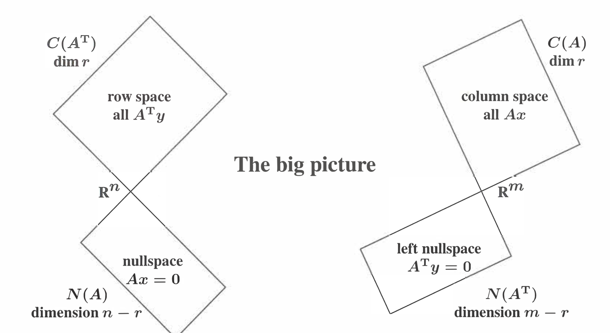
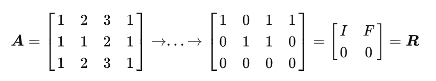
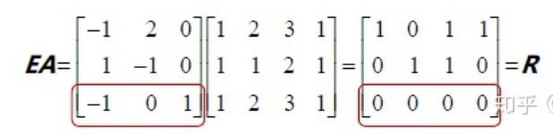
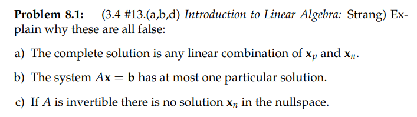
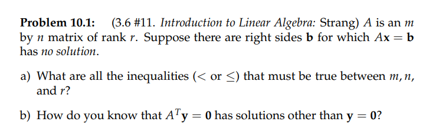
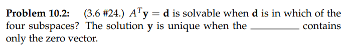
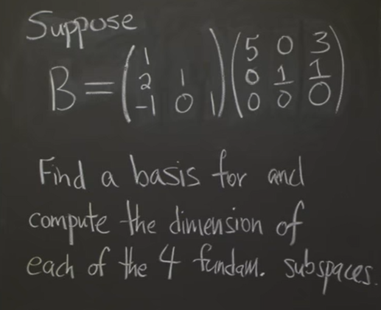

参考：[https://zhuanlan.zhihu.com/p/45826349](https://zhuanlan.zhihu.com/p/45826349)
> 本讲讨论矩阵的四个基本子空间以及他们之间的关系。

# 1 四个子空间
> 任意的$m\times n$矩阵$\bf A$都定义了四个子空间。
> 

## 1.1 列空间
> `Column Space`$\bf C(A)$
> 矩阵$\bf A$的列空间是$\bf A$的列向量的线性组合在 $\bf R^m$空间中构成的子空间。

## 1.2 零空间
> `Nullspace`$\bf N(A)$
> 矩阵$\bf A$的零空间是$\bf Ax=0$的所有解$\bf x$在$\bf R^n$空间中构成的子空间。

## 1.3 行空间
> `Rowspace`$\bf C(A^T)$
> 矩阵$\bf A$的行空间是$\bf A$的行向量的线性组合在$\bf R^n$空间中构成的子空间，也就是矩阵 $\bf A^T$的列空间。

## 1.4 左零空间
> `Left Nullspace`$\bf N(A^T)$
> 我们称矩阵 $\bf A^T$的零空间为矩阵$\bf A$的左零空间，它是$\bf R^m$空间中的子空间。

# 2 基和维数
## 2.1 列空间
> 矩阵$\bf A$的$r$个主元列构成了列空间$\bf C(A)$的一组基。$\bf dim C(A)=r$

## 2.2 零空间
> $\bf Ax=0$的一组特解对应于矩阵$\bf A$的$n-r$个自由列，并构成了零空间的一组基。
> $\bf dim N(A)=n-r$

## 2.3 行空间
> 我们用矩阵$\bf A$的化简的行阶梯矩阵$\bf R$
> 
> 尽管矩阵$\bf A$和矩阵$\bf R$的列空间不同，但两者行空间相同。$\bf R$的行向量来自于$\bf A$的行向量的线性组合，因为消元操作是可逆的，所以$\bf A$的向量也可以表示为$\bf R$行向量的线性组合。
> $\bf R$的前$r$ 行阶梯型“行向量”就是矩阵$\bf A$行空间$\bf C( A^T )$的一组基。$\bf dim C( A^T )=r$
> **矩阵的行秩等于列秩**

## 2.4 左零空间
> 矩阵$\bf  A^T$  有$m$列，而其秩为$r$，因此其自由列数目为$m-r$。所以$\bf dim N( A^T )=m-r$。
> 左零矩阵是满足 $\bf A^Ty=0$ 的所有向量$\bf y$的集合。称之为左零矩阵是因为该式可写作$\bf y^TA=0$，而$\bf y$出现在矩阵$\bf A$左侧。
> 
> **如何找到左零空间?**
> 为找到左零空间的基，我们应用增广矩阵：$\begin{bmatrix} \bf A_{m\times n} & \bf I_{m\times n}\end{bmatrix}\to \begin{bmatrix} \bf R_{m\times n} & \bf E_{m\times n}\end{bmatrix}$
> 我们将$\bf A$通过消元得到矩阵$\bf R$，其消元矩阵记为$\bf E$，即$\bf EA=R$。若$\bf A$为方阵，且$\bf R=I$，则有 $\bf E=A^{-1}$ 。在本例中
> 
 以“行操作”的观点来看矩阵$\bf E$和$\bf A$的乘法，则矩阵$\bf E$最下面的$m-r$个行向量使得矩阵$\bf A$的行向量线性组合成为$\bf 0$，也就是矩阵$\bf R$最下面的$m-r$个零向量。本例中，$m-r=1$。
> 矩阵$\bf E$的这$\bf m-r$个行向量满足$\bf y^TA$=0，它组成了矩阵$\bf A$左零空间的一组基。

# 3 新向量空间
> 所有$3\times 3$矩阵构成的集合是一个向量空间，符合对于线性运算封闭，称之为$\bf M$。
> $\bf M$的子空间包括：
> - 所有的上三角阵
> - 所有的对称阵
> - 所有的对角阵
> 
对角阵是前两个子空间的交集，其维数为$3$，具有以下一组基：
> $\begin{bmatrix} 1&0&0\\0&0&0\\0&0&0  \end{bmatrix}$,$\begin{bmatrix} 0&0&0\\0&1&0\\0&0&0  \end{bmatrix}$,$\begin{bmatrix} 0&0&0\\0&0&0\\0&0&1  \end{bmatrix}$

# 4 作业
## P1: 左零空间1**⭐⭐**
> 

> 

**(a) 判断条件成立**我们知道$r\leq min(m,n)$
因为题目说对于某些$\bf b$,$\bf Ax=b$无解, 我们分几类情况讨论:

- (1)$r<m<n$: 如果$b$的后几个分量不等于$0$, 就无解, 满足条件
- (2)$r<n<m$: 如果$b$的后几个分量不等于$0$, 就无解, 满足条件
- (3)$r=m<n$: 无数解, 不满足条件
- (4)$r=n<m$: 如果$b$的后几个分量不等于$0$, 就无解, 满足条件
- (5)$r=m=n$: 唯一解, 不满足条件

所以我们有$r<m$(因为$r=n$是可能的, 所以不能简单的归结为$r<min(m,n)$作为本题结论)
**(b) 判断条件成立**对于$\bf A_{m\times n}$的左零空间来说，如果它有非零解，就说明$\bf A^T$的自由列数量大于零, 换句话说就是$m-r>0$

## P2: 左零空间2**⭐⭐**
> 

> 

**(a) 左零空间的解**当$\bf d$在$\bf A$的行空间中则$\bf A^Ty=d$有解
**(b) 唯一解**当$\bf y$有唯一解时，说明$\bf A^T$的列满秩，没有自由元, 于是$m-r=0$, 也就是$\bf A$的左零空间只有$\bf 0$向量的解, 也很好理解。

- 如果一个矩阵$\bf A$的零空间只有$\bf 0$向量，则$\bf x=x_p+cx_n=x_p+c*0=x_p$只有$\bf x_p$这个唯一解
- 类似的，如果一个矩阵$\bf A$的左零空间只有$\bf 0$向量，则$\bf y=y_p+cy_n=y_p+c*0=y_p$只有$\bf y_p$这个唯一解

## P3: 找到四个子空间的维数**⭐⭐⭐⭐**
> 
> 此题较难，需要对矩阵的空间十分了解。

**Key****首先求维数**

1. **列空间**

注意到我们的$\bf LU$分解的结果是一个可逆下三角矩阵$\bf L$乘以一个不可逆的上三角矩阵$\bf U$, 于是$\bf Rank(B)=Rank(LU)=Rank(U)=2$, 所以$\bf B$的列空间的维数是$2$

2. **零空间**维数是$3-1=2$
3. 然后是**左零空间**，因为$\bf col(A)\perp N(B^T)$, 所以左零空间的维数是$3-2=1$
4. 最后是**行空间**，因为$\bf row(A)\perp N(B)$，所以零空间维数是$3-2=1$

**四个子空间的基向量是:**

1. **列空间**，还记得我们在找列空间基向量的时候可以**通过消元得到主元列的位置，然后选取主元列作为列空间的基向量**，这里也可以使用类似的思路，由于$\bf U$矩阵可以看成是在对$\bf L$矩阵的列进行消元操作，**而列消元操作不会改变**$\bf L$**的列空间, **所以我们直接取$\bf L$中的前两列(主元列，证明略)当做$\bf B$的列空间的基向量，他们线性无关，所以$\bf B$的基向量是$\{\begin{bmatrix} 1\\2\\-1\end{bmatrix},\begin{bmatrix} 0\\1\\0\end{bmatrix}\}$
2. **零空间**，由于$\bf B$的零空间是满足$\bf Bx=0$的向量，而$\bf B=LU$, 所以零空间相当于是满足$\bf LUx=0$的向量，进一步也就是满足$\bf Ux=0$的向量, 由于维数是$1$, 我们取$\{\begin{bmatrix} -3/5\\-1\\1\end{bmatrix}\}$即可
3. **行空间**, 和`1`中的分析类似，$\bf L$相当于在对$\bf U$做行消元操作，而行消元不改变矩阵的行空间，所以$\bf B$的行空间的基向量可以选取$\bf U$矩阵的前两行(主元行，证明略), 于是矩阵$\bf B$的行空间的基可以是$\{\begin{bmatrix} 5\\0\\3\end{bmatrix},\begin{bmatrix} 0\\1\\1\end{bmatrix}\}$
4. **左零空间, **较难，我们可以**左乘一个**$\bf L^{-1}$, 得到$\bf \begin{bmatrix} 1&0&0\\-2&1&0\\1&0&1\end{bmatrix}B=\begin{bmatrix} 5&0&3\\0&1&1\\0&0&0\end{bmatrix}$, 我们发现$\bf L^{-1}$的第三行乘上$\bf B$矩阵的过程就好像是我们在用$\bf B^T$中的每一行乘以$\bf \begin{bmatrix} 1\\0\\1\end{bmatrix}$向量, 并且结果为$\bf \begin{bmatrix} 0\\0\\0\end{bmatrix}$，于是$\bf \begin{bmatrix} 1\\0\\1\end{bmatrix}$在$\bf B^T$的零空间中，也就是在$\bf B$的左零空间中。因为$\bf dim N(B^T)=1$, 所以$\bf \begin{bmatrix} 1\\0\\1\end{bmatrix}$可以张成整个$\bf B^T$的左零空间。
**Geometric Understanding**$\bf B$矩阵操作:

- 把$\bf N(B)$中的向量都变成$\bf 0$
- 把$\bf C(B^T)$($\bf B$的行空间 )中的向量都变成$\bf C(B)$($\bf B$的列空间 )中的向量

$\bf B^T$矩阵操作:

- 把$\bf N(B^T)$中的向量都变成$\bf 0$
- 把$\bf C(B)$($\bf B^T$的行空间 )中的向量都变成$\bf C(B^T)$($\bf B^T$的列空间 )中的向量
