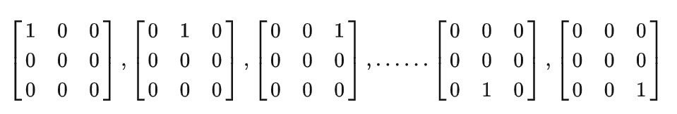
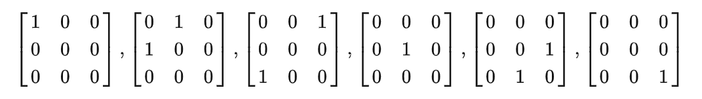
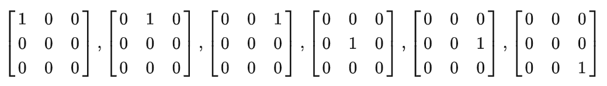
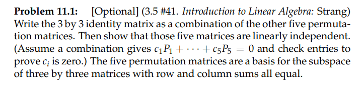
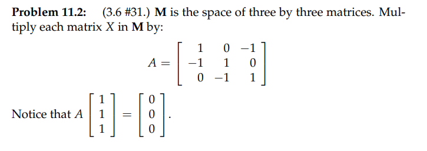
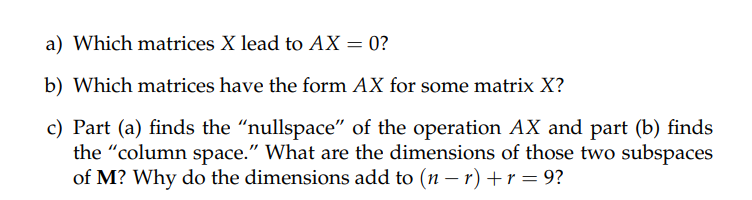
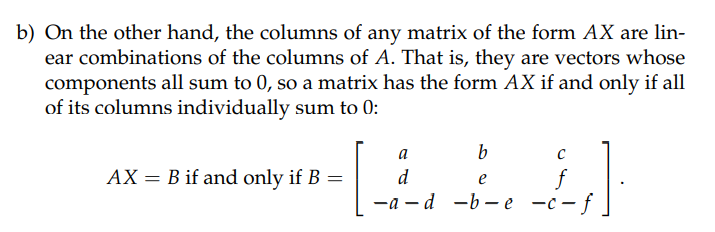
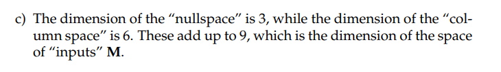
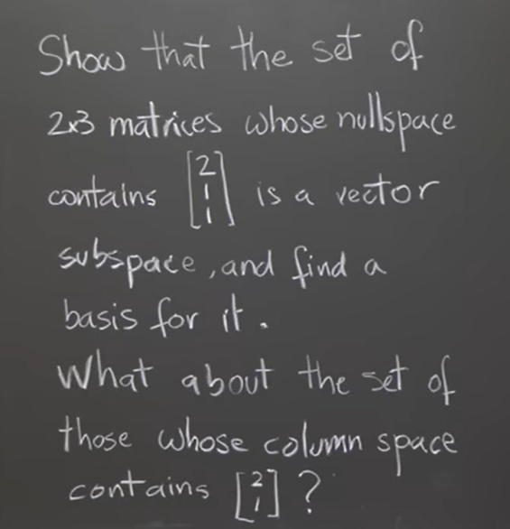

参考: [https://zhuanlan.zhihu.com/p/45840821](https://zhuanlan.zhihu.com/p/45840821)
[Matrix Spaces;Rank 1;Small World Graphs.pdf](https://www.yuque.com/attachments/yuque/0/2022/pdf/12393765/1659013142109-99c05426-9f43-4c48-91ad-0cc663f5358f.pdf)
> 本章节介绍了数学建模中经常使用到的一些矩阵操作和矩阵类型

# 1 新向量空间
## 1.1 回顾3x3矩阵空间的定义
> 空间$\bf M$是所有$\bf 3\times 3$矩阵所构成的空间，$\bf M$的部分子空间包括：
> - 所有的上三角阵，记为$\bf U$。
> - 所有的对称阵，记为$\bf S$。
> - 所有的对角阵，记为$\bf D$**，它是前两个子空间的交集**。

## 1.2 M,U,S,D 空间的维数
### 1.2.1 M空间的维数
> 空间$\bf M$的维数为$9$，与$\bf R^9$空间很类似。我们可以选定它的一组基：
> 

### 1.2.2 S 空间的维数
> 对称阵构成的子空间$\bf S$维数为$6$，它的一组基为：
> 

### 1.2.3 U 空间的维数 
> 上三角阵构成的子空间$\bf U$维数也为$6$，它的一组基为：
> 

### 1.2.4 D 空间的维数
> **对角阵构成的子空间**$\bf D$**维数为**$3$**，可以选定**$\bf S$**和**$\bf U$**的基的交集为**$\bf D$**的基。**
> 

> **一个小问题: **
> $\bf S$和$\bf U$的并集，即$\bf 3\times 3$矩阵中或为上三角阵或为对称阵的矩阵，构成$\bf M$的子空间么？答案是否定的，这就如同在$\bf R^2$空间中找出两条直线，询问它们的并集是否构成一个子空间。如果我们将$\bf S$和$\bf U$中所有元素可能构成的加和作为一个集合，可以称为和集$\bf S+U$，它是$\bf M$的一个子空间。实际上$\bf S+U$就是$\bf M$** **本身，其维数为$9$。
> $\bf dim⁡S+dim⁡U=dim⁡(S∩U)+dim⁡(S+U)$ 等式右侧应是和集的维数与交集的维数相加

# 2 微分方程
> 对于给定的微分方程 $\frac{d^2y}{dx^2}+y=0$ ，求解该方程可以视为求它的零空间。我们可以得到的解为： $y=cos⁡x ， y=sin⁡x ， y=e^{ix}$ 。
> 事实上，通解为$y=c_1cos⁡x+c_2sin⁡x$ ，其中$c$可以取任意复数。也将解的线性组合构成的空间称为解空间，其维数为$2$。$cosx$和$sinx$可以成为解空间的一组基。这些并不像是向量，它们是函数，但是可以对其进行线性运算，在线性代数的范畴内讨论之。

# 3 Rank 1矩阵
## 3.1 基本定义
> 矩阵$\bf A=\begin{bmatrix} 1&4&5 \\2&8&10\end{bmatrix}=\begin{bmatrix} 1\\ 2\end{bmatrix}\begin{bmatrix} 1&4&5\end{bmatrix}$, 所以矩阵的秩为$1$
> $\bf dim(C(A))=r=dim(C(A^T))$(**任意矩阵的列秩等于行秩**)

## 3.2 秩1矩阵的分解
> 所有的秩$1$矩阵都可分解 $\bf A=UV^T$ ，其中$\bf U$和$\bf V$都是列向量。秩1矩阵的行列式和特征值都很简单，它可以被当作是构建其他矩阵的“积木”。_其实我们在矩阵乘法的第四种形式里面见过它的作用。_例如若存在一个$\bf 5\times 17$的矩阵$\bf M$，而其秩为$4$，那么它可以由$4$个秩$1$矩阵组合而成。
> 若矩阵空间**M**为所有的5x17矩阵，那么**M**中所有的秩4矩阵所构成的集合是一个子空间么？答案是否定的，即使加入零矩阵也无法构成子空间，对于两个矩阵的加和，秩4矩阵集合并不封闭。
> 两个矩阵之和的秩小于等于两个矩阵的秩之和。

## 3.3 示例
> 在$\bf R^4$空间中，所有满足分量之后$v_1+v_2+v_3+v_4=0$的向量$v=\begin{bmatrix}v_1\\v_2\\v_3\\v_4\end{bmatrix}$构成了一个子空间$\bf S$,
> 包含零向量并对线性运算封闭。换句话说, $\bf S$就是秩一矩阵$\bf A=\begin{bmatrix} 1&1&1&1\end{bmatrix}$的零空间, 由于$\bf Rank(A)=1$, 所以$\bf dim(N(A))=4-1=3$
> 通过对自由元赋值$x_2=1,x_3=0,x_4=0$或$x_2=0,x_3=1,x_4=0$或$x_2=0,x_3=0,x_4=1$
> 得到三个零空间的基向量$\begin{bmatrix} -1 \\ 1\\0\\0\end{bmatrix}$,$\begin{bmatrix} -1 \\ 0\\1\\0\end{bmatrix}$,$\begin{bmatrix} -1 \\ 0\\0\\1\end{bmatrix}$
> 这其实和我们在`1.10`的作业中遇到的求一个平面$x-2y+3z=0$的基向量的方法如出一辙。
> **本例的一个意义就是寻找子空间维数的逆向思路，可以考虑它是不是某个方程的解空间，在这里它是矩阵**$\bf A=\begin{bmatrix} 1&1&1&1\end{bmatrix}$**的零空间，我们可以从矩阵推出这个空间的维数。**
> **同时我们发现: **
> - 矩阵$\bf A$的列空间为$\bf R^1$。
> - 左零空间仅包含零向量，维数为$0$

# 4 Small World Graph
> 介绍小世界图主要是引出图论和线性代数的联系。
> 在这里，“图”$\bf G$是结点和边的集合：$\bf G$=$\{结点（nodes），边（edges）\}$
> 
> 此图包含$5$个结点和$6$条边，我们可以利用一个$5\times 6$矩阵完全描述它。
> 我们可以用图来描述一个实际问题，如果每个人是一个结点，两个人互相认识为一个边，那么整个美国可以以此构成一张大图。我们可以通过这张图来确认两个人之间的最短距离是多少，即两个人需要通过最少几个朋友才能建立联系。G.Strang本人和克林顿之间的距离为$2$，他的一个朋友是参议员，他认识这个参议员朋友，那个人认识克林顿。班里的学生跟克林顿的距离因此不会大于$3$。还可以继续算希拉里和莱温斯基……
> 所谓“六度分割理论”（`six degrees of separation`）猜想一个人和陌生人之间间隔的点不会超过六个。因此当陌生的两人聊起这种联系都会感叹：“世界真小啊！”这也是“小世界图”这个名字的由来。

# 5 作业
## P1: 3x3 矩阵空间**⭐⭐**
> 

**(a) 用置换矩阵构造单位矩阵**我们知道，对于一个$3\times 3$的置换矩阵，一共就只有六种($(^3_3)=3~=6$)情况:
$\bf P_1=\begin{bmatrix} 1&0&0 \\ 0&0&1\\0&1&0  \end{bmatrix}$, $\bf P_2=\begin{bmatrix} 0&1&0 \\ 1&0&0\\0&0&1  \end{bmatrix}$,$\bf P_3=\begin{bmatrix} 0&1&0 \\ 0&0&1\\1&0&0  \end{bmatrix}$,$\bf P_4=\begin{bmatrix} 0&0&1 \\ 0&1&0\\1&0&0  \end{bmatrix}$,
$\bf P_5=\begin{bmatrix} 0&0&1 \\ 1&0&0\\0&1&0  \end{bmatrix}$,$\bf P_6=I=\begin{bmatrix} 1&0&0 \\ 0&1&0\\0&0&1  \end{bmatrix}$
我们要做的就是通过$\bf P_1,P_2,P_3,P_4,P_5$的线性组合来构造$\bf I$
首先我们注意到，$\bf I$的对角线上都是$1$, 观察五个置换矩阵可知，我们一定会需要$\bf P_1+P_2+P_4$来填充对角线上的$1$, 于是我们有$\bf P'=P_1+P_2+P_4=\begin{bmatrix} 1&1&1 \\ 1&1&1\\1&1&1  \end{bmatrix}$
然后我们看看能不能通过$\bf P_3,P_5$将$\bf P'$中非对角线的$1$给去掉、
尝试之后我们发现，只要$\bf P_1+P_2+P_4-P_3-P_5$就可以获得$\bf I$了
**(b) 置换矩阵线性无关性证明**要证明$\bf P_1,P_2,P_3,P_4,P_5$线性无关，只要证明$\bf c_1P_1+c_2P_2+c_3P_3+c_4P_4+c_5P_5=0$只有$\bf 0$解。
我们将左侧展开: $\begin{bmatrix} c_1&c_2+c_3&c_4+c_5 \\ c_2+c_5&c_4&c_3\\c_3+c_4&c_1+c_5&c_2  \end{bmatrix}=\begin{bmatrix} 0&0&0 \\ 0&0&0\\0&0& 0 \end{bmatrix}$
于是解这个方程我们得到$c_1=c_2=c_3=c_4=c_5=0$, 于是$\bf P_1,P_2,P_3,P_4,P_5$线性无关

## P2: 零/列空间的深入理解**⭐⭐⭐⭐**
> 
> 
> 本题不同于之前介绍的向量空间和子空间的概念，而是新向量空间$\bf M_{3\times 3}$, 
> 本题的第一问求$\bf AX_{3\times 3}=0_{3\times 3}$的所有$\bf X_{3\times 3}$, 换而言之就是$\bf A$的"零矩阵空间", 不同于我们之前接触的零空间，这个空间里都是$3\times 3$的矩阵，这些矩阵都满足某一个性质，而我们要做的就是找出这样的矩阵的形式
> 第二问与第一问类似，求的是$\bf A$的"列矩阵空间"
> 第三问求的是$\bf A$的"列矩阵空间"的维数和"零矩阵空间"的维数
> `Strang`教授的答案非常的简略，很多结论初学者是不会觉得显然的，不及`18.02SC`和`18.03SC`中的答案详细，所以这里我们需要详细地推导。

**(a) A的零空间**我们使用`1.8`中的程序对$\bf A$进行化简，得到$\bf R=\begin{bmatrix} 1&0&-1 \\ 0&1&-1\\0&0&0\end{bmatrix}$, 所以$\bf Rank(A)=2$, 有一个自由元$x_3$，令自由元$x_3=1$, 得到$x_1=1,x_2=1$   于是$\bf A$的零空间的基是$\begin{bmatrix} 1\\1\\1\end{bmatrix}$
于是$\bf A\begin{bmatrix} a\\a\\a\end{bmatrix}=0,a\in R$, 题目中求使得$\bf AX=0_{3\times 3}$的$\bf X_{3\times 3}$
我们可以将$\bf X$中的每一列看做是$\bf A$的零空间内的一个向量，于是$\bf X=\begin{bmatrix} a&b&c \\ a&b&c\\a&b&c\end{bmatrix}$
**(b) A的列空间**
我们要做的就是在任意的$\bf X$输入下$\bf AX=B$的$\bf B$矩阵的规律。
我们发现，$\bf B$矩阵的每一列都是矩阵$\bf A$的列的线性组合。
$\bf A = \begin{bmatrix} A_1&A_2& A_3\end{bmatrix}$,$\bf A_{k}$表示矩阵$\bf A$的第$i$列,  $\bf B_{k}$表示矩阵$\bf B$的第$i$列,$\bf X_{ij}$表示矩阵$\bf X$第$i$行第$j$列的元素, 我们有:
$\bf B = \begin{bmatrix} B_1&B_2&B_3\end{bmatrix}$
$\bf B = \begin{bmatrix} X_{11}A_1+X_{21}A_2+X_{31}A_3&X_{12}A_1+X_{22}A_2+X_{32}A_3&X_{13}A_1+X_{23}A_2+X_{33}A_3\end{bmatrix}$
$\bf B_1=X_{11}\begin{bmatrix} 1\\-1\\0 \end{bmatrix}+X_{21}\begin{bmatrix} 0\\1\\-1  \end{bmatrix}+X_{31}\begin{bmatrix} -1\\0\\1 \end{bmatrix}=\begin{bmatrix} X_{11}-X_{31}\\X_{21}-X_{11}\\X_{31}-X_{21} \end{bmatrix}$
$\bf B_2=X_{12}\begin{bmatrix} 1\\-1\\0 \end{bmatrix}+X_{22}\begin{bmatrix} 0\\1\\-1 \end{bmatrix}+X_{32}\begin{bmatrix} -1\\0\\1 \end{bmatrix}=\begin{bmatrix} X_{12}-X_{32}\\X_{22}-X_{12}\\X_{32}-X_{22} \end{bmatrix}$
$\bf B_3=X_{13}\begin{bmatrix} 1\\-1\\0 \end{bmatrix}+X_{23}\begin{bmatrix} 0\\1\\-1 \end{bmatrix}+X_{33}\begin{bmatrix} -1\\0\\1 \end{bmatrix}=\begin{bmatrix} X_{13}-X_{33}\\X_{23}-X_{13}\\X_{33}-X_{23} \end{bmatrix}$
我们观察$\bf B$的每一列的形式, 发现$\bf \sum_{i=1}^{3}B_k(i)=0$,也就是$\bf B_k$的各列相加之和为$0$
所以最终我们知道: 在$\bf A$的"列矩阵空间"中的所有$\bf B$, 都具有以下形式:

**(c) 空间维数**首先我们来看"零空间"的维数，因为在(a) 问中我们已经得到了"零矩阵"空间中的$\bf X=\begin{bmatrix} a&b&c \\ a&b&c\\a&b&c\end{bmatrix}$的结论。
于是对于任意"零矩阵空间"中的矩阵$\bf N$，我们都需要$\bf \begin{bmatrix} 1&0&0 \\ 1&0&0\\1&0&0\end{bmatrix}$,$\bf \begin{bmatrix} 0&1&0 \\ 0&1&0\\0&1&0\end{bmatrix}$,$\bf \begin{bmatrix} 0&0&1 \\ 0&0&1\\0&0&1\end{bmatrix}$三个基矩阵的线性组合而成, 故$\bf \dim(N)=3$
然后我们看列空间$\bf AX$中的矩阵: 
在(b)问中我们求出$\bf AX$新向量空间中的矩阵都满足$\bf \begin{bmatrix} a&b&c \\ d&e&f\\-a-d&-b-e&-c-f\end{bmatrix}$的形式，也就是说如果我们确定了$a,b,c,d,e,f$, 也就确定了第三行的全部。换句话说，我们会有六个基矩阵(类比`pivot column`我们有`pivot matrix`), 通过$\bf AX$的形式我们知道，在$\bf col(A)$中的矩阵都满足第一行加第二行等于第三行，于是我们可以选取 
$\bf \begin{bmatrix} 1&0&0 \\ 0&0&0\\-1&0&0\end{bmatrix}$,$\bf \begin{bmatrix} 0&0&0 \\ 1&0&0\\-1&0&0\end{bmatrix}$,$\bf \begin{bmatrix} 0&1&0 \\ 0&0&0\\0&-1&0\end{bmatrix}$,$\bf \begin{bmatrix} 0&0&0 \\ 0&1&0\\0&-1&0\end{bmatrix}$,$\bf \begin{bmatrix} 0&0&1 \\ 0&0&0\\0&0&-1\end{bmatrix}$,$\bf \begin{bmatrix} 0&0&0 \\ 0&0&1\\0&0&-1\end{bmatrix}$作为列空间的基向量
也就是$\bf dim(col) = 6$
综上，由于零空间的维数加列空间的维数等于所有$3\times 3$矩阵空间的维数，所以整个矩阵空间的维数是$9$(相当于零解和特解加和等于通解一样，这里的零空间加上列空间得到的就是所有$3\times 3$的矩阵空间，也就是$\bf M$)
 

## P3: Matrix Spaces**⭐⭐⭐⭐⭐**
> 

**(1) 验证矩阵空间及其基⭐⭐⭐⭐⭐****首先我们要证明满足条件的矩阵形成了一个新向量空间(矩阵空间) **$\bf S$
由于矩阵满足$\bf A\begin{bmatrix} 2\\1\\1 \end{bmatrix}=\begin{bmatrix} 0\\0\\0 \end{bmatrix}$, 我们验证加法和数乘封闭性:

1. 加法封闭: 我们取$\bf M_1\in S,M_2\in S$, 所以$\bf (M_1+M_2)\begin{bmatrix} 2\\1\\1 \end{bmatrix}=M_1\begin{bmatrix} 2\\1\\1 \end{bmatrix}+M_2\begin{bmatrix} 2\\1\\1 \end{bmatrix}=0$, 所以$\bf M_1+M_2\in S$, 所以加法封闭
2. 数乘封闭: 我们取$\bf M_1\in S$, 所以$\bf cM_1\begin{bmatrix} 2\\1\\1 \end{bmatrix}=0$, 所以$\bf cM_1\in S$, 所以乘法封闭

所以$\bf S$为矩阵空间，证毕。
**然后，我们求该矩阵空间的基**
因为$\begin{bmatrix} 2\\1\\1 \end{bmatrix}$在矩阵$\bf A$的零空间中，所以$\bf A$的行向量$\begin{bmatrix} a&b&c\end{bmatrix}$均满足$2a+b+c=0$, 所以矩阵可以写成$\bf \begin{bmatrix} a&b&-2a-b \\ c&d&-2c-d\end{bmatrix}$, 注意到有四个`Pivot Variable`$a,b,c,d$, 于是由这类矩阵构成的矩阵空间的维数是$4$, 我们类比`P2`中的方法得出，矩阵$\bf A$的新向量空间的基可以是$\bf \begin{bmatrix} 1&0&-2 \\ 0&0&0\end{bmatrix}$,$\bf \begin{bmatrix} 0&1&-1 \\ 0&0&0\end{bmatrix}$,$\bf \begin{bmatrix} 0&0&0 \\ 1&0&-2\end{bmatrix}$,$\bf \begin{bmatrix} 0&0&0 \\ 0&1&-1\end{bmatrix}$
**(2) 验证矩阵空间⭐⭐⭐**我们知道，如果满足列空间含有$\begin{bmatrix} 2\\1\end{bmatrix}$的矩阵的矩阵空间$\bf S$存在，则$\bf \begin{bmatrix} 0&0&0\\0&0&0\end{bmatrix}\in S$,但事实是，这个零矩阵的列空间中不含$\begin{bmatrix} 2\\1\end{bmatrix}$, 所以不成立。$\bf S$不是矩阵空间。

