参考: [https://zhuanlan.zhihu.com/p/45853245](https://zhuanlan.zhihu.com/p/45853245)
> 本讲讨论线性代数在物理系统中的应用。

# 1 图和网络
> “图”就是“结点”和“边”的一个集合。
> 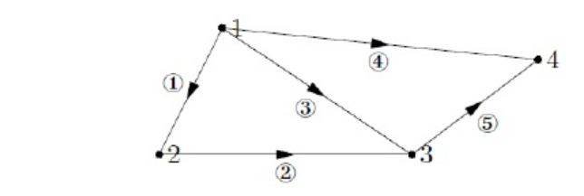
> 边线上的箭头代表从结点流出的正方向。

# 2 关系矩阵(Incidence Matrix)
## 2.1 定义
> 构造一个矩阵来表示图的内在含义，此矩阵称为关联矩阵，图中每个结点代表一列，每边代表一行。则上图为$5\times 4$矩阵。反过来从这个矩阵出发我们也能画出图。
> 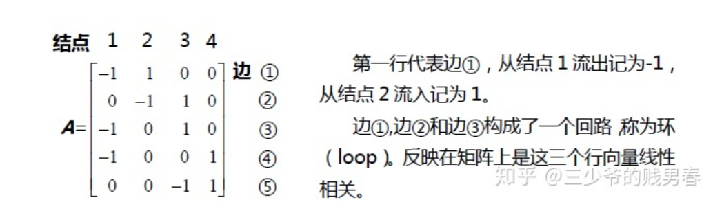
> 
> 源于现实问题的关联矩阵，通常描述了问题的结构。如果我们研究一个很大的图，则会构建一个很大的矩阵，但这个矩阵会是稀疏矩阵。

## 2.2 基尔霍夫电压定律
> **物理背景:**
> 假如$x_i$代表结点$i$上的电势
> 则考察$\bf A=\begin{bmatrix} -1&1&0&0\\0&-1&1&0\\ -1&0&1&0\\ -1&0&0&1\\
0&0&-1&1\end{bmatrix}$的零空间，$\bf Ax=\begin{bmatrix} x_2-x_1 \\ x_3-x_2\\x_3-x_1\\x_4-x_1\\x_4-x_3\end{bmatrix}=\begin{bmatrix} 0 \\ 0\\0\\0\\0\end{bmatrix}$
> 如果$x$为结点上的电势，则$\bf Ax$给出了每个边上的电势差
> 
> **矩阵分析:**
> 我们对矩阵$\bf A$进行最简阶梯阵化简: 
> 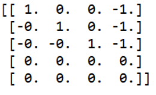 
> 发现其零空间的维数是$1$, 而矩阵的列数为$4$，而其零空间的维数为$1$，则矩阵的秩为$3$
> 我们取$x_4=1$得到零空间的特解$\begin{bmatrix}1\\1\\1\\1\end{bmatrix}$, 也就是零空间的基; 通过让$x_4=0$得到列空间的特解$\begin{bmatrix}0\\0\\0\\0\end{bmatrix}$
> 所以我们的通解是$x=x_p+c*x_n=\begin{bmatrix}0\\0\\0\\0\end{bmatrix}+c*\begin{bmatrix}1\\1\\1\\1\end{bmatrix}$
> 
> **确定整个电路的电流状况:**
> 如果我们需要准确地确定每个点的电势，则需要一个初始条件，类似于我们在微分方程中的`Initial Conditions`来确定常数$c$的值。比如: 当$x_4$接地的时候，$x_4=0$,于是$x=\begin{bmatrix}0\\0\\0\\0\end{bmatrix}$,也就是整个通路中没有电流产生，因为图中的每一条边上的电势差都为$0$

 

### 2.2.1 考察矩阵的列空间**⭐⭐**
> 对于上述矩阵$\bf A=\begin{bmatrix} -1&1&0&0\\0&-1&1&0\\ -1&0&1&0\\ -1&0&0&1\\0&0&-1&1\end{bmatrix}$
> 考察矩阵列空间的一个重要目的就是找到$\bf Ax=b$什么时候有解，有解的时候$\bf b$的分量满足什么条件。
> 于是$\bf b$的分量需要满足以及$b_3-b_4+b_5=0$。如果把边$1,2,4,5$构成的大环也表示出来则还可以得到一个等式$b_1+b_2-b_4+b_5=0$, 也就是上面两个等式相加。
> 注意到这些等式就是大名鼎鼎的基尔霍夫电压定律(`Kirchhoff's Voltage Law`), 即环路电势差之和为零

`

### 2.2.2 矩阵的左零空间**⭐⭐⭐⭐⭐**
#### 基本定义
> **矩阵的左零空间**是满足 $\bf A^Ty=0$ 的向量$\bf y$的集合。因为矩阵  $\bf A^T$  有$5$列，且矩阵的秩为$3$，因此矩阵的左零空间维数为$2$。这反应了行向量的线性关系，整个“图”中，环数为$2$。

#### 物理意义
> $\bf A^Ty=\begin{bmatrix} -1&0&-1&-1&0\\1&-1&0&0&0\\ 0&1&1&0&-1\\ 0&0&0&1&1\end{bmatrix}\begin{bmatrix}y_1\\y_2\\y_3\\y_4\\y_5\end{bmatrix}=\begin{bmatrix}0\\0\\0\\0\end{bmatrix}$其中$\bf y$的分量的值为“边”上的电流。
> 
> 
> **在电势差和电流之间建立联系就是欧姆定律（Ohm’s Law）**
> 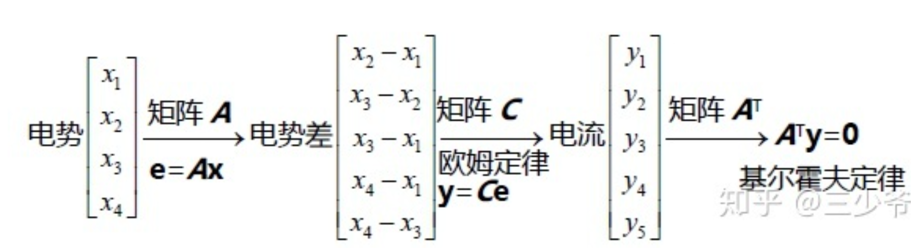
> **矩阵**$\bf C$**相当于是电阻率矩阵，将每一边的电势差转换为了那一边上的电流大小，具体在作业**`**2**`**中讲解**

#### 解读左零空间
> **理解 **$\bf A^Ty=0$**: **
> 1. **节点视角**
> 
我们求解 $\bf A^Ty=0$ 就是在求$5$个满足基尔霍夫电流定律（`Kirchhoff’s Law`）的电流值
> $\bf A^Ty=0$的方程形式$\begin{cases} -y_1-y_3-y_4=0\\y_1-y_2=0\\y_2+y_3-y_5=0\\y_4+y_5=0\end{cases}$,每一行方程描述一个结点的流入流出电流情况，比如第一行，表示节点$1$流出电流沿着$y_1,y_3,y_4$边，都为负号。
> **方程表示结点四周的边流入节点的电流总和等于流出节点的边上的电流总和, 之后可以使用消元法求解零空间**
> 

> 

> 2. **回路视角**
> 
我们也可以将$\bf A^T$抽象成$\bf \begin{bmatrix} e_1&e_2&e_3&e_4&e_5 \end{bmatrix}$五个列向量，每个列向量代表了下图中的一条边
> 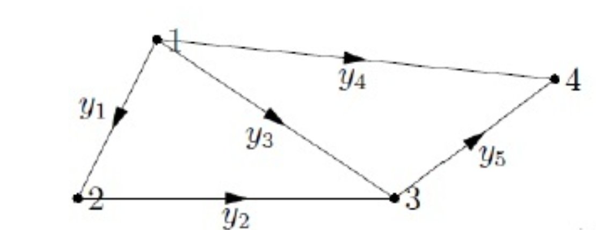
> $\bf A^Ty$可以抽象成$\bf \begin{bmatrix} e_1&e_2&e_3&e_4&e_5 \end{bmatrix}\begin{bmatrix} y_1\\y_2\\y_3\\y_4\\y_5 \end{bmatrix}$, 从图上解方程，而不是采用消元法解方程。如果我们设定$y_1=1$，并且让$y_1$，$y_2$和$y_3$组成的回路的“环流“为$0$，则有$y_2=1$，$y_3=-1$。可解得$\bf y=\begin{bmatrix} 1\\1\\-1\\0\\0\end{bmatrix}$ 。取另一个回路的环流为0，则有$y_3=1$,$y_4=-1$,$y_5=1$。$\bf y=\begin{bmatrix} 0\\0\\1\\-1\\1\end{bmatrix}$ 。
> 如果设定$y_1$，$y_2$，$y_4$和$y_5$组成的大回路环流为$0$，则可以得到另一个向量$\bf y$，**而该向量在零空间内，是前两个向量的线性组合**。这也符合常理，毕竟我们的$\bf A^T$只有两个自由元,也就意味着这个方程组只有两个线性无关的解。所以我们可以轻松求得$\bf A^T$的零空间的基$\{ \begin{bmatrix} 1\\1\\-1\\0\\0\end{bmatrix},\begin{bmatrix} 0\\0\\1\\-1\\1\end{bmatrix}\}$

### 2.2.3 考察矩阵的行空间**⭐⭐**
> $\bf A=\begin{bmatrix} -1&1&0&0\\0&-1&1&0\\ -1&0&1&0\\ -1&0&0&1\\0&0&-1&1\end{bmatrix}$
> 因为矩阵$r=3$，所以存在$3$个线性无关的向量。第$1$行，第$2$行和第$4$行为线性无关，在“图”中，边①,边②和边④构成了一张子图，这三个边没有形成回路。
> 
> **线性相关问题等价于形成回路**。没有回路的小图包含$4$个结点和$3$条边，再添加一条边就会产生回路，在矩阵里表现为在第$1$行，第$2$行和第$4$行之上再添加一个行向量就会变为线性相关。**没有回路的图称为“树”。**
> 我们注意到，边$1,2,3$构成了闭合环，所以这三个行向量线性相关()，同样的情况还有边$4,5,3$构成的环(,线性相关)。
> 如果把边$1,2,4,5$构成的大环也表示出来则还可以得到一个等式线性相关, 也就是上面两个等式相加。

### 2.2.4 加入外部电流**⭐⭐⭐⭐**
> 
> 如上图所示，之前的讨论都是针对于一个无源的电场，如果加入电源则情况又不同，例如加入电流源相当于将基尔霍夫定律的方程变为 $\bf A^Ty=f$ ，$\bf f$就是外部流入的电流。$\bf f$的分量表示不同节点的流入流出电流。具体见作业题
> 将$\bf e=Ax$ ， $\bf y=Ce$  ，$\bf A^Ty=f$ ，**三个等式结合得到应用数学中的基本方程**$\bf A^TCAx=f$**。**
> 关于方程$\bf A^TCAx=f$的更多内容可以阅读G.Strang的书《Computational science and engineering》的第二章。

## 2.3 维数公式在"图"中的意义
> 对于$\bf A_{m\times n}$，则其左零空间维数$\bf dim N(A^T)=m-r；$
> 等价于**“环”数量**=**“边”数量**-（**“结点”数量**-**1**）；
> 即`**Eular**`**公式**：**“结点”-“边”+“环”=1**。**对所有的“图”都成立。**

# 作业
## P1: Incidence Matrix
> 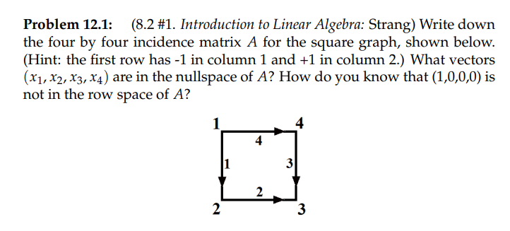

**(a) Find the incidence Matrix**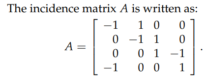
$\bf A$的每一行对应了图中标了序号的边
**(b) A的零空间**由`1.8`的程序可知: $\bf R=$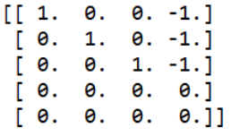
根据`1.8.4.3`中快速求零空间的基的方法，通过令自由元$x_4=1$, 我们得到$\bf x_n=\begin{bmatrix} 1\\1\\1\\1\end{bmatrix}$
于是$\bf A$的零空间中的向量形如$\bf \begin{bmatrix} a\\a\\a\\a\end{bmatrix}$
**(c) A的行空间**$\bf A$的行空间等价于$\bf A^T$的列空间
$\bf A^T=\begin{bmatrix} -1&0&0&-1 \\ 1&-1&0&0 \\ 0&1&1&0 \\ 0&0&-1&1\end{bmatrix}$, 将$\bf A^T$各列线性组合起来，我们有$\bf A^Tx=A^T\begin{bmatrix} a\\b\\c\\d\end{bmatrix}=\begin{bmatrix} -a-d\\a-b\\b+c\\d-c\end{bmatrix}$, 我们发现，在$\bf A^T$列空间中的向量的各个分量加起来等于零
所以$\bf \begin{bmatrix} 1\\0\\0\\0\end{bmatrix}$肯定不在$\bf A^T$的列空间中，也就肯定不在$\bf A$的行空间中

## P2: Conductance Matrix
> 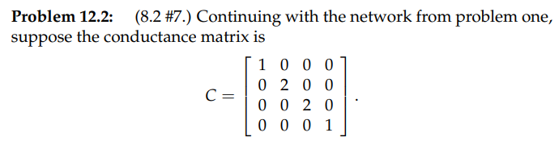
> 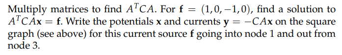

**(a) 矩阵乘法求回路系统电流**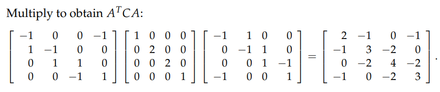
**(b) 求解方程**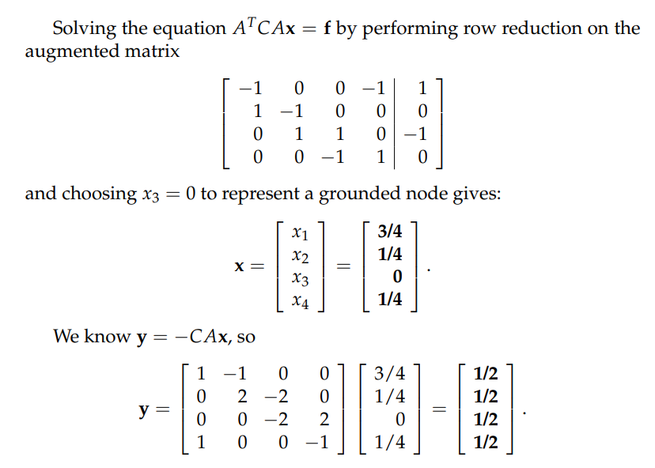
**(c) 画出图结构**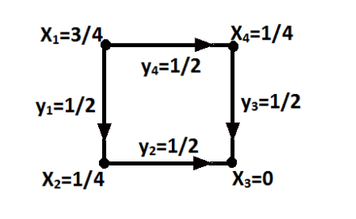

## P3: Graphs and Networks**⭐⭐⭐⭐⭐**
> 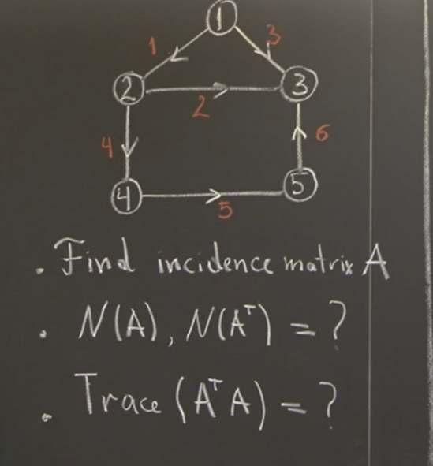

**(1) 找到Incidence Matrix**$\bf A=\begin{bmatrix} -1&1&0&0&0\\0&-1&1&0&0 \\ -1&0&1&0&0 \\ 0&-1&0&1&0\\0&0&0&-1&1 \\ 0&0&1&0&-1 \end{bmatrix}$
**(2) A的零空间和左零空间**对于$\bf A$的**零空间**，他的物理意义是，假设所有的节点上的电势是$x_i$, 则$\bf Ax=\begin{bmatrix} x_2-x_1 \\ x_3-x_2 \\x_3-x_1\\x_4-x_2\\x_5-x_4\\x_3-x_5\end{bmatrix}=0$, 其中$\bf x=\begin{bmatrix} x_1 \\ x_2 \\x_3\\x_4\\x_5\end{bmatrix}$, 所以零空间中的向量满足$x_1=x_2=x_3=x_4=x_5=x_6$, 所以零空间的基是$\{\begin{bmatrix} 1 \\ 1\\1\\1\\1\end{bmatrix}\}$, 且维数为$1$
对于**左零空间, 这个空间中的向量的物理意义是使得**$\bf A^T$**中每一行代表的节点上的流入电流等于流出电流。**所以, 根据[左零空间解读](https://www.yuque.com/alexman/so5y8g/yocz3x/edit#ynVVc)，可知$\bf A$的左零空间的基向量是$\{\begin{bmatrix} 1 \\ 1\\-1\\0\\0\\0\end{bmatrix},\begin{bmatrix} 0\\ -1\\0\\1\\1\\1\end{bmatrix}\}$
**(3)A^TA的迹⭐⭐⭐**对于$\bf A^TA$的迹，我们可以这样考虑，假设$\bf A^T=\begin{bmatrix}-a_1^T-\\ -a_2^T-\\-a_3^T-\end{bmatrix}$, $\bf A=\begin{bmatrix}a_1&a_2&a_3\end{bmatrix}$, 则$\bf trace(A^TA)=a_1^Ta_1+a_2^Ta_2+a_3^Ta_3=||a_1||^2+||a_2||^2+||a_3||^2$
于是回到这道题中，我们由上述公式可得,$\bf A^TA=12$
**实际上就是所有节点的**`**degrees(入度与出度)**`**之和。**
