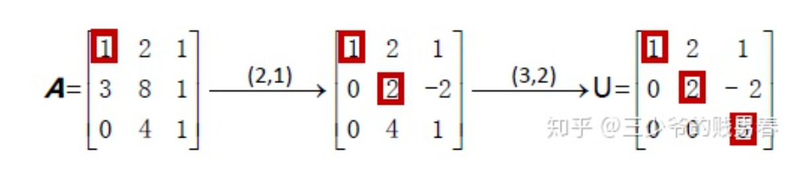

参考: [https://zhuanlan.zhihu.com/p/45717944](https://zhuanlan.zhihu.com/p/45717944)

# 1 高斯消元 Guassian Elimination
> 消元法是计算机软件求解线形方程组所用的最常见的方法。任何情况下，**只要是矩阵**$A$**可逆**，均可以通过消元法求得$Ax=b$的解。
> 此处给出的线性方程组为
> $\bf A=\begin{bmatrix} 1 & 2 & 1 \\ 3 & 8 & 1 \\0 &4 &1 \end{bmatrix},\bf{b}=\begin{bmatrix} 2 \\ 12  \\ 2 \end{bmatrix}$

> 我们消元的步骤就是，从左上角的`**The First Pivot(主元)**`开始:
> **将第一列中主元下方的数字均变为**`**0**`，**用之后的每一行减去第一行的适当倍数**； 注意: 不能进行`Row Exchange`, 只能使用`Row Mulplication`和`Row Addition`
> **将第二列中第二主元(**`**Second Pivot**`**)的下方的所有数字变为**`**0**`
> 如此往复， 直到出现某个主元位置的数字为`0`,同时其下方的所有行中的对应主元位置没有非零项, 则消元终止(此时方程组有无穷多组解)，**否则应当将那一行与该行交换(**`**Row Exchange**`**), 将主元位置变成非零，然后继续消元**
> 比如这样就算终止了:
> $\begin{bmatrix} * & * & * \\ 0 & * & * \\0 &0 &0 \end{bmatrix}$

:::success
图解高斯消元步骤:

:::
```python

def Gaussian_Elimination(A, b):
    """
    Return the eliminated matrix after Guassian elimination
    :param A: Matrix, in numpy format
    :param b: Span, in numpy format
    :return: U,c where Ux=c
    """

    if A.shape[0] != len(b):
        raise RuntimeError("Shape not match")

    aug = np.concatenate([A, b.reshape(len(b), 1)], axis=1)

    k=0      # 记录当前操作的行
    for i in range(0, aug.shape[1]):
        # 行交换保证主元在对应的位置上
        if aug[k,i] == 0:
            for t in range(k + 1, aug.shape[0]):
                if aug[t, i] != 0:
                    # 注意numpy不支持类似于a,b=b,a的赋值语句
                    temp = aug[k, :]
                    aug[k, :] =  aug[t, :]
                    aug[t, :]=temp
                    break

        # 行变换，加法和数乘操作
        for j in range(k + 1, aug.shape[0]):
            if aug[k,i]==0:
                continue
            factor = aug[j, i] / aug[k, i]
            aug[j, :] = aug[j, :] -aug[k, :] * factor

        # 如果当前列有主元，则下一次的主元行向下递增一行
        if aug[k,i] != 0:
            k += 1
    return aug[:,:-1], aug[:, -1]


if __name__ == "__main__":
    import numpy as np

    A = np.array([[1,2,1],[3,8,1],[0,4,1]])
    b = np.array([[2,12,2]]).reshape(3,1)
    print(Gaussian_Elimination(A,b))

```
> 


# 2 增广矩阵 Augmented Matrix
> 做方程的高斯消元时，需要对等式右侧的$\bf b$做同样的乘法和加减法。手工计算时比较有效率的方法是应用“增广矩阵”（augmented matrix），将$\bf b$插入矩阵$\bf A$之后形成最后一列，在消元过程中带着$\bf b$一起操作。
> 
> 此时我们将原方程$Ax=b$转化为了新的方程$Ux=c$，此时我们将原方程$Ax=b$转化为了新的方程$Ux=c$，其中$\bf c$=  。
> 通过`Back Substitution`可得$x$的解
> 从最后一行得到$z=-2$，依次回代可以得到$y=1$,和$x=2$。
> 以上高斯消元法的内容基本是回忆求解线性方程的步骤，是我们很熟悉的东西。在线性代数中比较重要的就是将之前所说的“第二行减去第一行的3倍”这种操作条例变为矩阵化的数学语言。


# 3 消元矩阵 Elimination Matrix
> 消元矩阵的**每一步可以抽象成一个消元矩阵对行进行加法和数乘操作变换**
> 比如仍然是这个例子，我们对$\bf A=\begin{bmatrix} 1 & 2 & 1 \\ 3 & 8 & 1 \\0 &4 &1 \end{bmatrix},\bf{b}=\begin{bmatrix} 2 \\ 12  \\ 2 \end{bmatrix}$进行**行高斯消元**，想要得到$\bf Ux=c$, 就可以**写成几个消元矩阵的左乘**
> **第一步: **将**第二行**减去**第一行的三倍**，我们的消元矩阵形如$\bf E_{21}=\begin{bmatrix} 1& 0 &0 \\ -3&1&0\\0&0&1\end{bmatrix}$$\bf E_{21}A=\begin{bmatrix} 1& 1 &1 \\ 0&2&-2\\0&4&1\end{bmatrix}$
> 第二步: 第三行已经为$0$, 不需要行操作，所以$\bf E_{31}=I$, $\bf E_{31}E_{21}A=\begin{bmatrix} 1& 1 &1 \\ 0&2&-2\\0&4&1\end{bmatrix}$
> **第二步: **将**第三行**减去**第二行的两倍**，我们的消元矩阵形如$\bf E_{32}=\begin{bmatrix} 1& 0 &0 \\ 0&1&0\\0&-2&1\end{bmatrix}$,$\bf E_{32}E_{31}E_{21}A=\begin{bmatrix} 1& 2 &1 \\ 0&2&-2\\0&0&5\end{bmatrix}$
> 所以上述步骤可以变成$\bf E_{32}E_{31}E_{21}A=U$, $\bf E_{32}E_{31}E_{21}b=c$

:::info
对于**行相加**操作，我们可以抽象成$\bf E=\begin{bmatrix} 1& 0 &0 \\ *&1&0\\0&0&1\end{bmatrix}$的形式，并**左乘**到矩阵$\bf A$上，表示第一行的几倍加到第二行上
对于**列相加**操作，我们可以抽象成$\bf E=\begin{bmatrix} 1& * &0 \\ 0&1&0\\0&0&1\end{bmatrix}$的形式，并**右乘**到矩阵$\bf A$上，表示第一列的几倍加到第二列上
**总的来说，左乘消元矩阵一般是行相加，右乘消元矩阵一般是列相加**
**所以这也看处矩阵运算不符合交换律性质**
:::

# 4 置换矩阵 Permutation Matrix
> **左乘置换矩阵完成行交换**`**Row Exchange**`
> 例如$\bf P=\begin{bmatrix} 0&1&0 \\ 1 &0&0\\0&0&1\end{bmatrix}$交换第一和第二行
> **右乘置换矩阵完成列交换**`**Column Exchange**`
> 例如$\bf P=\begin{bmatrix} 0&1&0 \\ 1 &0&0\\0&0&1\end{bmatrix}$交换第一和第二列
> 其实就是看$\bf I$的哪个主元发生了易位，就可以判断是哪两行或者哪两列发生了交换


# 5 逆矩阵 Inverse Matrix
:::info
在`18.02SC`中介绍过如何通过`Adj`矩阵求逆矩阵，这里主要讨论仙缘矩阵的逆矩阵，在后续的$\bf LU$分解中有用
由于对于一个消元矩阵$\bf E_{ij}$来说，$\bf det(E_{ij})\neq0$, 所以消元矩阵均可逆
所以对于  ，根据可逆矩阵的性质$\bf E_{ij}\cdot E_{ij}^{-1}=I$, 我们有 。
满足  ，即 
**总的来说，消元矩阵的逆矩阵抵消了原矩阵带来的高斯消元的操作。**
:::

# 6 练习
## P1: 矩阵消元
:::info

:::
Key


## P2: Pascal's Matrix
:::info

:::
Key**(1)** 我们要找到一个消元矩阵$\bf E$使得**帕斯卡矩阵**$\bf P=\begin{bmatrix} 1&0&0&0 \\ 1&1&0&0 \\ 1&2&1&0 \\ 1&3&3&1 \end{bmatrix}$**化简成**$\bf P'=\begin{bmatrix} 1&0&0&0 \\ 0&1&0&0 \\ 0&1&1&0 \\ 0&1&2&1 \end{bmatrix}$**, **我们可以观察进行了哪些行相加操作，来构造我们的$\bf E$
所以我们有$E_{21}=\begin{bmatrix} 1&0&0&0 \\ -1&1&0&0 \\ 0&0&1&0 \\ 0&0&0&1 \end{bmatrix}$, $E_{32}=\begin{bmatrix} 1&0&0&0 \\ 0&1&0&0 \\ 0&-1&1&0 \\ 0&0&0&1 \end{bmatrix}$, $E_{43}=\begin{bmatrix} 1&0&0&0 \\ 0&1&0&0 \\ 0&1&1&0 \\ 0&0&-1&1 \end{bmatrix}$
将这些乘起来$\bf E_{43}E_{32}E_{21}P=P'$, $\bf E = \bf E_{43}E_{32}E_{21}=\begin{bmatrix} 1&0&0&0 \\ -1&1&0&0 \\ 0&-1&1&0 \\ 0&0&-1&1 \end{bmatrix}$
**(2) 找到高斯消元矩阵**$\bf M$**, 使得**$\bf P'M$**成为上三角矩阵， 所以我们需要一个列操作的消元矩阵**


