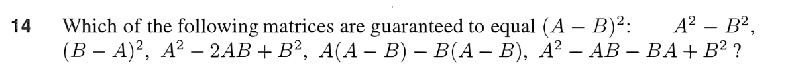

参考:[https://zhuanlan.zhihu.com/p/45750189](https://zhuanlan.zhihu.com/p/45750189)
# 1 矩阵乘法AB=C的四种理解**⭐⭐**
## 标准方法
>  The standard way of describing a matrix product is to say that $c_{ij}$ equals the dot product of row $i$ of matrix $\bf A$ and column $j$ of matrix $\bf B$. In other words,  $\bf C_{ij}=\sum_{k=1}^{n}A_{ik}B_{kj}$ 

## 列视角
> 矩阵$\bf A$乘矩阵$\bf B$的第$j$列得到矩阵$\bf C$的第$j$列
> **这说明了矩阵**$\bf C$**的每一列都是矩阵**$\bf A$**的所有列的线性组合**

## 行视角
> 矩阵$\bf A$的第$i$行乘矩阵$\bf B$得到矩阵$\bf C$的第$i$行
> **这说明了矩阵**$\bf C$**的每一行都是矩阵**$\bf B$**的所有行的线性组合**

## 列乘以行视角
> 矩阵$\bf A$的第$j$列和矩阵$\bf B$的第$i$行相乘
> 
> 
> 这种视角对我们后续理解谱分解定理和特征值分解定理极其有帮助。

:::success
**推导：**
我们针对这个公式得出的矩阵$\bf C$中的每一个`Entry`进行对比
按照`Standard Form`计算: $\bf C_{ij}=\sum_{k=1}^{n}A_{ik}B_{kj}$
按照上述公式: $\bf C_{ij}=\sum_{k=1}^nA_{ik}B_{kj}$
所以行乘以列的公式成立
:::

# 2 分块矩阵乘法**⭐⭐**
:::success
如果将矩阵**_A_**和矩阵**_B_**划分为严格匹配的区块，则矩阵乘法可以通过分块的乘法加以实现。

其中$\bf C_{1}=A_{1}B_{1}+A_{2}B_{3}$，计算方法与标准算法中矩阵里元素的操作方式相同。
之前没有提到一点，就是因为矩阵乘法规则有点小复杂，在手算计算过程中有可能会串行，我们不可能每一次都如下图这样认真标注。

一个比较好的小技巧就是把_**B**_矩阵的位置改变一下，这样矩阵$\bf C$中每一个元素所对应$\bf A$和$\bf B$中的行与列就变得非常清楚了。我在wiki百科中看到了这张图，MIT多元微积分课程上老师也提到了这种方法。

这里我们可以利用这种小技巧来帮助理解矩阵的分块乘法：

可以看到$\bf C_{1}$就是经过$\bf C_{1}=A_{1}B_{1}+A_{2}B_{3}$的运算计算出来的，$\bf A_1$中的元素只和$\bf B_1$的元素进行运算，$\bf A_2$只和$\bf B_3$进行运算，$\bf C_1$为两者加和。
:::

# 3 逆矩阵
:::success
如果矩阵**_A_**是方阵，若存在逆矩阵  ，使得  （左逆矩阵等于右逆矩阵）。我们称矩阵**_A_**可逆（invertible）或者矩阵_**A**_非奇异（nonsingular）。
反之，如果**_A_**为奇异（singular），则其没有逆矩阵。它的行列式为**0**。另一个等价的说法是，**_A_**为奇异阵，则方程**_A_x**=**0**存在非零解**x(non-trivial Solutions)**。例如：

在这个二阶矩阵的例子中，两个列向量排列在同一方向上。不可逆矩阵中总有列向量对生成线性组合没有贡献，等价的说法还有：不可逆矩阵的列向量可以通过线性组合得到**0**。
换而言之，若矩阵_**A**_存在逆矩阵，则方程**_A_x**=**0**只有零解。证明：反设其存在非零解**x**，则有  ，矛盾。
对于可逆矩阵，求它的逆矩阵是一个重要的问题。

从“列操作”的角度来看，求逆矩阵过程其实和求**_A_x**=**b**相同，只是这里**x**为矩阵 的第j列，而**b**为单位阵**_I _**的第j列。
:::

# 4 高斯-诺尔当消元法**⭐⭐**
## 二阶的例子
:::success
对于前面的二阶矩阵，求逆相当于两组方程：
 和 
Gauss-Jordan消元法可以同时处理两个方程：

在用高斯消元法的到上三角矩阵之后，按照若尔当的做法继续消元，用第一行减去第二行的若干倍，最后原矩阵变为单位阵，这时右侧的矩阵即为逆矩阵。
对_**A**_进行一系列消元操作，相当于左乘消元矩阵**_E_**，此时消元的结果为_**EA**_=_**I**_，因为右侧矩阵也进行了同样消元操作，也等于左乘矩阵**_E_**，则右侧矩阵为**_EI_**=**_E_**。由_**EA**_=**_I__ _**可知这里的_**E**_就是**_A_**的逆矩阵，因此右侧矩阵给出的就是逆矩阵 。

:::

## 分块矩阵消元 - Schur Complement
> 

## Summary
> 

# 5 Exercises
## P1: 矩阵乘法分配律
:::success

:::
Key

## P2: 高斯诺尔当消元
:::success

:::
Key

# 6 Problem Set 2.4&2.5
## Matrix Algebra
### AB&BA
> 

**Solution**

### Row&Col Multiplications
> 

**Solution**

### aij⭐⭐⭐⭐⭐
> 

**Solution 18**⭐⭐⭐
**Solution 19**⭐⭐⭐⭐⭐
**Solution 20**⭐⭐⭐

### Powers of A
> 

**Solution 21: Strict Triangular Matrix**⭐⭐⭐⭐
这种`Strictly Triangular Matrix`在乘方的过程中严格保持`Triangular`的性质。
**Solution 22**⭐⭐⭐⭐
**Solution 23**⭐⭐⭐⭐⭐
**Solution 24**

## Block Multiplication
### Four Perspectives
> 

**Solution**

### Block Elimination⭐⭐⭐⭐⭐
> 

**Solution 29**
**Solution 30**⭐⭐⭐
**Solution 31 Complex Number Multiplication**⭐⭐⭐

## Invertibility&Columns&Rows
> 

**Solution 6**a. 化简成$A(B-C)=0$, 然后把$B-C$想象成一些列向量构成的矩阵$M$，因为$A$可逆，所以$Ax=0$只有零解。也就是说$AM=0$中$M$的每一列都是零向量，也就是说$M$是零矩阵，所以$B=C$
b. 取$B=\begin{bmatrix} 2&3\\3&2\end{bmatrix},C=\begin{bmatrix} 3&2\\2&3\end{bmatrix}$即可。因为$A$不可以，所以满足$A(B-C)=0$的$B,C$有很多。
**Solution 7**
