参考: [https://zhuanlan.zhihu.com/p/45784001](https://zhuanlan.zhihu.com/p/45784001)
# 1 矩阵乘积的一些基本性质
## 1.1 矩阵乘积的逆矩阵
:::success
**Inverse of a product**

 比较等式两端可得 。
:::

## 1.2 矩阵乘积的转置
:::success
**Transpose of a product**
其数学表达式为 ，即  的第i行j列的元素为原矩阵$\bf A$中第$j$行$i$列的元素。

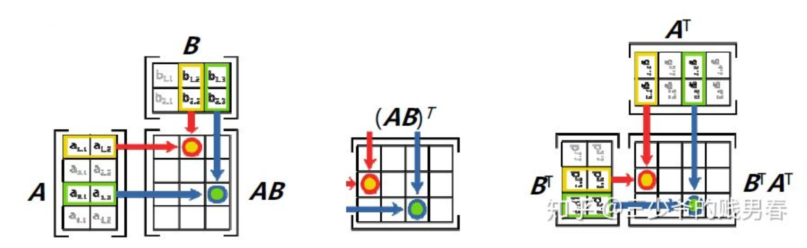
上图中可以理解为把一张横着放的$A4$纸反转$90$度
:::
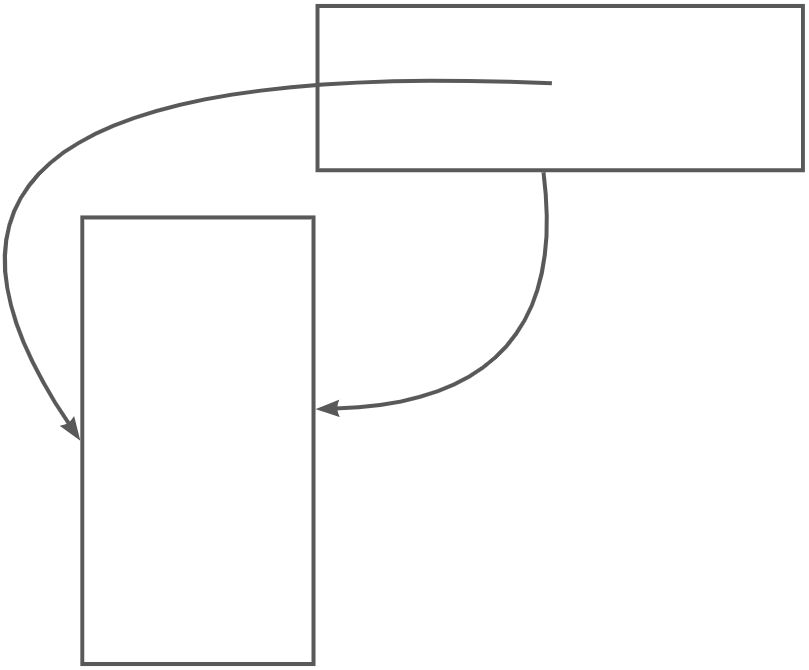


## 1.3 矩阵转置的逆矩阵
:::success
**Inverse of a Transpose**

 两边取转置，并应用积的转置公式，得到。根据逆矩阵定义得到
:::


# 2 矩阵的LU分解
:::info
$\bf LU$分解一般只针对于方阵。
:::
## 2.1 LU分解的由来
:::success
矩阵的**LU**分解可由高斯消元的步骤进行一些加工得到, 本质上是想得到一个下三角阵$\bf L$和上三角阵$\bf U$
前文我们知道，一个矩阵$\bf A$高斯消元的结果是一个上三角矩阵$\bf U$, 而**经历的行操作可以抽象成一系列的消元矩阵**$\bf E_{ij}$**的左乘**
**假设现在我们通过一系列行操作(左乘消元矩阵)**: 得到$\bf EA=U$，那么矩阵的$\bf LU$分解就呼之欲出、
因为$\bf E$可逆，所以$\bf E^{-1}E=I$我们在两边同乘以$\bf E^{-1}$,得到$\bf E^{-1}EA=E^{-1}U$
所以$\bf A=LU$,这里$\bf L=E^{-1}$
**例如: **
在没有行交换的情况下，矩阵A通过左乘一系列消元矩阵$\bf E_{ij}$可以转化为_**U**_。在二阶矩阵中，进行一次消元操作即可达到这一效果。

在等式两侧左乘  ，得到 即。就得到了矩阵_**A**_的_**LU**_分解结果。

**其中**_**U**_**为上三角阵（Upper triangular matrix），主元依次排列于它的对角线上，****即**_**L**_**为下三角阵（Lower triangular matrix）。**
:::


## 2.2 没有行交换的LU分解
### 2x2的算例
> 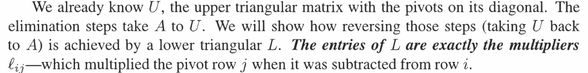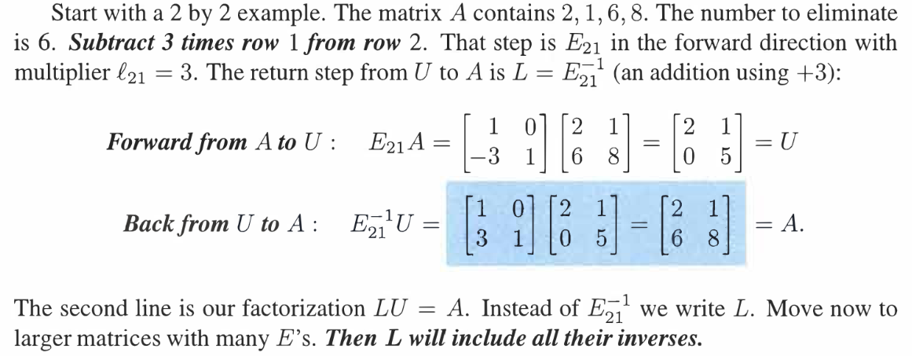


### Eij的含义⭐⭐⭐⭐⭐
> 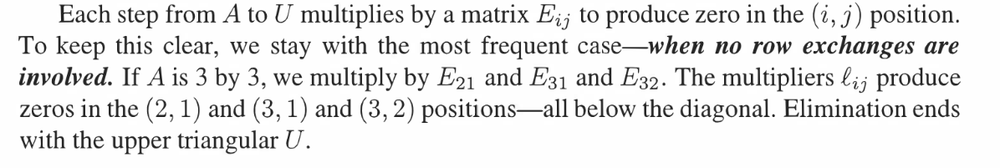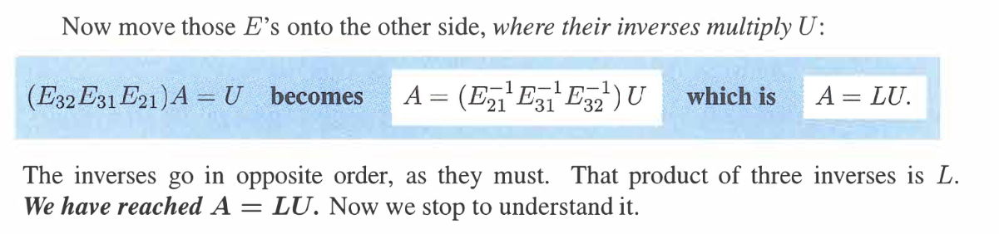

**Remarks**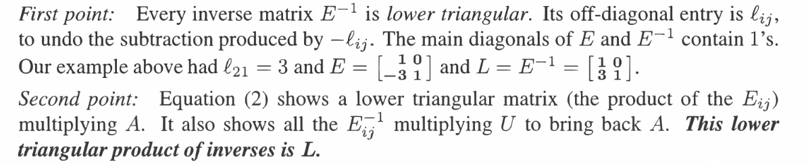


### 本质: 行操作的叠加
:::success
假设我们有两个行操作矩阵$E_{32},E_{21}$, 并且假设被操作的矩阵$\bf A$的行向量分别为$A_1,A_2,A_3$
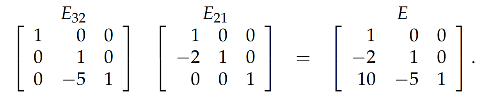
进行高斯消元, 我们有:
(1) $A_2 = A_2-2A_1$
(2) $A_3 = A_3 - 5A_2$
将这两步合起来看，$A_2 = A_2-2A_1,\space A_3 = A_3 - 5(A_2-2A_1)=A_3 -5A_2+10A_1$
**由于我们的消元矩阵是从右到左一次计算的，所以在第一步行操作的时候对第二行的影响会在后续对第三行产生影响， 就体现在这个数字**$10$**中**
:::
:::info
而写成逆的形式, 也就是从原来的$\bf E_{32}E_{21}A=U$变成$\bf A=E_{32}^{-1}E_{21}^{-1}U$之后
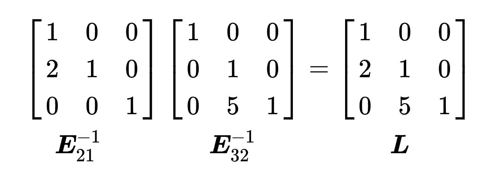
就不会出现数字$10$了, 也就没有交叉项出现了，因为运算顺序会发生变化。使得消元矩阵的因子可以直接写入矩阵$\bf L$, 这种$\bf A=LU$的书写形式优于$\bf EA=U$的写法
:::


### 总结
> 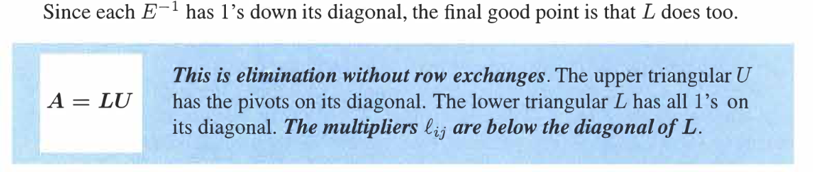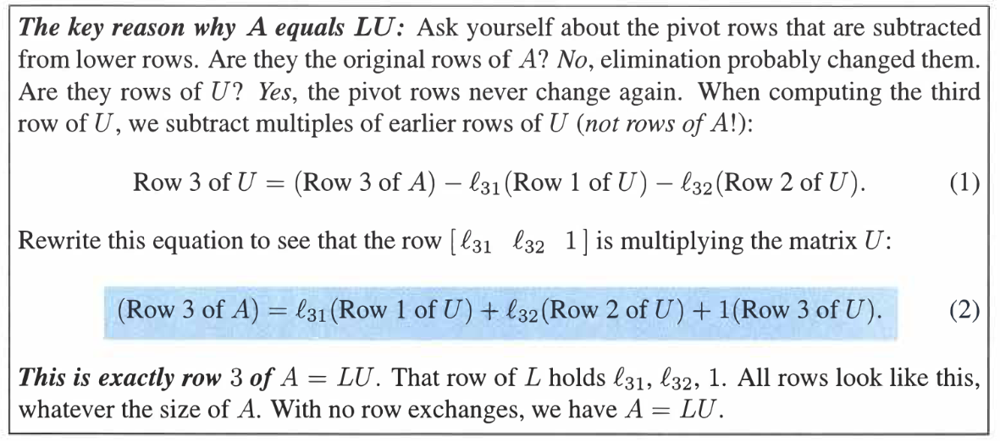


## 2.3 含有D的LU分解**⭐⭐⭐**
:::success
有时我们也通过分解得到对角阵$D$（diagonal matrix）,例如

这种分解的意义在于，我们通过$\bf LU$分解得到的$\bf L$的对角线上都是$1$, 但是$\bf U$的对角线上是我们的主元，他们有可能不是$1$, 所以看起来不是很对称。
于是，为了让$\bf LU$看起来对称，我们将$\bf U$分解成一个对角矩阵和一个主元位置均为$1$的上三角矩阵
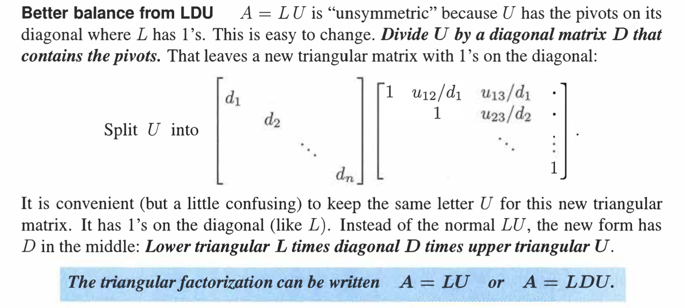
:::
 


## 


## 2.4 Python 实现LU分解 
:::info
在一些应用中我们需要处理超大型矩阵，即使用计算机来处理这一问题，也需要评估所需的计算量。
**如果我们把“先乘后减”大致记为一次运算**，那么对于一个$n\times n$矩阵，对于一行进行消元要进行$n$次运算，由于有$n$行所以进行了$n\times n$次运算，结果得到了第一列除第一主元外都消成0的矩阵。随后开始对除第一行第一列之外的剩余部分进行消元，这相当于一个$(n-1)\times(n-1)$的矩阵，那么就要进行$(n-1)\times(n-1)$次运算，以此类推。(**简单理解就是沿着各阶主子式的方向消元**)
最后需要的运算次数为$1\times 1+2\times 2+……+n\times n$，**利用积分公式可以估算其数值。**
$1^2+2^2+...+n^2=\sum_{i=1}^n i^2\Delta i$, $\Delta i=1$, 相当于步长(因为是离散的情况), 但当$\Delta i\to 0$时，$\sum_{i=1}^n i^2\Delta i=\int_0^n t^2 dt=\frac{1}{3}n^3$
**这里算是个灵活使用数学工具的例子，我看到完全平方的求和，就一直在回忆公式，但其实作为估算采用积分公式就很方便了。有时候应用数学工具就像开车，保证你正常行驶主要靠驾驶技能，而不是你手边的一本《交规》，熟练驾驶但是不遵守交规很容易出错，交规倒背如流却没有驾驶技能则往往寸步难行。**
:::
```python
# 算法本质就是高斯消元的过程中，记录下每次消元矩阵中非1项，记录在L矩阵相应的位置上， U矩阵就是
# 高斯消元后的U上三角矩阵
def LU_factorization(A):
    """
    Return the LU factorized matrix using guassian elimination
    :param A: Matrix, in numpy format, must be square
    :return: L,U
    """

    if A.shape[0] != A.shape[1]:
        raise RuntimeError("Input Matrix is not a square matrix")

    L = np.eye(*A.shape)

     k=0      # 记录当前操作的行
    for i in range(0, A.shape[1]):
        # 行交换保证主元在对应的位置上
        if A[k,i] == 0:
            for t in range(k + 1, A.shape[0]):
                if A[t, i] != 0:
                    temp = A[k, :]
                    A[k, :] =  A[t, :]
                    A[t, :]=temp
                    break

        # 行变换，加法和数乘操作
        for j in range(k + 1, A.shape[0]):
            if A[k,i]==0:
                continue
            factor = A[j, i] / A[k, i]
            if factor != 0:
                L[j,i] = factor
            A[j, :] = A[j, :] -A[k, :] * factor

        # 如果当前列有主元，则下一次的主元行向下递增一行
        if A[k,i] != 0:
            k += 1
    
    return L,A


if __name__ == "__main__":
    import numpy as np

    A = np.array([[2,1],[8,7]])
    L,U = LU_factorization(A)
    print(L)
    print(U)
```
:::info
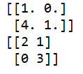
:::

## 2.5 能够LU分解的条件
参考: [https://zhidao.baidu.com/question/557328926075052012.html](https://zhidao.baidu.com/question/557328926075052012.html)
> $\bf A$可以进行$\bf LU$分解的充要条件是$\bf A$顺序主子式全不为$0$.
> **证明:**
> 这个定理的证明涉及到高斯消去法.
我们知道高斯消去的三种消去
> 1. 对换: 对换矩阵的两行
> 2. 倍乘: 将某行乘以常数
> 3. 倍加: 将矩阵某行乘以常数加到另一行.
> 
**对应三种初等矩阵.其中第二三个是下三角矩阵而第一个不是**.
**如果矩阵A可以经过不用对换的高斯变换化成**`**RREF**`**矩阵(一个上三角矩阵),那么就能进行LU分解**.
> **什么情况高斯消去不用对换矩阵的两行呢?**
打个比方$\bf A$经过第一次高斯消去后使得除了$\bf A_{11}$第一列其他元素都是$0$了,然后进行第二列的消去此时要满足新的$\bf A_{22}$不为零才能进行下去.否则就要将第二行和其他行对换。
因此没有对换的关键是"消去第$i$列"时的$\bf A_{ii}$不为$0$.
> 我们的定理要证明的就是"消去第$i$列时的$\bf A_{ii}$不为零"这个条件与"$\bf A$ 的顺序主子式不为零"等价
证明,用数学归纳法对矩阵的阶$n$进行归纳
> 我们也可以这样想，$\bf L$是由一系列的初等变换矩阵(不包括`Permutation Matrix`)的逆矩阵逆序相乘得到的，于是我们在左乘$\bf U$时不能出现置换，也就是在高斯消元时不能出现置换。


# 3 置换交换的性质
:::info
如果主元的位置出现了0，就需要进行“行交换”。我们可以通过左乘一个置换矩阵（Permutation Matrix）实现“行交换”的操作。例如

可以实现33矩阵的第一行与第二行的交换。所有的33的置换矩阵包括：

对于$n\times n$矩阵存在着$n！$个置换矩阵。
置换矩阵每一行或者每一列只有一个元素是1，其它都是0，从第一行选一个位置设定为1有n个选择，第二行则只剩下$n-1$个选择，以此类推，最终有$(^n_n)=n！$(**也就是**$n$**行的全排列**)种可能。
对于某阶的置换矩阵集合而言，置换矩阵的两两乘积仍在这个集合中，置换矩阵的逆矩阵也在此集合中。置换矩阵的逆矩阵即为它的转置  。
**可以用前面介绍过的乘法运算小技巧来理解这件事情**
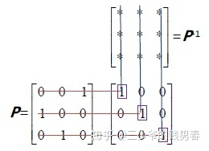
$\bf P$的第$i$行和 的第$i$列相乘会得到$1$，与其他列相乘都得到$0$，所以 的第i列只能是$\bf P$的第i行行向量的转置（让分量$1$出现在向量里的相同位置），其他各列以此类推，则$\bf P$的每一个行向量转置就得到 的列向量，这也就是矩阵转置  的定义。因此可得  。
:::


# 4 Recitation
## P1: LU分解
:::info
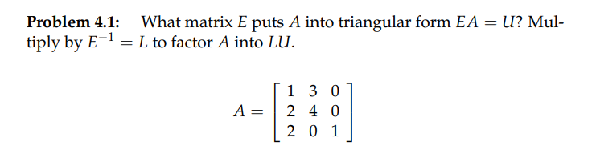
:::
Key**第一步**寻找使得$EA=U$的$E$
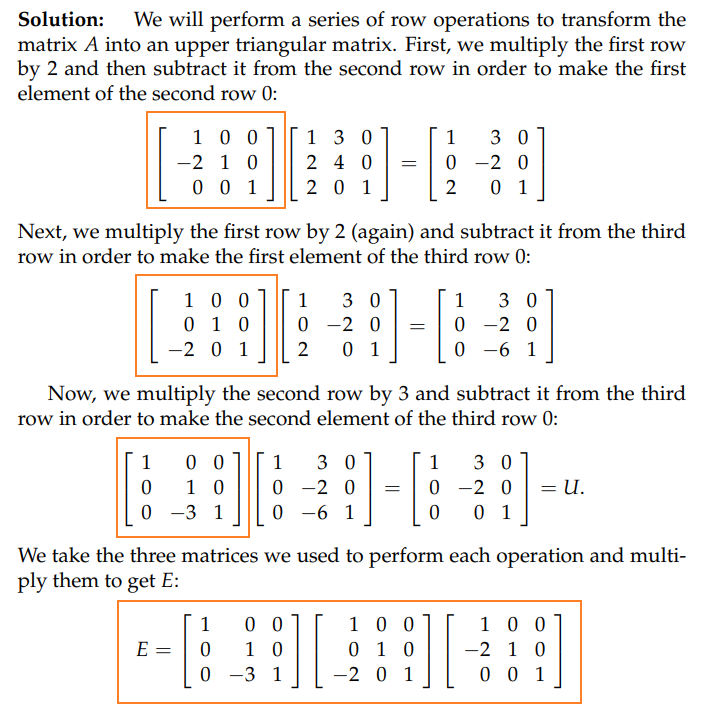
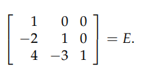
**第二步:** 通过$E$利用高斯诺尔当消元法找到$E^{-1}$
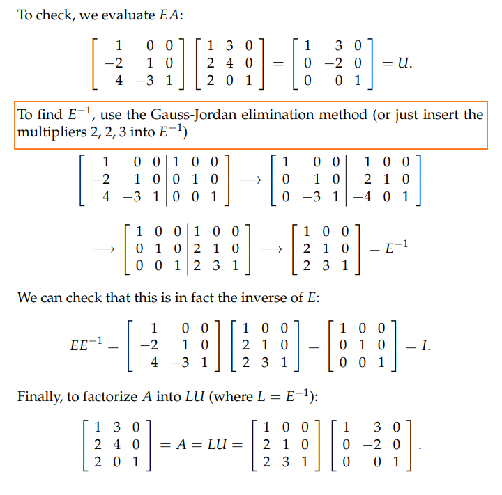
**用**`**Python**`**代码验证得到的结果一致**
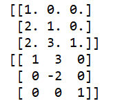


## P2: 对称矩阵的LU分解
:::info
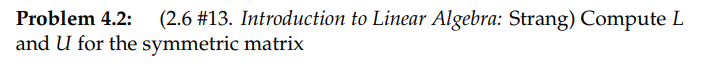
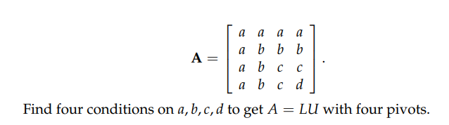
:::
Key**(1) 计算矩阵**$A$**的LU分解 **
**(2) 找到满足条件的参数**
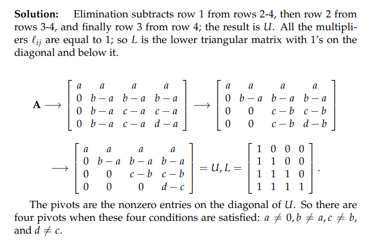

## P3: LU分解的条件**⭐⭐**
> 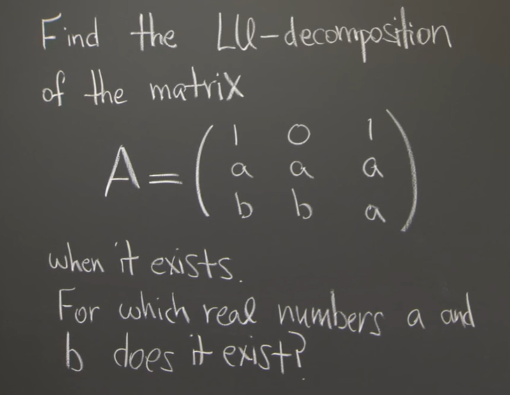

**Key**先化简，再求条件
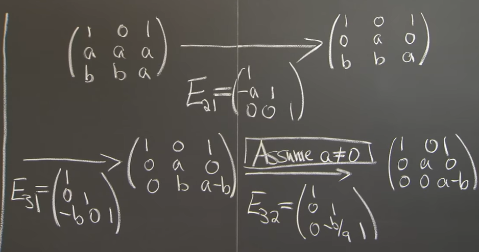
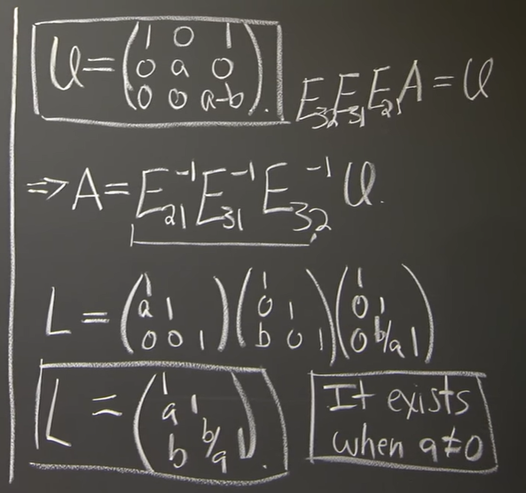
不可逆矩阵也有`LU`分解

# 5 Problem Set 2.6
## LU Process
### Ax=b -> Ux=c （2 x 2）
> 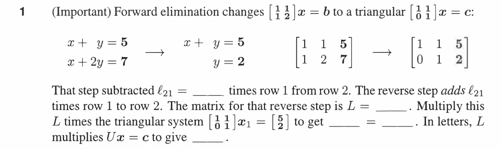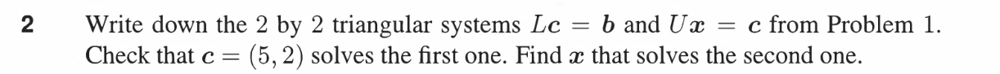
> **注意:** $l_{ij}$是矩阵$L$的第$i$行第$j$列。

**Solution 1**从$Ax=b$到$Ux=c$的过程中，根据上图可知，为了首先使得$A_{21}$变成$0$, 我们需要左乘一个$E_{21}$矩阵$\begin{bmatrix} 1&0\\-l_{21}&1\end{bmatrix}$, 其中因为我们想要$A$的第二行减去$A$的第一行，所以选取$l_{21}=1$, 从而得到上三角矩阵$U$。本质上$E_{21}$是在对$A$做行相加操作。
从$Ux=c$到$Ax=b$的过程中，我们想要复原这一过程，也就是我们要撤销行相加操作，那么我们只要取基础矩阵$E_{21}^{-1} = \begin{bmatrix} 1&0\\l_{21}&1\end{bmatrix} = \begin{bmatrix} 1&0\\1&1\end{bmatrix}$, 对这一行操作撤销即可。而实际上$E_{21}^{-1}$就是我们的$L$。
且$LU=A$. 同时, 对$Ux=c$左乘一个$L$可以得到$LUx=Lc\implies Ax=b$。
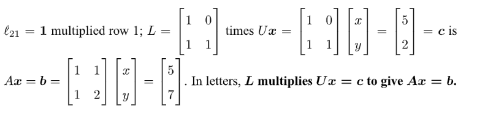
**Solution 2**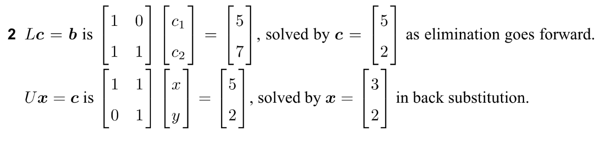

### 3 x 3 LU Process
> 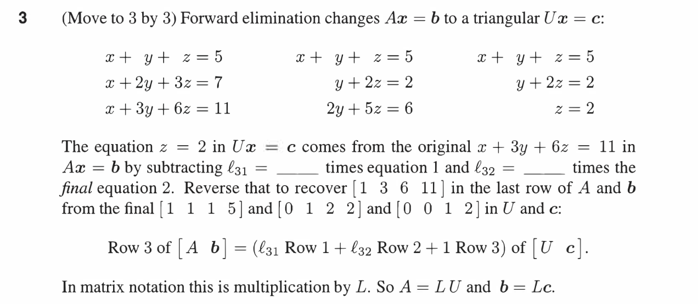

**Solution**首先我们从$Ax=b$到$Ux=c$。根据高斯消元的步骤，我们先得到$l_{21}=1$(因为高斯消元中是用第二行减去第一行，所以在$L$中要去取负号)。这样第二行变成$y+2z=2$。然后得到$l_{31}=1$, 原因同上。最后得到$l_{32}=2$, 因为高斯消元中是用第三行减去第二行的两倍。所以综上$l_{21}=1, l_{31}=1, l_{32}=2$。
然后我们从$Ux=c$到$Ax=b$：

1. 需要对$U$左乘$E_{32}^{-1}=\begin{bmatrix} 1&0&0\\0&1&0\\0&l_{32}&1\end{bmatrix}=\begin{bmatrix} 1&0&0\\0&1&0\\0&2&1\end{bmatrix}$和$E_{31}^{-1}=\begin{bmatrix} 1&0&0\\0&1&0\\l_{31}&0&1\end{bmatrix}=\begin{bmatrix} 1&0&0\\0&1&0\\1&0&1\end{bmatrix}$来恢复$A$的第三行。因为在高斯消元的时候我们对第三行减了两次。也就是说只要在高斯消元过程中对第三行进行过操作的行在`Reverse`中都要把自己原封不动还回去。
2. 最后左乘$E_{21}^{-1}=\begin{bmatrix} 1&0&0\\l_{21}&1&0\\0&0&1\end{bmatrix}=\begin{bmatrix} 1&0&0\\1&1&0\\0&0&1\end{bmatrix}$来恢复第二行即可。

**Textbook Solution:**
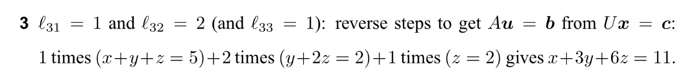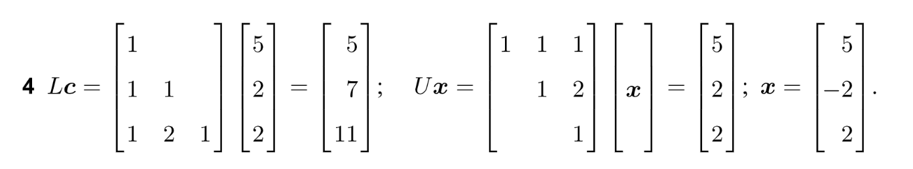
