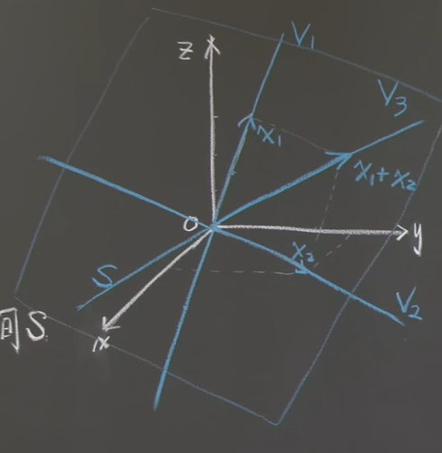

参考: [https://zhuanlan.zhihu.com/p/45804907](https://zhuanlan.zhihu.com/p/45804907)
# 1 置换**⭐⭐⭐**
## 1.1 消元法中的置换
:::info
当应用消元法求解方程组的时候我们需要通过行交换将$0$从主元位置移走。左乘一个置换阵可以实现行交换的操作。（为了满足数值计算的要求，Matlab甚至会对接近于$0$的非零主元做行交换）因此我们的$\bf LU$分解由$\bf A=LU$变为$\bf PA=LU$。其中的$\bf P$就是对$\bf A$的行向量进行重新排序的置换矩阵。
**这里其实蕴含了一个重要性质**: 就是如果矩阵在消元的过程中需要发生行交换，也就是左乘了一个置换矩阵的话，这个矩阵就无法进行标准的$\bf LU$分解，而只能进行$\bf PA=LU$的分解
**这个重要性质还有一个推论**: 就是当矩阵$\bf A$的$\bf A_{11}$元素为零时，矩阵不能进行$\bf LU$分解
设想一下，如果一个矩阵如果$\bf A_{11}$为零，则一定会发生行交换，将该列的主元位置交换为其他行对应的非零元素，那么矩阵不能$\bf LU$分解
**证明:**
假设矩阵的消元过程是$\bf EEEPA=U........(1)$, 则$\bf L=E^{-1}E^{-1}E^{-1}P^{-1}........(2)$
对于$\bf E$来说，他们都是下三角矩阵，且他们的逆矩阵也一定是下三角矩阵(因为行交换的逆操作就是变一个符号而已，比如$E=\begin{bmatrix} 1&0&0\\1&1&0\\0&0&1\end{bmatrix}$, $E^{-1}=\begin{bmatrix} 1&0&0\\-1&1&0\\0&0&1\end{bmatrix}$), 所以$(2)$式中的前三个$\bf E^{-1}$的结果是下三角矩阵，但是$\bf P^{-1}$的存在使得我们的下三角矩阵得发生行交换，这就有可能导致$\bf L$不再是下三角矩阵，于是矩阵无法正确地进行$\bf LU$分解。
:::
> **如果在消元的过程中进行“行交换”，那么不是意味着P矩阵存在于一堆_ E _矩阵之间么**_**EEEPEPEA**_**=**_**U**_**，矩阵乘法不符合交换律，怎么保证能把P提出来变成**_**PA**_**=**_**LU**_**呢？**
> 我们可以假想在消元过程中你已经完全知道需要怎么进行“行交换”之后，我们重新开始做矩阵分解，这一次先对**_A_**进行“行交换”得到**_A_***，这时候对_**A**_*消元，就不用再进行“行交换”了，于是有**_PA_**=_**A**_*=_**LU**_。

## 1.2 置换矩阵的个数
:::info
置换矩阵$\bf P$是通过对单位阵进行“行交换”得到的。对于$n\times n$矩阵存在着$n!$个置换矩阵。置换矩阵具有特殊性质 即。
:::

# 2 转置
:::info
矩阵$\bf A$的转置矩阵记为  ，对矩阵进行转置就是将$\bf A$矩阵的行变为 的列，则完成后$\bf A$的列也就成为了 的行，看起来矩阵如同沿着对角线进行了翻转。
其数学表达式为  ，即 的第$i$行$j$列的元素为原矩阵$\bf A$中第$j$行第$i$列的元素。

若$\bf A$是对称矩阵则有 。
矩阵乘积的转置 ，
**重要性质：**
**给定一个矩阵**$\bf R$**，**$\bf R$**可以不是方阵，则乘积**$\bf R^TR$**一定是对称阵。**

:::

# 3 向量空间
:::info
我们可以对向量进行所谓“线性运算”，即通过加和（**v**+**w**）与数乘运算（3**v**）得到向量的线性组合。向量空间**对线性运算封闭**，即空间内向量进行线性运算得到的向量仍在空间之内。
$\bf R^2$即为向量空间，它是具有两个实数分量的所有向量（二维实向量）的集合。
例如  ……
向量  的图像是从原点出发到点$(a,b)$的箭头，其中第一分量$a$为横轴坐标，第二分量$b$为纵轴坐标。空间$\bf R^2$ 的图像为整个$xy$平面。
**所有向量空间必然包含零向量，因为任何向量数乘**$0$**或者加上反向量都会得到零向量，而因为向量空间对线性运算封闭，所以零向量必属于向量空间。**
$\bf R^3$是向量空间，它是具有三个实数分量的所有向量的集合。
$\bf R^n$是向量空间，它是具有$n$个实数分量的所有向量的集合。
**反例**：$\bf R^2$中的第一象限则不是一个向量空间。
:::

# 4 子空间
:::info
包含于向量空间之内的一个向量空间称为原向量空间的一个子空间。例如用实数$\bf c$数乘$\bf R^2$ 空间中向量$\bf v$所得到的向量集合就是$\bf R^2$ 空间的一个子空间，其图像为二维平面上穿过原点的一条直线，它对于**线性运算封闭。**
反例：$\bf R^2$ 中不穿过原点的直线就不是向量空间。子空间必须包含零向量，原因就是数乘0的到的零向量必须处于子空间中。
$\bf R^2$** 的子空间包括：**

- $\bf R^2$ 空间本身
- **过原点的**一条直线（这是$\bf R^2$ 空间中的一条直线，与$\bf R^1$ 空间有区别）, (因为对$\bf u\in R^2,0*u\in R^2$,**所以只要是一条直线，就必须过原点，否则不是向量空间**)
- **原点 仅包含**$0$**向量 Z** (因为对于$\bf u,u\in R^2, u-u=0\in R^2$)

$\bf R^3$** 的子空间包括：**

- $\bf R^3$ 空间本身 $3$维
- **过原点的**一个平面 $2$维
- **过原点的**一条直线 $1$维
- **原点** 仅包含$0$向量 $\bf Z$

**注意: 零向量就是原点**
:::

# 5 列空间
:::info
给定矩阵$\bf A$，其列向量属于$\bf R^3$空间，这些列向量和它们的线性组合张成了$\bf R^3$空间中的一个子空间，即矩阵$\bf A$的列空间$\bf C(A)$。
如果  ，则$\bf A$的列空间是$\bf R^3$空间中包含向量  和  并穿过原点的平面，空间内包含两向量的所有线性组合。
下面课程的任务就是在列空间和子空间的基础上理解$\bf Ax=b$。
:::

# 6 练习
## P1: 寻找置换**⭐⭐⭐⭐**
:::info

:::
**(a)****本题介绍了置换矩阵的一个性质:**
由于置换矩阵本质上就是对行向量的一个全排列, 假设我们原来的矩阵为$A=\begin{bmatrix} -A_1- \\ -A_2- \\ -A_3 -\end{bmatrix}$
则$P=\begin{bmatrix} 0&1&0 \\ 0&0&1 \\  1&0&0 \end{bmatrix}$, 会使得本来矩阵的$1,2,3$行的顺序变成$2,3,1$, 如此来三次（车轮战的感觉，矩阵就会复原）
$PA = \begin{bmatrix} -A_2- \\ -A_3- \\ -A_1 -\end{bmatrix}$, $PPA= \begin{bmatrix} -A_3- \\ -A_1- \\ -A_2 -\end{bmatrix}$, $P^3A=\begin{bmatrix} -A_1- \\ -A_2- \\ -A_3 -\end{bmatrix}$
所以$P=\begin{bmatrix} 0&1&0 \\ 0&0&1 \\  1&0&0 \end{bmatrix}$, 本质上就是把所有行的打乱，打乱三次就变回原样
**(b)**利用(a) 中得到的$P^3 \neq I$, 我们可以构造一个分块矩阵$\hat{P}=\begin{bmatrix} 1&0\\0&P \end{bmatrix}$
根据分块矩阵的性质$\hat{P}^3 = \begin{bmatrix} 1&0\\0&P^3 \end{bmatrix} = \begin{bmatrix} 1&0\\0&I \end{bmatrix}$
所以$\hat{P}^4 = \hat{P}^3\cdot \hat{P}=\begin{bmatrix} 1&0\\0&P \end{bmatrix}\neq I$

## P2: Skew-Symmetric?**⭐⭐**
:::info

:::
**(a)**
**(b)**

## P3: 子空间
:::info

:::
**(a)**对于一个空间$M=\{A|A^T=A\}$
我们验证这个空间是否对加法和数乘(线性计算)封闭
我们取空间中的任意两个矩阵$\bf A,B$, 因为$\bf A,B\in M$, 所以$\bf A^T = A, B^T =B$

- 因为$\bf (A+B)^T=A^T+B^T=A+B$所以$\bf (A+B) \in M$
- 因为$\bf (cA)^T=cA^T=cA$, 所以$\bf cA\in M$
- 同时因为$\bf 0$矩阵也属于$M$

所以$\bf M$是一个子空间, True
**(b)**对于一个空间$M'=\{A|A^T=-A\}$
我们验证这个空间是否对加法和数乘(线性计算)封闭
我们取空间中的任意两个矩阵$\bf A,B$, 因为$\bf A,B\in M'$, 所以$\bf A^T = -A, B^T =-B$

- 因为$\bf (A+B)^T=A^T+B^T=-(A+B)$所以$\bf (A+B) \in M'$
- 因为$\bf (cA)^T=cA^T=-cA$, 所以$\bf cA\in M'$
- 同时因为$\bf 0$矩阵也属于$M'$

所以$\bf M'$是一个子空间, True
**(c)**

## P4: 三维空间的子空间
> 

**(1)**$\bf V_1$的子空间是$cx_1$直线(包含原点)
$\bf V_2$的子空间是$cx_2$直线(包含原点)
$\bf V_1\cap V_2=\{0\}$
**(2)**$\bf V_3\neq V_1\cup V_2$
我们取$\bf x_1+x_2$这个向量张成的线性子空间$\bf S$即可满足使得$\bf x_1\notin S,x_2\notin S$

**(3)**$\bf V_3\cup\{xy平面\}=V_2$
