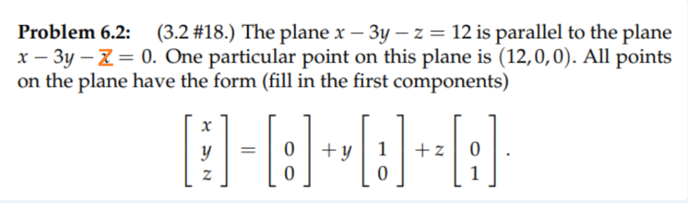

参考: [https://zhuanlan.zhihu.com/p/45810014](https://zhuanlan.zhihu.com/p/45810014)
:::info
**本讲给出了关于矩阵的两种子空间，同时给出了两种构造子空间的方法。**

- 对于列空间，它是由列向量进行线性组合张成的空间；
- 对于零空间,   他是从方程组的结构出发，通过让$x$满足特定条件而得到的子空间
:::
# 1 子空间深入
## 1.1 向量空间
:::info
**所谓的“向量空间”是对于线性运算封闭的向量集合**。即对于空间中的任意向量$v$和$w$，其和$v+w$和数乘$cv$必属于该空间；换而言之对于任何实数$c$和$d$，线性组合$cv+dw$必属于该空间。
 ，  ， ，……都是重要的向量空间， 代表的空间包含所有具有$n$个分量的向量。其中字母$R$表明分量均为实数（real）。
:::

## 1.2 子空间
:::info
“子空间”为包含于向量空间内的一个向量空间。它是原向量空间的一个子集，而且本身也满足向量空间的要求。
**但是“子空间”和“子集”的概念有区别: **

- **所有元素都在原空间之内就可称之为子集**
- **但是要满足对线性运算封闭的子集才能成为子空间。**

**例如**

- 通过原点的平面$\bf P$是的一个子空间。
- 通过原点的直线L也是的子空间。
- $\bf P\cup L$通常并不是的子空间。(取这根直线$u$和平面内的任意一根直线$v$，$u+v\notin R^3$)
- $\bf P\cap L$是子空间的特例——$0$空间，只有零向量。

任意子空间$S$和$T$的交集都是子空间，可以通过$S$和$T$本身对线性组合封闭来证明。
任意子空间$S$和$T$的并集一般不是子空间，可以通过$S$和$T$本身对线性组合封闭来举反例。
:::

# 2 列空间
## 2.1 列空间定义
:::info
矩阵$\bf A$的列空间$\bf C(A)$是其列向量的所有线性组合所构成的空间。
:::

## 2.2 求解线性方程组
:::info
求解$\bf Ax=b$的问题，对于给定的矩阵$\bf A$，对于任意的$\bf b$都能得到解么？
如果 
显然并不是所有的$\bf b$都能保证$\bf Ax=b$有解，因为它有$4$个线性方程而只有$3$个未知数，矩阵$\bf A$列向量的线性组合无法充满
设想一下，因为我们只有三个未知数$x_1,x_2,x_3$, 假设矩阵$\bf A=[A_1\space A_2\space  A_3]$, $\bf A_i$代表矩阵的列
则$\bf Ax=x_1A_1+ x_2*A_2+x_3*A_3$, 一旦我们确定了$x_1,x_2,x_3$的值，那么第四行的值就被锁死了，也就是说，我们在第四维度不能取到所有值，而前三位可以取到所有值， 也就是说，$\bf A$的列空间不是$\bf R^4$

**解的情况:**
因此如果$\bf b$不能被表示为$\bf A$列向量的线性组合时，方程是无解的。只有当$\bf b$在矩阵$\bf A$列空间$\bf C(A)$里时，$\bf x$才有解。
**对于我们上面所给定的矩阵**$\bf A$**，由于列向量不是线性无关的，第三个列向量为前两个列向量之和，所以尽管有3个列向量，但是只有**$2$**个对张成向量空间有贡献。矩阵**$\bf A$**的列空间为****内的一个二维子空间。**
:::

# 3 零空间
## 3.1 零空间的定义
:::info
矩阵$\bf A$的零空间$\bf N(A)$是指满足$\bf Ax=0$的所有解的集合。
:::

## 3.2 零空间的例子
:::info
如果 
则对于这个矩阵$\bf A$：

- 矩阵$\bf A$的**列空间**是空间的子空间, 因为其列向量含有$4$个分量
- 矩阵$\bf A$的**零空间**是的子空间。因为$x$为含有$3$个分量的向量
- 矩阵$\bf A$的零空间$\bf N(A)$为包含  的任何倍数的集合，因为很容易看到第一列向量和第二列向量相加减去第三列向量为零。**此零空间为****中的一条直线。**
- 对于$m\times n$矩阵，列空间为的子空间，零空间为空间的子空间。

**验证零空间是一个向量空间: **
为了验证$\bf Ax=0$的解集是一个向量空间，我们可以检验它是否对线性运算封闭。
若$v$和$w$为解集中的元素，则有：
$A(v+w)=Av+Aw=0+0=0$，
$A(cv)=cAv=0$，
因此得证N(_**A**_)确实为空间的一个子空间。
:::

## 3.3 b的值的影响
:::info
**b值的影响 Other values of b**
若方程变为  ，则其解集不能构成一个子空间。零向量并不在这个集合内。解集是空间内过 和 的一个平面，但是并不穿过原点 。
:::

# 4 练习
## P1: Span的含义**⭐⭐**
:::info

:::
**(a)**任取$\bf x,y\in S, z,w\in T$, 所以$\bf x+z, y+w\in S+T, x+y\in S, z+w\in T$
我们令$\bf u=x+z, v=y+w, \therefore u,v\in S+T$
$\bf \because x+y\in S, z+w\in T, \therefore u+v = (x+z)+(y+w)=(x+y)+(z+w)\in S+T$, 满足加法原则
因为$\bf c(u+v)=cu+cv = (cx+cy)+(cz+cw)\in S+T$, 所以满足数乘
于是$\bf S+T$是向量空间
**(b)**
**关于**`**Span**`**的定义: **

- 对于集合$\bf M$, $\bf span(M)= \{ax+by|x\in M,y\in M, a,b\in R\}$
- 所以题目中说的$\bf span(S\cup T)$意思是是$\bf S\cup T$中挑出任意两个向量进行线性组合之后的结果的集合
- 因为$\bf S+T$的意思和$\bf span(S\cup T)$的意思一样，都是从$\bf S\cup T$这个集合中挑出任意两个向量进行线性组合之后的结果的集合, 所以$\bf S+T = span(S\cup T)$

 

## P2: 平面方程
:::info

:::
Key
这就是`18.02SC`中的`Homogeneous`和`Inhomogeneous`方程的区别

## P3: 分块矩阵的零空间**⭐⭐⭐⭐**
:::info

:::
Key
、

## P4: Vector Subspaces**⭐⭐⭐⭐**
> 
> 本题的意思是: 我们要探究$\begin{bmatrix} b_1\\b_2\\b_3\end{bmatrix}$张成的空间是不是一个三维子空间，下面给出了$b_1,b_2,b_3$的不同关系

**(1)**这个式子可以写成$\begin{bmatrix} 1&1&-1\end{bmatrix}\begin{bmatrix} b_1\\b_2\\b_3\end{bmatrix}=0$, 所以$\begin{bmatrix} b_1\\b_2\\b_3\end{bmatrix}$描述了$\begin{bmatrix} 1&1&-1\end{bmatrix}$的零空间, 所以是子空间
**(2)**由于$b_1b_2-b_3=0$, 所以$\begin{bmatrix} b_1\\b_2\\b_3\end{bmatrix}$一定包含$\begin{bmatrix}1\\1\\1\end{bmatrix}$, 假设这是一个子空间$\bf S$，则根据子空间的[数乘封闭性](https://www.yuque.com/alexman/so5y8g/qbbszt/edit#iM7hJ)$\begin{bmatrix}2\\2\\2\end{bmatrix}$也必须在$\bf S$中。但是不幸的是，$2*2\neq 2$, 不满足$b_1b_2-b_3=0$, 所以$\begin{bmatrix}2\\2\\2\end{bmatrix}$不在$\bf S$中，所以此时$\{\begin{bmatrix}  b_1\\b_2\\b_3\end{bmatrix}\}$不是一个$\bf R^3$子空间。
**(3)⭐⭐**当$c_1=1/2,c_2=1/2$时，$\begin{bmatrix} 1\\0\\0\end{bmatrix}=1/2\begin{bmatrix} 1\\0\\-1\end{bmatrix}+1/2\begin{bmatrix} 1\\0\\1\end{bmatrix}$
而$\begin{bmatrix} 1\\0\\-1\end{bmatrix},\begin{bmatrix} 1\\0\\1\end{bmatrix}$线性无关，所以$\{\begin{bmatrix}  b_1\\b_2\\b_3\end{bmatrix}\}$是$\{\begin{bmatrix} 1\\0\\-1\end{bmatrix},\begin{bmatrix} 1\\0\\1\end{bmatrix}\}$张成的二维$R^3$子空间
**(4)⭐⭐⭐⭐⭐**我们将问题转化一下：由于任何一个子空间都含有$\bf 0$向量
所以存在$c_1,c_2$使得$\begin{bmatrix} 0\\1\\0\end{bmatrix}+c_1\begin{bmatrix} 1\\0\\-1\end{bmatrix}+c_2\begin{bmatrix} 1\\0\\1\end{bmatrix}=\bf 0$
由于$\begin{bmatrix} 0\\1\\0\end{bmatrix},\begin{bmatrix} 1\\0\\-1\end{bmatrix},\begin{bmatrix} 1\\0\\1\end{bmatrix}$线性无关，所以不存在$c_1,c_2$使得上式成立
