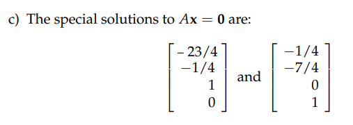

参考: [https://zhuanlan.zhihu.com/p/45815011](https://zhuanlan.zhihu.com/p/45815011)
> 我们定义了矩阵的列空间和零空间，那么如何求得这些子空间呢？本节课的内容即从定义转到算法。

# 1 计算零空间
> 1. **矩阵**$\bf A$**的零空间即满足**$\bf Ax=0$**的所有**$\bf x$**构成的向量空间。**
> 
取 $\bf A=\begin{bmatrix}1&2& 2&2\\2&4&6&8\\3&6&8&10\end{bmatrix}$
> （$\bf A$的列空间并不是线性无关的, 比如$\begin{bmatrix} 1\\2\\3\end{bmatrix}$和$\begin{bmatrix} 4\\5\\6\end{bmatrix}$成线性关系。）
> 2. **无论矩阵**$\bf A$**是否可逆，我们都采用消元法作为计算零空间的算法**。
> 
对于矩阵$\bf A$进行“行操作”并不会改变$\bf Ax=b$的解(因为本质上是线性方程组化简的步骤，解是不会变的)，因此也不会改变零空间。
> 3. **但是对矩阵**$\bf A$**进行“行操作”会改变列空间。**
> 
设想一下，本来$\bf A$的列空间$\bf C(A)$是$\begin{bmatrix} 1\\2\\3\end{bmatrix}$,$\begin{bmatrix} 2\\4\\6\end{bmatrix}$,$\begin{bmatrix} 2\\6\\8\end{bmatrix}$,$\begin{bmatrix} 2\\8\\10\end{bmatrix}$的线性组合，
> 但是高斯消元后得到$\bf U=\begin{bmatrix}1&2& 2&2\\0&0&2&4\\0&0&0&0&\end{bmatrix}$, 列空间变为$\begin{bmatrix} 1\\0\\0\end{bmatrix}$,$\begin{bmatrix} 2\\0\\0\end{bmatrix}$,$\begin{bmatrix} 2\\2\\0\end{bmatrix}$,$\begin{bmatrix} 2\\4\\0\end{bmatrix}$的线性组合，显然第三个维度无论怎么线性组合这四列，值都为$0$, 所以$\bf C(A)\neq C(U)$
> 此处不需要应用增广矩阵，因为等号右侧的向量$\bf b=0$。


# 


# 2 特解
## 2.1 概述
> 在`18.03SC`中，我们学习过`Particular Solution`和`Homogeneous Solution`，也就是特解和通解，
> - 特解对应着`Steady State`,描述`System Response`的`Long-term Behavior`, 不受初始条件的影响
> - 而通解对应着`Transient Solution`, 会受到`IV conditions`的影响
> 
在本课程中，我们希望通过几何性质来理解$\bf Ax=b$这个线性系统的特解和通解的集几何性质


## 2.2 求特解&零空间
> 之前我们对矩阵$\bf A$通过高斯消元(左乘消元矩阵) 的方式将原矩阵变换为阶梯矩阵(上三角矩阵)$\bf U$
> $\bf U=\begin{bmatrix}1&2& 2&2\\0&0&2&4\\0&0&0&0&\end{bmatrix}$, 我们对$\bf Ux=0$进行求解
> $\begin{bmatrix} 1\\0\\0\end{bmatrix}x_1+\begin{bmatrix} 2\\0\\0\end{bmatrix}x_2+\begin{bmatrix} 2\\2\\0\end{bmatrix}x_3+\begin{bmatrix} 2\\4\\0\end{bmatrix}x_4=0$, $\begin{cases} x_1+2x_2+2x_3+2x_4=0 \\ 2x_3+4x_4=0\end{cases}$
>  得到$\begin{cases}x_1=-2x_2+2x_4\\x_3=-2x_4\end{cases}$, 由于$x_2$和$x_4$是自由变量，我们可以任意取值，
> 假设我们取$\begin{cases}x_2=1\\x_4=0\end{cases}$， 就可以得到$\begin{cases}x_1=-2\\x_3=0\end{cases}$, 所以我们得到一个特解$x_p=\begin{bmatrix} -2\\1\\0\\0\end{bmatrix}$
> 假设我们取$\begin{cases}x_2=0\\x_4=1\end{cases}$， 就可以得到$\begin{cases}x_1=2\\x_3=-2\end{cases}$, 可以得到另一个特解$x_p=\begin{bmatrix} 2\\0\\-2\\1\end{bmatrix}$
> 而矩阵$\bf A$的零空间就是这些$x_p$特解向量线性组合构成的向量空间


## 2.3 矩阵的秩
> 
> **矩阵的秩（**`**rank**`**）就是矩阵的主元的个数。上例中矩阵**$\bf A$**和**$\bf U$**的秩均为**$2$**。**
> 自由列的数目就等于$n-r$，即列的数目减去主元列的数目, **这个数值等于特解的数目和零空间的维数。**


# 3 主元和自由变量
## 3.1 概述
> 通过以上行变换操作, 我们可以得到一个`Echelon Form(Staircase Form)`的$\bf U$形阶梯矩阵
> 
> **矩阵中包含主元的列为主元列（**`**pivot column**`**），不包含主元的列称为自由列（**`**free column**`**）。**


## 3.2 主元列和自由列
> 主元列和自由列的一个重要区别就是，**自由列可以表示为其左侧所有主元列的线性组合**，而主元列则不可以。
> 还是回到这个例子中， 对于消元之后的梯形矩阵 $\bf U=\begin{bmatrix}1&2& 2&2\\0&0&2&4\\0&0&0&0&\end{bmatrix}$, 它包含两个主元列, 两个自由列
>  我们观察他的第四列, 这是个自由列，它的左侧有两个主元列(第一列和第三列)， 主元列之间显然线性无关，所以第四列可以写成前两个主元列的线性组合，假设我们取$x_4=1,x_2=0$，为了使$\bf Ux=0$, 需要满足$x_1\begin{bmatrix} 1\\0\\0\end{bmatrix}+0*\begin{bmatrix} 2\\0\\0\end{bmatrix}+x_3\begin{bmatrix} 2\\2\\0\end{bmatrix}+1*\begin{bmatrix} 2\\4\\0\end{bmatrix}=0$
> 所以$\begin{cases}x_1=2\\x_3=-2\end{cases}$, 也就是和我们在`2.2`中对自由变量赋值的过程
> 设想一下，如果我们对两个自由变量都赋值为$0$会怎么样，此时需要满足的方程是:
> 需要满足$x_1\begin{bmatrix} 1\\0\\0\end{bmatrix}+0*\begin{bmatrix} 2\\0\\0\end{bmatrix}+x_3\begin{bmatrix} 2\\2\\0\end{bmatrix}+0*\begin{bmatrix} 2\\4\\0\end{bmatrix}=0$, **由于主元列线性无关，所以只有平凡解**$\bf 0$**向量**


# 4 最简阶梯矩阵
## 4.1 定义
> 高斯消元得到的只是一个上三角矩阵$\bf U$，主元位置为任意不等于零的数， 而我们的最简阶梯矩阵要求:
> - 主元位置必须为$1$
> - 主元列除了主元以外的所有数字都为零
> 
这样的矩阵标记为$\bf R$
> 
> 在矩阵中主元行和主元列的交汇处存在一个单位阵。通过“列交换”，可以将矩阵$\bf R$中的主元列集中在左侧，从而在左上角形成这个单位阵，而将自由列集中在矩阵的右侧。如果矩阵$\bf A$中的某些行是线性相关的，则在矩阵$\bf R$的下半部分就会出现一些完全为$\bf 0$的行向量。
> 
> 这里的$\bf I$是一个$r\times r$的方阵。$\bf F$**_ _**即自由列消元后组成的部分。


## 4.2 Python 实现最简阶梯阵 
```python

def Gaussian_Elimination_RREF(A,col_exchange=False):
    """
    Return the Reduced row-echelon matrix after gaussian elimination
    :param A: Matrix, in numpy format
    :return: R
    """

    k=0 # row
    for i in range(0, A.shape[1]):
        if A[k,i] == 0:
            for t in range(k + 1, A.shape[0]):
                if A[t, i] != 0:
                    temp = A[k, :]
                    A[k, :] =  A[t, :]
                    A[t, :]=temp
                    break

        # 注意范围左侧的0，使得主元列除了主元以外的所有元素都为0
        for j in range(0, A.shape[0]):
            if A[k,i]==0 or j == k:
                continue
            factor = A[j, i] / A[k, i]
            A[j, :] = A[j, :] -A[k, :] * factor


        # 化简
        if A[k,i] != 0:
            A[k,:] = A[k,:]/A[k,i]
            k += 1
            
    # 列交换
    if col_exchange:
        A = np.concatenate([A[:,pivot_col],\
                            A[:,list(set(range(A.shape[1]))-set(pivot_col))]],axis=1)

    return A

if __name__ == "__main__":
    import numpy as np

    A = np.array([[1,2,2,2],[2,4,6,8],[3,6,8,10]])
    print(Gaussian_Elimination_RREF(A,False))  # 不是最简
    print(Gaussian_Elimination_RREF(A,True))   # 最简
```
> 


## 4.3 使用R快速求零空间
> 原方程$\bf Ax=0$变为求解$\bf R$（**不含列交换的话**）的主元行乘以$\bf x$，$\begin{bmatrix} \bf I& \bf F\\\bf 0&\bf 0\end{bmatrix}\begin{bmatrix}\bf x_{pivot} \\ \bf x_{free}\end{bmatrix}=\bf 0$。
> 我们将$\bf Ax=0$的特解作为列向量写成一个矩阵$\bf N$，即零空间矩阵。
> 则其形式为$\bf N= \begin{bmatrix}\bf -F\\\bf I\end{bmatrix}$ 。这里的$\bf I$_** **_为一个$(n-r)\times (n-r)$的矩阵，就是对$n-r$个自由变量分别赋值为$1$所构造出来的, $\bf F$就是主元列为了得到自由变量的数值所要满足的线性组合的系数矩阵。
> 零空间矩阵满足$\bf RN=0$，$\bf 0$矩阵是一个$m\times (n-r)$的矩阵。则从矩阵分块乘法运算可知零空间矩阵上半部分为$\bf -F$，即$\bf N$的最终形式, 
> $\bf N$中的每一列都是特殊解, 这样可以快速求出特解。
> **对于**`**RREF**`$\bf R$**列交换后的**$\bf I,\bf F$**列数不同的情况， 比如示例**$2$**， 我们在拼接的时候要注意**$\bf I$**的列数是要根据**$\bf F$**的列数做动态调整的。**
> **如果得到**$\begin{bmatrix} \bf I& \bf F\\\bf 0&\bf 0\end{bmatrix}$**的过程各种必须使用列交换，那么在最终使用**$\bf N= \begin{bmatrix}\bf -F\\\bf I\end{bmatrix}$**公式的时候要将主元位置调整到列交换前的顺序，详见下面两个示例**


### 示例 1
> $\bf A=\begin{bmatrix}1&2& 2&2\\2&4&6&8\\3&6&8&10\end{bmatrix}，b=0$
> 通过程序可知$\bf R =  \begin{bmatrix}1&2& 0&-2\\0&0&1&2\\0&0&0&0\end{bmatrix}$, 行交换后得到$\bf R' =  \begin{bmatrix}1&0& 2&-2\\0&1&0&2\\0&0&0&0\end{bmatrix}=\begin{bmatrix}I& F\\0&0\end{bmatrix}$
> 其中$\bf I=\begin{bmatrix}1&0\\0&1\end{bmatrix},F=\begin{bmatrix}2& -2\\0&2\end{bmatrix}$
> 所以零空间的基向量为$\bf X=\begin{bmatrix} -2&2\\1&0\\0&-2\\0&1\end{bmatrix}$(注意列交换后主元列的位置), 每一列都是零空间$\bf N$的基向量
> **这里我们的**$\bf I,F$**列数相同， 直接对应上就行, 同时注意， 由于得到**$\bf R'=\begin{bmatrix}I& F\\0&0\end{bmatrix}$**是经过了列交换的( **$x_2,x_3$**所在列发生了交换) ，所以最终写成解的形式的时候我们需要将**$\bf X$**的第二第三行交换回去。**


### 示例2
> $\bf A=\begin{bmatrix}1&5& 7&9\\0&4&1&9\\2&-2&11&5\end{bmatrix}，b=0$
> 通过程序可知$\bf R =  \begin{bmatrix}1&0& 23/4&0\\0&1&1/4&0\\0&0&0&1\end{bmatrix}$, 行交换后得到$\bf R' =  \begin{bmatrix}1&0& 0&23/4\\0&1&0&1/4\\0&0&1&0\end{bmatrix}=\begin{bmatrix}I& F\end{bmatrix}$
> 其中$\bf I=\begin{bmatrix}1&0&0\\0&1&0\\0&0&1\end{bmatrix},F=\begin{bmatrix}23/4\\ 1/4\end{bmatrix}$
> 注意到这里我们的$\bf I,F$列数不同，中只有一个自由元$x_4$(对应中的自由元是, 因为进行了列交换), 我们如果对赋值为$0$(也就是中对应的), 则得到平凡解，这个平凡解在零空间中，但是不是零空间的基向量，所以我们令中的$x_4=1$(对应中的), 得到, 才是零空间的基向量，所以此时零空间是一条过原点(因为在的零空间中)的直线，是$\bf R^4$的一维子空间。
> **由于得到**$\bf R'=\begin{bmatrix}I& F\\0&0\end{bmatrix}$**的过程没有发生列交换，所以不需要对上面得到的**$\bf x$**进行任何行交换。**


# 5 作业
## P1: RREF, Rank and Special Solution
> 

**(a)**使用我们的程序，设置参数
```python
if __name__ == "__main__":
    import numpy as np
    # 别忘了设置数据类型，否则默认是整数除法导致结果不正确
    A = np.array([[1,5,7,9],[0,4,1,7],[2,-2,11,-3]],dtype=np.float64)
    print(Gaussian_Elimination_RREF(A,False))
```
得到

**(b)**
**(c)**
因为没有发生列交换，所以直接根据$\bf X=\begin{bmatrix} -F\\I\end{bmatrix}$写出基向量矩阵即可

## P2: Rank Relations
> 

Key

- 注意到其实$\bf B$的主元个数就是一个，因为$\bf B$的行成倍数关系，我们其实只要保证我们的$\bf A_1$线性变换使得$\bf B$的`行成倍数关系`的关系不变就行了
- $\bf A_2$的选取就更简单了，只要让$\bf B$变成全零矩阵就行，毕竟全零矩阵的`Rank`一定是`0` 

## P3: 零空间和列空间
> 

**(1)**答案是: `plane,parallel,plane`
**(2)**

