参考: [https://zhuanlan.zhihu.com/p/45816772](https://zhuanlan.zhihu.com/p/45816772)
> 本章我们学习线性方程组$\bf Ax=b$的可解性和解构，在`18.02SC`中我们初探了线性方程组解的情况，并就`Homogeneous Equations`$\bf Ax=0$和`Inhomogeneous Equations`$\bf Ax=b$在$\bf det(A)=0和det(A)\neq 0$ 的情况下方程组的解的情况

# 1 可解的条件
## 1.1 可解条件中的b
> 我们仍然取$\bf A=\begin{bmatrix}1&2& 2&2\\2&4&6&8\\3&6&8&10\end{bmatrix}$
> 则我们的线性方程组为:$\bf A=\begin{bmatrix}1&2& 2&2\\2&4&6&8\\3&6&8&10\end{bmatrix}\begin{bmatrix}x_1\\x_2\\x_3\\x_4\end{bmatrix}=\begin{bmatrix}b_1\\b_2\\b_3\end{bmatrix}$
> 我们注意到， $\bf A$的列空间$\bf col(A)$中的向量满足这样一个规律: 向量第一行加第二行等于第三行。
> - 如果方程组要有解，则$\bf b$也必须满足$\bf b_1+b_2=b_3$
> - 否则$\bf b$不在$\bf col(A)$中，$\bf Ax=b$也就无解


## 1.2 验证可解性的方法
> 检验$\bf Ax=b$是否可解的方法**是对增广矩阵进行行消元**。如果矩阵$\bf A$的行被完全消去的话，则对应的$\bf b$的分量也必须是$0$。在本例中，矩阵$\bf A$的第三行被消去：
> $\bf A=\begin{bmatrix}1&2& 2&2&b_1\\2&4&6&8&b_2\\3&6&8&10&b_3\end{bmatrix}\to...\to\bf A=\begin{bmatrix}1&2& 2&2&b_1\\0&0&2&4&b_2-2b_1\\0&0&0&0&b_3-b_2-b_1\end{bmatrix}$
> 如果$\bf Ax=b$, 则第三行$\bf b_3-b_2-b_1=0$, 在本例中我们可以令：$\bf b=\begin{bmatrix}1\\5\\6\end{bmatrix}$
> **前几讲讨论过，只有当**$\bf b$**处于矩阵的列空间**$\bf C(A)$**之中时，方程才有解。本讲推导出矩阵**$\bf A$**的行向量若经过线性组合成为了零向量，则对应的**$\bf b$** 经同样的线性组合后也要等于**$\bf 0$**。因此看起来我们有了两条关于**$\bf b$**的限制条件，但实际上这两点是等价的。**


# 2 特解和通解的关系
> 在`18.03SC`中，我们介绍了$x(t)=x_p+cx_h(t)$的`General Solutions`的形式，$x_p$对应的就是特解，$x_h$对应的就是通解，我们可以看到，`General Solutions`就是特解加上零解的线性组合
> 那么在线性方程组中， 我们也有相似的概念：
> **为了求得线性方程组的所有解，我们可以先验证方程是否可解，然后找到一个特解，将特解和矩阵零空间的向量相加即为方程的解。**


## 2.1 求特解
> 特解对应$x_p$,`particular solution`
> 找到任意一个满足$\bf Ax=b$的解即为特解
> **方法是：**
> **将自由变量均赋值为**$0$**，求解其主变量**
> 我们仍然取$\bf A=\begin{bmatrix}1&2& 2&2\\2&4&6&8\\3&6&8&10\end{bmatrix},b=\begin{bmatrix}1\\5\\6\end{bmatrix}$
> 增广矩阵为$\bf [A \space b]=\begin{bmatrix}1&2& 2&2&1\\2&4&6&8&5\\3&6&8&10&6\end{bmatrix}$ 化简成上三角增广矩阵$\bf [U\space c]=\begin{bmatrix}1&2& 2&2&1\\0&0&2&4&3\\0&0&0&0&0\end{bmatrix}$, 我们取$x_2=x_4=0$, 求解关于主元的方程组: $\begin{cases} x_1+2x_3=1 \\ 2x_3=3\end{cases}$得到$\begin{cases} x_1=-2 \\ x_3=\frac{3}{2}\end{cases}$, 所以特解是$x_p=\begin{bmatrix}-2\\0\\3/2\\0\end{bmatrix}$


## 2.2 零解
> 零解对应$x_h$, `homogeneous solutions`
> 找到$\bf Ax=0$的解， 我们可以使用`1.8.4.3`中的方法快速求解零空间的解
> 我们仍然取$\bf A=\begin{bmatrix}1&2& 2&2\\2&4&6&8\\3&6&8&10\end{bmatrix}$
> 通过$1.8.4.2$的程序得到, $\bf R = \begin{bmatrix}1&2& 0&-2\\0&0&1&2\\0&0&0&0\end{bmatrix}$, 列交换得到$\bf R'=\begin{bmatrix}1&0& 2&-2\\0&1&0&2\\0&0&0&0\end{bmatrix}$
> 根据$\bf X=\begin{bmatrix} -F\\I\end{bmatrix}$公式，并且将第二第三行交换之后得到：
> 矩阵$\bf A$的零空间是向量$\begin{bmatrix}-2\\1\\0 \\ 0\end{bmatrix}$和$\begin{bmatrix}2\\0\\-2 \\ 1\end{bmatrix}$的线性组合


## 2.3 通解
> 综合`2.1`和`2.2`的推导
> 方程$\bf Ax =b$的通解是$\bf x_{complete}=x_p+col(x_)=\begin{bmatrix}-2\\0\\3/2\\0\end{bmatrix}+c_1\begin{bmatrix}-2\\1\\0 \\ 0\end{bmatrix}+c_2\begin{bmatrix}2\\0\\-2 \\ 1\end{bmatrix},c_1,c_2\in R$
> 矩阵的零空间$\bf N(A)$是$\bf R^4$空间中的二维子空间，方程的解$\bf Ax=b$构成了穿过$\bf x_p$点并和矩阵零空间平行的“平面“。但该”平面“并不是$\bf R^4$空间的子空间, 因为它不过原点，所以不是向量空间，也就自然不是子空间了。
> 前面求取$\bf Ax=b$的特解过程中，我们令所有自由变量赋值为$0$。
> 如果不赋值为$0$，则等于带着自由列进行计算，但自由列其实也就是主元列的线性组合，这样求的特解$\bf x_p'$只不过是$\bf x_p$与零空间特解的一个加和。如此例中若令$\bf x_2=1,x_4=0$，则求特解的方程变为： $x_1+2+2x_3=12x_3=3$ ，求得$x_1=-4，x_3=3/2$。因此特解为 $\bf x_p'=\begin{bmatrix} -4\\1\\3/2\\0\end{bmatrix}$ 。而实际上 $\bf x_p'=x_p+x_{n_1}=\begin{bmatrix}-2\\0\\3/2\\0\end{bmatrix}+\begin{bmatrix}-2\\1\\0 \\ 0\end{bmatrix}$ 。
> **怎么更好的理解呢: **
> 还是令$\bf A=\begin{bmatrix}1&2& 2&2\\2&4&6&8\\3&6&8&10\end{bmatrix},b=\begin{bmatrix}1\\5\\6\end{bmatrix}$, 最简阶梯阵为$\bf R = \begin{bmatrix}1&2& 0&-2\\0&0&1&2\\0&0&0&0\end{bmatrix},d=\begin{bmatrix} -2\\3/2\\0\end{bmatrix}$
> 注意到方程$\bf Ax =b$的通解是: $\bf x_{complete}=x_p+col(x_)=\begin{bmatrix}-2\\0\\3/2\\0\end{bmatrix}+c_1\begin{bmatrix}-2\\1\\0 \\ 0\end{bmatrix}+c_2\begin{bmatrix}2\\0\\-2 \\ 1\end{bmatrix},c_1,c_2\in R$，
> 而$\bf A$的自由元是$x_2,x_4$（第二列和第四列）, 对应的就是这里的$c_1$和$c_2$， 所以当$c_1=1,c_2=0$的时候，实际上就是我们在令自由元$x_2=1,x_4=0$然后求任意一个解的过程
> **当自由元**$x_2=2，x_4=0$**时，相当于**$c_1=2,c_2=0$**, 对应第二个分量就是专属为**$x_2$**服务的(注意到特解**$\bf x_p$**的第二个分量为零, 最终**$x_2$**的贡献全部来自于零空间)**
> **当自由元**$x_2=0，x_4=3$**时，相当于**$c_1=0,c_2=3$**, 对应第四个分量就是专属为**$x_2$**服务的(注意到特解**$\bf x_p$**的第四个分量为零, 最终**$x_4$**的贡献全部来自于零空间)**


# 3 矩阵的秩
## 3.1 定义
> 矩阵的秩等于矩阵的主元数。如果$m\times n$矩阵的秩为$r$，则必有$r<=m$且$r<=n$。
> **下面讨论满秩（full rank）的情形**


## 3.2 列满秩
> **列满秩**`**(Full Column Rank)**`：$r=n$。每列都有主元，$\bf x$的每一个分量都是主变量，**没有自由变量**。零空间$\bf N(A)$之内只有零向量。方程$\bf Ax=b$无解或者有唯一解$\bf x_p$
> 无解的情况$\bf A=\begin{bmatrix} 1&3 \\ 2&1 \\ 6&1\\5&1\end{bmatrix}$, $\bf R=\begin{bmatrix} 1&0 \\ 0&1 \\ 0&0\\0&0\end{bmatrix}$, 此时如果$\bf  Rx=c$中的$\bf c$的后两个分量不为$0$, 则$\bf Ax=b$无解， 否则有唯一解: $\bf x=A^{-1}b$


## 3.3 行满秩
> 行满秩(`Full Row Rank`)：$r=m$。每行都有主元，无论$\bf b$取何值，方程$\bf Ax=b$都有解。主变量$r$个，自由变量$n-r$个。
> 比如: $\bf A=\begin{bmatrix} 1&2&6&5 \\ 3&1&1&1\end{bmatrix}$, $\bf R=\begin{bmatrix} 1&0&*&* \\ 0&1&*&* \\ \end{bmatrix}$


## 3.4 满秩
> 满秩(`Full Rank`): $r=m=n$，**矩阵可逆**。零空间只有零向量，无论$\bf b$取何值，方程$\bf Ax=b$都有唯一解$\bf x=A^{-1}b$。 


## 3.5 总结
> 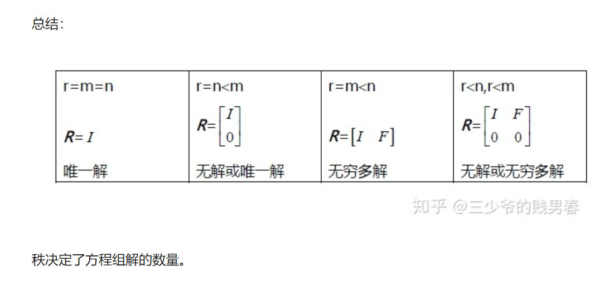
> $m\times n$**给出了矩阵的尺寸，但是秩**$r$**给出的是矩阵的实际“大小”。关于这个随后会有讨论**


# 4 作业
## P1: 判断对错**⭐⭐**
> 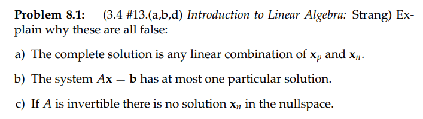

(a)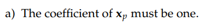, 错误
(b)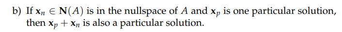, 特解有无数个，所以错误
(c)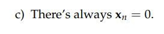, **记住，任意向量空间中至少有一个零向量, 所以零空间中至少有一个解**$x_n=0$


## P2: 化简线性方程组
```python
def RREF_AX_B(A,b,col_exchange=True):
    """
    Return the RREF for the augmented matrix formed by [A,b] with gaussian elimination
    :param A: Matrix, in numpy format
    :param b: vector, in numpy format
    :return: R, d
    """

    if A.shape[0] != len(b):
        raise RuntimeError("Shape not match")

    aug = np.concatenate([A, b.reshape(len(b), 1)], axis=1)
    pivot_col = []
    k=0 # row
    for i in range(0, aug.shape[1]):
        if aug[k,i] == 0:
            for t in range(k + 1, aug.shape[0]):
                if aug[t, i] != 0:
                    aug[t, :], aug[k, :] = aug[k, :], aug[t, :]

        for j in range(0, aug.shape[0]):
            if aug[k,i]==0 or j == k:
                continue
            factor = aug[j, i] / aug[k, i]
            aug[j, :] = aug[j, :] -aug[k, :] * factor


        if aug[k,i] != 0:
            pivot_col.append(i)
            aug[k,:] = aug[k,:]/aug[k,i]
            k += 1
            if k >= len(A):
                R = aug[:, :-1]
                d = aug[:, -1]
                return R,d

    R= aug[:,:-1]
    d = aug[:,-1]

    return R,d


if __name__ == "__main__":
    import numpy as np

    A = np.array([[1,2,3],[0,0,4]],dtype=np.float64)
    b = np.array([[5,8]]).reshape(2,1)
    print(RREF_AX_B(A,b))
```
> 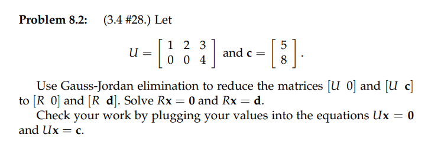

**(a)****使用程序可得: **
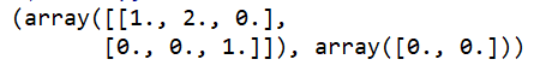
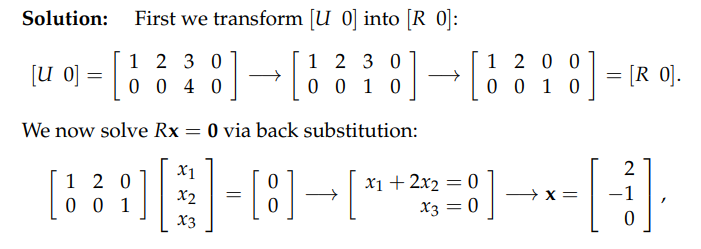
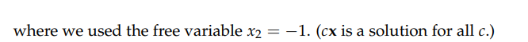
这样求出的就是$\bf U$的零空间的基向量，也就是我们的零解
**(b)**由程序可得: 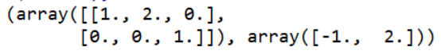
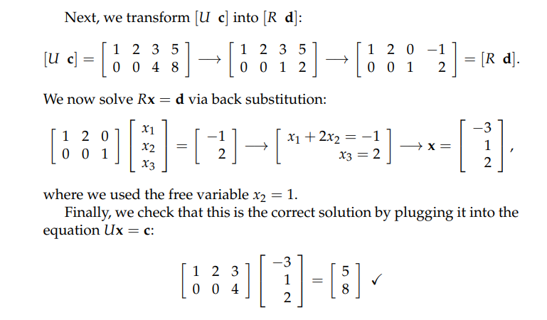
这样求出的就是$\bf Ux=c$的特解


## P3: 通解相同, 线性方程组相同**⭐⭐**
> 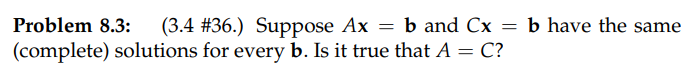

**Key**证明$\bf A=C$相当于需要证明$\bf Ay=Cy,\forall y$(**也就是**$\bf A$**的列的线性组合和**$\bf C$**的列的线性组合在任何情况下都一样，这足以说明**$\bf A=C$)
假设$\bf y$是$\bf Ay=b$这个系统的解，由于$\bf Ax=b$和$\bf Cx=b$有着相同的解集，
所以既然$\bf y$在$\bf Ax=b$的解集中， 那么$\bf y$也一定在$\bf Cx=b$的解集中
于是$\bf \forall y, Ay=b=Cy$, 于是我们证明完毕
