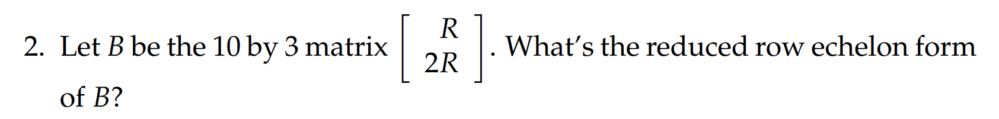
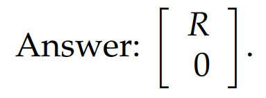
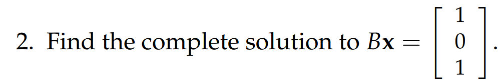
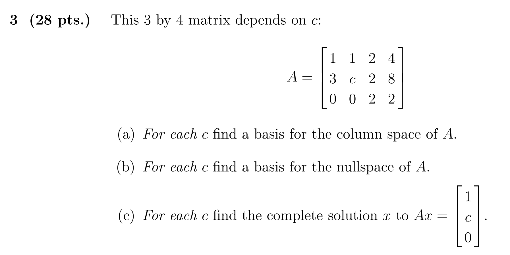

# 1 Sample Questions
[Exam 1 Review.pdf](https://www.yuque.com/attachments/yuque/0/2022/pdf/12393765/1659080413041-0b6dbc8a-6f1f-4872-92c6-b01951182e06.pdf)
## P1: Span
> 

Key三个$n$维向量互相独立张成一个三维子空间，也就是说三个$n$维向量最多能够张成三维子空间，所以$1,2,3$维子空间都是可行的。因为是非零向量，所以零维空间（只含$\bf 0$向量的向量空间）是不可能的。

## P2: Vector Spaces
> 
> 1. 求$\bf R$的零空间
> 2. 
> 3. $\bf B$的秩是多少?
> 4. 
> 5. $\bf C$的秩是多少?
> 6. $\bf C^T$的零空间维数是多少?

**(1) **
**(2)**
**(3)**$\bf B$的秩是$3$
**(4)**
要非常注意这里的行化简操作。这里的第二行$\bf \begin{bmatrix} R&0\end{bmatrix}$要加上第一行的$-1$倍，得到$\bf \begin{bmatrix} 0&-R\end{bmatrix}$, 不要粗心得到$\bf \begin{bmatrix} 0&0\end{bmatrix}$
**(5)**$\bf C$的秩是$6$
**(6)**

## P3: An Unknown Matrix**⭐⭐**
> 
> 
> 
> 
> 

**(1)**
向量$\bf x$的长度对应了矩阵$\bf A$的列数，向量$\bf b$的长度对应了矩阵$\bf A$的行数
**(2)**
**(3)⭐⭐**
**(4)**

## P4: Matrix Multiplication**⭐⭐**
> 
> 
> 

**(1)**
1. **引理:**

这里我们给出一个公式$\bf Rank(AP)=Rank(PA)=Rank(A),P可逆$
使用空间的视角来证明这个公式非常的简单，如果我们要证明$\bf Rank(A)=Rank(B)$, 我们可以转而证明$\bf Ax=0,Bx=0$的解空间相同，也就是说$\bf A,B$的零空间相同
**证明过程如下:**

- 对于$\bf PAx=0$的解集，因为$\bf P$可逆，所以$\bf P^{-1}P=I$
- 上面的方程两边同乘以$\bf P^{-1}$， 得到 $\bf P^{-1}PAx=0$, 进而$\bf Ax=0$, 解集应该也不变
- 所以$\bf PA$和$\bf A$的零空间一致，所以$\bf dim(N(PA))=dim(A)$
- 因为$\bf PA$的列数和$\bf A$的列数相同, 都为$\bf m$， 所以$\bf m-dim(N(PA))=m-dim(A)$
- 所以$\bf Rank(PA)=Rank(A)$
- 对于$\bf Rank(AP)=Rank(A)$来说，证明过程相似。

2. **解题过程:**

回到本题，我们对$\bf C$进行行化简，得到$\bf R_c=\begin{bmatrix} 1&0&0\\0&1&0\\0&0&1 \end{bmatrix}$, 所以$\bf C$是可逆矩阵
于是由上面的定理，$\bf Rank(B)=Rank(CD)=Rank(D)$
于是$\bf B$的零空间等于$\bf D$的零空间, 所以我们只要求$\bf D$的零空间就可以了
注意到题目中的$\bf D$已经是`RREF`了，所以直接使用`1.8.4.3`中的快速求出零空间基向量的方法，可以得到: 

**(2)**$\bf Bx=0$的解（零空间基向量）在$(1)$中已经给出，本小问中我们只需要$\bf Bx=\begin{bmatrix} 1\\0\\1\end{bmatrix}$求一个特解即可。
我们可以很容易找到一个特解， 下面介绍两种方法:
**方法一（不进行任何**$\bf CD$**的运算）：**
为了求$\bf CDx=\begin{bmatrix} 1\\0\\1\end{bmatrix}$的一个特解，我们可以令$\bf Dx=y$, 然后先求$\bf Cy=\begin{bmatrix} 1\\0\\1\end{bmatrix}$的$\bf y$
我们注意到$\bf C$的第一列就是$\begin{bmatrix} 1\\0\\1\end{bmatrix}$, 于是可以取$\bf y=\begin{bmatrix} 1\\0\\0\end{bmatrix}$
然后求$\bf Dx=\begin{bmatrix} 1\\0\\0\end{bmatrix}$的一个特解，于是可以取$\bf x=\begin{bmatrix} 1\\0\\0\\0\end{bmatrix}$
然后结合我们的零空间的基向量，我们得到通解$x=\begin{bmatrix} 1\\0\\0\\0\end{bmatrix}+c_1\begin{bmatrix} 1\\-1\\1\\0\end{bmatrix}+c_2\begin{bmatrix} -2\\1\\0\\1\end{bmatrix}$
**方法二（进行一部分**$\bf CD$**的运算）：**
注意到$\bf B=CD$的第一列就是$\begin{bmatrix} 1\\0\\1\end{bmatrix}$, 所以可以取$\bf x=\begin{bmatrix} 1\\0\\0\\0\end{bmatrix}$使得$\bf Bx=0$
然后结合我们的零空间的基向量，我们得到通解$x=\begin{bmatrix} 1\\0\\0\\0\end{bmatrix}+c_1\begin{bmatrix} 1\\-1\\1\\0\end{bmatrix}+c_2\begin{bmatrix} -2\\1\\0\\1\end{bmatrix}$

## P5: Short Questions
> 
> 
> 
> 
> 
> 
> 
> 
> 

**(1)**
**(2)**
要判断一个空间是否是向量空间或者新向量空间，我们只要从这个空间中任取两个向量或者矩阵出来，对他们进行线性操作，如果所有的线性操作结果都还在这个空间内，我们说该空间是一个向量(子)空间或者新向量(子)空间, 本题目中，我们取$\begin{bmatrix} 1&0&0 \\0&1&0 \\ 0&0&1\end{bmatrix}$和$\begin{bmatrix} -1&0&0 \\0&-1&0 \\ 0&0&-1\end{bmatrix}$, 他们两求和，得到一个$\bf 0$矩阵，不在这个新向量空间里， 所以答案是`No`
**(3)⭐**举反例就行
**(4)**
**(5)**
**(6)**
**(7)⭐⭐**
**(8)⭐**
任何行操作都会影响列空间
**(9)**
# 2 Exam 1
[Exam 1.pdf](https://www.yuque.com/attachments/yuque/0/2022/pdf/12393765/1659084314976-22ad8050-f318-474d-8b99-0bf13257bd70.pdf)
[Exam 1_sn.pdf](https://www.yuque.com/attachments/yuque/0/2022/pdf/12393765/1659084502791-ada97395-4d14-43d2-a5d5-e883004eb005.pdf)

## P1: Matrix Solutions**⭐⭐**
> 

**(a)**
**(b)**
**(c)**

## P2:  消元矩阵
> 

**(a)**
**(b)**
**(c)**
## 
## P3: 基和解**⭐⭐⭐**
> 

**(a)**
这里有一个问题: 就是为什么行化简后$\bf R$的主元列对应的$\bf A$中的相应列可以作为基呢?
首先，我们得明白基的概念，什么可以称为空间的基? （截取`1.10.3.1`中的定义）
> **向量空间的基是具有如下两个性质的一组向量**$\bf v_1，v_2……v_d$**：**
> - $\bf v_1，v_2……v_d$ 线性无关
> - $\bf v_1，v_2……v_d$ 张成该向量空间

这里我们化简的目的是判断前三列是否线性无关，因为证明线性无关的一个重要方法就是通过判断这三个向量按列组成的矩阵的零空间只有$\bf 0$解， 如果三列在`Row-reduce`之后得到的矩阵的零空间只有$\bf 0$解，则这三列线性无关。
然后再看这三列能够张成的空间，发现是$\bf R^3$, 也就是$\bf Col(A)$,于是可以选择这三列作为$\bf Col(A)$作为基向量。
**(b)**
**(c)**

## P4: 向量空间**⭐⭐**
> 

**(a)**
**(b)**
**这里注意行操作是不改变列的比例关系和线性无关性的，但是会改变列空间。**
**(c)**
