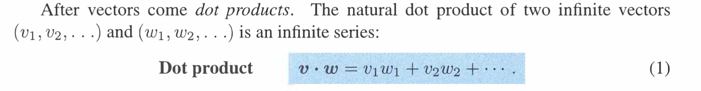

参考: [https://zhuanlan.zhihu.com/p/45967060](https://zhuanlan.zhihu.com/p/45967060)
> 本讲学习马尔可夫矩阵和傅里叶级数，两者是关于特征值和投影矩阵的应用。

# 1 A^T的特征值
> 

# 2 马尔科夫矩阵**⭐⭐⭐⭐**
## 2.0 前言
> 

## 2.1 基本概念
> $\bf A=\begin{bmatrix} 0.1&0.01&0.3\\ 0.2&0.99&0.3\\0.7&0&0.4\end{bmatrix}$
> 形如矩阵$\bf A$，**任何元素非负(对应概率值)**，且每列的元素加和为$1$(对应概率相加等于$1$的事实)的矩阵被称为马尔可夫矩阵。马尔可夫矩阵主要应用在**概率领域**。**将一个马尔可夫矩阵进行方幂运算得到的矩阵仍旧是马尔可夫矩阵。**

## 2.2 人口流动
> **我们用马尔科夫矩阵来研究人口流动问题:**
> $\begin{bmatrix}  u_{上海}\\u_{浙江}\end{bmatrix}_{t={k+1}}=\begin{bmatrix} 0.9&0.2\\0.1&0.8\end{bmatrix}\begin{bmatrix}  u_{上海}\\u_{浙江}\end{bmatrix}_{t={k}}$, 其中$\bf A=\begin{bmatrix} 0.9&0.2\\0.1&0.8\end{bmatrix}$
> 方程中的$\bf u$的分量代表上海和浙江的人口，矩阵中每一列元素代表人口去留比例:
> - 第一列$0.9$表示留在上海的人口占上海人口的$90\%$，而$10\%$进入浙江；
> - 第二列中由浙江进入上海的人口占浙江人口的$20\%$, 而浙江人口的$80\%$选择留在浙江。
> 
如果取初值$\begin{bmatrix}  u_{上海}\\u_{浙江}\end{bmatrix}_{t=0}=\begin{bmatrix}0\\1000\end{bmatrix}$, 则经过一次人口结构调整, 我们有$\begin{bmatrix}  u_{上海}\\u_{浙江}\end{bmatrix}_{t=1}=\begin{bmatrix} 0.9&0.2\\0.1&0.8\end{bmatrix}\begin{bmatrix}  0\\1000\end{bmatrix}_{t=0}=\begin{bmatrix}  200\\800\end{bmatrix}$。
> 而为了获取长时间后的人口分布，我们需要了解矩阵的特征值和特征向量。因为这是马尔科夫矩阵，所以有一个特征值$1$, 则另一个特征值为$tr(A)-1=0.9+0.8-1=0.7$。待会特征方程并求解矩阵的特征向量我们有$x_1=\begin{bmatrix} 2\\1\end{bmatrix}, x_2=\begin{bmatrix} 1\\-1\end{bmatrix}$。
> 由于每次人口调整都相当于左乘一个矩阵$\bf A$, 所以经过$k$次调整, 我们知道通解的结构是$\bf u_{t=k}=c_1\lambda_1^kx_1+c_2\lambda_2^kx_2$, 由于$\lambda_1=1,\lambda_2=0.7$, $\lambda_1^k\to 1,\lambda_2^k\to 0$, 所以$\bf u_{t=k}\approx c_1x_1=c_1\begin{bmatrix} 2\\1\end{bmatrix}$,也就是最终的稳定状态。
> 同时我们知道$\bf u_{t=0}=\begin{bmatrix}0\\1000\end{bmatrix}$, 可以解得$\bf c_1=\frac{1000}{3},c_2=\frac{2000}{3}$

## 2.3 稳态
### 基本概念
> **当进行矩阵的方幂运算时，特征值给出稳态的条件包括：**
> 1. $\lambda_1=1$是特征值之一。
> 2. 其它特征值的绝对值都比$1$小，$|λ_i|<1$ 。
> 
> **如我们所知，如果矩阵具有**$n$**个线性无关的特征向量，则有：**
> $\bf u_k=A^ku_0=c_1\lambda_1^kx_1+c_2\lambda_2^kx_2+...+c_n\lambda_n^kx_n$.
> 如果$λ_1 =1$并且其他的特征值都小于$1$，则系统在$k$增大过程中趋近于$u_0$的分量 $c_1x_1$ ，即给出了一个稳态状况。这里特征向量$x_1$的每一分量都是正的，因此若初始值为正，则最终的稳态也是正的。
> 
> `**Markov**`**矩阵每一列的元素加和为**$1$**这个条件，保证了矩阵具有**$1$**这个特征值。**
> **假设我们有一个矩阵**$\bf A=\begin{bmatrix} 0.1&0.01&0.3\\ 0.2&0.99&0.3\\0.7&0&0.4\end{bmatrix}$**, **$\bf A-I=\begin{bmatrix} -0.9&0.01&0.3\\ 0.2&-0.01&0.3\\0.7&0&-0.6\end{bmatrix}$**, 此时**$\bf A-I$**的每一列的元素加和为零，于是**$\bf A-I$**的行向量线性相关，所以**$\bf A-I$**不可逆，于是**$\bf A-I$**的零空间有解，这个解就是特征向量，而此时的特征值就是**$1$**, 带回**$\bf A-I$**计算可得**$x_1=\begin{bmatrix} 0.6\\33\\0.7\end{bmatrix}$**, 我们称这个稳态向量为**`**Pattern for Markov Chains**`
> `**Markov**`**矩阵的幂仍然是**`**Markov**`**矩阵: 原因也很简单，因为如果我们使用**[列视角](https://www.yuque.com/alexman/so5y8g/gkg1kx#FBNL6)**来看待矩阵的乘法，我们会发现，对于**$\bf A^2=A\cdot A=\begin{bmatrix}a_1&a_2\end{bmatrix}\begin{bmatrix}a_1&a_2\end{bmatrix}$**, **$\bf A^2$**的第一列是**$a_1$**和**$a_2$**的线性组合，由于列操作不改变行空间，所以**$\bf A^2$**的行加和仍然等于**$1$
> 

### 没有稳态的情况
> 不满足稳态的第二个条件: $|\lambda_i|<1$
> 

### 3x3 Markov 算例
> 
> 

## 2.4 Perron-Frobenius Theorem
> 若一个$n×n$的矩阵各个元素非负，那它有一个非负特征值$λ$严格大于其他所有特征值，其对应的特征向量也非负, 且$\bf Ax=\lambda x$中，$\bf Ax>0$
> 

## 2.5 人口增长模型
### 2.5.1 定义
> 人口增长模型描述了各个不同年龄段的人口在`Reproduction`和`Survival`这两个因子的影响下增长的规律， 我们使用`**Leslie**`**矩阵**来描述这种状态转移。
> - $F_1,F_2,F_3$分别对应三种人群的生育率
> - $n_1,n_2,n_3$分别动态记录三种人群的人口数量变化
> - $n_i=P_{i-1}n_{i-1},i>1$, 表示年龄阶段为$n_{i-1}$的人口生存了$P_{i-1}$的比例到下一个年龄阶段$n_i$
> 

### 2.5.2 特征值分析
> 

## 2.6 消耗矩阵
### 2.6.1 定义
> 一个消耗矩阵记录了**输入的多少成为了输出,他描述了一个经济体的供给侧。**
> 
> 

### 2.6.2 求解满足条件的矩阵
> 
> 
> 

### 2.6.3 算例
> 
> 

# 3 傅里叶级数: 线性代数视角**⭐⭐⭐⭐**
> 我们在`18.03SC`中已经详细介绍了傅里叶级数基本概念(将一个频率为$w$的周期函数写成无数个三角函数的组合)和[函数正交性](https://www.yuque.com/alexman/dydxis/ww4vev#jKGTl)，本小节我们将从有限维延伸到无限维，并用线性代数来解释。

## 3.1 无限维的向量
> 

## 3.2 无限维向量的点积
> 
> 我们将要探究这个点积公式在无限维向量下是否收敛。
> 如果$v=w=(1,1,1,\cdots)$, 那么计算$\bf v\cdot w=||v||^2$, 这个点积一定不收敛

## 3.3 无限维点积收敛性
### 3.3.1 准则
> 

### 3.3.2 向量不等式
> 
> 

## 3.4 函数的点积
### 3.4.1 定义
> 函数本质上是极限状态下的无限维向量。函数点积本质上就是极限状态下的向量分量乘积之和, 用积分表示
> 
> 

### 3.4.2 算例
> 

### 3.4.3 函数正交性
> 

## 3.5 傅里叶级数
> 标准正交是此处的核心概念。而傅里叶级数也是在这个概念上构建的。我们可以对任意函数做傅里叶展开，得到表达式：$f(x)=a_0+a_1cos⁡x+b_1sin⁡x+a_2cos⁡2x+b_2sin⁡2x+⋯$
> 与之前的有限个标准正交向量组成的正交矩阵不同，这个空间是无限维，它的一组基是$1$，$cosx$，$sinx$，$cos2x$，$sin2x$……
> 此处的正交概念与$R^n$空间不同，点积的概念也不同。
> 向量$\bf v^Tw=v_1w_1+v_2w_2+…+v_nw_n$ ,
> 函数 $\bf f^Tg=\int_0^{2π}f(x)g(x)dx$
> 
> 计算基$sinx$和$cosx$的点积可以验证其正交性。
> 利用正交性我们可以求出傅里叶系数。
> 傅里叶系数的推导详见`18.03SC``Unit 3.1`中的[垂直性推导](https://www.yuque.com/alexman/dydxis/ww4vev#zzCyP)

# 4 Problems
## P1: 特征值分析**⭐⭐**
> 

**(a)**
因为矩阵的迹(特征值的和)是正数，所以两个特征值必定一正一负，所以$det(A)<0$, 所以$b^2>1$, 所以$b>1$或者$b<-1$
**(b)**
因为我们知道`Pivot`只有在消元后才可以确定，而消元的过程是不改变矩阵的特征值的，而消元后的`Pivot`在对角线上，此时**对角线的乘积等于矩阵的行列式的值**。
而我们又知道**矩阵的特征值的积等于矩阵的行列式的值**，从$(a)$中我们知道，特征值一正一负，所以矩阵的行列式的值为负，所以矩阵的`Pivot`的乘积为负数，所以一定有一个`Pivot`是负数。
**(c)**我们从$(a)$中知道，至少有一个特征值是正的。

## P2: 矩阵性质总结**⭐⭐⭐⭐⭐⭐**
> 

**Key**

## P3 Markov矩阵**⭐⭐⭐**
> 

**Key**

## P4 Markov 图**⭐⭐⭐⭐**
> 

**(1) 求出Markov矩阵**首先我们要将图转换成`Markov`矩阵。
$\bf M=\begin{bmatrix} 0.6&0.2\\0.4&0.8\end{bmatrix}$
我们假设在$t=0$时，$\bf A,B$的状态向量是$\bf u_0=\begin{bmatrix} A_0\\B_0\end{bmatrix}=\begin{bmatrix} 1\\0\end{bmatrix}$
我们有状态转换方程: $\bf u_{k+1}=Mu_k$
所以$\bf u_{1}=Mu_0=\begin{bmatrix} 0.6&0.2\\0.4&0.8\end{bmatrix}\begin{bmatrix} 1\\0\end{bmatrix}=\begin{bmatrix} 0.6\\0.4\end{bmatrix}$
**(2) 求通项公式**我们要求得关于$\bf u_k$的通项公式。
首先我们对$\bf M=\begin{bmatrix} 0.6&0.2\\0.4&0.8\end{bmatrix}$进行特征值分析
我们有特征方程: $\lambda^2-1.4\lambda+0.4=0$, $\lambda_1=1,\lambda_2=0.4$
对应的特征向量$\bf x_1=\begin{bmatrix}1\\2 \end{bmatrix},x_2=\begin{bmatrix}-1\\1 \end{bmatrix}$
所以$\bf u_k=c_1\lambda_1^kx_1+c_2\lambda_2^kx_2$
因为$\bf u_0=\begin{bmatrix} 1\\0\end{bmatrix}$, 所以$\bf \begin{cases} c_1=\frac{1}{3}\\c_2=-\frac{2}{3}\end{cases}$
于是$\bf u_k=\frac{1}{3}x_1-\frac{2}{3}(0.6)^kx_2=\begin{bmatrix}1/3+2/3*(0.6)^k\\2/3-2/3*(0.6)^k\end{bmatrix}$
**(3)**$\bf u_{\infty}=\begin{bmatrix}1/3\\2/3\end{bmatrix}$,达到最终的稳态。
