:::info
本文讨论(`orthogonal`)概念对于向量，基和子空间的意义
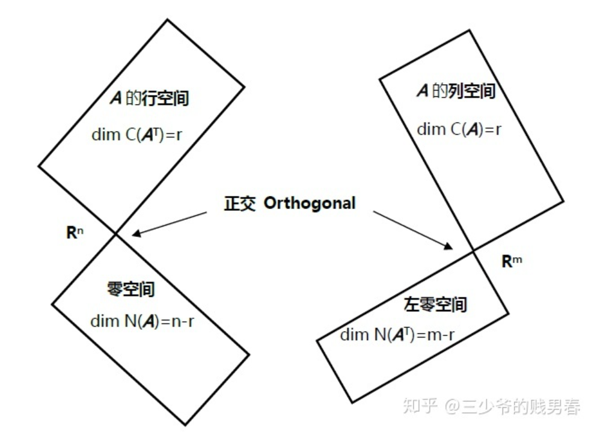
:::

# 1 正交向量 Orthogonal Vectors
:::info
**正交就是垂直（**`**perpendicular**`**）的另一种说法**。
**两向量正交的判据之一是其点积**$\bf x^Ty=y^Tx=0$ 。当两个向量的夹角为$90$度时，按照勾股定理（毕达哥拉斯定理 `Pythagorean theorem`）$\bf x，y$满足：
$\bf ||x||^2+||y||^2=||x+y||^2$
其中$\bf ||x||^2=x^Tx$
例如$\bf x= \begin{bmatrix} 1\\2\\3\end{bmatrix}$, $\bf y= \begin{bmatrix} 2\\-1\\0\end{bmatrix}$ ，则$\bf x+y= \begin{bmatrix} 3\\1\\3\end{bmatrix}$ , $\bf||x||^2=14$ ， $\bf ||y||^2=5$ , $\bf ||x+y||^2=19$ 。
将勾股定理展开进行计算，则有 $\bf x^Tx+y^Ty=(x+y)^T(x+y)=x^Tx+y^Ty+x^Ty+y^Tx$ 。
得到 $\bf 2x^Ty=0$ 。
**零向量与所有向量都正交**。
:::

# 2 正交子空间 Orthogonal Subspaces
## 2.1 基本概念
:::info
子空间$\bf S$与子空间$\bf T$正交，则$\bf S$中的任意一个向量都和$\bf T$中的任意向量正交。黑板所在的平面和地板所在平面不是正交关系，沿两者的交线方向的向量同时属于两个平面，但并不与自己正交。
我们在平面内讨论正交子空间，平面的子空间包括只包含零向量的$\bf 0$空间、过原点的直线以及整个平面。经过原点的直线不会和整个空间正交；$\bf 0$空间和过原点的直线正交；经过原点的两条直线若夹角为直角则互相正交。
:::

## 2.2 正交与垂直概念辨析
**参考**: [https://www.cnblogs.com/bigmonkey/p/9884104.html](https://www.cnblogs.com/bigmonkey/p/9884104.html)
:::info
以我们比较熟悉的三维空间为例，墙角就可以看作一个典型的空间坐标系，两个墙面和地面两两垂直，每个平面都是三维空间中的二维子空间，这是否意味着子空间的正交呢？并不是这样，**两个平面垂直（平面法向量垂直即可判定）并不等同于两个子空间正交(需要复杂的条件判定)，可以轻易找出两个分属于两个平面但不垂直的向量。实际上，在墙壁与地面的交接处，沿着接缝方向的向量同属于两个平面，但它们不会自己正交与自己，除非是零向量**。
这样看来，“正交是垂直的令一种说法”并不完全准确，实际上，**正交一定垂直，垂直不一定正交。**
通过平面的例子可以看出，如果两个子空间交于一个非零向量，那么这两个子空间一定不会正交。**换句话说，如果两个子空间正交，它们只能交于零向量（单独的点就是零向量，它没有方向，或者说有任意方向，并且模长为**$\bf 0$**）**。

**在同一个平面中正交的例子有哪些呢？**
回顾一下子空间的定义，如果$\bf V$是$\bf R^n$的线性子空间，则$\bf V$一定满足三个条件：

1. 包含$\bf 0$向量；
2. $\bf x$是$\bf V$中的一个向量，$\bf x$和一个标量的乘积也在$\bf V$中，即数乘封闭性；
3. $\bf a$和$\bf b$是$\bf V$中的向量，$\bf a+b$也在$\bf V$中，即加法封闭性。

由此可见平面内只有三个子空间：原点、过原点的直线、整个平面。这样一来答案就很清晰了：

1. 过原点的直线任何时候都不会和整个平面正交；
2. 原点和所有过原点的直线正交，也和整个平面正交；
3. 如果两个过原点的向量的点积是$\bf 0$，二者正交。
:::

## 2.3 三维空间中的二维子空间
> **三维空间中的二维子空间不可能正交**
> 设想一下这两个矩阵:
> 
> 他们的秩都是$2$, 也就是他们的列空间都是$\bf R^3$中的$\bf R^2$子空间。
> 如果他们的列空间正交，就说明我们除了$\bf 0$向量找不到其他的向量同时属于$\bf A\cap B$了。
> **怎么说明我们除了**$\bf 0$**向量以外能够找到其他向量呢?**
> 我们可以先假设有一个神奇的非零向量$\bf b$, 他同时属于$\bf A$和$\bf B$的列空间，于是线性方程组$\bf Ax=b, B\hat{x}=b$均有解。于是$\bf Ax=B\hat{x}$有解，我们将这个式子变一下形, 得到$\bf Ax-B\hat{x}=0$, 写成分块矩阵形式$\begin{bmatrix} \bf A&\bf B\end{bmatrix}\begin{bmatrix} \bf x\\\bf -\hat{x}\end{bmatrix}=\bf 0$
> 也就是$\bf C=\begin{bmatrix} \bf A&\bf B\end{bmatrix}$的零空间有非零解。解得$\begin{bmatrix} 5\\6\\5\end{bmatrix}$同时属于这两个$\bf R^2$子空间，因为它非零，所以$\bf Col(A)$和$\bf Col(B)$不正交。

## 2.4 推广到一般
> 我们将`2.3`中的三维空间的两个二维子空间推广到$n$维空间$\bf R^n$的一个$p$维子空间$\bf V$和一个$q$维子空间$\bf W$
> 则如果$\bf V\cap  W$中有非零向量($\bf V$和$\bf W$不正交)，则$p+q>n$
> 从`2.3`中我们看到$\bf V$的$p$个基向量和$\bf W$的$q$个基向量必须线性相关。(否则的话$\bf V$的个基向量的线性组合就不能写成$\bf W$的基向量的线性组合了，参考下面的式子$a_1v_1+a_2v_2+\cdots+a_pv_p+b_1w_1+\cdots+b_qw_q=0$, 只有当$a_i,b_i$不全为零的时候，$\bf V$的基向量的某种非零线性组合, 才可能写成$\bf W$的基向量的某种非零线性组合，) 

# 3 四个基本空间的正交性
> 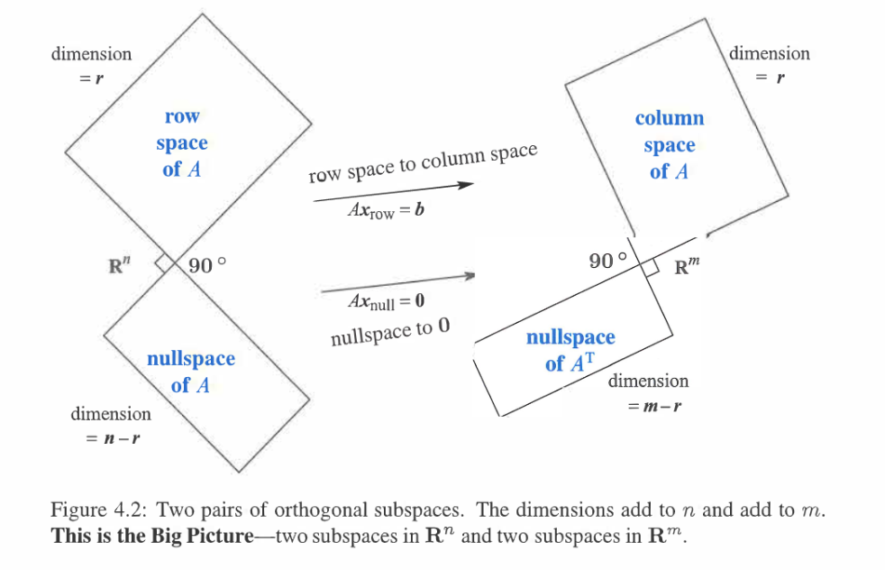

## 3.1 零空间与行空间正交⭐⭐
:::info
` Nullspace is perpendicular to row space`
**矩阵的行空间和它的零空间正交**。
若$\bf x$在零空间内，则有$\bf Ax=0$，将$\bf A$表示为行向量的格式：
$\begin{bmatrix} \bf row_{1} \\ \bf row_{2} \\ .\\.\\.\\\ \bf row_{n} \end{bmatrix}\begin{bmatrix} \bf x \end{bmatrix}=\begin{bmatrix} \bf row_{1}* x\\ \bf row_{2}*x \\ .\\.\\. \\ \bf row_{n}*x \end{bmatrix}=\begin{bmatrix} 0\\0 \\ .\\.\\. \\ 0 \end{bmatrix}$
$\bf x$与矩阵$\bf A$的行向量点积都等于$\bf 0$，则它和矩阵$\bf A$行向量的线性组合进行点积也为$\bf 0$，所以$\bf x$与$\bf A$的行空间正交。$\bf x$为零空间内的任意向量，所以零空间与行空间正交。同理可以证明列空间与左零空间正交。

**行空间和零空间实际上把**$\bf R^n$**空间分割成了两个正交的子空间**。例如对于矩阵：
$\bf A= \begin{bmatrix} 1&2&5\\2&4&10  \end{bmatrix}$ , 其行空间是$1$维的，向量 $\begin{bmatrix} 1\\2\\5\end{bmatrix}$ 是它的基向量，而其零空间是垂直于 $\begin{bmatrix} 1\\2\\5\end{bmatrix}$ 并穿过原点的$2$维平面。
**行空间和零空间不仅仅是正交，并且其维数之和等于**`**n**`，我们称行空间和零空间为$\bf R^n$空间内的正交补（`orthogonal complements`）。这表示零空间包含所有和行空间正交的向量，反之亦然。

- 列操作一般会改变行空间，但是不会改变行空间的维数
- 行操作一般会改变列空间，但是不会改变列空间的维数

**想想我们之前提到的黑板和地板平面不是正交子空间的例子，二者都在**$3$**维空间中，分别为**$2$**维空间，因此不可能正交。一个空间中正交子空间的维数之和不可能超过原空间的维数。**
我们可以称目前讨论的这部分内容是线性代数基本定理的第二部分。第一部分是给出四个子空间和它们的维数，第二部分说明它们是两两互为正交补，第三部分讨论子空间的正交基。
这些内容都反映在了本讲座开始的那幅图上。
:::

## 3.2 列空间和左零空间正交
> **为什么要叫左零空间呢?**
> 我们知道零空间是将矩阵$\bf A$的列映射到$\bf 0$向量
> 左零就是把矩阵$\bf A$的行映射到$\bf 0$向量
> 左零空间一般写成满足$\bf A^Ty=0$或者$\bf y^TA=0$的$\bf y$, 本质上就是行的线性组合。
> 
> **为什么列空间中的向量和左零空间的向量正交呢?**
> 我们知道矩阵$\bf A$的左零空间中的向量$\bf y$满足$\bf A^Ty=0......(1)$
> 矩阵$\bf A$的列空间中的向量$\bf b$满足$\bf b=Ax......(2)$
> **我们要证明，**$\mathbf{b^Ty}=0$**或者**$\mathbf {y^Tb}=0$
> 因为$\bf A^Ty=0$, 所以$\bf y^TA=0^T......(3)$, 然后在$(2)$的左右两边乘上$\bf y^T$, 得到$\mathbf{ y^TAx}=\mathbf{y^Tb}$, 根据$(3)$, 有$\mathbf{ y^TAx}=\bf 0^Tx=0=y^Tb$
> 所以$\bf y^Tb=0$, 证毕。
> **另一种证明:**
> 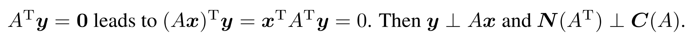

## 3.3 左零空间判断解的情况⭐⭐⭐
> 假设我们有如下的线性方程组$\bf Ax=b$
> $\begin{cases} x+2y+2z=5\\2x+2y+2z=5\\3x+4y+5z=9\end{cases}$
> 我们如何利用左零空间判断这个方程是否有解呢?
> 我们回忆一下，在我们求解线性方程组的时候，是不是可以把等式左侧和右侧的每个方程线性组合一下，因为这样不会影响解的情况。
> 如果说我找到了一个线性组合使得方程组被化简成了$\bf 0=1$,我就可以说这个方程无解了。

:::info
**怎么找呢?**
还记得我们的目的是要将行进行线性组合对吧，那么根据`3.2`中的叙述，我们应该在矩阵$\bf A$的左零空间中去寻找这样的向量。如果找到了，方程就无解。
本例中我们可以找到这样的向量$\bf y= \begin{bmatrix} 1\\1\\-1\end{bmatrix}$使得$\bf y^TAx=0$。如果$\bf y^Tb$也能等于$\bf 0$的话(也就是**如果**$\bf b$**在**$\bf A$**的列空间中时，因为左零空间和列空间正交，所以**$\bf y^Tb=0$)，方程其实是有解的，但是这里$\bf y^Tb=1$，所以$\bf b$不在$\bf A$的列空间中，方程无解。
作业`1`中总结了这种方法，称为`Fredholm's Alternative`。
:::

# 4 A^T*A**⭐⭐**
## 4.1 基本性质
:::info
下面讨论如何求解一个无解方程组$\bf Ax=b$的解。如果$\bf A$是长方形矩阵，$m$大于$n$。当左侧方程数特别多的时候，容易混入“坏”数据，方程变得无解。但是对于数据的可信度我们无从判断，线性代数要做的就是在这种条件下求一个方程的“最优解(最小二乘解)”。**矩阵**$\bf A^TA$**会发挥重要作用，它是一个**$n\times n$**方阵，并且是对称阵，**$\bf (A^TA)^T=A^TA$**。**
:::
> 本章的核心内容就是当$\bf Ax=b$无解的时候，求解 $\bf A^TAx=A^Tb$ 得到最优解。
> **例：**$\bf A= \begin{bmatrix} 1&1\\1&2\\1&5\end{bmatrix}$ ，则$\bf A^TA= \begin{bmatrix} 1&1&1\\1&2&5 \end{bmatrix}\begin{bmatrix} 1&1\\1&2\\1&5\end{bmatrix}= \begin{bmatrix} 3&8\\8&30\end{bmatrix}$ 是可逆矩阵。
> 但是矩阵$\bf A^TA$并不总是可逆。
> **例：**$\bf A= \begin{bmatrix} 1&3 \\1&3 \\1&3 \end{bmatrix}$ ，则$\bf A^TA= \begin{bmatrix} 1&1&1\\3&3&3 \end{bmatrix}\begin{bmatrix} 1&3\\1&3\\1&3\end{bmatrix}= \begin{bmatrix} 3&9\\9&27\end{bmatrix}$ 是不可逆矩阵。
> 实际上 $\bf N(A^TA)=N(A)$，并且矩阵$\bf A^TA$的秩等于$\bf A$的秩。因此矩阵$\bf A^TA$可逆，则要求$\bf A$的零空间只有零向量，即$\bf A$的列向量线性无关。

## 4.2 最小二乘证明
### 4.2.1 集合视角
参考：[https://math.stackexchange.com/questions/349738/prove-operatornamerankata-operatornameranka-for-any-a-in-m-m-times-n](https://math.stackexchange.com/questions/349738/prove-operatornamerankata-operatornameranka-for-any-a-in-m-m-times-n)
> 我们将使用空间的定义给出$\bf Rank(A^TA)=Rank(A)$的证明: 
> 1. 令 $\bf x∈N(A),N(A)$是$\bf A$的零空间， 所以我们有:$\bf Ax=0$ $=>\bf A^TAx=0$ $\bf =>x\in N(A^TA)$; 由集合的性质，如果$\bf \forall a\in B\space, \space a\in C, then \space B\subseteq C$, 所以$\bf N(A)\subseteq N(A^TA)$
> 2. 令$\bf x∈N(A^TA),N(A^TA)$是$\bf A^TA$的零空间, 所以我们有：$\bf A^TAx=0 => x^TA^TAx=0=>(Ax)^T(Ax)=0=>Ax=0$, 于是$\bf x\in N(A)$, 所以$\bf N(A^T)\subseteq N(A)$
> 3. 因为$\bf N(A)\subseteq N(A^TA)$, $\bf N(A^T)\subseteq N(A)$, 我们有$\bf N(A)= N(A^TA)$
> 4. 因为$\bf \#col(A)= \#col(A^TA)=n$, 所以$\bf Rank(A)=n-N(A),Rank(A^TA)=n-N(A^TA)$, 所以$\bf Rank(A^TA)=Rank(A)$
> 5. 所以这个重要性质就是说，当$\bf A$列满秩时，$\bf A^TA$可逆，$\bf A^TAx=A^Tb$有最小二乘解$\bf x=(A^TA)^{-1}A^Tb$ 

### 4.2.2 空间正交视角
> **证明:** 如果$\bf A^TAx=0$, 则$\bf Ax=0$, 由这个结合维数公式可以直接推出$\bf Rank(A^TA)=Rank(A)$
> 因为$\bf Ax$在$\bf A^T$的零空间中，所以$\bf Ax$**在**$\bf A$**的左零空间中，而**$\bf Ax$**一定在**$\bf A$**的列空间**中，而列空间和左零空间正交，所以$\bf Ax=0$。（**一个向量和自己正交，那么这个向量只能是**$\bf 0$**向量**） 

## 4.3 最小二乘应用
> 在机器学习的线性回归中，假设我们的样本数据集是$\bf X_{m\times n}$, 标签是$\bf Y_{m\times 1}$
> 原始数据集满足$\bf Y = Xw+\epsilon, \epsilon\sim N(0,\sigma^2)$
> 我们模型的参数是$\bf \hat{w}$, 我们使用线性模型来拟合数据集的时候，往往假设$\bf Y=Xw$, 然后对这个线性方程组求解$\bf w$。** 如果我们的**$\bf X$**列满秩的话(数据集特征较少，样本很多，模型较为简单的时候)**，由于$\bf X$不一定可逆，所以我们转而求解$\bf X^T Xw=X^TY$, 因为$\bf X^TX$为方阵且列满秩，所以其一定可逆，于是$\bf w=(X^TX)^{-1}X^TY$唯一存在，作为模型的最小二乘解，但为什么就是最优解呢?
> 如果我们从需要最小化损失函数的角度来看的话， 我们在训练模型的时候，实际上就是在使如下的损失函数最小化: $\mathcal{l}(Y,\hat{Y})=\mathcal{J}(w)=\sum_{i=1}^m(Y_i-(X_iw))^2=\bf (Y-Xw)^T(Y-Xw)$
> 通过对$\bf w$求偏导, 并且利用矩阵求导术，得到$\bf w=(X^TX)^{-1}X^TY$, 与上面的一致，所以我们在求最小二乘解的时候就相当于是在优化模型参数，使得模型训练误差最小化。
> **当然如果**$\bf X$**不是列满秩的话，**$\bf N(A^TA)$**不再只有零向量，这意味着**$\bf A^TA$**也不再可逆，同时**$\bf Ax=b$**可能有无数多个解，不知道哪个是最小二乘解了， 也有可能无解，那么上述优化方法就不能使用了，我们转而使用梯度下降算法最小化损失函数， 具体在**`**MIT 6.036x**`**中介绍**

# 5 正交补
> 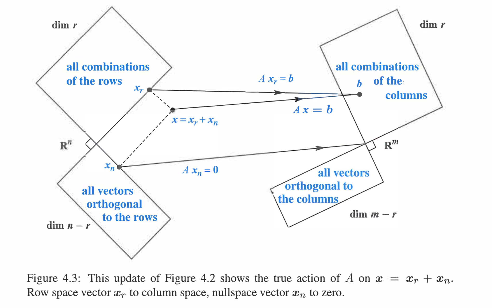

## 5.1 定义
:::info
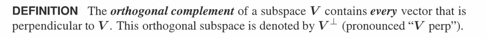
由此定义，矩阵的零空间是行空间的正交补，记为$\bf N(A)^{\perp}=C(A^T)$
四个基本空间的正交补关系如下:
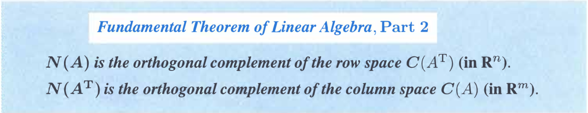
:::

## 5.2 解的成分
:::info
对于$\bf Ax=b$这个方程组来说，每个$\bf x$可以被分解成行空间成分$\bf x_r$和零空间成分$\bf x_n$
根据空间正交性, 我们有:

1. $\bf Ax_r=Ax$
2. $\bf Ax_n=0$

**对一个向量左乘**$\bf A$**就只是把所有**$\bf x$**映射到**$\bf A$**的列空间中去。**
对于每一个在$\bf A$的列空间中的向量$\bf b$, 我们知道$\bf Ax=b$一定有解, 这个解和上面说的一样可以分解为两部分，$\bf A(x_r+x_n)=Ax+0=b$
:::
:::info
根据这个性质，我们尝试给出命题：对于每个在$\bf A$的列空间中的$\bf b$,有且仅有一个$\bf x_r\in Row(A)$成分与之对应，即$\bf Ax_r=b$只有一个解。
**证明:**
假设有$\bf x'_r\in Row(A)$也满足$\bf Ax'_r=b$, 则$\bf A(x_r-x'_r)=0$, 于是$\bf x_r-x'_r$在矩阵$\bf A$的零空间中，而$\bf x_r-x'_r$本身也在矩阵$\bf A$的行空间中(因为本质上是两个行空间向量的线性组合)，而行空间和零空间正交。**一个向量和自己正交，那么这个向量只能是**$\bf 0$**向量**，所以$\bf x_r-x'_r=0$, 于是$\bf x_r=x'_r$, 证毕。
:::
 
 
## 5.3* 拓展
> 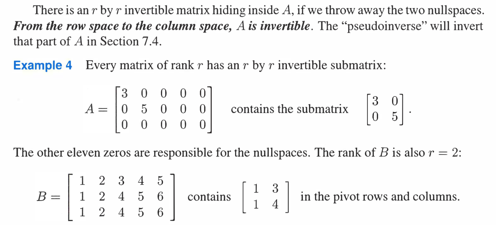

## 5.4 有限向量集合也有正交补
> **不一定非得是一个子空间才能有正交补(正交补是一个子空间)**
> 对于一个只含有有限个向量的集合$\bf S=\{(1,5,1),(2,2,2)\}$, $\bf S^{\perp}$是一个子空间，尽管$\bf S$不是子空间（不满足加法数乘封闭性）。特别的，$\bf S^{\perp}$是矩阵$\bf \begin{bmatrix} 1&5&1\\2&2&2 \end{bmatrix}$的零空间。

## 5.5 寻找正交补的基向量
> 假设$\bf S$是向量$\begin{bmatrix} 1\\2\\2\\3 \end{bmatrix}$和向量$\begin{bmatrix} 1\\3\\3\\2 \end{bmatrix}$张成的子空间，$\bf S^{\perp}$的基向量是什么？
> 因为$\bf S^{\perp}$和$\bf S$中的任意向量正交，同时$\bf S$的基已经给出，就是上面的两个向量，我们可以求$\begin{bmatrix} 1&2&2&3\\1&3&3&2 \end{bmatrix}$的零空间的基作为答案。

## 5.6 超平面的正交补
> 对于一个超平面$\bf \theta^T x=0$来说，他的法向量是$\theta$， 所以超平面代表的向量空间$\bf P=R^n$的正交补$\bf P^{\perp}$的基是$\theta$张成的一维直线。$\bf P$也就是矩阵$\bf A=\begin{bmatrix} \theta_1&\theta_2&\cdots&\theta_n\end{bmatrix}$的行空间，$\bf P^{\perp}$也就是矩阵$\bf A$的零空间。

## 5. 经常被忽视的点
### 5.7.1 {0}的正交补
> 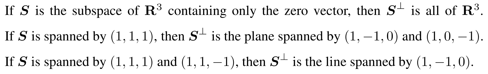
> 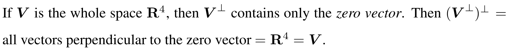

### 5.7.2 正交补的包含关系
> 如果子空间$\bf S\subset V$, 则$\bf V^{\perp} \subset S^{\perp}$
> **证明:**
> 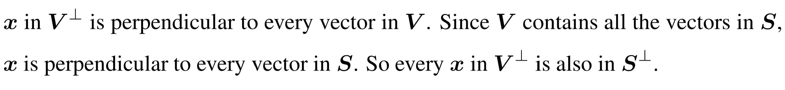

# 6 垂直的行和列 
## 6.1 逆矩阵的列和原矩阵的行空间
> 假设$\bf AA^{−1} = I$, 则$\bf A^{-1}$的第一列和$\bf A$的第$2,3,...,n$行张成的向量空间，因为乘积都是$0$

# 7 作业
## P1: Fredholm's Alternative**⭐⭐**
> 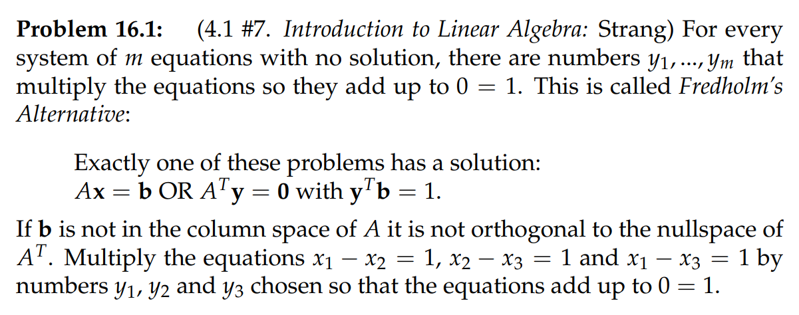

**Key**本题的意思是对于$\bf A=\begin{bmatrix} 1&-1&0\\0&1&-1\\1&0&-1\end{bmatrix}\bf x=\begin{bmatrix} 1\\1\\1\end{bmatrix}$这个方程组来说, 要么$\bf Ax=b$有解，要么$\bf A^Ty=b,y^Tb=1$有解
做法很简单，我们只要从$\bf A^T$的零空间($\bf A$的左零空间) 中找一个向量$\bf y$, 使其满足$\bf y^Tb=1$即可
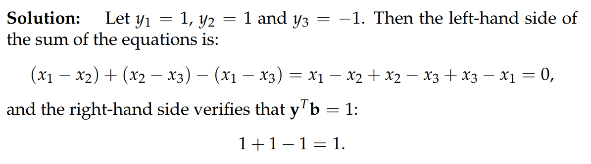

## P2: Vector Spaces**⭐⭐⭐**
> 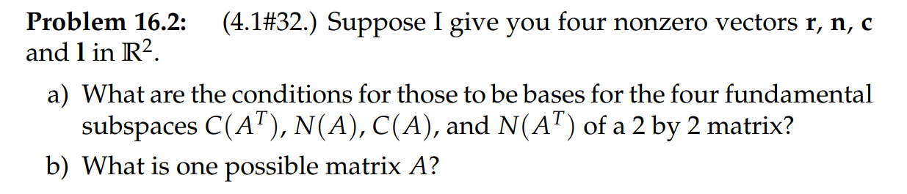

**(a)**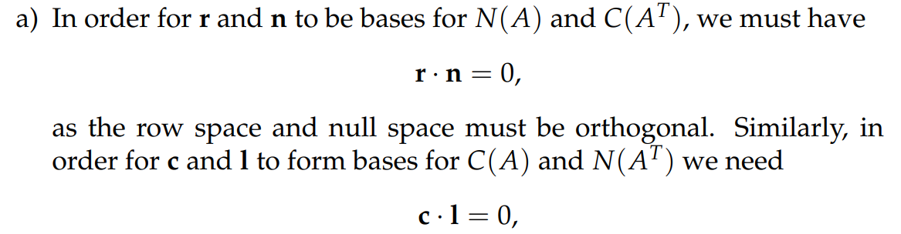
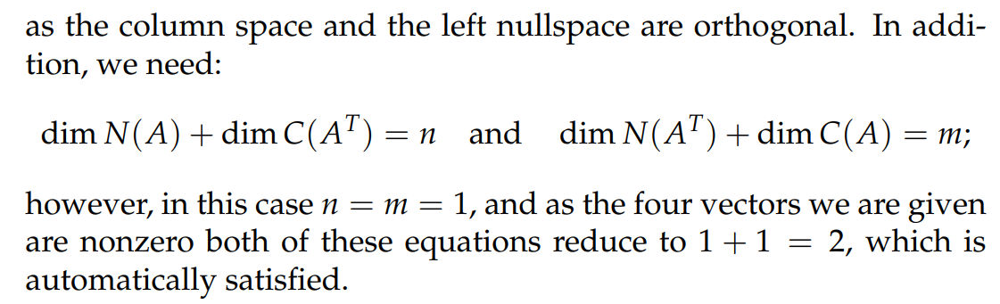
要注意: 正交空间中的向量一定线性无关
**(b)**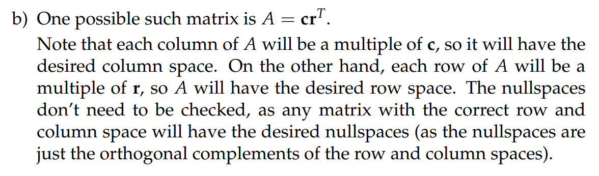

## P3 Orthogonal Space**⭐⭐**
> $\bf S$是由$\begin{bmatrix} 1\\2\\2\\3 \end{bmatrix},\begin{bmatrix} 1\\3\\3\\2 \end{bmatrix}$张成的平面
> 1. 找到$S^{\perp}$的基
> 2. $R^{4}$中的任意一个$v$是是否能唯一地表示成$S^{\perp}$和$S$基向量一起张成的向量空间?

**(1)**我们知道$S^{\perp}$是矩阵$\bf A=\begin{bmatrix} 1&1\\2&3\\2&3\\3&2\end{bmatrix}$的左零空间, 也就是$\bf A^T=\begin{bmatrix} 1&3&3&2\\1&2&2&3\end{bmatrix}$的零空间我们进行行消元，得到$\bf U^T=\begin{bmatrix} 1&0&0&5\\0&1&1&-1\end{bmatrix}$, 根据[快速求解零空间基向量](https://www.yuque.com/alexman/so5y8g/fxb3kg#OvFQk)中的方法，我们得到$S^{\perp}$的基是$\begin{bmatrix} 0\\-1\\1\\0 \end{bmatrix},\begin{bmatrix} -5\\1\\0\\1 \end{bmatrix}$
**(2)**注意题目的意思，是将$S^{\perp}$和$S$的基向量一起张成的空间是否能包含全部的$R^4$向量，答案是肯定的，因为$\bf dim(S^{\perp})+dim(S)=dim R^4=4$。从线性方程组的角度出发，我们只要证明$\bf A=\begin{bmatrix} 1&1&0&5\\2&3&-1&1\\2&3&1&0\\3&2&0&1   \end{bmatrix}$可逆，就可以证明$\bf Ax=b,b\in R^4$有唯一解$\bf x=A^{-1}b$
下面我们研究$\bf A$的可逆性，我们使用第三列的拉普拉斯展开求行列式得到$\bf \det A \neq 0$
所以唯一性证明完毕。
