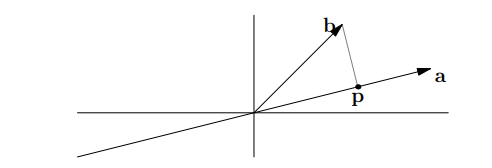
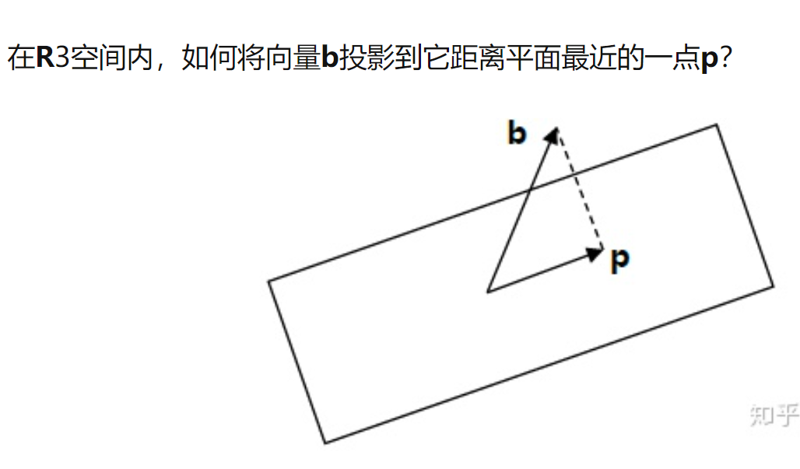
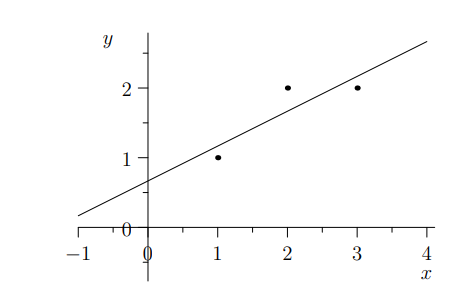
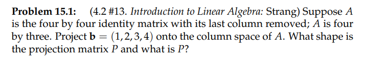
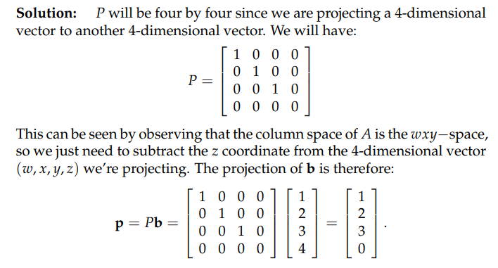
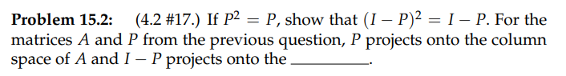
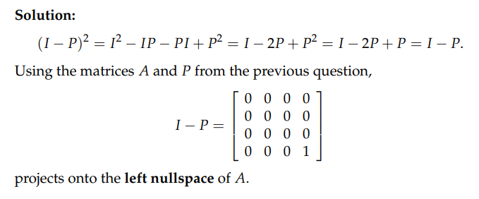
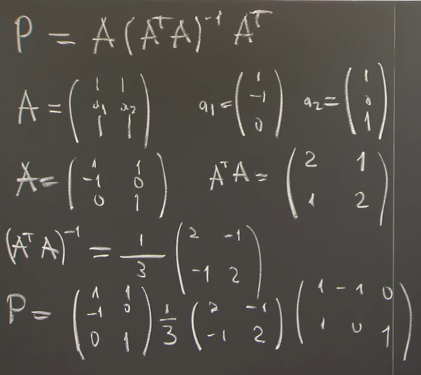
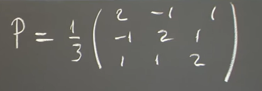
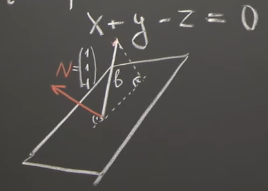

**参考**: [https://zhuanlan.zhihu.com/p/45862922](https://zhuanlan.zhihu.com/p/45862922)
> `Projections onto subspaces`

# 1 投影
> 在`18.02SC`的`Unit 1`中就介绍了向量投影的概念和单位方向向量的概念

## 1.1 问题概述
> 
> 投影问题的几何解释就是：如何在向量$\bf a$的方向上寻找与向量$\bf b$**(终点坐标)**距离最近的一点。从图中可以看出，这个距离最近的点$\bf p$就位于穿过$\bf b$点并与向量$\bf a$正交的直线与向量$\bf a$所在直线的交点上。这就是$\bf b$在$\bf a$上的投影。如果我们将向量$\bf p$视为$\bf b$的一种近似，则长度$\bf e=b-p$就是这一近似的误差。

:::info
因为$\bf p$在向量$\bf a$的方向上，因此可以令$\mathbf p=x\mathbf a$，而因为它和$\bf e$正交，我们可以得到方程： $\mathbf{a^T}(\mathbf{b}−x\mathbf a)=0$ 。
解得: $x=\bf\frac{a^Tb}{a^Ta}$, $\mathbf{p}=x\bf a=a\frac{a^Tb}{a^Ta}$
如果$\bf b$变为原来的$2$倍，则$\bf p$也变为原来的$2$倍。而如果$\bf a$变为原来的$2$倍，$\bf p$不发生变化。从几何上和计算中都会得到验证。
:::

## 1.2 投影矩阵 Projections Matrix
:::info
我们将投影问题用投影矩阵的方式进行描述，即为$\bf p=Pb$，其中$\bf P$为投影矩阵。
$\mathbf{p}=x\bf a=a\frac{a^Tb}{a^Ta}$。则有$\bf P=\frac{aa^T}{a^Ta}$ 。其分子 $\bf aa^T$ 是一个矩阵，而分母 $\bf a^Ta$ 是一个常数(`scalar`)。
观察这个矩阵可知，矩阵$\bf P$的列空间就是向量$\bf a$所在的直线，矩阵的秩是$1$。投影矩阵$\bf P$是一个对称矩阵(将$\bf aa^T$展开即可发现)。另一方面，如果做两次投影则有 $\bf P^2b=Pb$ ，这是因为第二次投影还在原来的位置。
**因此矩阵**$\bf P$**有如下性质: **$\bf P^2=P ， P^T=P$** 。**
:::

## 1.3 为什么要投影**⭐⭐⭐**
:::info
如前所述，方程$\bf Ax=b$有可能无解，我们需要得到方程的“最优解”。这里的问题在于向量$\bf Ax$一定在矩阵$\bf A$的列空间之内，但是$\bf b$不一定，因此我们希望将$\bf b$投影到$\bf A$的列空间得到$\bf p$，将问题转化为求解 $\bf A\hat{x}=p$ 。
:::

## 1.4 高维投影**⭐⭐**
:::info

如果$\bf a_1$和$\bf a_2$构成了平面的一组基，则平面就是矩阵$\bf A=\begin{bmatrix} a_1&a_2\end{bmatrix}$的列空间。
已知向量$\bf p$在平面内，则有$\bf p= x_1a_1+x_2a_2=A\hat{x}$ 。
而 $\bf e=b−p=b−A\hat{x}$ 与投影平面正交（_重点_），因此$\bf e$与$\bf a_1$和$\bf a_2$均正交，因此可以得到： $\bf a_1^T(b−A\hat{x})=0$并且 $\bf a_2^T(b−A\hat{x})=0$ 。因为$\bf a_1$和$\bf a_2$分别为矩阵$\bf A$的列向量，即$\bf a_1^T和a_2^T$为矩阵$\bf A^T$ 的行向量，所以将两个方程式写成矩阵形式即为$\bf A^T(b−A\hat{x})=0$。这与一维投影的方程形式($\bf a^T(b−ax)=0$)相同。
向量$\bf e=b−A\hat{x}$ 存在于矩阵$\bf A^T$的零空间$\bf N(A^T)$里，从上一讲讨论子空间的正交性可知，向量$\bf e$与矩阵$\bf A$的列空间正交，这也正是方程的意义。
将方程$\bf A^T(b−A\hat{x})=0$改写，可得$\bf A^TA\hat{x}=A^Tb$。两侧左乘$\bf (A^TA)^{-1}$，得到：
$\bf \hat{x}=(A^TA)^{−1}A^Tb$(**这其实就是最小二乘的来源**), $\bf p=A\hat{x}=A(A^TA)^{−1}A^Tb$

令$\bf P=A(A^TA)^{−1}A^T$， $\bf P$就是我们的关于平面$\bf A$的投影矩阵。
因为矩阵$\bf A$不是方阵，无法简单的用$\bf (A^TA)^{−1}=A^{−1}(A^T)^{−1}$ 对投影矩阵公式进行化简。若$\bf A$是可逆方阵，则化简得到$\bf P=I$。此时$\bf A$的列空间就是整个$\bf R^n$空间，$\bf b$到这个空间的投影就是其本身，投影矩阵等于单位阵。
对 $\bf P=A(A^TA)^{−1}A^T$ 用矩阵乘法的结合律和矩阵乘积的转置公式，可以证明投影矩阵的性质： $\bf P^2=P ， P^T=P$ 。
**注意在**$\bf A$**形如**$\bf \begin{bmatrix} *&*&*&*\\ 0&*&*&*\\0&0&*&*\end{bmatrix}$**也就是非列满秩的时候，**$\bf A^TA$**不可逆，上述投影矩阵的求法不成立。**
:::

# 2 最小二乘
:::info
在`Unit 2.1`中已经介绍了最小二乘的性质, 现在对其进行一个梳理，并且借用一个小例子进行说明。
:::
> 
> 应用投影矩阵求方程组最优解的方法，最常用于“最小二乘法”拟合曲线。
> 有三个数据点$\bf \{(1,1), (2,2), (3,2)\}$，求直线方程$\bf b=C+Dt$，要求直线尽量接近于三个点。把三个点的数据代入方程则有：
> $\bf C+ D=1$, $\bf C+2D=2$,$\bf C+3D=2$
> 矩阵形式为 $\bf \begin{bmatrix}1&1\\1&2\\1&3\end{bmatrix}\begin{bmatrix}C\\D\end{bmatrix}=\begin{bmatrix}1\\2\\2 \end{bmatrix}$
> 这个的方程$\bf Ax=b$是无解的，解决办法就是求其最优解，即方程$\bf A^TA\hat{x}=A^Tb$的解。

# 3 作业
## P1: 投影矩阵 P
> 

Key使用$\bf P=A(A^TA)^{−1}A^T$计算$\bf A$的投影矩阵

## P2: 投影矩阵 I-P**⭐⭐⭐⭐**
> 

Key
我们计算$\bf v= (I-P)b=\begin{bmatrix}0\\0\\0\\4\end{bmatrix}$
**我们考察**$\bf A$**的四个空间:**

1. 对于列空间$\bf Col(A)$,$\bf dim(Col(A))=3$列空间的基向量是$\bf \begin{bmatrix} 1\\0\\0\\0 \end{bmatrix}$,$\bf \begin{bmatrix} 0\\1\\0\\0 \end{bmatrix}$,$\bf \begin{bmatrix} 0\\0\\1\\0 \end{bmatrix}$, 所以很显然$\bf v\notin Col(A)$
2. 对于零空间，$\bf dim(N(A))=0$, 零空间里只有零向量，所以$\bf v\notin N(A)$
3. 对于行空间, $\bf dim(Row(A))=dim(Col(A))=3$, 基向量是$\bf \begin{bmatrix} 1\\0\\0 \end{bmatrix}$,$\bf \begin{bmatrix} 0\\1\\0 \end{bmatrix}$,$\bf \begin{bmatrix} 0\\0\\1 \end{bmatrix}$,所以$\bf v\notin Row(A)$
4. 对于左零空间, $\bf dim(N(A^T))=4-3=1$, 基向量是$\bf \begin{bmatrix} 0\\0\\0\\1 \end{bmatrix}$

所以$\bf I-P$投影到$\bf A$的左零空间内。

## P3: 找到平面的投影矩阵**⭐⭐**
> 找到投影到平面$x+y-z=0$的投影矩阵

**公式法**我们知道，平面的法向量是$\begin{bmatrix} 1\\1\\-1\end{bmatrix}$, 我们需要找到这个平面的两个基向量，将他们按列组成矩阵$\bf A$,然后利用公式$\bf P=A(A^TA)^{−1}A^T$求得投影矩阵。

**注意：尽管基向量的选取是任意的，我们得到的投影矩阵是同一个, 可以举例验证**
**几何法**我们也可以从几何的角度来解:

假设平面外有向量$l$,那么$Il=Pl+P_vl$(几何含义是: $l$投影到$\hat{N}$上的向量和$l$投影到平面上的向量的加和等于$l$向量), 所以$I=P+P_v$, 所以$P=I-P_v$, 而$P_v$很容易求出，是$P_v=N(N^TN)^{-1}N^T$, 所以可以很快得出$P$和公式法得到的一致。
这种方式可以使得我们非常快速的确定平面的投影矩阵。
 
