参考: [https://zhuanlan.zhihu.com/p/45867051](https://zhuanlan.zhihu.com/p/45867051)
# 1 投影(cont.)
## 1.1 回顾
> 上一讲介绍了投影矩阵 $\bf P=A(A^TA)^{−1}A^T$ ，当它作用于向量$\bf b$，相当于把$\bf b$投影到矩阵$\bf A$的列空间，以及投影矩阵$\bf I-P$, 当它作用于向量$\bf b$, 相当于把$\bf b$投影到矩阵$\bf A$的左零空间中。
> 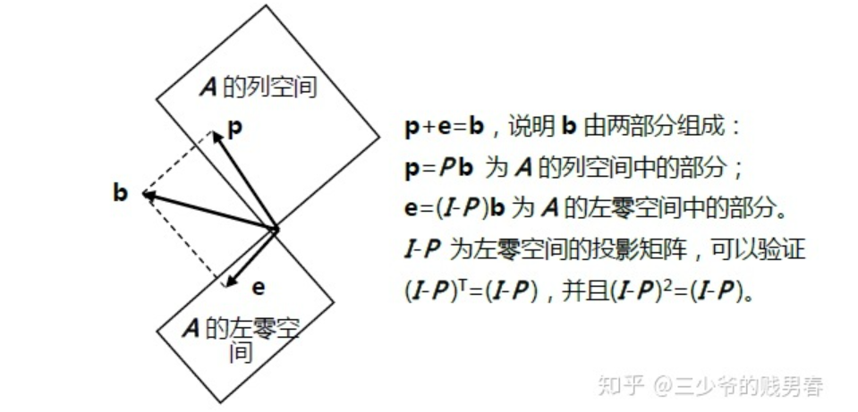
> 1. **如果向量**$\bf b$**本身就在**$\bf A$**列空间之内，即存在**$\bf x$**使得**$\bf Ax=b$**，则有：**
> 
$\bf Pb=A(A^TA)^{−1}A^Tb=A(A^TA)^{−1}A^TAx=A((A^TA)^{−1}A^TA)x=Ax=b$
> 
> 
> 2. **如果向量**$\bf b$**与**$\bf A$**的列空间正交，向量**$\bf b$**在矩阵**$\bf A$**的左零空间**$\bf N(A^T)$**中，则有:**
> 
$Pb=A(A^TA)^{−1}A^Tb=A(A^TA)^{−1}A^TAx$
> 
> 一定要注意，当$\bf A$不是列满秩的时候，$\bf A^TA$不可逆，上述投影矩阵不存在。

## 1.2 最小二乘（cont.）
> 本节我们对该最小二乘的概念再做一个梳理
> 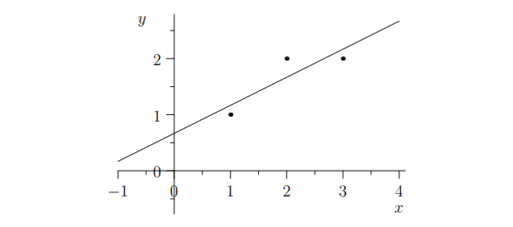
> 应用投影矩阵求方程组最优解的方法，最常用于“最小二乘法”拟合曲线。
> 有三个数据点$\bf \{(1,1), (2,2), (3,2)\}$，求直线方程$\bf b=C+Dt$，要求直线尽量接近于三个点。把三个点的数据代入方程则有：
> $\bf C+ D=1$, $\bf C+2D=2$,$\bf C+3D=2$
> 矩阵形式为 $\bf \begin{bmatrix}1&1\\1&2\\1&3\end{bmatrix}\begin{bmatrix}C\\D\end{bmatrix}=\begin{bmatrix}1\\2\\2 \end{bmatrix}$
> 这个的方程$\bf Ax=b$是无解的，解决办法就是求其最优解，即方程$\bf A^TA\hat{x}=A^Tb$的解。
> 
> 最优解的含义即为误差最小，这里误差就是每个方程误差值的平方和 $\bf ‖e‖^2=‖Ax−b‖^2$ ，因此就是寻找具有最小误差平方和的解$\bf x$，这就是所谓的“最小二乘”问题。
> 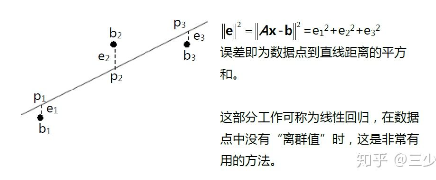
> **还可以从误差最小的角度出发求解：**
> $\bf e_{1}^2+e_2^{2}+e_3^{2}=(C+D−1)^2+(C+2D−2)^2+(C+3D−2)^2$
> 对等号右边的表达式求偏导数，极值出现在$\frac{d}{dC}=0,\frac{d}{dD}=0$的位置。求偏导最终会得到相同的线性方程组和相同的解。
> 得到直线表达式$\bf y=\frac{2}{3}+\frac{t}{2}$。将$\bf t=1, 2, 3$分别代入可得：
> 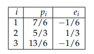
> 可以验证，向量$\bf p$与$\bf e$正交，并且$\bf e$与矩阵$\bf A$的列空间正交。

# 2 投影矩阵
## 2.1 投影到直线上[⭐](https://www.yuque.com/alexman/so5y8g/bk3kq8/edit#O5YM7)
> 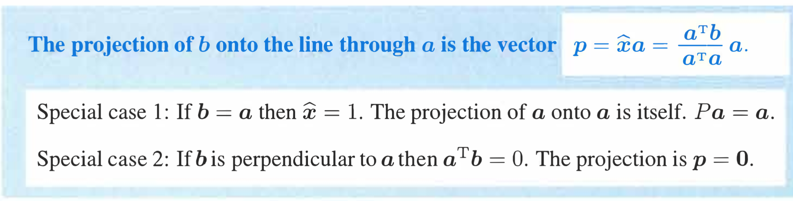
> 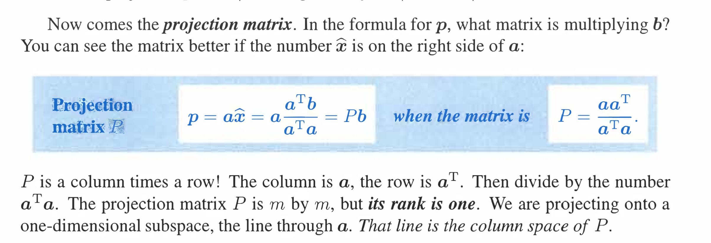

# 
## 2.2 I-P 投影矩阵[⭐](https://www.yuque.com/alexman/so5y8g/bk3kq8/edit#O5YM7)
> 投影矩阵$\bf I-P$和矩阵$\bf P$投影的方向互相正交
> 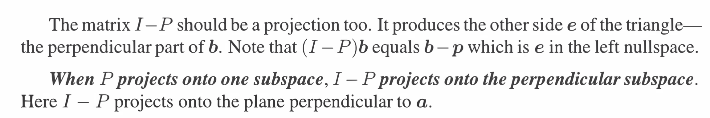

## 2.3 投影到子空间中[⭐⭐](https://www.yuque.com/alexman/so5y8g/bk3kq8/edit#O5YM7)[⭐⭐](https://www.yuque.com/alexman/so5y8g/bk3kq8/edit#O5YM7)
> 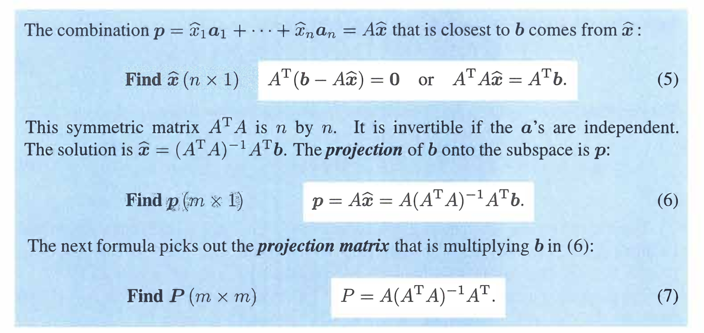
> 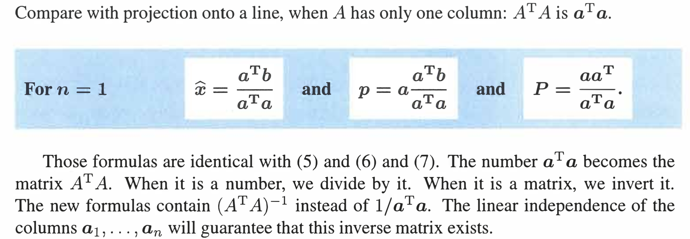

## 2.4 矩阵的左零空间 - Error Vectors
> 最小二乘的误差向量`Error Vector`(待投影向量$\bf b$减去投影后的向量$\bf Pb$的结果$\bf e$)在矩阵$\bf A$的左零空间中，这是非常重要的性质：
> 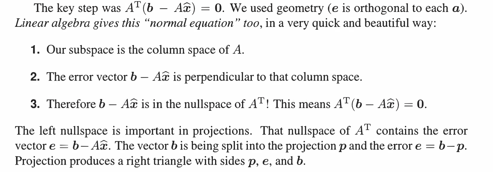

## 2.5 A^TA的可逆性
> 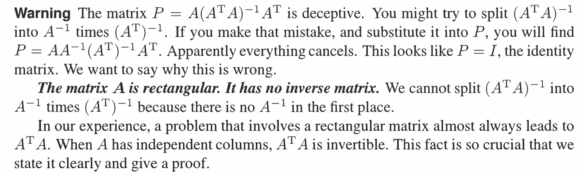
> 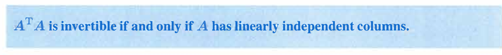
> **证明：若**$\bf A$**的列向量线性无关时，矩阵 **$\bf A^TA$** 为可逆矩阵。**
> `Unit 2.1`中我们使用了空间的概念证明了这个结论，现在我们从线性无关性来证明(本质上是相同的思路)
> 假设存在$\bf x$使得 $\bf A^TAx=0$ 。则有$\bf x^TA^TAx=0=(Ax)^T(Ax)$，因此$\bf Ax=0$。因为$\bf A$的列向量线性无关，所以只有当$\bf x=0$时有$\bf Ax=0$。因此只有当$\bf x=0$时有$\bf A^TAx=0$ 。即矩阵$\bf A^TA$为可逆矩阵。
> **如果矩阵的列向量是互相垂直的单位向量，则它们一定是线性无关的。我们将这种向量称之为标准正交（**`**orthonormal**`**）。**
> 例如：$\bf \begin{bmatrix} 1\\ 0\\0 \end{bmatrix}$,$\bf \begin{bmatrix} 0\\ 1\\0 \end{bmatrix}$,$\bf \begin{bmatrix} 0\\ 0\\1 \end{bmatrix}$ , 还有 $\bf \begin{bmatrix} cos(\theta)\\ sin(\theta) \end{bmatrix}$ 和$\bf \begin{bmatrix} -sin(\theta)\\ cos(\theta) \end{bmatrix}$ 。
> 
> 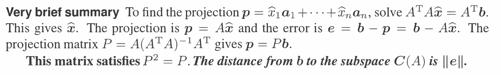

## 2.6 总结
> 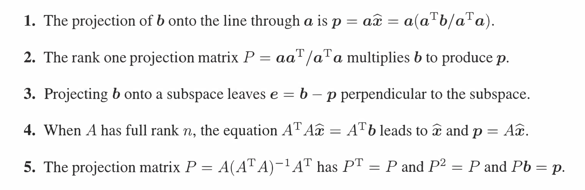

# 3 作业
## P1: 最小二乘
> 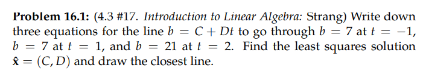

Key$\bf A = \begin{bmatrix} 1&-1\\1&1\\1&2\end{bmatrix}$
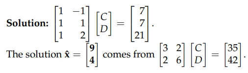

## P2: 投影矩阵
> 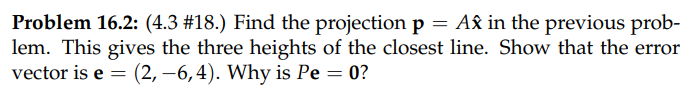
> $\bf A = \begin{bmatrix} 1&-1\\1&1\\1&2\end{bmatrix}$

Key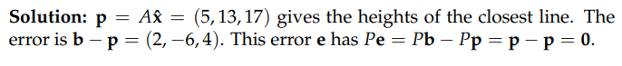
`Height of the error`就是每一个样本点预测值和拟合值之差

## P3: 垂直于列空间向量的投影⭐⭐
> 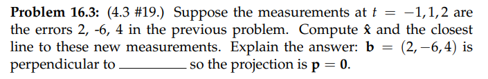

Key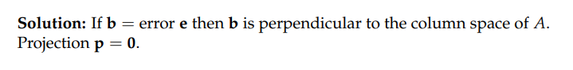

## P4: 在列空间内的向量的投影
> 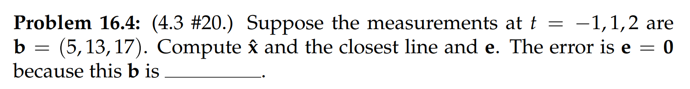

Key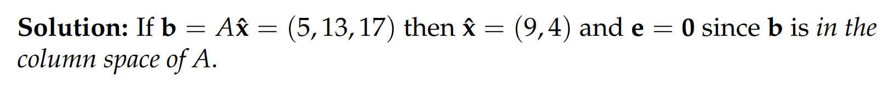

## P5: 四个基本向量空间
> 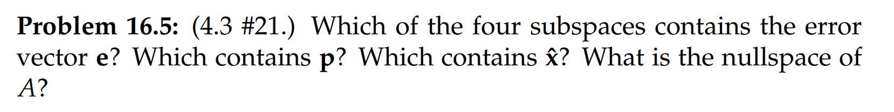
> $\bf A = \begin{bmatrix} 1&-1\\1&1\\1&2\end{bmatrix}$

Key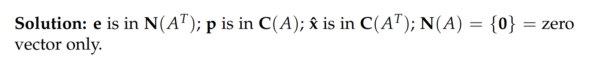

## P6: 最小二乘
> 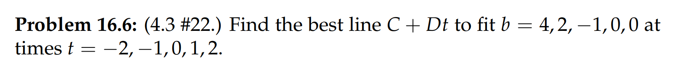

Key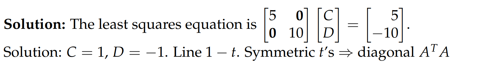
`Least Square Equation`就是$\bf A^TAx=A^Tb$,答案中对$\bf A^TA$进行了化简

## P7 最小二乘-Quadratic
> 找到通过原点的二阶方程，最佳拟合点$(1,1),(2,5),(-1,-2)$

**Key**我们写出拟合表达式: $y=at^2+bt$
然后给出线性方程组: $\bf \begin{bmatrix} 1&1\\4&2\\1&-1\end{bmatrix}x=\begin{bmatrix} 1\\5\\-2\end{bmatrix}$
最后利用最小二乘公式求解$\bf x=\begin{bmatrix} a\\b\end{bmatrix}$, 也就是$\bf \hat{x}=(A^TA)^{-1}A^Tb=\begin{bmatrix} \frac{11}{2}\\\frac{5}{2}\end{bmatrix}$
所以方程是$y=\frac{11}{2}t^2+\frac{5}{2}t$
