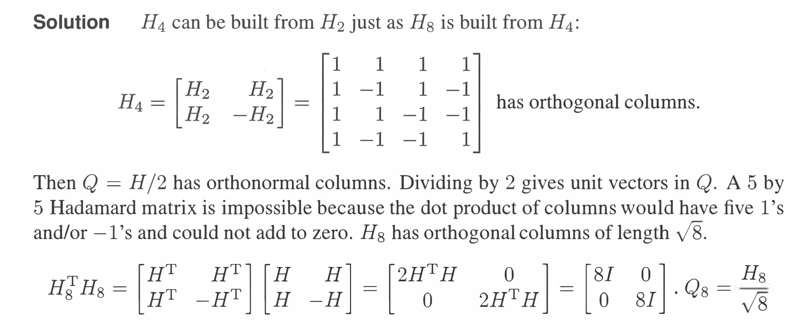

参考:[https://zhuanlan.zhihu.com/p/45869142](https://zhuanlan.zhihu.com/p/45869142)
# 1  正交(Orthogonality)
## 1.0 序言
> 本讲我们完成对“正交”的介绍。`Gram-Schmidt`过程可以将原空间的一组基转变为标准正交基。
> 满足如下条件的向量$\bf q_1，q_2……q_n$为标准正交：
> $\bf q_i^Tq_j=\begin{cases}0&i≠j\\1&i=j\end{cases}$
> **换而言之，它们都具有单位长度**$1$**，并且彼此正交**。标准正交向量是线性无关的。很多线性代数的计算都建立在标准正交基础上，它让一切变得简单可控。
> 


## 1.1 标准正交向量
> 


# 2 正交矩阵(Orthogonal Matrix)
## 2.1 标准正交列向量矩阵
> **如果矩阵**$\bf Q$**的列向量为标准正交向量**，则 $\bf Q^TQ=I$ 为单位阵。
> 
> **注意这里的矩阵**$\bf Q$**可以不是方阵**。我们已经学过了一系列矩阵，包括三角阵、对角阵、置换矩阵、对称矩阵、行最简梯形矩阵、投影矩阵等等，现在有了“标准正交”矩阵。
> 


## 2.2 正交矩阵**⭐⭐⭐⭐⭐**
### 2.2.1 定义**⭐⭐⭐⭐**
> 一个含有**标准正交列**的**方阵**我们称之为**“正交矩阵”（**`**orthogonal matrix**`**）**。**因为**$\bf Q^TQ=I$** ，所以**$\bf Q^T=Q^{−1}$** 。**
> **注意必须是方阵, 才有**$\bf Q^T=Q^{-1}$**成立(非方阵不存在逆矩阵这个概念)**
> 
> 如果$\bf Q$的列不是标准正交而只是正交的话(也就是长度不为$1$), 则$\bf Q^TQ$仍然可以得到一个对角矩阵$\bf D$
> **注意**: $\bf Q^TQ=I$对于任何有标准正交列的矩阵$\bf Q$都成立(包括非方阵)。 对于$\bf Q$为方阵的情况，$\bf QQ^T=I$也成立, 且$\bf Q^T=Q^{-1}$ 
> 
> **由这个定义，其实我们发现只要**$\bf Q$**是方阵，如果其行标准正交或者列标准正交，都可以成为**`**Orthogonal Matrix**`


### 2.2.2 示例
> 1. (**置换矩阵**)例如，置换矩阵 $\bf Q=\begin{bmatrix}0&0&1\\1&0&0 \\0&1&0 \end{bmatrix}$ ，则有 $\bf Q^T=\begin{bmatrix} 0&1&0\\0&0&1\\1&0&0 \end{bmatrix}$ ，两者皆为正交矩阵，并且两者乘积为单位阵。
> 
> 2. (**旋转性质**)再例如，$\bf  Q=\begin{bmatrix}cos(\theta)&-sin(\theta)\\sin(\theta)&cos(\theta) \end{bmatrix}$ 为正交矩阵。而矩阵 $\bf \begin{bmatrix}1&1\\1&-1\end{bmatrix}$ 并不是正交矩阵，而通过调整得到的矩阵 $\bf Q=\bf \frac{1}{\sqrt{2}}\begin{bmatrix}1&1\\1&-1\end{bmatrix}$ 为正交矩阵，在矩阵外面要除以向量的长度。
> 
> 3. 再给一个长方形矩阵的例子，其列向量为标准正交：
> 
$\bf Q=\frac{1}{3}\begin{bmatrix}1&-2\\2&-1\\2&2\end{bmatrix}$ ，我们可以拓展其成为正交矩阵$\frac{1}{3}\begin{bmatrix}1&-2&2\\2&-1&-2\\2&2&1\end{bmatrix}$ 。


### 2.2.3 阿达玛矩阵
> 再比如 $\bf Q=\frac{1}{2}\begin{bmatrix} 1&1&1&1\\1&-1&1&-1\\1&1&-1&-1\\1&-1&-1&1 \end{bmatrix}$ 也是由$-1$和$+1$组成的正交矩阵，这种类型的矩阵称之为**阿达玛**`**Hadamard**`**矩阵**，**不同阶数矩阵性质不同并且没有规律，无从判断几阶的阿达玛矩阵为正交阵。**
> 


## 2.3 正交矩阵的几何性质
### 2.3.1 旋转矩阵
#### 定义
> 
> 


#### 保长性
> 


### 2.3.2 置换矩阵
> 
> 


### 2.3.3 翻转矩阵
> 
> 
> 


## 2.4 标准正交列向量的优势
> 若$\bf Q$的列向量为标准正交向量，则投影到$\bf Q$的列空间的投影矩阵为：
> $\bf P=Q(Q^TQ)^{−1}Q^T$
> 因为 $\bf Q^TQ=I$ ，所以$\bf P=QQ^T$。这种情况会降低很多运算量。**如果**$\bf Q$**为方阵，则**$\bf P=I$**，因为**$\bf Q$**的列向量张成了整个空间，投影过程不会对向量有任何改变。**
> 很多复杂问题使用标准正交向量之后都变得简单。如果基为标准正交，则方程$\bf A^TA\hat{x}=A^Tb$ 的解变为$\bf \hat{x}=Q^Tb$ ，$\bf \hat{x}$ 的分量$\bf \hat{x}_i$就等于$\bf q_i^Tb$。


## 2.5 正交矩阵的优势
### 2.5.1 计算简化
> 由于正交矩阵的列向量长度为$1$,在大型矩阵计算的时候会更稳定。


### 2.5.2 投影和最小二乘
> **如果线性方程组的系数矩阵是正交矩阵，则最小二乘和投影矩阵都非常容易求得。**
> 
> 


## 2.6 正交矩阵投影
> 
> 
> 这个表达式相当于在一个直角坐标系中求$b$在各个坐标轴上的投影，得到的都是坐标。


## 2.7 在傅里叶中的运用
> 


### 求投影分量
> 如果有一组标准正交基$\bf q_1,q_2,...,q_n$，则任意向量可以写成$\bf v=x_1q_1+x_2q_2+...+x_nq_n$, 我们的目标要求每一个分量的值$\bf x_i$

> 因为当$i,j$不相等时有$q_i^Tq_j=0$, 所以$\bf q_i^Tv=x_1q_i^Tq_1+x_2q_i^Tq_2+...+x_iq_i^Tq_i+...+x_nq_i^Tq_n=x_iq_i^Tq_i=c_i$
> 我们得到分量公式: $\bf x_i=q_i^Tv$
> 因为$\bf v=\begin{bmatrix} q_1&q_2&q_3&...q_n\end{bmatrix} \begin{bmatrix} x_1\\x_2\\x_3\\\vdots\\x_n\end{bmatrix}$, 即$\bf v=Qx$, 因为$\bf Q$是正交矩阵，所以$\bf x=Q^{-1}v$, 且$\bf Q^{-1}=Q^T$, 可得到: $\bf x=Q^Tv$, 其中每一个分量就是我们刚刚得到的分量公式$\bf x_i=q_i^Tv$
> 这里给出了求分量的思路就是用空间的一组标准正交基去点乘目标向量，利用其标准正交的性质得到所求。


### 向量重构
> 
> 


### 练习
> 


# 3 施密特正交化**⭐⭐⭐⭐⭐**
## 3.1 `Gram-Schmidt`正交化做了什么
> 从两个线性无关的向量$\bf a$和$\bf b$开始，它们张成了一个空间，我们的目标是希望找到两个标准正交的向量$\bf q_1，q_2$能张成同样的空间。`Schmidt`给出的结论是如果我们有一组正交基$\bf A$和$\bf B$（_注意这个小节_$\bf A，B，C$_均为向量_），那么我们令它们除以自己的长度就得到标准正交基：
> $\bf q_1=\frac{A}{‖A‖} ,q_2=\frac{B}{‖B‖}$。


## 3.2 步骤
> `**Gram**`做了重要的工作，令$\bf A=a$，我们在$\bf a$和$\bf b$张成的空间中，取与$\bf A$正交的向量做成标准正交基，方法就是将$\bf b$投影到$\bf a$的方向，然后取$\bf B=b-p$（$\bf B$就是之前谈论过的误差$\bf e$的方向）。
> 
> 则有 $\bf B=b−\frac{A^Tb}{A^TA}A$
> 如果从等式两端左乘 $\bf A^T$, 可以得到$\bf A^TB=0$ 。
> 
> 1. 如果从三个线性无关的向量$\bf a、b和c$出发，则可以通过从$\bf c$中减去其在$\bf A和B$两个方向的投影来得到$\bf C$。 $\bf C=c−\frac{A^Tc}{A^TA}A−\frac{B^Tc}{B^TB}B$
> 
例如：$\bf a= \begin{bmatrix}1\\1\\1 \end{bmatrix}$, $\bf b=\begin{bmatrix}1\\0\\2 \end{bmatrix}$，则有$\bf A=a$，$\bf B= \begin{bmatrix}1\\0\\2 \end{bmatrix}−\frac{3}{3}\begin{bmatrix}1\\1\\1 \end{bmatrix}=\begin{bmatrix}0\\1\\-1 \end{bmatrix}$ ，验证计算得$\bf A^TB=0$ 。
> 然后标准化我们得到的正交向量
> 最后写出$\bf q_1，q_2$所组成的矩阵为：
> $\bf Q= \begin{bmatrix}q_1&q_2\end{bmatrix}=\begin{bmatrix}\frac{1}{\sqrt{3}}&0\\\frac{1}{\sqrt{3}}&-\frac{1}{\sqrt{2}}\\\frac{1}{\sqrt{3}}&\frac{1}{\sqrt{2}}\end{bmatrix}$
> 
> 2. $\bf Q$列向量的空间就是$\bf a$和$\bf b$张成的空间。因此矩阵$\bf Q$和矩阵$\bf A= \begin{bmatrix}1&1\\1&0\\1&2\end{bmatrix}$ 有相同的列空间。
> 
> 
> 3. **关于为什么**`**Gram-Schmidt**`**正交化后的向量就是原来向量张成的空间，我们参考如下博客:**
> 
资源: [如何理解施密特正交化](https://zhuanlan.zhihu.com/p/136627868)
> 本质就是因为: 假设现在$\bf a$和$\bf b$张成一个二维平面，我在取$\bf e=b-\frac{aa^T}{a^Ta}b$作为我们的与$\bf a$正交的向量的时候，我们注意到$\bf a,e$还是能够张成同一个二维平面的，也就是说$\bf a$和$\bf e$仍然是二维平面的基，只是他们有了更好的关系(正交的关系)。


# 4 QR分解
## 4.1 概述
> 在消元过程中，我们可以对矩阵进行分解得到$\bf A=LU$，**而在对**$\bf A$**做施密特正交化的过程也可以用矩阵运算的方式表示为**$\bf A=QR$**。此处**$\bf R$**为上三角阵**。
> 
> $\bf R$为上三角阵，则 $\bf a_1^Tq_2=0$ 。这是因为$\bf a_1$就是$\bf q_1$的方向，而$\bf q_1$和$\bf q_2$为标准正交向量，因此$\bf q_2$的方向与$\bf a_1$垂直，因此内积为$0$。$\bf R$_在_$\bf Q$右侧相当于对$\bf Q$做列操作，即$\bf A$的列向量是$\bf Q$列向量的线性组合，而$\bf Q$_为_$\bf A$列空间的一组标准正交基，则$\bf R$的元素实际上是$\bf A$的列向量基于$\bf Q$这组标准正交基的`Weighted Sum`_。_
> 采用矩阵的$\bf QR$分解来帮助求解$\bf Ax=b$的问题，最大的优势是提高了数值的稳定性。
> **有了矩阵的**$\bf QR$**分解，我们有**$\bf R=Q^{-1}A=Q^{T}A$


## 4.2 标准定义
> 


## 4.3 算例
> 


## 4.4 最小二乘
> 
> 
> 


## 4.5 Python 实现`QR`分解
**伪代码**
```python
import numpy as np

def gram_schmidt(A):
    """Gram-schmidt正交化"""
    Q=np.zeros_like(A)
    cnt = 0
    # 对A的每一列遍历
    for a in A.T:
        u = np.copy(a)
        for i in range(0, cnt):
            # u = u - (aa^T/a^Ta)*u - (bb^T/b^Tb)*u - ...
            u -= np.dot(np.dot(Q[:, i], a), Q[:, i]) # 减去待求向量在以求向量上的投影
        e = u / np.linalg.norm(u)  # 归一化
        Q[:, cnt] = e   # 放在Q矩阵中
        cnt += 1
    R = np.dot(Q.T, A)  # R=Q^(-1)A=Q^TA
    return (Q, R)
```

## 4.6 总结
> 


# 5 作业
## P1: 正交向量**⭐⭐**
> 

Key


## P2: 施密特正交化**⭐⭐⭐**
> 

**(a)**
**(b)**
令$\bf U=\begin{bmatrix} ——A——\\——B——\\——C—— \end{bmatrix}$, $\bf Ux=0$的零空间的基是$\bf d=\begin{bmatrix} 1\\1\\1\\1\end{bmatrix}$向量， 我们知道，矩阵$\bf U$的行空间和零空间正交，且都是$\bf R^4$的子空间（从向量的分量数判断空间维数，用向量的线性无关性判断子空间维数），由于$\bf Col(U)$和$\bf N(U)$是$\bf R^4$的两个正交的子空间，所以$\bf dimCol(U)+dim\bf N(U)=4$, 因为$\bf dim\bf N(U)=1$, 所以$\bf dim \bf Col(U)=3$, 于是$\bf \{A,B,C\}$可以作为垂直于$\bf d$的空间的基向量。

## P3: QR分解
> 

**Key**实际上我们在正交化的过程中，可以动态地对已经正交化完毕的向量除以其模长转化为标准正交向量，这样做的好处是，一个向量在标准正交向量$\bf q$(单位向量$\bf \hat{u}$也可以)上的投影公式就是$\bf b\cdot q$,可以简化计算。其实从本小节的开头我们就发现了正交向量的种种有用的性质，比如正交矩阵的性质$\bf Q^TQ=I$, $\bf det(Q)=\pm 1$等等。
**回到本题，我们采用常规方法进行正交化：**

**然后进行**$\bf QR$**分解**


## P4 Hadamard 矩阵
> 

**Key**
