> 之前学习了大量长方形矩阵的性质，现在我们集中讨论方阵的性质，行列式和特征值将我们的又一个重点，求行列式则与特征值息息相关。

# 1 行列式的定义
> 行列式(`Determinants`)是一个每个方阵都具有的数值，我们将矩阵$\bf A$的行列式记作 $\bf det(A)=|A|$ 。**它将尽可能多的矩阵信息压缩在这一个数里**。
> 例如，矩阵不可逆或称奇异与矩阵的行列式等于$0$等价，因此可以用行列式来判定矩阵是否可逆。

# 2 行列式的性质
> 直接给出$n$阶行列式的公式，则一下子代入了大量信息，并不利于接受这个概念，我们从行列式的三个性质开始讲起，这三个性质定义了行列式。
> 这里可以给出二阶行列式的表达式 $\left| \begin{array}{cc} a&b\\c&d\end{array} \right|$=$ad−bc$ 。我们可以用它来验证行列式的性质，也可以看到它本身是可以从行列式的性质推导出来的。

## 
## P1 单位矩阵的行列式的值
> $\bf det(I)=1$。 $\bf \left| \begin{array}{cc} 1&0\\0&1 \end{array} \right|=+1$

## P2 交换行列式的两行
> 如果交换行列式的两行，则行列式的数值会反号。从前两条可以推知置换矩阵的行列式是$+1$或者$-1$。 $\bf \left| \begin{array}{cc} 0&1\\1&0 \end{array} \right|$=$−1$
> **证明也很简单：**
> 假设原来的行列式是$\bf \left| \begin{array}{cc} a_1&a_2&a_3\\b_1&b_2&b_3\\c_1&c_2&c_3 \end{array} \right|$, 我们通过拉普拉斯行列式展开第一行，可以得到$\bf detA =\bf a_1 \left| \begin{array}{cc} b_2&b_3\\c_2&c_3 \end{array} \right|-a_2\bf \left| \begin{array}{cc} b_1&b_3\\c_1&c_3 \end{array} \right|+a_3\bf \left| \begin{array}{cc} b_1&b_2\\c_1&c_2 \end{array} \right|$
> 现在我们交换第一行和第二行, 行列式是$\bf \left| \begin{array}{cc} b_1&b_2&b_3\\a_1&a_2&a_3\\c_1&c_2&c_3 \end{array} \right|$, 我们通过拉普拉斯行列式展开第二行，可以得到$\bf detA'=\bf -a_1 \left| \begin{array}{cc} b_2&b_3\\c_2&c_3 \end{array} \right|+a_2\bf \left| \begin{array}{cc} b_1&b_3\\c_1&c_3 \end{array} \right|-a_3\bf \left| \begin{array}{cc} b_1&b_2\\c_1&c_2 \end{array} \right|$
> 对比可以发现$\bf detA=-detA'$。所以交换矩阵的任意两行之后，其行列式取相反数。

 
## P3 行列式加法和数乘
> **(a)**. 如果在矩阵的一行乘上$t$，则行列式的值就要乘上$t$。 $\bf \left| \begin{array}{cc} ta&tb\\c&d \end{array} \right|=\bf t \left| \begin{array}{cc} a&b\\c&d \end{array} \right|$
> **(b)**. 行列式是“矩阵的行”的线性函数。 $\bf \left| \begin{array}{cc} a+a'&b+b'\\c&d \end{array} \right|=\bf \left| \begin{array}{cc} a&b\\c&d \end{array} \right|+\bf \left| \begin{array}{cc} a'&b'\\c&d \end{array} \right|$ ,我们将其写得更加便于理解一些，也就是$\bf \left| \begin{array}{cc} \bf a^T+c^T\\\bf b^T\end{array} \right|=\bf \left| \begin{array}{cc} \bf a^T\\\bf b^T \end{array} \right|+\bf \left| \begin{array}{cc} \bf c^T\\\bf b^T \end{array} \right|$, 其中$\bf a^T,b^T,c^T$都是行向量
> **性质证明:    **
> 对于$\bf (a)$来说，我们仍然可以通过拉普拉斯行列式展开来证明
> 对于$\bf (b)$来说，我们也用拉普拉斯行列式展开来证明:
> $\bf \left| \begin{array}{cc} a+a'&b+b'\\c&d \end{array} \right|=(a+a')|d|-(b+b')|c|$
> $\bf \left| \begin{array}{cc} a&b\\c&d \end{array} \right|+\bf \left| \begin{array}{cc} a'&b'\\c&d \end{array} \right|=a|d|-b|c|+a'|d|-b'|c|$
> 对比上面两个结果，我们发现: $\bf \left| \begin{array}{cc} a+a'&b+b'\\c&d \end{array} \right|=\left| \begin{array}{cc} a&b\\c&d \end{array} \right|+\bf \left| \begin{array}{cc} a'&b'\\c&d \end{array} \right|$成立, 扩展到高维这个结论也同样成立
> 行列式本身是有显式的，但是直接给出显式真的无益于理解行列式，我觉得`**G.Strang**`这里做了一个类似公理化的办法来给出行列式，是一个比较高明的办法。如他所言，很少有人用公式进行行列式计算，计算机也是用消元的办法来求解的。窃以为把大量时间花在“逆序”这一概念上对学习线代帮助并不大。

## P4 行列式为零
> 如果矩阵的两行是完全相同的，则它的行列式为$0$。这可以从性质`**P2**`推导出来，因为交换这个相同的两行，行列式应该变号；但是新生成的矩阵跟原矩阵没有区别，因此行列式应该不变，所以有$\bf det=-det$，所以$\bf det$等于$0$。

## P5 矩阵消元不改变行列式的值
> 从矩阵的某行k减去另一行i的倍数，并不改变行列式的数值，我们以二阶为例：
> 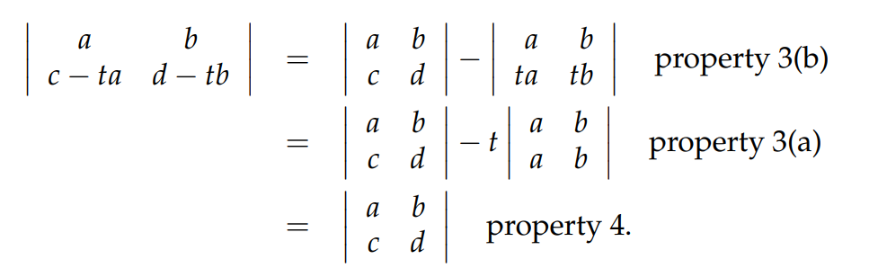

## P6 行列式某行为零
> 如矩阵$\bf A$的某一行都是$0$，则其行列式为$0$。可以应用性质`**P3(a)**`，取$t=0$证明。

## P7 行列式和对角线
> **这里补充一下对角阵的概念: **对角矩阵可以认为是矩阵中最简单的一种，值得一提的是：**对角线上的元素可以为**$0$** 或其他值**，**对角线上元素相等的对角矩阵称为数量矩阵**；对角线上元素全为$1$的对角矩阵称为单位矩阵。
> 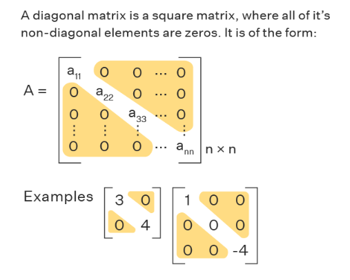
> **三角阵**的行列式的值等于其**对角线上数值（主元）的乘积**。
> 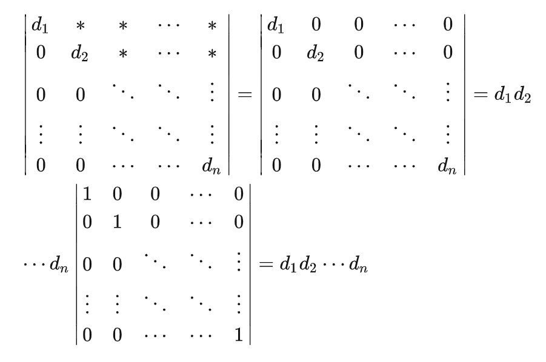
> 性质`**P5**`告诉我们三角阵通过行消元法得到对角阵的过程中，行列式的数值没有发生变化。性质`**P3(a)**`告诉我们对角阵的行列式等于其主元的乘积再乘以单位阵的行列式。而性质`**P1**`表明单位阵行列式为$1$。
> 注意如果$d_i$中有一个是零的话，行列式的值$\bf 0$。

## P8 奇异/非奇异矩阵行列式
> 当且仅当矩阵$\bf A$为奇异矩阵时，其行列式为$\bf 0$。
> - 如果矩阵$\bf A$为奇异阵，则必可通过消元法使得矩阵的某行全等于零，则按照性质`**P6**`，$\bf A$的行列式为$0$。
> - 如果其不是奇异阵，则通过消元可以得到一个上三角矩阵，且其主元均不为$0$，则按照性质$7$，行列式的数值等于主元的乘积也不等于$0$。
> 
计算**非奇异矩阵(可逆矩阵)**的行列式有确切的公式，但通常计算机是靠消元的方法来转化为三角阵，然后将主元相乘来进行计算的。
> 例如：二阶矩阵 $\bf \left| \begin{array}{cc}a&b\\c&d \end{array} \right|= \begin{bmatrix} a&b\\0&d-\frac{c}{a}b\end{bmatrix}$, 如果$a\neq 0$, $\left| \begin{array}{cc}a&b\\c&d \end{array} \right|=a(d-\frac{c}{a}b)=ad-bc$

## P9 行列式相乘
> $\bf det(AB)=det(A)det(B)$
> 尽管矩阵的和的行列式不等于行列式的和，但矩阵乘积的行列式等于矩阵行列式的乘积。
> 在课本中，`**G.Strang**`给了一个挺赞的证明，其主要思想就是证明$\bf det(AB)=det(A)det(B)$与矩阵$\bf A$的关系完全符合行列式的前三个性质，而因为前三个性质定义了行列式，因此$\bf det(AB)/det(B)$这就等于矩阵的行列式值，即$\bf det(AB)/det(B)= det(A)$。
> 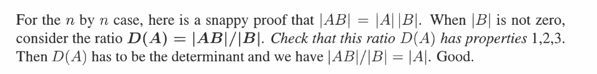
> **由上面的定理可以推出几个引理:**
> 1. 如果$\bf A$为可逆矩阵，则 $\bf A^{−1}A=I$，所以有 $\bf det(A^{−1})=\frac{1}{det(A)}$
> 2. $\bf det(A^2)=det(AA)=det(A)^2$
> 3. $\bf det(2A)=det(\begin{bmatrix}2&\cdots&0\\\vdots&\ddots&\vdots\\0&\cdots&2 \end{bmatrix})det(A)=2^ndet(A)$。

## P10 行列式的转置
> $\bf det(A^T)=det(A)$
> 对于二阶矩阵这显然成立:$\left| \begin{array}{cc}a&b\\c&d \end{array} \right|=\left| \begin{array}{cc}a&c\\b&d \end{array} \right|=ad-bc$
> **证明**： 矩阵消元可得$\bf A=LU$，则 $\bf A^T=U^TL^T$ ，由性质$9$可知$\bf det(A)=det(L)det(U)$，$\bf det(A^T)=det(L^T)det(U^T)$，根据性质`P7`可知$\bf det(L^T)=det(L)$，$\bf det(U^T)=det(U)$，则二者乘积相等。
> 因为性质`**P10**`成立，所以性质$2,3,4,5,6$可以用在**行列式的列**性质上。
> 行列式的性质`**P2**`中隐藏着一个内容，这就是置换隐藏着奇偶性，一个矩阵不可能经过奇数次置换得到和偶数次置换相同的方阵

# 3 练习
## P1 行加和等于零的矩阵⭐
> 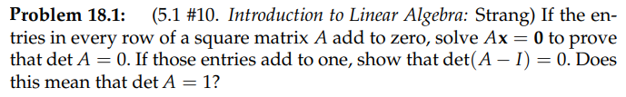

**Key**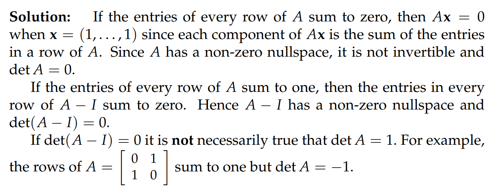
这种行加和等于$1$的矩阵就是我们后续将要提到的`Markov`矩阵

## P2 范德蒙德行列式⭐⭐
> 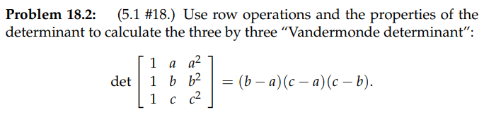

**Key**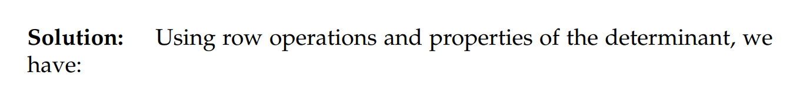

## P3 计算行列式的技巧⭐⭐⭐
> 找到下列行列式的行列式的值:
> $\bf A=\begin{bmatrix} 101&201&301\\102&202&302\\103&203&303\end{bmatrix}$, $\bf B=\begin{bmatrix} 1&a&a^2\\1&b&b^2\\1&c&c^2\end{bmatrix}$,$\bf C=\begin{bmatrix} 1\\2\\3\end{bmatrix}\begin{bmatrix} 1&-4&5\end{bmatrix}$, $\bf D=\begin{bmatrix} 0&1&3\\-1&0&4\\-3&-4&0\end{bmatrix}$

**(a) 消元**采用消元法, 发现有两行相同，所以行列式为零
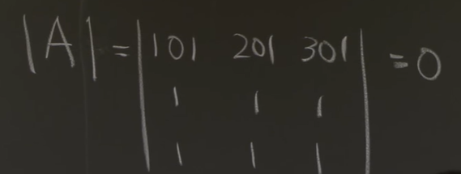
**(b) 范德蒙德行列式**和`P2`中的行列式一致: 得到$(b-a)(c-a)(a-b)$
**(c) 行相关矩阵**很明显是$0$
**(d) Skew-Symmetric Matrix**$\bf det(D)=det(D^T)=det(-D)=(-1)^3det(D)=-det(D)$
所以$\bf det(D)=0$

# 4 Problem Set
## 行列式的性质(P1~P12)
### P1&P2
> 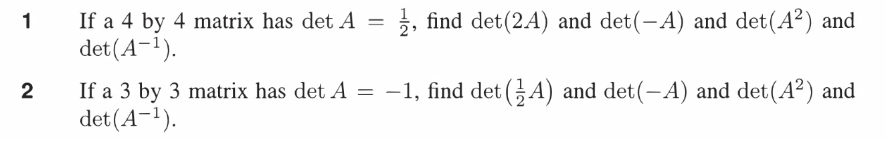

**Solution**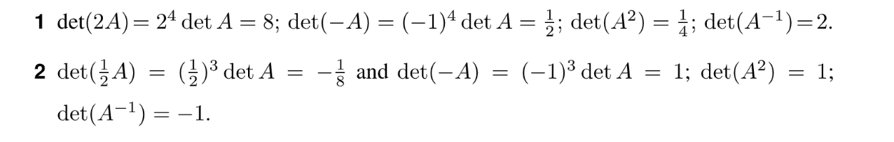

> 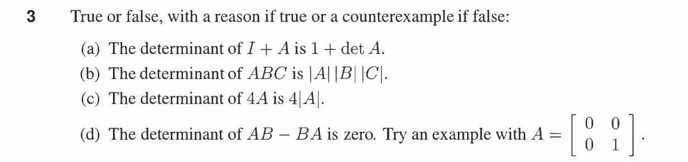

