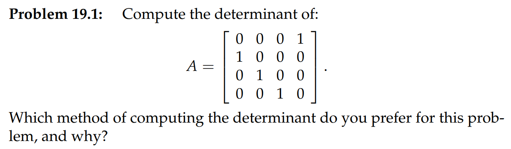

[Determinant Formulas.pdf](https://www.yuque.com/attachments/yuque/0/2022/pdf/12393765/1659961871157-6bfa15c9-6569-4d4f-9a14-7e33bc4a568e.pdf)
> 代数余子式的内容在`18.02SC`的`Unit 1 PartA 3`中有详细介绍和标准定义，包括各阶主子式的定义，这里给出简单梳理和性质的证明。

# 1 行列式的计算公式
## 1.1 行列式基本性质
> 

## 1.2 三阶行列式计算公式
> 
> 

# 2 高阶行列式计算公式**⭐⭐⭐**
## 2.1 Big Formula**⭐⭐⭐**
> 
> 这个公式在计算稀疏矩阵行列式的时候格外的好用

## 2.2 例子
> 

# 3 代数余子式
> 
> 

# 4 三角阵的递推式**⭐⭐**
> 举"三对角阵"（`**tridiagonal matrix**`）为例，它除了对角线和对角线两侧相邻的元素之外，其它元素均为$0$。例如由$1$组成的$4$阶三对角阵为$A_4=\begin{bmatrix} 1&1&0&0\\1&1&1&0\\0&1&1&1\\0&0&1&1\end{bmatrix}$
> **由**$1$**组成的**$\bf n$**阶三对角阵的行列式等于多少？**
> **我们可以从**$\bf 1$**阶算起，**$\bf |A_1|=1,|A_2|=\left| \begin{array}{cc}1&1\\1&1 \end{array}\right|=0,|A_3|=\left| \begin{array}{cc}1&1&0\\1&1&1\\0&1&1 \end{array}\right|=-1$**,**
> $\bf |A_4|=1\left| \begin{array}{cc}1&1&0\\1&1&1\\0&1&1 \end{array}\right|-1\left| \begin{array}{cc}1&1&0\\0&1&1\\0&1&1 \end{array}\right|=|A_3|-1|A_2|=-1$
> 从矩阵的特殊结构我们可以得到：$\bf |A_n|=|A_{n-1}|-1|A_{n-2}|$
> 由$\bf 1$组成的$\bf n$阶三对角阵的行列式从$\bf 1$阶开始按照$\bf 1,0，-1，-1,0,1$进行循环。

# 5 作业
## P1 计算行列式
> 

**Key**

## P2 Symmetric Pascal Matrix
> 

**Key**

## P3 Big Formula**⭐⭐**
> **计算下列矩阵的行列式:**
> $\bf A=\begin{bmatrix}x&y&0&0&0\\0&x&y&0&0\\0&0&x&y&0\\0&0&0&x&y\\y&0&0&0&x \end{bmatrix},B=\begin{bmatrix}x&y&y&y&y\\y&x&y&y&y\\y&y&x&y&y\\y&y&y&x&y\\y&y&y&y&x \end{bmatrix}$
> 提示: 可以使用以下方法的组合
> $(1)$ 消元 $(2)$ Big Formula $(3)$ 使用代数余子式

**(a)**
1. **使用消元比较繁琐，我们不使用这种方法。**
2. **使用**`**Big Formula**`

我们发现只有当系数组合为$(1,2,3,4,5)$和$(2,3,4,5,1)$时才是非零项，于是$\bf \det A=x^5+(-1)^4y^5=x^5+y^5$($(2,3,4,5,1)$要行交换四次才会有$(1,2,3,4,5)$)

3. **使用代数余子式**

最简单的方法，对最后一行进行拉普拉斯行展开，得到$\bf det A=x^5+y^5$
**(b)⭐⭐**我们使用消元最为简便:

