> 之前我们了解了行列式的公式和性质

# 1 逆矩阵的公式
参考: [https://zhuanlan.zhihu.com/p/45889796](https://zhuanlan.zhihu.com/p/45889796)
## 1.1 定义
> **这个逆矩阵的公式我们在**`**18.02SC**`**中**`**Unit 1 Part B**`**的第二部分中有介绍, 也给出了详细的定义**
> 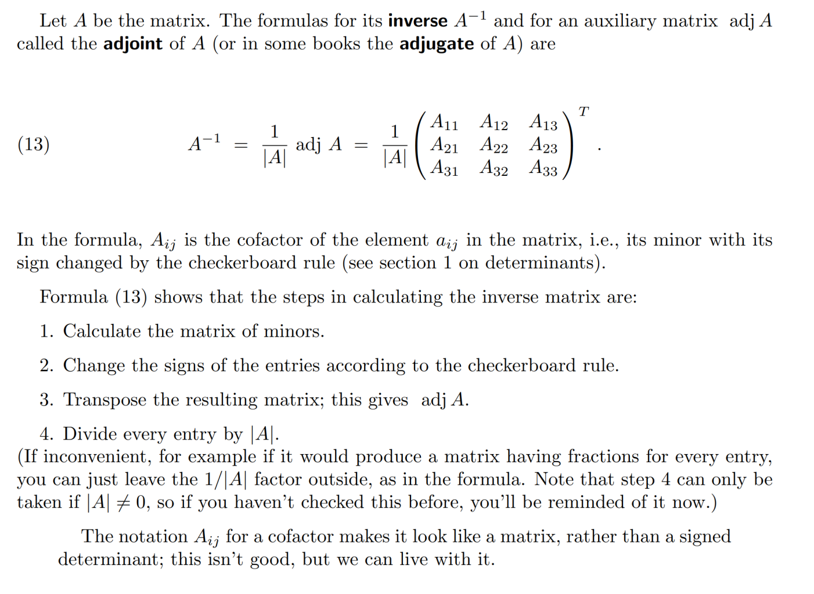
> 这是二阶矩阵的行列式公式:$\begin{bmatrix} a&b \\c&d  \end{bmatrix}=\frac{1}{ad-bc}\begin{bmatrix}d&-b\\-c&a\end{bmatrix}$
> **我们推广到高阶: **
> 通过观察二阶矩阵逆矩阵的公式，我们可以用同样的策略来构造高阶矩阵的求逆公式，为：
> $\bf A^{-1}=\frac{1}{det(A)}C^T$， 当且仅当$\bf det(A)\neq 0$, 如果$\bf det(A)=0$, 则$\bf A$不可逆，是奇异矩阵。
> 上面的等式中右侧的因子$\bf \frac{1}{det(A)}$，其分母是矩阵的行列式的值，而矩阵$\bf C$是“代数余子式矩阵”（`**cofactor matrix**`）$\bf C$的转置矩阵。即伴随矩阵（`**adjoint matrix**`）。

## 1.2 行列式中元素的乘积
### 性质
> 矩阵$\bf A$的行列式的计算中包含的都是$\bf n$个元素的乘积：
> $\bf detA=\sum_n \pm a_{1\alpha} a_{2\beta} a_{3\gamma}...a_{nw}$
> 而伴随矩阵中的元素都是$n-1$阶行列式，它的运算中出现的是$n-1$个矩阵$\bf A$中元素的乘积。所以矩阵$\bf A$与两者相乘才能完全消去，而得到单位矩阵。下面我们就用矩阵$\bf A$与矩阵 $\bf C^T$ 相乘来验证 $\bf AC^T=det(A)I$ ，并且理解逆矩阵的构造策略。

### 行展开
> **我们在**`**18.02SC**`**中没有对一个重要性质做证明**: 
> 如果我们按照第$i$行进行拉普拉斯展开，得到一系列关于第$i$行的代数余子式，将这些代数余子式排成一个向量$\bf \begin{bmatrix} C_{i1} \\C_{i2}\\ C_{i3}\\  \vdots \\C_{in}\end{bmatrix}$。
> 这时候如果我们用第$i$行去乘以这些代数余子式: 得到的就是$\bf \sum_{j=1}^na_{ij}C_{ij}=det(A)$
但是如果我们用第$k,k\neq i$行去乘以这些代数余子式: $\bf \sum_{j=1}^na_{kj}C_{ij}=det(A_s)$, 我们要证明$\bf det(A_s)=0$

### 行展开的证明[⭐⭐](https://www.yuque.com/alexman/tn6ya7/qqf91p#vauz2)⭐⭐[⭐](https://www.yuque.com/alexman/tn6ya7/qqf91p#vauz2)
> 1. **如果行展开的时候行向量点乘的是对应行的代数余子式: **
> 
$\bf AC^T=\begin{bmatrix} a_{11}&...&a_{1n}\\ \vdots &\ddots & \vdots \\ a_{n1} & \cdots &a_{nn}\end{bmatrix}\begin{bmatrix} C_{11}&...&C_{n1}\\ \vdots &\ddots & \vdots \\ C_{1n} & \cdots &C_{nn}\end{bmatrix}$
> 矩阵 $\bf AC^T$ 第一行第一列的元素等于矩阵$\bf A$第一行和矩阵 $\bf C^T$ 第一列进行点积，计算可得：$\bf \sum_{j}=a_{1j}C_{1j}=det(A)$
> 点积的算式本身就是矩阵$\bf A$的计算公式(拉普拉斯行展开)，因此结果为$\bf A$行列式的值。而矩阵$\bf AC^T$ 对角线上所有的元素都是如此，因此其对角戏上的元素都等于$\bf detA$。
> 
> 2. **如果行展开的时候行向量点乘的不是对应行的代数余子式: **
> 
其计算公式为：
> $\bf \sum_{j=1}^n=a_{2j}C_{1j}=det(A_s)$
> 这可以视为矩阵$\bf A_s$的行列式数值，各个代数余子式的形式不变，但是与代数余子式相乘的变为了矩阵$\bf A$第二行第$\bf j$列元素。**因此**$\bf A_s$**的形式相当于用矩阵**$\bf A$**第二行的元素替代第一行的元素得到的矩阵**。因为该矩阵中前两行完全相同，因此按照行列式性质`**P4**`，$\bf det(A_s)=0$（`**G.Strang**`在课堂上是用二阶矩阵为例）：
 $\bf \sum_{j=1}^{n} a_{2j}C_{1j}=\left|  \begin{array}{cccc} a_{21}&a_{22}&\cdots&\cdots&a_{2n} \\ a_{21}&a_{22}&\cdots&\cdots&a_{2n} \\
\\a_{31}&a_{32}&\ddots&&a_{3n}  \\  
\vdots&&&\ddots&\vdots\\
a_{n1}&a_{n2}&\cdots&\cdots &a_{nn} 
\end{array} \right|$
> 而$\bf AC^T$乘积矩阵中非对角线元素的计算均服从此规律，因此均为$\bf 0$。则：
> $\bf AC^T=\begin{bmatrix} detA &0&0&\cdots&0 \\  0 &detA&0&\cdots&0 \\ 0 &0&\ddots&&0 \\ \vdots&&&\ddots&\vdots\\0&0&\cdots&&det(A) \end{bmatrix}=det(A)I\cdots(1)$ 
> **如果**$\bf det(A)\neq 0$**, 则说明**$\bf A^{-1}$**存在，所以式**$(1)$**两边同乘以**$\bf A^{-1}$**, 得到:**
> $\bf A\frac{1}{det(A)}C^T=I$, 因此有$\bf A^{-1}=\frac{1}{det(A)}C^T$
> **如果**$\bf det(A)=0$**, 则**$\bf A^{-1}$**不存在，所以上述公式不适用。**
> 逆矩阵公式的一个好处就是，我们从中可以看到，当改变原矩阵中的一个元素时，给逆矩阵带来了怎样的变化。

# 2 方程组的解⭐⭐
## 2.1 Adjoint Matrix 视角
> 克拉默法则就是从我们`1.2`该出的`Adjoint Matrix`求逆的公式中推出来的:
> 对于可逆矩阵$\bf A$, 方程$\bf Ax=b$必然有解$\bf x=A^{-1}b$
> 结合我们刚刚推导出的$\bf A^{-1}=\frac{1}{det(A)}C^T$ ，我们有$\bf x= A^{-1}b=\frac{1}{det(A)}C^Tb$

## 2.2 克拉默法则视角
> 克莱姆法则是从另一个角度来看待`2.1`中的公式。**实际上**$\bf x$**的分量** $\bf x_j=\frac{det(B_j)}{det(A)}$
> 其中，矩阵$\bf B _j$为用向量$\bf b$替换矩阵$\bf A$的第$\bf j$列所得到的新矩阵。例如：
> 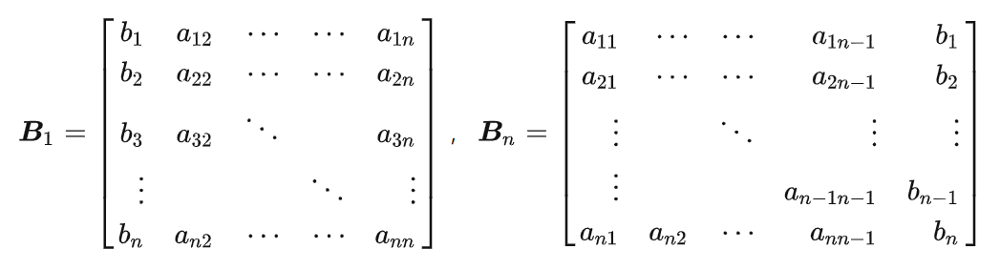
> 矩阵$\bf B_j$的行列式的数值从第$\bf j$列用代数余子式进行展开计算，正好是伴随矩阵$\bf C^T$的第$\bf j$行与向量$\bf b$点积的结果。此处我们用到了行列式的性质`**P10**`。
> 相比于消元法，采用克莱姆法则计算方程的解，效率较低。

# 3 箱体的体积
## 3.1 体积性质
> 1. **矩阵**$\bf A$**行列式的绝对值等于以矩阵**$\bf A$**行（列）向量为边所构成的平行六面体的体积。行列式的正负对应左手系和右手系。**
> 

> 2. **如果矩阵**$\bf A$**是单位矩阵，则其构成的是三个边长均为**$1$**且互相垂直的立方体，其体积为**$1$**，这与上面的结论相符。这也是行列式的性质**`**P1**`**。**
> 
而如果矩阵$\bf A$为正交矩阵$\bf Q$，则其构成的也是三个边边长为$1$且三边互相垂直的立方体，其体积也为$1$只是取向与单位阵不同。这也与上面的结论相符，因为 $\bf Q^TQ=I$ ，且 $\bf det(Q)=det(Q^T)$ ，所以$\bf detQ=1$。
> 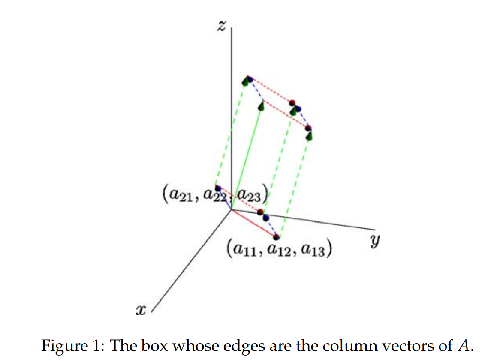

## 3.2 行列式和体积变换
### 3.2.1 交换行列式的行
> 交换矩阵$\bf A$中的行并不会改变其行列式的绝对值，显然也不会改变向量围成的体积，因此这也和体积理论相符。这是行列式的性质`**P2**`。

### 3.2.2 扩大行列式的某一行
> 对于长方体，也非常直观，当你将其中一条边的边长增加$2$倍时，平行六面体的体积也会增加$2$倍，这相当于性质$\bf 3(a)$。

### 3.2.3 行列式与平行四边形面积
> 对于性质$\bf 3(b)$，实际上是要求**体积理论摆脱角度的限制**（之前几条完全都是在直角的背景下讨论得）

#### 二维简单证明
> 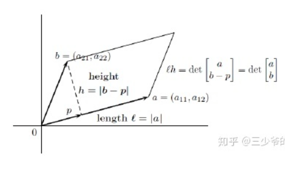
> 如图所示，$\bf a$和$\bf b$围成的平行四边形的面积，就等于$\bf a$和$\bf h$的长度之积，就等于两个互相垂直的向量$\bf a$和$\bf h$所围成的长方形的面积，按照前面所述即为$\bf \left| \begin{array}{cc}  a_1&a_2\\h_1&h_2\end{array}\right|$。(在`18.02SC`的`Part A`的`3.3`中有详细证明)
根据行列式运算法则有 $\bf \left| \begin{array}{cc}  a_1&a_2\\h_1&h_2\end{array}\right|=\bf \left| \begin{array}{cc}  a_1&a_2\\b_1&b_2\end{array}\right|-\bf \left| \begin{array}{cc}  a_1&a_2\\p_1&p_2\end{array}\right|$ ，而$\bf p$与$\bf a$同方向因此第二项为$0$，因此平行四边形的面积等于 $\bf \left| \begin{array}{cc}  a_1&a_2\\b_1&b_2\end{array}\right|$。结果可以推广到高维。

#### 高维证明
> 对于$\bf \left| \begin{array}{cc} a+a'&b+b'\\c&d \end{array} \right|=\bf \left| \begin{array}{cc} a&b\\c&d \end{array} \right|+\bf \left| \begin{array}{cc} a'&b'\\c&d \end{array} \right|$    
> 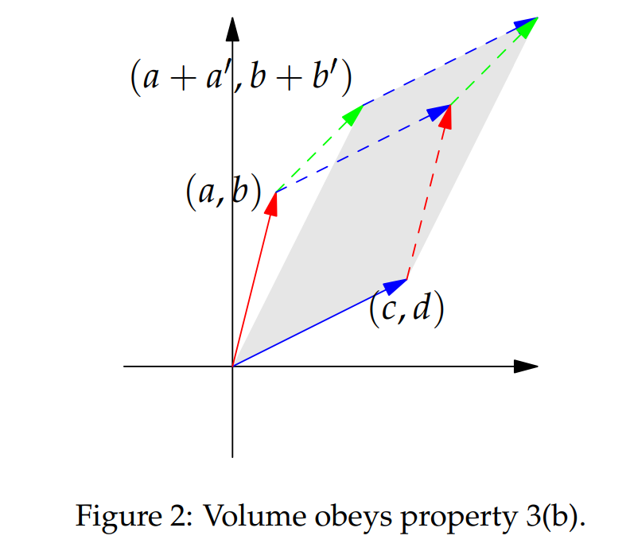
> 这个图简洁证明了上面的公式

### 3.2.4 三角形视角⭐[⭐](https://www.yuque.com/alexman/tn6ya7/qqf91p#vauz2)
> 阶行列式的值等于平行四边形的面积，同时其一半也是$\bf \{(a,b),(c,d),(0,0)\}$围成的三角形的面积。
> 若三角形不过原点，为$\bf \{(x1,y1),( x2,y2),( x3,y3)\}$围成，则其面积等于$\bf \frac{1}{2}\left| \begin{array}{cc}  x_1&y_1&1\\x_2&y_2&1\\x_3&y_3&1\end{array}\right|$
> 这个公式可以从第三列用代数余子式展开，所得结果可以看做是从一个过原点的大三角形中减去两个过原点的小三角形。
> 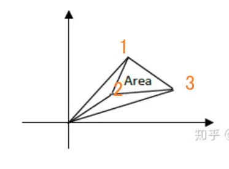
> 除以上各条之外，性质$4$也比较直观，当有两条边重合时，平行六面体或者平行四边形被压扁，体积或者面积为$0$。

### 3.3 重要信息⭐[⭐](https://www.yuque.com/alexman/tn6ya7/qqf91p#vauz2)
> 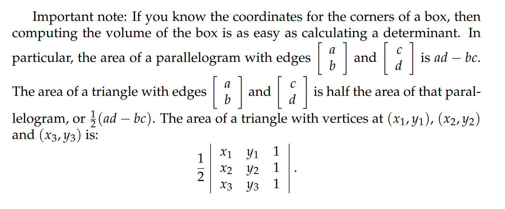

# 4 作业
## P1 计算逆矩阵⭐⭐
> 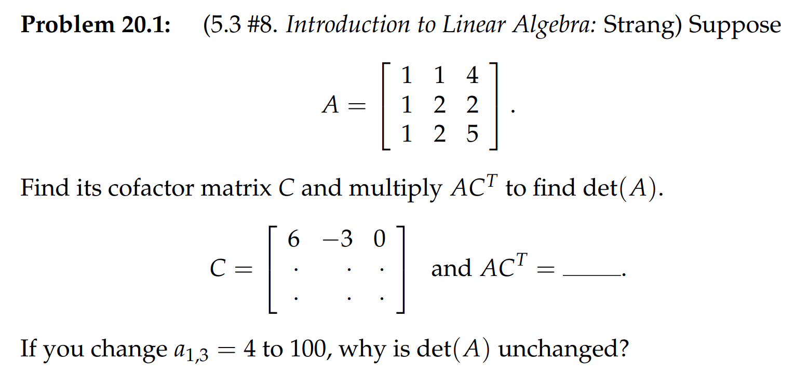

**Key**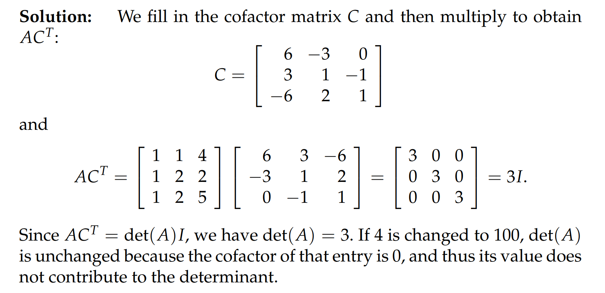

## P2 三重积分的雅各比矩阵⭐⭐
> 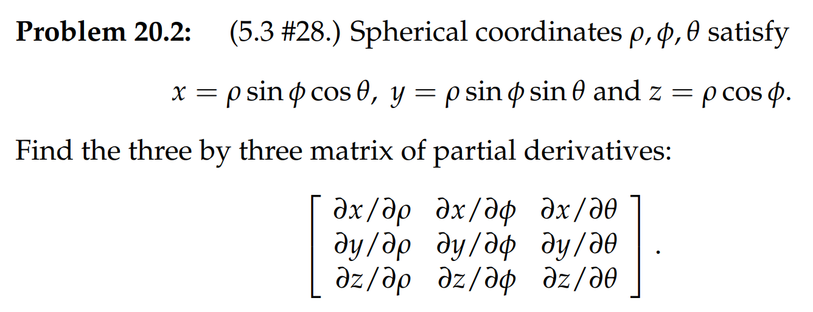
> 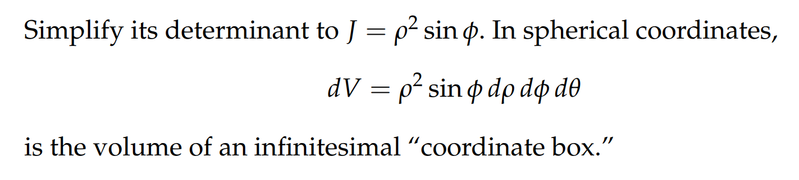

**Key**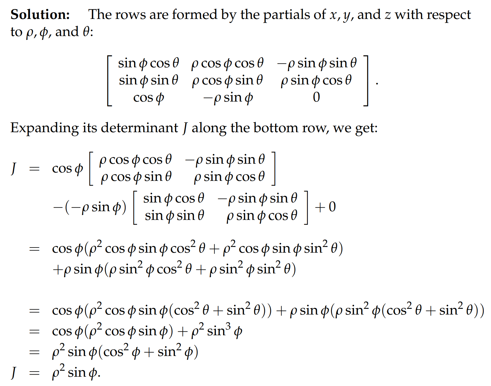

## P3 四面体的体积⭐⭐
> 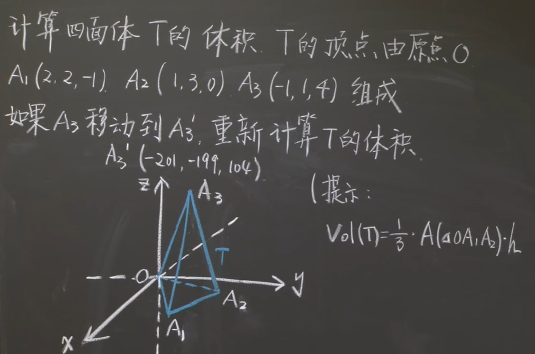

**(a)**运用在`18.02SC`中的[平行六面体的体积](https://www.yuque.com/alexman/tn6ya7/llx58u#Xs6tb)公式可得:
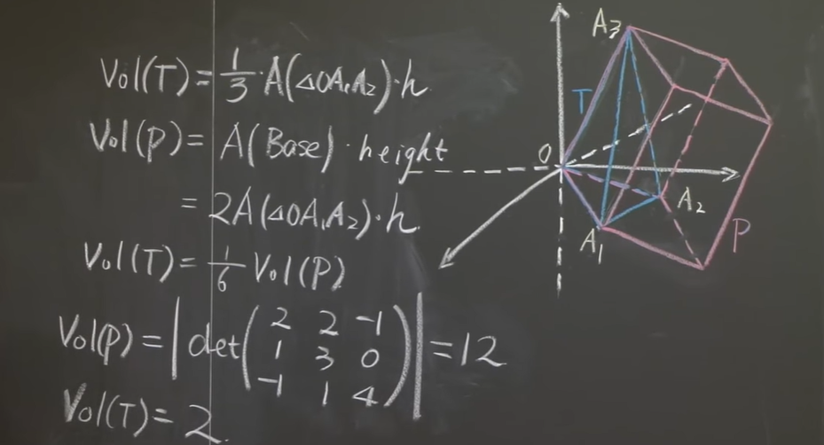
**(b)**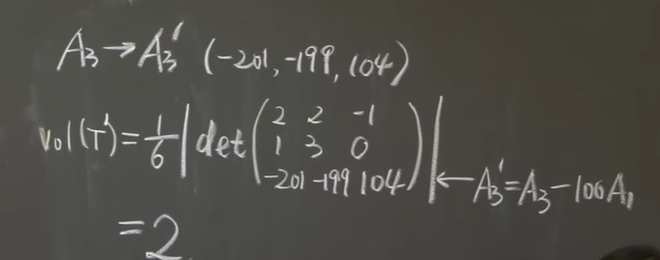
