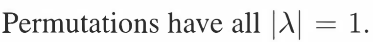

参考: [https://zhuanlan.zhihu.com/p/45912594](https://zhuanlan.zhihu.com/p/45912594)
> 本单元后面的课程主要围绕特征值和特征向量。在这个议题下讨论得都是方阵。
> - `Eigen-decomposition`要求被分解的矩阵一定是方阵
> - `SVD`没有这个要求
> 
**前情提要:**
> 

# 1 特征向量和特征值基础
## 1.1 定义
> 将矩阵$\bf A$与向量$\bf x$相乘当做是对向量的一种操作或者函数，输入$\bf x$而输出$\bf Ax$。特征向量即在特定的向量$\bf x$方向上输出的$\bf Ax$平行于$\bf x$，即为：$\bf Ax=λx$ 。
> 其中$\bf x$为矩阵$\bf A$的特征向量，而$\bf  λ$ 为$\bf A$的特征值。
> 如果$\bf 0$是矩阵的特征值，则有$\bf Ax=0x=0$。特征值$\bf 0$所对应的向量生成了矩阵的零空间。如果矩阵$\bf A$为不可逆矩阵，则$\bf 0$是其特征值之一。
> **这里要特别说明，特征向量是非零的; 只有非零的向量才有可能被称为特征向量**

## 1.2 投影矩阵的特征值**⭐⭐⭐⭐**
> 矩阵$\bf P$是朝向一个平面的投影矩阵: 
> - 对于这个平面之内的$\bf x$，均有$\bf Px=x$，因此$\bf x$是特征值$\bf 1$的特征向量。
> - 垂直于该平面的向量$\bf x$经投影得到$\bf Px=0$，这个$\bf x$是特征值$\bf 0$的特征向量
> - 矩阵$\bf P$的所有特征向量张成了整个空间(**但不对所有矩阵成立**)
> - **投影矩阵只有特征值**$1$**和**$0$
> 

## 1.3 对称矩阵的特征值
> 矩阵$\bf B=\begin{bmatrix} 0&1 \\ 1&0\end{bmatrix}$有特征值$\bf 1$, 对应的特征向量是$\bf x=\begin{bmatrix} 1\\1 \end{bmatrix}$和特征值$\bf -1$,对应的特征向量是$\bf x=\begin{bmatrix} 1\\-1 \end{bmatrix}$
> 这两个特征向量$\begin{bmatrix} 1\\1 \end{bmatrix}$和$\begin{bmatrix} 1\\-1 \end{bmatrix}$张成了一个二维向量空间，并且互相垂直。
> **对称矩阵不同特征值的特征向量相互垂直**

## 1.4 翻转矩阵的特征值 
> 

## 1.5 置换矩阵的特征值
> 置换矩阵的所有特征值的绝对值(实部)都是$1$
> 

## 1.6 矩阵的迹
> 一个$n\times n$的矩阵$\bf A$有$n$和特征值，并且他们的和是矩阵$\bf A$的对角线元素之和, 称为矩阵的迹: $\bf tr(A)$。 对于一个$2\times 2$的矩阵来说，如果我们知道了他的一个特征值，我们就能通过这个性质求出另外一个。

# 2 计算方阵特征值
## 2.1  求方阵的特征值
> 我们能否求解一个方阵的特征值呢? 方法很简单，分为两步:
> 1. 求解这个方程$\bf Ax=\lambda x$的特征向量$\bf x$, $\bf (A-\lambda I)x=0$, 由于特征向量是非零的，于是我们只要求$\bf A-\lambda I$的零空间的非零基向量就行了。
> 2. 为了让$\bf A-\lambda I$的零空间有非零基向量，$\bf A-\lambda I$一定不能满秩，所以$\bf det(A-\lambda I)=0$, 这个方程也被成为矩阵$\bf A$的特征方程, 可以类比`18.03SC`中的特征多项式的概念
> 3. 求解使得$\bf det(A-\lambda I)=0$成立的$\bf \lambda$
> 4. 将求得的$\bf \lambda$代入$\bf (A-\lambda I)x=0$中，求得每一个特征值$\bf \lambda$对应的特征向量

## 2.2 特征值的偏移**⭐⭐**
### 关于矩阵自己的偏移
:::info
假设原来的方程是$\bf Ax=\lambda x$, 关于矩阵自己的偏移可以写成$\bf p(A)x=p(\lambda)x$
:::
> 假设矩阵$\bf A=\begin{bmatrix} 3&1\\1&3\end{bmatrix}$
> 1. 求解$\bf det(A-\lambda I)=0$, $\bf \left| \begin{array}{cc}  3-\lambda & 1-\lambda \\ 1-\lambda & 3-\lambda   \end{array} \right|=0$, 所以我们有$\bf (3-\lambda)^2-1=\lambda^2-6\lambda+8=0$
> 2. 注意$\bf \lambda^2-6\lambda+8=0$中的系数$\bf 6$, 这就是**矩阵**$\bf A$**的迹（对角线元素的和）**； 同时我们注意系数$\bf 8$, 这是$\bf \det(A)=8$, 所以**特征值的乘积就是矩阵的行列式的值**
> 3. $\bf \lambda^2-trace(A) \cdot \lambda+det(A)=0$, 所以矩阵的特征值的和就是矩阵的迹，矩阵的特征值的乘积就是矩阵的行列式的值。

> 对于矩阵$\bf A=\begin{bmatrix} 3&1\\1&3\end{bmatrix}$， 其特征值是$\bf \lambda_1=4,\lambda_2=2$
> - 当特征值是$\bf \lambda_1=4$的时候，$\bf \begin{bmatrix} 3-4&1\\1&3-4 \end{bmatrix}=\bf \begin{bmatrix} -1&1\\1&-1 \end{bmatrix}$, 通过高斯消元得到$\bf \begin{bmatrix} 1&-1\\0&0 \end{bmatrix}x=0$, 由于有一列自由列，根据`1.8.4.3`中的快速求解方法，我们得到$x_1=\begin{bmatrix} 1\\1\end{bmatrix}$
> - 当特征值是$\bf \lambda_1=2$的时候，$\bf \begin{bmatrix} 3-2&1\\1&3-2 \end{bmatrix}=\bf \begin{bmatrix} 1&1\\1&1 \end{bmatrix}$, 通过高斯消元得到$\bf \begin{bmatrix} 1&1\\0&0 \end{bmatrix}x=0$, 由于有一列自由列，根据`1.8.4.3`中的快速求解方法，我们得到$x_1=\begin{bmatrix} -1\\1\end{bmatrix}$
> 
注意到这里$\bf A=\begin{bmatrix} 3&1\\1&3\end{bmatrix}$和$\bf B=\begin{bmatrix} 0&1 \\ 1&0\end{bmatrix}$的特征向量完全一致。**可知两者为一组平移矩阵**。在对角元素上分别加$\bf 3$，改变了特征值但是**没有改变特征向量**。 则有$\bf Ax=(B+3I)x=λx+3x=(λ+3)x$ 。所以$\bf B$的特征值加$3$就是$\bf A$的特征值。

### 矩阵加上矩阵
:::info
原来的方程是$\bf Ax=\lambda x$, 矩阵加矩阵的偏移可以写成$\bf p(A，B,...)x=(\lambda+\alpha+\beta)x$
:::
> **例如: 如果**$\bf Ax=\lambda x$**和**$\bf Bx=\alpha x$**, **$\bf (A+B)x=(\lambda +\alpha)x$**. **
> - **当**$\bf A$**和**$\bf B$**有相同特征向量的时候，特征值相同**
> - **两个矩阵的和的特征值不是两特征值直接相加之和，因为特征向量并不相同。**
> - $\bf AB$**的特征值不一定等于**$\bf \lambda(A)\lambda(B)$

## 2.3 特征值与特征向量的进阶
### 不同特征值对应的特征向量线性无关
:::info
一个矩阵里的两个特征向量是否相关，这仅仅取决于与它们两是否是“同向”，就是说，你是从一个特征方向上拿出来两个特征向量做比较，问它们是否相关呢？还是你从不同的特征方向上各取一个特征向量来做比较。
如果它们来自同一个特征方向，则它们一定是线性相关的，因为它们是同向的么。当然，它们对应的特征值也必定相同，因为每个特征方向都有自己唯一的一个特征值。
但是，在不同的特征方向上取来的特征向量当然是不相关的啦，可是不同特征方向上的特征值却可能是相同的。
所以，如果你要用特征值来区分两个向量是否相关，那在不同的特征值的情况下，一定无关(一个特征方向不可能有两个特征值)；而在特征值相同的情况下，可能无关(如果它们来自不同的特征方向)，也可能相关(如果它们来自相同的特征方向)。
:::

### 矩阵的迹等于特征值之和**⭐⭐⭐**
> 如上所述，将$\bf det(A−λI)=0$展开会得到$\bf λ$ 的$\bf n$阶多项式，多项式的解就是矩阵$\bf A$ 的特征值，根据多项式根与系数的关系，解之和即特征值之和等于$\bf  λ^{n−1}$ 的系数。而行列式展开式中只有对角线的积这一项包含$\bf λ^{n−1}$（其它项最高是$\bf n-2$ 次方），而其系数为矩阵$\bf A$ 对角线元素之和，即矩阵$\bf A$** **的迹，因此特征值之和与矩阵的迹相等。(参考韦达定理)
> **证明:**
[https://www.cnblogs.com/qizhou/p/12583084.html](https://www.cnblogs.com/qizhou/p/12583084.html)

### 矩阵的行列式等于特征值之积**⭐⭐**
> 矩阵的特征值满足$|A-\lambda I|=0$
> 而一个矩阵的特多项式就是通过$|A-\lambda I|=0$化简得来的， 形如$(\lambda_1-\lambda)(\lambda_2-\lambda)(\lambda_3-\lambda)\cdots(\lambda_n-\lambda)=0$, $\lambda_1,\lambda_2,\cdots\lambda_n$可以相等
> 通过使得$\lambda=0$, 我们有$|A-0I|=|A|=\lambda_1\lambda_2\lambda_3\cdots\lambda_n=0$,于是证毕。

### 对称矩阵的特征向量正交**⭐⭐**
> $\lambda_1$ 和 $\bf λ_2$ 是对称矩阵的两个不同的特征值，对应的特征向量分别为$\bf x_1$ 和$\bf x_2$。
> 则有$\bf Ax_1=λ_1x_1$ ，左乘$\bf x_2^T$得$\bf x_2^TAx_1=λ_1x_2^Tx_1$ 。
> 而又有 $\bf x_2^TAx_1=(A^Tx_2)^Tx_1=λ_2x_2^Tx_1$ 。因此有$\bf (λ_1−λ_2)x_2^Tx_1=0$，而两特征值不等，所以可得两特征向量正交。

# 3 复数特征值
> 对于一个旋转矩阵$\bf Q=\begin{bmatrix} 0&-1\\1&0\end{bmatrix}=\begin{bmatrix} cos(90^。)&-sin(90^。)\\sin(90^。)&cos(90^。)\end{bmatrix}$是一个$90$度旋转矩阵。从矩阵的迹和行列式的值可以得到$\lambda_1+\lambda_2=0，\lambda_1\lambda_2=1$。他的特征多项式是$\bf \lambda^2+1=0$, 所以$\bf \lambda =\pm i$
> **这里有几个性质: **
> 1. 如果一个矩阵有复数特征值$a+bi$则他的共轭复数$a-bi$也是矩阵的特征值。
> 2. 实数特征值让特征向量伸缩，虚数特征值让其旋转。
> 3. **对称矩阵永远有实数的特征值**，而反对称矩阵`antisymmetric matrices`$\bf A^T=-A$，具有纯虚数的特征值

:::info
**性质一**可以求根公式中得到
**性质二**在`18.03SC`中的`2.9.2`部分由详细介绍:

- 如果我们对一个复数$a+bi$乘上一个$i$, 就相当于把$a+bi$在复平面内**逆时针**旋转了$90$度
- 如果我们对一个复数$a+bi$除以一个$i$, 就相当于把$a+bi$在复平面内**顺时针**旋转了$90$度

**性质三的证明：**
对于一个实对称矩阵$\bf A$, 其特征值和特征向量满足$\bf Ax=\lambda x\cdots(1)$

1. $\bf (1)$两边同时取共轭: $\bf \overline{A}\overline{x}=\overline{\lambda}\overline{x}$, 因为$\bf A$是实矩阵，所以$\bf \overline{A}=A$
2. $\bf (1)$两边同时取转置: $\bf (A\overline{x})^T=(\overline{\lambda}\overline{x})^T$, 得到$\bf \overline{x}^TA^T=\overline{x}^T\overline{\lambda}^T\cdots(2)$
3. $\bf (2)$两边同乘以$\bf x$, 加上$\overline{\lambda}^T=\overline{\lambda}$得到: $\bf \overline{x}^TA^Tx=\overline{x}^T\overline{\lambda}x\cdots(3)$
4. $\bf (1)$两边同时乘以$\bf \overline{x}^T$, 得到: $\bf \overline{x}^TAx=\overline{x}^T\lambda x\cdots(4)$
5. 观察$(3)$和$(4)$, 因为$\bf A$是对称矩阵，所以$\bf A^T=A$, 所以$\bf \overline{x}^TA^Tx=\bf \overline{x}^TAx$, 因此$\bf \overline{x}^T\overline{\lambda}x=\overline{x}^T\lambda x\cdots(5)$
6. 观察$(5)$, 移动到等式左边，得到$\bf \overline{x}^Tx(\overline{\lambda}-\lambda )=0$
7. 假设$\bf x= \begin{bmatrix} a_1+b_1i \\a_2+b_2i\\\vdots\\a_n+b_ni\end{bmatrix}$, 则$\bf \overline{x}^T= \begin{bmatrix} a_1-b_1i &a_2-b_2i&\cdots&a_n-b_ni\end{bmatrix}$，于是我们有$\bf \overline{x}^Tx= \begin{bmatrix} a_1^2+b_1^2 \\a_2^2+b_2^2\\\vdots\\a_n^2+b_n^2\end{bmatrix}$因为$\bf x$是特征向量，所以$\bf x\neq 0$, 加上$a_i^2+b_i^2\geq 0$, 我们得到$a_i^2+b_i^2> 0$, 于是$\bf \overline{x}^Tx\neq 0$,于是$\overline{\lambda}-\lambda=0,\overline{\lambda}=\lambda, \lambda$是实数
:::

# 4 三角矩阵和重复特征值
> 
> 也就是说，形如$\begin{bmatrix} \lambda_1&*&*&*&*\\0&\lambda_2&*&*&*\\0&0&\lambda_3&*&*\\0&0&0&\lambda_4&*\\0&0&0&0&\lambda_5 \end{bmatrix}$的矩阵对角线上的元素就是其特征值
> 也就是说，我们渴望通过$det(A-\lambda I)=0$找到矩阵$A$的的特征值，但是如果找到的$\lambda$有重根的情况，我们希望最好是在$\lambda$是$k$阶重特征值的情况下仍然能够有$k$个线性无关的特征值，但事实往往不仅如此人意。假设$\lambda$的$k$重特征值，这时候$\lambda$对应的线性无关的特征向量的数量$n$可能是$0\leq n\leq k$

 

# 5 矩阵特征值性质总结
> 矩阵$\bf A$为实对称矩阵⇒$\bf A$可相似对角化⇔$\bf A$有$\bf n$个线性无关的特征向量
> 矩阵$\bf A$可相似对角化,$\bf λ$为$\bf A$的$k$重特征值⇔$\bf λ$对应有$\bf k$个线性无关的特征向量
> 若矩阵$\bf A$为$n$阶实对称矩阵,$\bf r(A)=k$,则$\bf λ=0$为$\bf A$的$\bf n−k$重特征值
> 若矩阵$\bf A$能相似对角化,$\bf r(A)=k$,则$\bf λ=0$为$\bf A$的$\bf n−k$重特征值
> 若矩阵$\bf A$能相似对角化, **矩阵**$\bf A$**所有不同的非零特征值的数量等于其秩(证明在**`**2.9**`**中给出)**

# 6 Problem Set
## Find Eigenvalues
> 

## P1 矩阵特征值**⭐⭐⭐⭐**
> 

**(a)**
**(b)**
**(c)**
**(d)**

1. **这里提到的如果**$\lambda$**是矩阵**$A_{n\times n}$**的特征值，那么**$\frac{1}{\lambda}$**就是矩阵**$A^{-1}$**的特征值，** **我们给出证明: **

对于任何一个特征值$\lambda$, 一定满足$\bf det(A-\lambda I)=0$, 两边同乘以$\bf det(A^{-1})$(如果$\bf A^{-1}$存在的话)，得到$det(A-\lambda I)det(A^{-1})\newline=det((A-\lambda I)A^{-1})=det(AA^{-1}-\lambda IA^{-1})\newline=det(I-\lambda A^{-1})=0$ 
关于这个式子$det(I-\lambda A^{-1})=0$, 我们两边同时乘以$\frac{1}{\lambda^n}$（因为如果只乘以$\frac{1}{\lambda}$的话，只是对行列式的某一行乘上了$\frac{1}{\lambda}$, 而要对整个行列式的所有行都缩小的话，必须乘上$\frac{1}{\lambda^n}$）, 最终得到：$det(\frac{1}{\lambda}I-A^{-1})=0$
我们换一种方式写表达式$det(A^{-1}-\frac{1}{\lambda}I)=0$，令$k=\frac{1}{\lambda}$, 我们有$det(A^{-1}-kI)=0$ 所以我们其实是在求$\bf A^{-1}$的特征值$k$, 也就是在求$\frac{1}{\lambda}$, 所以$\bf A^{-1}$的特征值是$\frac{1}{\lambda}$

2. **这里提到的**$\bf B^2+I$**的特征值和**$\bf B$**的特征值之间的联系，我们给出说明:**

我们本来要求$\bf B$的特征值$\bf \lambda$, 也就是要求$\bf Bx=\lambda x$的$\lambda$, 我们开始进行多项式偏移:

   - 首先两边同乘以$\bf B$, 得到$\bf B^2x=\lambda Bx=\lambda^2x$
   - 然后两边同时加上$\bf Ix$, 得到$\bf (B^2+I)x=(\lambda^2+I)x$, 由于特征向量没有改变，所以$\bf B^2+I$的特征值就是$\lambda^2+1$
3. **结合**`**1**`**中的推导，我们知道**$\bf (B^2+I)^{-1}$**的特征值就是**$\bf \frac{1}{\lambda^2+1}$** **
4. **这里也可以直接得出上面的结论**$p(A)x=p(\lambda)x$

## P2 求特征值
> 

**Key**

