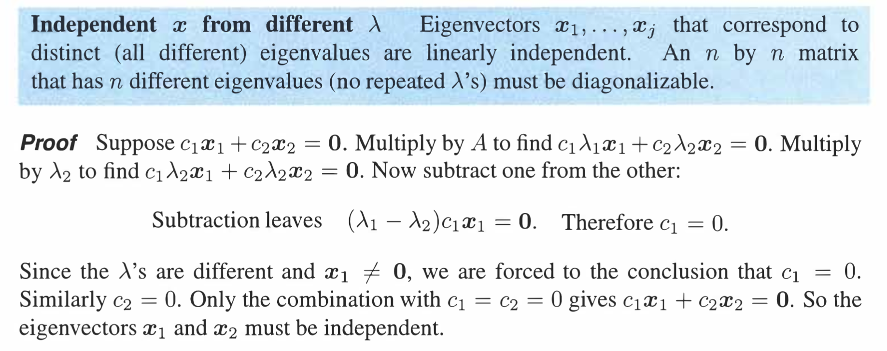

参考: [https://zhuanlan.zhihu.com/p/45916486](https://zhuanlan.zhihu.com/p/45916486)
:::info
本讲中我们学习如何对角化含有$n$个线性无关特征向量的矩阵，以及对角化是怎样简化计算的。
:::

# 1 对角化矩阵
## 1.1 基本性质
> 

## 1.2 对角化
:::info
`Diagonalizing a matrix`:
**如果矩阵**$\bf A$**具有**$n$**个线性无关的特征向量**$x_1,x_2,x_3,\cdots,x_n$**，**将它们作为列向量可以组成一个可逆方阵$\bf S$**_  _**，并且有：
$AS=A\begin{bmatrix}x_1&x_2&\cdots&x_n\end{bmatrix}=\begin{bmatrix} \lambda_1x_1&\lambda_2x_2&\cdots&\lambda_nx_n\end{bmatrix}\newline=\begin{bmatrix} x_1&x_2&\cdots&x_n\end{bmatrix}\begin{bmatrix}\lambda_1&0&\cdots&0\\0&\lambda_2&&0\\\vdots&&\ddots&\vdots\\0&\cdots&0&\lambda_n\end{bmatrix}\newline=\bf SΛ$
这里的矩阵$\bf Λ$为对角阵，它的非零元素就是矩阵$\bf A$的特征值。因为矩阵$\bf S$中的列向量线性无关，因此逆矩阵 $\bf S^{−1}$ 存在。在等式两侧左乘逆矩阵，得到$\bf S^{−1}AS=Λ$**_。_**同样地，$\bf A=SΛS^{−1}$_**。**_
对于消元法而言，矩阵有$\bf LU$分解，对于施密特正交法，矩阵有$\bf QR$分解，而上面的推导是一种新的矩阵分解。
之前曾经提到过消元进行行操作和列操作最后会得到“相抵标准型”。现在我们得到的是矩阵的“相似标准形”,它还保有矩阵操作的基本性质——特征值，而相抵标准型只剩下最内核的秩信息还保留着。
:::

## 1.3 特征值和可逆性
> **当所有特征值都不同的时候，矩阵才能够对角化**
> **能否对角化和矩阵是否可逆没有关系：**
> 1. **如果矩阵有零特征值，则矩阵不可逆，因为其零空间中有非零向量**
> 2. **如果**$n\times n$**矩阵有少于**$n$**和特征向量，则矩阵不能对角化**
> 

> 每个特征值都有至少一个特征向量，因为我们在求特征向量的时候就假定$det(A-\lambda I)=0$了。

##  1.4 特征向量的线性无关性
> 不同特征值对应的特征向量线性无关。
> 
> 
> 

## 1.5 重数与对角化(Optional)
### 1.5.1 定义
> 这里介绍了关于某个特征值$\lambda$的重数的概念:
> 1. **几何重数**: 某个特征值$\lambda$的 $\bf A-\lambda I=0$的零空间的维数
> 2. **代数重数**: 特征多项式中特征值$\lambda$所在因式的最高次数。
> 

### 1.5.2 算例
> 
> 

### 1.5.3 算例比较
> 

# 2 矩阵的幂
:::info
`**Powers of A**`: 特征值给矩阵的幂计算提供了简便方法。
如果 $\bf Ax=λx$ ，则有 $\bf A^2x=λAx=λ^2x$ 。说明矩阵 $\bf A^2$ 有着和$\bf A$一样的特征向量，而特征值为 $\bf λ^2$ 。
写成对角化形式则有：$\bf A^2=SΛS^{−1}SΛS^{−1}=SΛ^2S^{−1}$。做相同的处理还可以得到： $\bf A^k=SΛ^kS^{−1}$ 。这说明 $\bf A^k$ 有着和$\bf A$一样的特征向量，而特征值为 $\bf λ^k$ 。
如果矩阵$\bf A$具有$n$个线性无关的特征向量，如果所有的特征值均满足 $\bf |λ_i| <1$。则$\bf k\to∞$时， $\bf A^k \to 0$。
:::

# 3 重特征值 Repeated Eigenvalues
:::info
如果矩阵$\bf A$没有重特征值，则其一定具有$n$个线性无关的特征向量。
如果矩阵$\bf A$有重特征值，它有可能具有$n$个线性无关的特征向量，也可能没有。比如单位阵的特征值为重特征值$1$，但是其具有$n$个线性无关的特征向量。
对于$\bf A=\begin{bmatrix} 2&1\\0&2\end{bmatrix}$的三角矩阵，特征值就是$\lambda_1=2,\lambda_2=2$属于重复特征值。其特征向量在 $\bf A−λI$ 的零空间中，满足 $\bf (A−λI)x=\begin{bmatrix}0&1\\0&0\end{bmatrix}x=0$ 。求解可得$\bf x= \begin{bmatrix} 1\\0\end{bmatrix}$ ，而没有第二个特征向量。
:::

# 4 差分方程
## 4.1 定义
:::info
`Difference Equations`:
从给定的一个向量$\bf u_0$出发，我们可以通过对前一项乘以矩阵$\bf A$得到下一项的方式，得到一个向量序列：$\bf u_{k+1}=Au_k$。
$\bf u_{k+1}=Au_k$为一个一阶差分方程，$\bf u_k=A^ku_0$是方程的解。但这种简洁形式并没有给出足够的信息，我们需要通过特征向量和矩阵的幂运算给出真实解的结构。
**将**$\bf u_0$**写成特征向量的线性组合：**

- $\bf u_0=c_1x_1+c_2x_2+…+c_nx_n=S_c$
- $\bf Au_0=c_1λ_1x_1+c_2λ_2x_2+…+c_nλ_nx_n$
- $\bf u_k=A^ku_0=c_1λ_1^kx_1+c_2λ_2^kx_2+…+c_nλ_n^kx_n=Λ^kS_c$
:::

## 4.2 斐波那契数列
:::info
斐波那契数列为$0,1,1,2,3,4,8,13……$其通项公式为 $F_{k+2}=F_{k+1}+F_k$。求 $F_{100}$ ？
如果我们以矩阵的方式来理解数列，则矩阵的特征值可以告诉我们数列中数值的增长速度。
为了凑成矩阵形式，需要用一个比较巧妙的技巧。令 $\bf u_k=\begin{bmatrix} F_{k+1}\\F_{k}\end{bmatrix}$，则有：
$\bf F_{k+2}=F_{k+1}+F_k,F_{k+1}=F_{k+1}$ 写成矩阵形式为 $\bf u_{k+1}=\begin{bmatrix} 1&1\\1&0\end{bmatrix}u_k$
:::

## 4.3 斐波那契数列矩阵视角
:::info
观察矩阵$\bf A= \begin{bmatrix} 1&1\\1&0\end{bmatrix}$ 的特征值和特征向量，因为**其为对称矩阵，特征值为实数(**`**Unit 2.8.3**`**中已证明)**，且特征向量正交(**在**`**Unit 2.8.2.3**`**中已证明**)。
**下面我们开始求这个矩阵的特征值和特征向量: **

1. **求特征值**

$\bf det(A-\lambda I)=\left| \begin{array}{cc} 1-\lambda&1\\1&-\lambda \end{array}\right|=\lambda^2-\lambda-1=0$
我们解得: $\bf \lambda_1=\frac{1+\sqrt{5}}{2}\approx1.618,\lambda_2=\frac{1-\sqrt{5}}{2}\approx-0.618$
由于$\bf u_k=c_1\lambda_1^kx_1+c_2\lambda_2^kx_2$, 且$|\lambda_1|>1,0<|\lambda_2|<1$, 我们知道$\bf u_k$的`Long-term behaviors`将会由$c_1\lambda_1^kx_1$决定，因为$c_2\lambda_2^kx_2\to 0,k\to \infty$

2. **求特征向量**

将特征值$\bf \lambda_i$代入$\bf (A-\lambda_i I)x=0$, 我们有$\bf \begin{bmatrix} 1-\lambda_i&1 \\1&-\lambda_i\end{bmatrix}x=0$, 我们观察可知特征向量$x_1=\begin{bmatrix} \lambda_1\\1\end{bmatrix}$,$x_2=\begin{bmatrix} \lambda_2\\1\end{bmatrix}$。 此时我们可以近似$\bf F_k\approx c_1\lambda_1^k$

3. **写出首项，求得系数**

$u_0=\begin{bmatrix} F_1\\F_0 \end{bmatrix}=\begin{bmatrix} 1\\0 \end{bmatrix}=c_1x_1+c_2x_2$, 所以$\begin{cases} c_1\lambda_1+c_2\lambda_2=1\\ c_1+c_2=0\end{cases}$, 解得: $\begin{cases} c_1=\frac{1}{\sqrt{5}}\\ c_2=-\frac{1}{\sqrt{5}}\end{cases}$

4. **求出通项**

根据`4.1`中给出的公式: $u_k=\begin{bmatrix} F_{k+1}\\F_k \end{bmatrix}=c_1\lambda_1^kx_1+c_2\lambda_2^kx_2$
我们得到: $\bf F_k=\frac{1}{\sqrt{5}}(\frac{1+\sqrt{5}}{2})^k-\frac{1}{\sqrt{5}}(\frac{1-\sqrt{5}}{2})^k$
:::
> 至此，我们使用一个转移矩阵$\bf A=\begin{bmatrix} 1&1\\1&0 \end{bmatrix}$得到了斐波那契数列的某一项的通项公式
> 

# 5 相似矩阵
## 5.1 定义
> 我们知道，特征向量是可以任意选取的，比如乘以一个常数倍就可以得到一个新的特征向量，所以**如果一个矩阵可以对角化**，则$\bf A=X\Lambda X^{-1}$中的$\bf X$可以有无数种选择方法，而$\bf \Lambda$确是不变的，我们把这类有着相同的$\bf \Lambda$的矩阵称为相似形。
> 

> **如果一个矩阵不能对角化呢？**
> 我们仍然可以定义相似形。只是在对角化中的$\bf X$和$\bf \Lambda$不再代表特征向量和特征值, 而是一个任意的**可逆矩阵**$\bf B$和一个**常数矩阵**$\bf C$ (形如$\begin{bmatrix} k&0&0\\0&k&0\\0&0&k\end{bmatrix}$)
> 
> 

## 5.2 证明
> 

# 6 作业
## P1 对角矩阵
:::info

:::
**Key**

## P2 稳定向量**⭐⭐**
:::info

:::
**Key**
这里的稳定向量就是使得矩阵的长期行为区域收敛的列向量，也就是特征值为$1$的特征向量。

## P3 矩阵的幂**⭐⭐⭐**
> 

**(1)**得到特征多项式: $\lambda^2-(a+b)\lambda+ab=0$, 所以$\lambda_1=a,\lambda_2=b$
得到特征向量: $x_1=\begin{bmatrix} 1\\2\end{bmatrix}, x_2=\begin{bmatrix} 1\\1\end{bmatrix}$
所以根据[特征值分析](https://www.yuque.com/alexman/dydxis/owcord#KV7J5)中的论述，我们知道矩阵的特征值是`Complete Case`, 所以矩阵的对角化形式是$\bf C^k=SD^kS^{-1}$,其中$\bf S=\begin{bmatrix} 1&1\\2&1\end{bmatrix}$,$\bf S^{-1}=\begin{bmatrix}-1&1\\2&-1 \end{bmatrix}$
所以$C^k=\begin{bmatrix}2b^k-a^k&a^k-b^k\\2b^k-2a^k&2a^k-b^k \end{bmatrix}$
**(2)**代入$a=b=1,k=100$, 得到$C^{100}=\begin{bmatrix}1&0\\0&1\end{bmatrix}$
