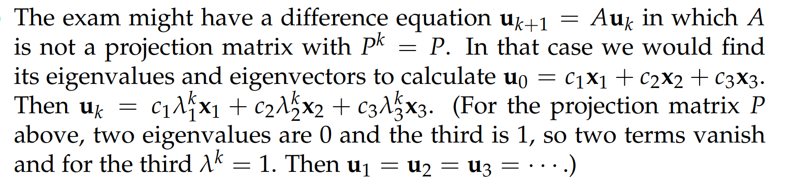
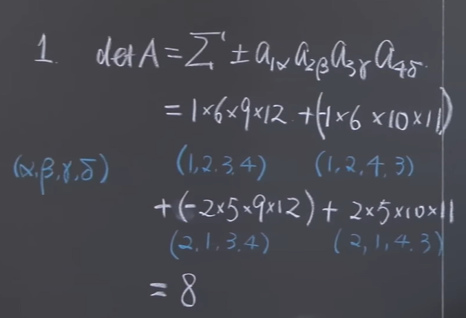
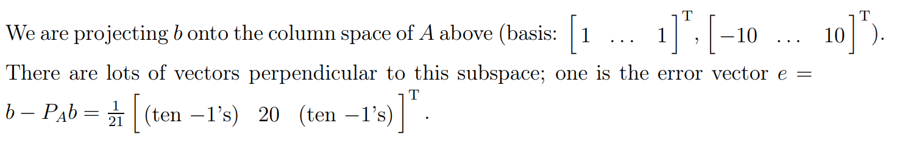

# 1 Exam 2 Review
[Exam 2 Review.pdf](https://www.yuque.com/attachments/yuque/0/2022/pdf/12393765/1659870018891-c52c4dd7-d3c7-4434-8597-95239b2e05d2.pdf)
## 1.1 Recap on chapter concepts
> 

## 1.2 Sample Questions
### P1 投影矩阵和特征值**⭐⭐**
> 

**(a) 向量的投影矩阵**
**(b) 矩阵的秩**
**(c) 矩阵的列空间**
**(d) 矩阵的特征值⭐⭐⭐**
**这个结论不够直觉，我们尝试进行一些定量分析: **

1. 我们发现$\bf P$的列向量互为倍数，所以$\bf P$的秩为$1$
2. 因为$\bf P$为方阵且不满秩，因此$\bf det(P)=0$， 所以特征值的积为$0$
3. 因为特征值的和等于$\bf tr(P)=\frac{1}{9}*(4+1+4)=1$
4. 假设矩阵$\bf P$的特征值为$\lambda_1,\lambda_2,\lambda_3$, 我们有$\begin{cases}\lambda_1+\lambda_2+\lambda_3=1\\\lambda_1*\lambda_2*\lambda_3=0 \end{cases}$
5. 我们从$(a)$问中知道$\bf P$是一个投影矩阵，根据[投影矩阵的性质](https://www.yuque.com/alexman/so5y8g/rg8xot#wmB7K)，我们知道$\lambda_1=1,\lambda_2=0,\lambda_3=0$
**(e) 特征向量**
参考[投影矩阵的性质](https://www.yuque.com/alexman/so5y8g/rg8xot#wmB7K)
**(f) 状态转移矩阵⭐**
参考[投影矩阵的性质](https://www.yuque.com/alexman/so5y8g/rg8xot#wmB7K)
**(g) 投影矩阵的长期行为**
一旦我们要分析一个矩阵的幂的线性变换的长期趋势，我们一般会采用特征值和特征向量将长期行为表示出来。这在[差分方程](https://www.yuque.com/alexman/so5y8g/tz3tpd#OJsXd)中有详细介绍。相同的方法在`18.03SC`的[求线性微分方程组的通解](https://www.yuque.com/alexman/dydxis/kn22hy#I20jA)中也有非常广泛的应用，本质也是通过分析矩阵的特征值来得出解的基本形式，在[分析线性微分方程组的通解参数曲线](https://www.yuque.com/alexman/dydxis/owcord#dpCae)中也使用了特征值分析

### P2 最小二乘**⭐**
> 

**(a) 最小二乘⭐**

**(b) 投影和最小二乘**

### P3 正交化
> 

**(a) 找到正交向量****Find two orthogonal vectors in the plane.**
参考[施密特正交化](https://www.yuque.com/alexman/so5y8g/xtfo06#YkeS6)步骤

### P4 特征值分析**⭐⭐**
> 

**(a) 可逆矩阵的特征值⭐⭐⭐**

另一种视角是从行列式出发，因为我们知道，一个矩阵的行列式的值等于其特征值的乘积，所以如果一个行列式的值是零的话，说明至少有一个特征值为零。换句话说，如果有一个特征值为零的话，矩阵的行列式为零，矩阵不可逆。
**(b) 逆矩阵的行列式⭐**
**这个答案不够令人信服，我们简单推导一下：**
对于矩阵$\bf A$, 其特征值满足$\bf Ax=\lambda x........(1)$, 因为$\bf A$可逆，假设为$\bf A^{-1}$
然后我们在$(1)$两侧同乘以$\bf A^{-1}$, $\bf A^{-1}Ax=\lambda A^{-1}x$, 所以$\bf x=\lambda A^{-1}x$
化简后我们得到$\bf A^{-1}x=\frac{1}{\lambda}x$, 由于整个变形化简过程我们的特征向量都没有发生变化，所以$\bf A^{-1}$的特征值是$\frac{1}{\lambda_i}$,也就有了上面的答案。
**

### P5 三角对角矩阵行列式**⭐⭐⭐⭐⭐**
> 

**(a) 行列式递归表达式⭐⭐**
**(b) 预测长期行为⭐⭐⭐⭐⭐**

**结论不显然，我们进行推导,  类比**[**差分方程**](https://www.yuque.com/alexman/so5y8g/tz3tpd#OJsXd)**中的通过递归求通项公式的方法，我们有:**
$\begin{bmatrix} D_{n+1}\\D_n \end{bmatrix}=\begin{bmatrix} 1&-1\\1&0\end{bmatrix}\begin{bmatrix} D_{n}\\D_{n-1} \end{bmatrix}$
令$u_{k+1}=\begin{bmatrix} D_{n+1}\\D_n \end{bmatrix},A=\begin{bmatrix} 1&-1\\1&0\end{bmatrix},u_{k}=\begin{bmatrix} D_{n}\\D_{n-1} \end{bmatrix}$
我们得到差分方程: $u_{k+1}=Au_k$
我们通常会令$u_{k}=c_1\lambda_1^kx_1+c_2\lambda_2^kx_2$, $u_0=c_1x_1+c_2x_2$(因为$\bf A$的特征值可以张成整个二维空间，包含所有的$u_i$向量)
我们对矩阵$\bf A$进行特征值分析，来探究$u_k$在$k\to\infty$时的行为。

1. $\bf det(A-\lambda I)=0$, 得到$\lambda^2-\lambda +1=0$, 所以$\lambda_{1,2}=\frac{1\pm\sqrt{3}i}{2}$
2. 使用[极坐标转换](https://www.yuque.com/alexman/dydxis/gpg6n4)(欧拉公式)， 得到$\lambda_1=e^{\frac{\pi}{3}i}, \lambda_2=e^{-\frac{\pi}{3}i}$
3. 使用[复数指数](https://www.yuque.com/alexman/dydxis/gpg6n4#iUxzr)相关概念，我们来思考$\lambda^k$的行为，我们有$\lambda_1^k=e^{\frac{\pi}{3}ki},\lambda_2^k=e^{-\frac{\pi}{3}ki}$, $e^{\frac{\pi}{3}i}$相当于我们在复平面内逆时针旋转了$60\degree$, $e^{\frac{\pi}{3}ki}$就相当于旋转了$k$次$60\degree$, 同时我们知道$|\lambda_1|=|\lambda_2|=1$, 这告诉我们$\lambda^k$在旋转的同时长度没有改变。如果我们将$\bf x_1$看成一个复数向量$\begin{bmatrix} a_1+b_1i\\a_2+b_2i\end{bmatrix}$的话，在乘上$\lambda_1^k$之后实际上$\bf |x_1|$是不变的，对$\lambda_2$的分析也类似，
4. 我们注意到$\lambda_1^k$带来的旋转是有周期性的，根据欧拉公式，我们知道$e^{\frac{\pi}{3}ki}=cos(\frac{\pi}{3}k)+isin(\frac{\pi}{3}k)$, 而$sin(x)$和$cos(x)$的周期都是$2\pi$, 我们很自然想到，当$k=6t,t=0,1,2,...$时，我们旋转了$2\pi$的整数倍。于是我们有$\lambda_1^k=\lambda_1^{k+6t},t=0,1,2...$, 对$\lambda_2^k$的分析类似，周期相同，只是旋转方向相反
5. 回到$u_{k}=c_1\lambda_1^kx_1+c_2\lambda_2^kx_2$，我们会发现$u_{k+6t}=u_{k},t=0,1,2...$, 于是$u_i$的分量$D_{n+6t}=D_n$
6. 总的来说，我们的$\bf det(A_n)$是周期震荡变化的，对应的数列$\bf D_n=det(A_n)$也是周期变化的，周期为$6t,t=0,1,2...$

### P6 对称矩阵**⭐⭐⭐**
> 

**(a) 不可逆矩阵的投影矩阵⭐⭐⭐**
由于$\bf A$不是列满秩的，由[A^TA的可逆性](https://www.yuque.com/alexman/so5y8g/kce24v#TI3gK)分析，我们知道$\bf A^TA$不是可以矩阵，自然没有办法直接使用投影矩阵公式，于是我们带搞清楚$\bf A$的列空间是几维的，搞清楚$\bf A$的列空间的基向量是什么，将这些基向量按列排成一个矩阵$\bf A'$, 然后求$\bf A'$的投影矩阵才是正确的结果，因为$\bf A'^TA'$一定是可逆的
**(b) 求解特征值**

**(c) 可逆对称矩阵的投影矩阵⭐⭐⭐**
对称矩阵有一个特别好的性质: 如果对称矩阵$\bf A$可逆，则其投影矩阵为$\bf P_A=I$
**证明:**
$\bf P_A=A(A^TA)^{-1}A^T=AA^{-1}(A^T)^{-1}A^T=I\cdot I=I$
**(d)**

### P7 行列式和代数余子式**⭐⭐**
> 假设$\bf A=\begin{bmatrix} 1&2&3&4\\5&6&7&8\\0&0&9&10\\0&0&11&12\end{bmatrix}$
> 1. 找出$\bf detA = \pm \sum a_{1\alpha}a_{2\beta}a_{3\gamma}a_{4\delta}$的非零项, 其中$\alpha,\beta,\gamma,\delta$互不相同, 并计算$\bf det A$
> 2. 计算$\bf A$的第一行的代数余子式$\bf C_{11},C_{12},C_{13},C_{14}$
> 3. 写出$\bf A^{-1}$的第一列
> 
第一问的公式出现在[稀疏矩阵行列式计算公式](https://www.yuque.com/alexman/so5y8g/ianu6d#Sht42)中

**(1) 行列式公式⭐⭐⭐⭐**
1. 先求第一部分:

我们知道，我们找出$\bf detA = \pm \sum a_{1\alpha}a_{2\beta}a_{3\gamma}a_{4\delta}$中的非零项，只能这样选取:
，一共四种可能$(a_{12},a_{21},a_{33},a_{44}),(a_{11},a_{22},a_{34},a_{43}),(a_{12},a_{21},a_{34},a_{43}),(a_{11},a_{22},a_{33},a_{44})$
所以我们有行列式的值为$8$(注意发生行兑换时要乘上$-1$)
**(2) 代数余子式⭐⭐**

**(3) 利用矩阵的逆的公式⭐⭐⭐⭐**

# 2 Exam 2
[Exam 2.pdf](https://www.yuque.com/attachments/yuque/0/2022/pdf/12393765/1659870018870-5a0c710f-a27c-42f9-bf1e-281f5cc68156.pdf)
[Exam 2 Solution.pdf](https://www.yuque.com/attachments/yuque/0/2022/pdf/12393765/1659870018880-45cfbee4-a3a5-4884-ba72-198f0a8b16ef.pdf)

## P1 正交矩阵的行列式**⭐⭐⭐**
> 

**(a)⭐**我们知道一个`Orthonormal Matrix`具有如下性质:
$\bf Q^TQ=I$
$\bf det(Q^T)=det(Q)$
所以$\bf det(Q^TQ)=det(Q^T)det(Q)=det(Q)^2=det(I)=1$
所以$\bf det(Q)=\pm 1$
**(b)⭐⭐⭐**我们有三种方法来解决这个问题:

1. **多次运用行列式的性质**[3(b)](https://www.yuque.com/alexman/so5y8g/nwr0wp#uGxh2)和性质[10](https://www.yuque.com/alexman/so5y8g/nwr0wp#hOxT7), 我们有$det\begin{bmatrix}q_1+q_2&q_2+q_3&q_1+q_3\end{bmatrix}\newline=det\begin{bmatrix}q_1&q_2+q_3&q_1+q_3\end{bmatrix}+det\begin{bmatrix}q_2&q_2+q_3&q_1+q_3\end{bmatrix}\newline=det\begin{bmatrix}q_1&q_2+q_3&q_1\end{bmatrix}+det\begin{bmatrix}q_1&q_2+q_3&q_3\end{bmatrix}+det\begin{bmatrix}q_2&q_2&q_1+q_3\end{bmatrix}+det\begin{bmatrix}q_2&q_3&q_1+q_3\end{bmatrix}\newline=det\begin{bmatrix}q_1&q_2+q_3&q_3\end{bmatrix}+det\begin{bmatrix}q_2&q_3&q_1+q_3\end{bmatrix}\newline=det\begin{bmatrix}q_1&q_2&q_3\end{bmatrix}+det\begin{bmatrix}q_2&q_3&q_1\end{bmatrix}$运用行列式性质[2](https://www.yuque.com/alexman/so5y8g/nwr0wp#DlCgp), 得到$det\begin{bmatrix}q_1&q_2&q_3\end{bmatrix}=det\begin{bmatrix}q_2&q_3&q_1\end{bmatrix}$(因为列交换了两次), 所以最终结果是$\pm 2$
2. **使用列消元(和方法3是同一种思想)**

3. **使用消元矩阵**

我们通过观察可知$\begin{bmatrix} q_1+q_2&q_2+q_3&q_1+q_3\end{bmatrix}=\begin{bmatrix} q_1&q_2&q_3\end{bmatrix}\begin{bmatrix} 1&0&1\\1&1&0\\0&1&1\end{bmatrix}$
所以$det\begin{bmatrix} q_1+q_2&q_2+q_3&q_1+q_3\end{bmatrix}=det\begin{bmatrix} q_1&q_2&q_3\end{bmatrix}det(\begin{bmatrix} 1&0&1\\1&1&0\\0&1&1\end{bmatrix})$
因为$det(\begin{bmatrix} 1&0&1\\1&1&0\\0&1&1\end{bmatrix})=2$, 所以答案为$\pm 2$
**(c)⭐⭐**答案非常简单，$\begin{bmatrix} q_2&q_3&q_1\end{bmatrix}$是$\begin{bmatrix} q_1&q_2&q_3\end{bmatrix}$经过两次列置换得到的，于是行列式的值不变，所以$det\begin{bmatrix} q_1&q_2&q_3\end{bmatrix}det\begin{bmatrix} q_2&q_3&q_1\end{bmatrix}=det(\begin{bmatrix} q_1&q_2&q_3\end{bmatrix})^2=+1$

## P2 最小二乘**⭐⭐⭐**
> 

**(a)**
**(b)**

## P3 正交化**⭐⭐**
> 

**(a)**
**(b)⭐⭐⭐⭐**
**这里蕴含了两个重要性质:**

1. **相同列空间的基向量形成的投影矩阵相同**
2. 一个$m\times n$的矩阵$\bf A$, $m>n$, 则$\bf AA^T$不可逆(不管$\bf A$是否列满秩)，原因就是[矩阵乘法行列视角](https://www.yuque.com/alexman/so5y8g/gkg1kx#rYK66)
**(c)⭐⭐⭐⭐**
按照正交化的步骤来确实需要$a_i$都是正交化过后的向量，所以$2$不对；$1$之所以不对，是因为这不是正交向量，而是投影向量
**关于**$2$**为什么不对，我们只能使用立体几何进行说明:**
如果$a_i$不互相垂直，那么投影到两个基向量的分量的线性组合不等于投影向量

如果$a_i$相互垂直，投影到分量上的向量就相当于$xy$坐标，其线性组合就等于投影向量

## P4 行列式性质**⭐**
> 

**(a)⭐⭐⭐**
**(b)**

