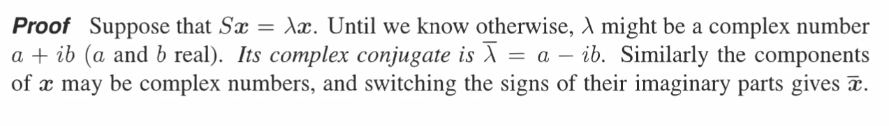
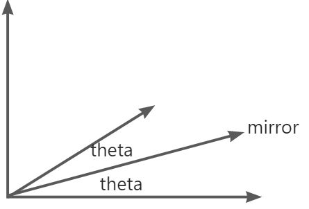
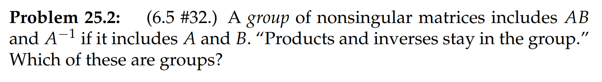

参考: [https://zhuanlan.zhihu.com/p/46023045](https://zhuanlan.zhihu.com/p/46023045)
> 进入第三单元学习，主题是正定矩阵及其应用。对称矩阵是最重要的矩阵之一，特征值为实数并且拥有一套正交特征向量。正定矩阵的性质则更好。
> **前情提要:**
> 

# 1 对称矩阵及其基本性质
## 1.1 定义
> 对称矩阵具有性质 $\bf A=A^T$ 。我们知道，对于包含特殊性质的矩阵，例如$\bf Markov$矩阵，其特征值和特征向量往往拥有一定特性。

## 1.2 基本性质**⭐⭐**
:::info
**对称矩阵的特征值为实数**，具有完全正交的特征向量。这里的“有”，是指可以选出一套完全正交的特征向量（例如在重特征值条件下，可能存在一个平面内向量都可以作为特征向量）。
如果$\bf A$具有$n$个线性无关的特征向量，可以对角化得到 $\bf A=SΛS^{−1}$ 。而对于对称矩阵，$\bf A=QΛQ^{−1}=QΛQ^T$ ，其中$\bf Q$为正交矩阵，列向量为标准正交基，**这个公式本身还显示了矩阵的对称性(读者可以自行验证)**。
**引用书中的定义:**

:::

## 1.3 证明实数特征值
> **对称矩阵有实特征值**，这是一个非常重要的性质，在[对称矩阵的特征值为实数的证明](https://www.yuque.com/alexman/so5y8g/rg8xot)中有详细推导。
> **引用书中的证明：**
> 
> 

## 1.4 对称矩阵的四个基本空间
> **书中给出了一个例子，说明了对称矩阵的行列空间相同**
> 
> 求这个矩阵的特征值和特征向量，我们发现$\lambda_1=0,\lambda_2=5$, 于是对应的特征向量$\bf x_1=\begin{bmatrix}2\\-1\end{bmatrix}$在矩阵$\bf S$的零空间中，$\bf x_2=\begin{bmatrix}1\\2\end{bmatrix}$在矩阵$\bf S$的列空间中, 我们发现零空间和列空间垂直，但是根据我们的四个基本空间的关系，零空间应该是和行空间垂直的，原因就是其对称性，所以**对称矩阵的行空间和列空间相同**
> 

## 1.5 对称矩阵的特征向量
> **不同特征向量对应的特征值互相垂直**
> **代数视角:**
> 
> 
> **正交空间视角(以具有**$0$**特征值的矩阵为例)**
> 假设$\bf Ax=0x, Az=\lambda z$, $0,\lambda\neq 0$是矩阵的两个特征值(因此矩阵不可逆)
> - 于是$z$在$\bf A$的列空间中, 因为对称矩阵行空间列空间相同，所以$z$在$\bf A$的行空间中，
> - 因为$x$在$\bf A$的零空间中，且因为$\bf A$的行空间与零空间正交，所以$x^Tz=0$
> - 即不同特征值的特征向量正交。

## 1.6 对称矩阵一定可以对角化
> 

> **证明:**
> 

# 2 谱分解**⭐⭐⭐⭐**
## 2.1 谱分解定理
> 对于一个对称矩阵$\bf A=A^T$, 我们有$A=Q\Lambda Q^{-1}=Q\Lambda Q^T=\begin{bmatrix} q_1&q_2\cdots q_n\end{bmatrix}\begin{bmatrix} \lambda_1&&&&\\&\lambda_2&&&\\&&\ddots\\&&&\lambda_n\end{bmatrix}\begin{bmatrix} q_1^T\\q_2^T\\q_3^T\\\vdots \\q_n^T\end{bmatrix}\newline=\lambda_1q_1q_1^T+\lambda_2q_2q_2^T+\cdots+\lambda_nq_nq_n^T$
> 我们知道$\bf q_1q_1^T$是投影到向量$\bf q_1$的投影矩阵($\bf P= \frac{q_1q_1^T}{q_1^Tq_1}$,$\bf q_1^Tq_1=1$), 所以**任何一个对称矩阵都是一系列正交向量的投影矩阵的线性组合**
> **矩阵能够进行这种分解，在数学上称为“谱定理”（spectral theorem），将特征值视为“谱”，而在物理上称之为“主轴定理”。**
> 
> $(7)$成立的原因是：$q_i$互相正交，所以投影矩阵只有投影自己才会有结果，其他的投影结果都是$\bf 0$向量。

## 2.2 谱分解定理的几何解释**⭐⭐**
> 

# 3 复数特征值
> 在`18.03SC`的[复数特征值](https://www.yuque.com/alexman/dydxis/kn22hy#w3orV)中我们已经介绍过复数特征值在微分方程组中的应用
> 这里我们给出线性代数视角的解释

## 3.1 共轭特征分析**⭐⭐**
> 如果我们知道矩阵$\bf A$有一个特征值是$a+ib$和复数特征向量$\bf x$, 则一定存在一个共轭特征值$a-bi$和对应的共轭特征向量$\bf \bar{x}$
> 

### 3.1.1 算例**⭐⭐⭐⭐**
> 

## 3.2 特征值与主元的联系**⭐⭐⭐⭐⭐**
> 
> 主元是我们通过高斯消元(行倍乘之后加到另外一行的操作，不包括行交换和行自身的化简)得到的非零项

:::info
当**确认矩阵特征值为实数后**，下一个要考虑的问题就是**它是正还是负数**，因为这**影响着微分方程中体系的稳定与否**。但是对于大型矩阵通过计算$|A−λI|=0$ 得到特征值进行判定难以实现，即使用`MATLAB`求解结果也不一定可靠，**但**`**MATLAB**`**可以得到矩阵的主元**，**而对称阵的主元正负性与特征值的正负性相同，且正主元的数目等于正特征值的数目。**
:::
> 对于**对称矩阵**来说，一定有$n$个不同的线性无关的特征向量, 且
> - **主元的符号和特征值的符号相同**
> - **正的特征值的数量和正的主元的数量相同**
> - **当且仅当所有的主元为正时，对称矩阵的所有特征值都大于零。**
> 

### 3.2.1 算例
> 

### 3.2.2 证明特征值和主元的联系**⭐⭐**
:::info
**证明:**
**第一种论证是用合同矩阵的惯性定理加以证明。**
若存在可逆矩阵$\bf C$** **满足$\bf A=CBC^T$ ，就称$\bf A$** **与$\bf B$** **为合同矩阵。
**惯性定理是指矩阵的特征值符号经过合同变换后不发生变化**。对称阵$\bf A$**_ _**经过消元操作可得$\bf A=LDL^T$ ($\bf D$为主元值的对角阵)，而经过对角化处理得到$\bf A=QΛQ^T$ ，两者比较可知$\bf D=(L^{−1}Q)Λ(L^{−1}Q)^T$ ，因此两个对角阵为合同矩阵，主元和特征值的符号匹配。
:::
> **书上的证明更加直观: **
> 
> 

# 4 正定矩阵**⭐⭐⭐⭐⭐**
## 4.0 序言
> 本小节主要探究特征值为正的对称矩阵。如果说对称性让矩阵变得重要，那么正定性(所有特征值均为正)会让其更特殊。我们称特征值全部为正的对称矩阵为正定矩阵。
> 如果我们想要识别正定矩阵，其中一种方式就是求出他的所有特征值，然后挨个看看是不是都大于零，这样的做法很浪费时间有没有实际意义。所以本小节我们有两个目标:
> 1. 找到快速确定矩阵正定性的充要条件
> 2. 探寻正定矩阵的用途。
> 
正定矩阵是对称矩阵的特殊情况，描述了所有特征值均大于零的对称矩阵，所以他们的联系非常紧密。
> **前情提要:**
> 

## 4.1 Energy-based 定义
> 
> 
> $2\times 2$正定矩阵描述了一个`Quadratic Function`的表达式
> 对于一个正定矩阵$\bf S$, 我们写出特征表达式$\bf Sx=\lambda x$, 得到$\bf x^TSx=x^T\lambda x=\lambda||x||^2\geq 0$, 因为**正定矩阵的所有特征值为正,** 所以对于非零向量$\bf x$, $\bf x^TSx>0$

## 4.2 性质**⭐⭐⭐⭐**
### 4.2.0 特征值均大于零**⭐⭐⭐⭐⭐**
> **正定矩阵最重要的一个性质就是所有的特征值大于零**，由这个性质可以延伸出去很多其他性质，比如可逆性，主元非负性等，我们在这里给出证明:
> 对于一个正定矩阵$\bf S$, 它的二次型为: $\bf x^TSx$, 由于$\bf S$一定是对称矩阵，所以它可以正交对角化, 我们令$\bf S=Q\Lambda Q^T$, 令$\bf y=Q^Tx$, 所以$\bf x^TSx=y^T\Lambda y$,$\bf \Lambda$为对角矩阵。
> **根据正定矩阵的**`**Energy-based**`**定义**，$\bf y^T\Lambda y>0, \forall x\neq 0$, 我们将$\bf y^T\Lambda y$展开，得到$\bf y^T\Lambda y=y_1\Lambda_{(1,1)}y_1+y_2\Lambda_{(1,1)}y_2+\cdots+y_n\Lambda_{(n,n)}y_n$, 由于$\bf \Lambda_{(i,i)}$是一个常数, 所以:$\bf y^T\Lambda y=\sum_{i=1}^n\Lambda_{(i,i)}y_i^2$, 因为对于任意的$\bf x\neq 0$, $\bf y= Q^Tx\neq 0$($\bf Q$为标准正交**方阵, **所以$\bf Q^Tx$不改变其长度)，所以要使$\bf y^T\Lambda y=\sum_{i=1}^n\Lambda_{(i,i)}y_i^2$对任意$\bf y\neq 0$恒成立，必须有$\bf \Lambda_{(i,i)}=\lambda_i>0$恒成立。证毕

### 4.2.1 对称矩阵的和
> 

### 4.2.2 A^TA
> 如果$\bf A$的列线性无关($\bf A$可以是长方形矩阵), 则$\bf A^TA$是**正定矩阵**。
> **证明:**
> 我们要证明的是对于所有非零向量$\bf x$,$\bf x^TA^TAx>0$
> 因为$\bf x^TA^TAx=(Ax)^T(Ax)=||Ax||^2$, 由于我们的$\bf A$各列线性无关，所以$\bf Ax\neq0,\forall x\neq 0$, 最终我们有$\bf  x^TA^TAx=||Ax||^2 > 0,\forall x\neq 0$

### 4.2.3 对称矩阵与正定矩阵
> **一个对称矩阵称为正定矩阵只需要满足下面的五个条件之一即可**
> **性质**`**2**`**就是我们用来判断对称矩阵正定性的其中一个方法**
> 

## 4.3 正定矩阵的构建与分解**⭐⭐**
### 4.3.1 线性无关性分解
> 我们可以通过$\bf S=A^TA$,$\bf A$各列线性无关，来构建一个正定矩阵
> 
> 我们称$\bf A_1$构建了$\bf S$, 也称$\bf S$可以分解成$\bf A_1^TA_1$
> **这种构建/分解得到的因子矩阵可以是任意形状，只要满足列线性无关即可**

### 4.3.2 Cholesky 分解
> 假设我们现在有一个正定矩阵$\bf S$, 我想像当初构建它一样将他分解成$\bf A_2^TA_2$的形式。
> 由于对于任意矩阵我们都有$\bf LU$分解，而对于$\bf U$来说我们又可以进一步分解成$\bf DU'$的形式[LDU分解](https://www.yuque.com/alexman/so5y8g/dmqy0y#KYUJO)
> 因为$\bf S$是正定矩阵，所以$\bf L,D,U'$均是方阵。且$\bf (LDU')^T=U'^TD^TL^T=LDU'$
> 我们可以令$\bf L=U'^T,L^T=U'$, 最终得到$\bf S=LDL^T$的分解方式，而这一切通过高斯消元就可以实现。
> 然后我们令$\bf A_2=L\sqrt{D}$,就得到了正定矩阵的`Cholesky`分解: $\bf S=(L\sqrt{D})^T(L\sqrt{D})$
> 
> 
> **这种分解得到的因子矩阵均为方阵**

### 4.3.3 对角化分解
> 我们知道对于正定矩阵$\bf S$,由于其对称性，可以正交对角化，$\bf S=Q\Lambda Q^T$
> 我们可以选取一个对称矩阵$\bf A_3$, 通过精心挑选的对角矩阵，将其正交对角化为$\bf A_3=Q\sqrt{\Lambda}Q^T$，于是$\bf A_3^TA_3=S$
> 
> **这种分解得到的因子矩阵均为方阵**

### 4.3.4 验证正定性
> 在`4.3.1~4.3.3`我们领略了三种分解正定矩阵为两个互为转置的矩阵的方法
> 现在我们逐个验证其正定性: 
> 

## 4.4 测试正定性
> 

**Test on S**
**Test on T**对于$1\times 1$和$2\times 2$的子行列式，很容易验证其大于零
对于$3\times3$的行列式，我们有:

## 4.5 半正定矩阵
> 当对称矩阵的子行列式中有等于零的，则这个对称矩阵为半正定的，下面给出两个例子:
> 
> 

## 4.6 椭圆方程**⭐⭐⭐⭐⭐**
### 4.6.1 线性代数视角定义
> 
> 

### 4.6.2 找到方程对应的正定型
> 

**Tilted Ellipse Associted Matrix**这是椭圆在$xy$坐标系下的正定型，一般这时候的椭圆是斜着的

**Line-up Associated Matrix**这是椭圆在$XY$坐标系下的正定型，一般这时候的椭圆是垂直的

### 4.6.3 主轴定理
> 在[谱分解](https://www.yuque.com/alexman/so5y8g/bk3kq8/edit#PbujB)中，我们提到过主轴定理，这里我们给出几何解释:
> 对于$5x^2+8xy+5y^2=1$的椭圆，其正定型为$\begin{bmatrix} x&y\end{bmatrix}\begin{bmatrix} 5&4\\4&5\end{bmatrix}\begin{bmatrix} x\\y\end{bmatrix}=1$
> 我们对$\bf \begin{bmatrix} 5&4\\4&5\end{bmatrix}$进行正交对角化(对称矩阵性质)，得到 :$\bf \begin{bmatrix} 5&4\\4&5\end{bmatrix}=\frac{1}{\sqrt{2}}\bf \begin{bmatrix} 1&1\\1&-1\end{bmatrix}\bf \begin{bmatrix} 9&0\\0&1\end{bmatrix}\frac{1}{\sqrt{2}}\bf \begin{bmatrix} 1&1\\1&-1\end{bmatrix}$
> 此时椭圆的正定型变为$\bf x^TSx=(x^TQ)\Lambda(Q^Tx)$, 我们来研究$\bf Q^Tx$的坐标变换:
> 1. **关于**$\bf Q$**:**
> 
$\bf Q^T=\frac{1}{\sqrt{2}}\bf \begin{bmatrix} 1&1\\1&-1\end{bmatrix}$是一个旋转矩阵，根据[旋转矩阵](https://www.yuque.com/alexman/so5y8g/xtfo06#Bd4ED)可知，$\bf Q$将$\bf xy$坐标系内的任意向量$\begin{bmatrix} x\\y\end{bmatrix}$均逆时针旋转了$-45\degree$, 也就是顺时针旋转了$45\degree$, 也就是将$\begin{bmatrix} 5&4\\4&5\end{bmatrix}$的特征向量(主轴)方向旋转后的方向作为新坐标系$\bf XY$。
> 2. **关于**$\bf \Lambda$**:**
> 
 $\bf \Lambda$控制了椭圆在$\bf XY$坐标系下的半轴长度。 最终得到在新的坐标系下的椭圆方程$\bf 9X^2+Y^2=1$, 其中$\bf X=\frac{x+y}{\sqrt{2}},Y=\frac{x-y}{\sqrt{2}}$
> 
> 
> 

## 4.7 极小值判断**⭐⭐**
> 
> 这其实就是我们在`18.02SC`中提到的[二阶测试](https://www.yuque.com/alexman/tn6ya7/roebmy#JoKqE)

## 4.8 总结
> 

# 5 练习
## E1 对称矩阵性质
> 

**Key**

## E2 对称矩阵特征值和特征向量
> 

**Key**

## E3 正定矩阵性质
> 解释为什么下列说法是正确的

每个正定矩阵都是可逆的**行列式视角:** 因为**正定矩阵的所有特征值大于零**，所以其行列式大于零，所以正定矩阵一定可逆
**矩阵分解视角**: 因为正定矩阵可以分解成两个列线性无关的矩阵相乘，即$\bf S=A^TA$
由于$\bf Ax=0$的零空间只有零向量，所以$\bf A^TAx=0$的零空间也只有零向量(参考[向量空间证明](https://www.yuque.com/alexman/so5y8g/qh5ruz#TmJCW)或者[线性算子证明](https://www.yuque.com/alexman/so5y8g/kce24v#TI3gK))，于是$\bf S=A^TA$可逆。
正定的投影矩阵是P=I**特征值视角: 任何投影矩阵都只有**$1,0$**这两个特征值**, 而正定矩阵的特征值恒大于零, 所以由于正定矩阵$\bf P$是可正交对角化的，$\bf P=QIQ^T=I$
所有项都为正的对角矩阵D是正定的对角矩阵的对角线元素对应着特征值，而因为这些特征值都大于零，所以$\bf D$是正定矩阵。
对称矩阵S的行列式大于零不意味着它就是正定矩阵必须所有的从左上角出发的$k\times k$子行列式(主子式)都大于零才能判定正定性

# 6 作业
## P1 找到证明的漏洞
> 

**Key**

## P2 验证封闭性
> 
> 

**(a)**
**(b)**
**(c)**
**(d)**
