参考:[https://zhuanlan.zhihu.com/p/46077995](https://zhuanlan.zhihu.com/p/46077995)
# 0 序言
> 本讲学习正定矩阵，这部分内容将本课程之前的知识点：主元、行列式、特征值以及方程的稳定性融为一体。本讲介绍如何判定一个矩阵是否正定矩阵，以及当一个矩阵是正定矩阵时，其内涵和矩阵操作的效果有何特别之处。此外还有正定矩阵与几何的关系：椭圆和正定有关，双曲线与正定无关。

# 1 正定性和最小值**⭐**
[Positive definite matrices and minima.pdf](https://www.yuque.com/attachments/yuque/0/2022/pdf/12393765/1660295847470-fa604602-7c8b-4977-a206-929db6581beb.pdf)
## 1.1 判定正定性**⭐⭐⭐**
> 我们之前介绍过, 给定一个$2\times 2$ 矩阵 $A=\begin{bmatrix} a&b\\b&c\end{bmatrix}$  ，有四个途径判定矩阵是否正定矩阵：
> 1. 特征值(`Eigenvalue Test`)： $λ_1>0,λ_2>0$
> 2. 行列式(`Determinant Test`)： $a>0，ac−b^2>0$
> 3. 主元(`Pivot Test`)： $a>0，(ac−b^2)/a>0$
> 4. 表达式(`Enregy Test`): $x^TAx>0,\forall x\neq 0$,而这通常这就是正定的定义，而前三条是用来验证正定性的条件。
> 
**于是，利用判定条件，我们有:**
> 1. **Determinant Test: **
> 
给定矩阵 $\bf A=\begin{bmatrix} 2&6\\6&y\end{bmatrix}$ ，从判据可知矩阵为正定阵的条件是$2y-36>0$，即$y>18$
> 矩阵 $\begin{bmatrix} 2&6\\6&18\end{bmatrix}$ 正好处在判定为正定矩阵的临界点上，称之为半正定（`positive semidefinite`）矩阵，它具有一个特征值$0$，是奇异矩阵，只有一个主元，而行列式为$0$。半正定矩阵特征值大于等于$0$。
> 
> 2. **Energy Test：**
> 
$\bf x^TAx=\begin{bmatrix}x_1&x_2\end{bmatrix}\begin{bmatrix} 2&6\\6&18\end{bmatrix}\begin{bmatrix}x_1\\x_2\end{bmatrix}=2x_1^2+12x_1x_2+18x_2^2$
> 之前讨论得都是线性方程$\bf Ax$，现在引入 $\bf x^T$ ，变成二次，如果对于任意$x,y$，这种二次型（`**quadratic form**`） $\bf ax^2+2bxy+cy^2$ 均大于零，则矩阵为正定矩阵。

## 1.2 半正定矩阵二次型图像**⭐**
> 如果将矩阵$\begin{bmatrix} 2&6\\6&18\end{bmatrix}$变为$\begin{bmatrix} 2&6\\6&7\end{bmatrix}$ ，二次型为 $f(x,y)=2x^2+12xy+7y^2$ ，从几何图像上看没有最小值点，在原点处有一鞍点。鞍点在某个方向上看是极大值点，在另一方向上是极小值点，实际上最佳观测角度是特征向量的方向。
> 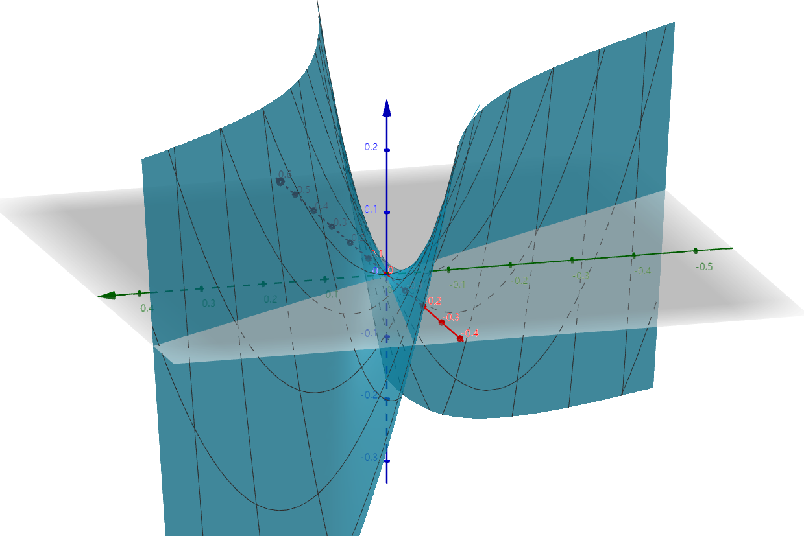

## 1.3 常见二次型
> 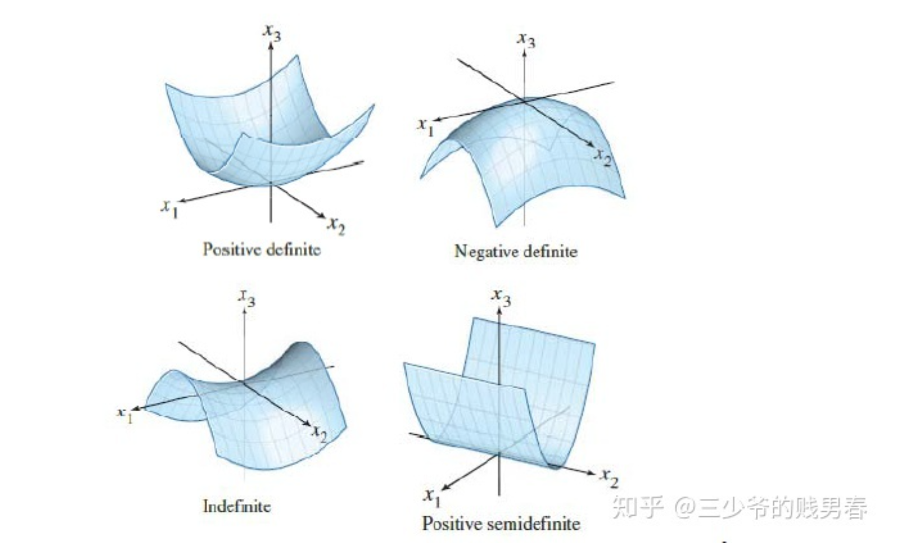

## 1.4 验证二次型最小值**⭐**
### 1.4.1 配方法
:::info
之前我们都是通过矩阵本身的性质来判断其是否正定，下面我们不妨从二次型的非负性来判断。
:::
> 前文已经看到: 矩阵 $\begin{bmatrix} 2&6\\6&18\end{bmatrix}$ 正好处在判定为正定矩阵的临界点上，称之为半正定（`positive semidefinite`）矩阵，其二次型的$y^2$的系数为$18$ 
> **于是我们可以用配方法来验证**$\begin{bmatrix} 2&6\\6&20\end{bmatrix}$**的二次型是否具有最小值：**
> 对于$\begin{bmatrix} 2&6\\6&20\end{bmatrix}$我们有其二次型: $f(x,y)=2x^2+12xy+20y^2=2(x+3y)^2+2y^2$
> 配方使得 $x^2$ 的系数和交叉项 $xy$ 的系数配合形成完全平方的形式，这个时候用到的 $y^2$ 的系数$d$正好是$18$，即判定正定的临界点。如果实际的系数$d$大于$18$，则还剩余 $(d−18)y^2$ ，二次型在原点之外一定大于零，若小于$18$则二次型可以小于等于$0$。
> 对于$f(x,y)=2x^2+12xy+20y^2=2(x+3y)^2+2y^2$ ，其几何图像为碗型的曲面。
> 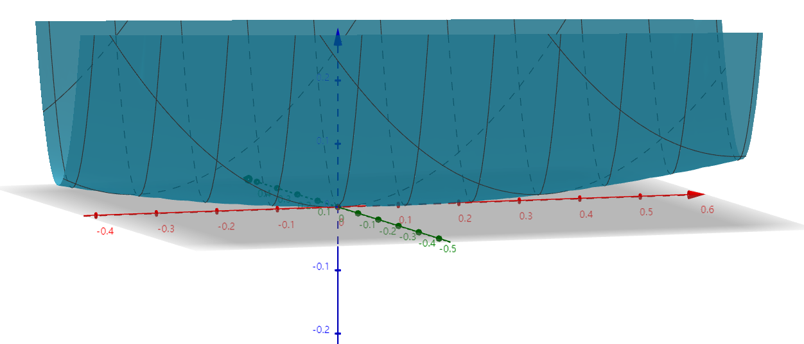
> 如果我们用$f=1$的截面横截曲面，得到的就是 $2(x+3y)^2+2y^2=1$ 的椭圆曲线。而对于双曲面进行切割就得到双曲线。
> 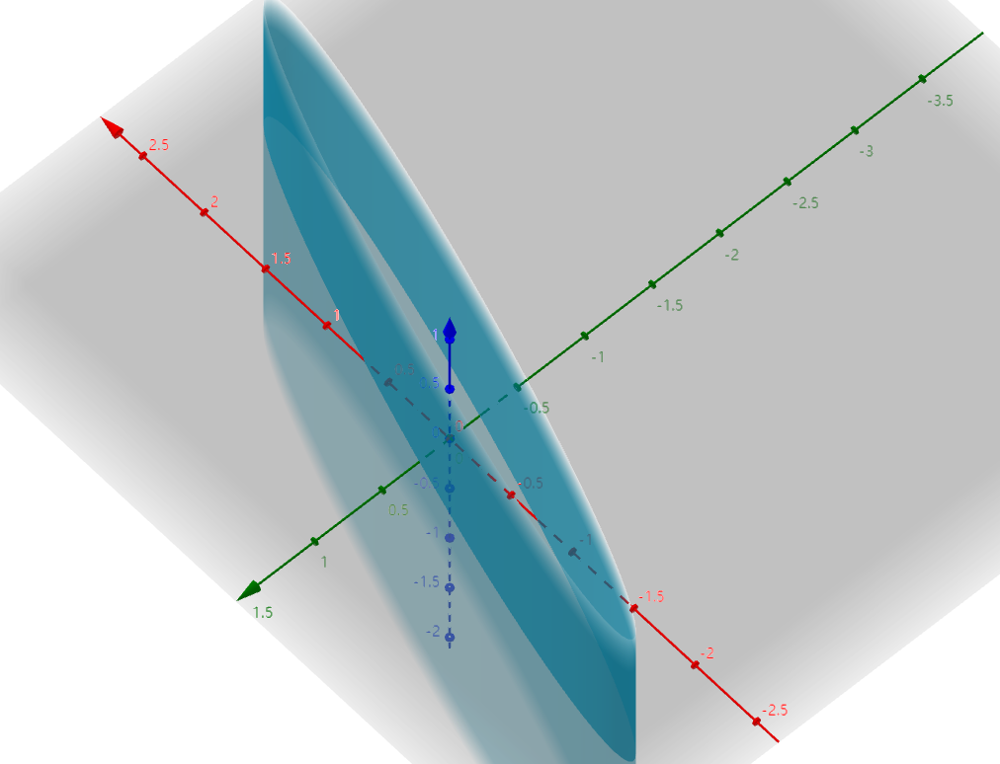

### 1.4.2 配方法=消元?**⭐**
:::info
配方法实际上就是消元，这看起来没那么直观，我们可以验证一下：
如果我们想要得到矩阵$\bf A=\begin{bmatrix} 2&6\\6&20\end{bmatrix}$的配方之后的二次型：$\mathbf{x^TAx}=a(x+by)^2+cy^2$
我们可以对$\bf A$进行高斯消元(做$\bf  LU$分解):

得到$\bf L=\begin{bmatrix} 1&0\\3&1\end{bmatrix},U=\begin{bmatrix} 2&6\\0&2\end{bmatrix}$, 系数对应关系如下:
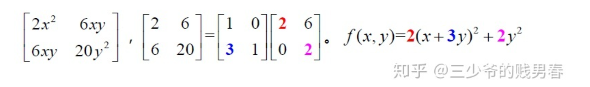
:::
:::danger
注意: 只有对称二次型才可使用
比如作业第二题中的那个矩阵就不能使用上述方法
:::
# 2 海森矩阵**⭐⭐⭐⭐⭐**
:::info
海森矩阵在机器学习、深度学习中应用非常广泛，可谓是明星矩阵之一，和他经常一起出现的是雅阁比矩阵，二者联合起来能够对$n$维向量函数进行泰勒展开。相关资料如下:
:::
[Talyor Expansion for Vector Functions.pdf](https://www.yuque.com/attachments/yuque/0/2022/pdf/12393765/1660298553557-128f9524-3de4-47b9-ad74-9e82464515d0.pdf)
[Linear Algebra and Differentials.pdf](https://www.yuque.com/attachments/yuque/0/2022/pdf/12393765/1660298729306-856ce096-e966-4c30-952a-b9082510403b.pdf)
:::info
多元函数的二阶导数的矩阵记为 $\bf \begin{bmatrix}f_{xx}&f_{xy}\\
f_{yx}&f_{yy} \end{bmatrix}$ 称为海森矩阵，**海森矩阵**所具有的**对称性**代表交叉二阶偏导数与求导顺序无关 $f_{xy}=f_{yx}$ 。在多元微积分[二阶测试](https://www.yuque.com/alexman/tn6ya7/roebmy#IYgOk)中我们学到的判据 $f_{xx}f_{yy}>f_{xy}^2$ ，和二阶矩阵判定正定是等价的，并且线代可以推广到$n$维。(其实我们在[证明二阶测试](https://www.yuque.com/alexman/tn6ya7/roebmy#VzioN)的时候就已经使用了二次型的概念来构建我们的二阶函数(`Quadratic Function`))

:::

# 3 nxn矩阵的正定性**⭐⭐⭐**
## 3.1 通过代数性质判断
:::info
我们从三阶矩阵开始:
对于$3$阶矩阵$\bf A=\begin{bmatrix} 2&-1&0\\-1&2&-1\\0&-1&2\end{bmatrix}$ ，它是正定矩阵。计算子行列式得到 $|2|=2$
， $\left| \begin{array}{cc}2&-1\\-1&2\end{array}\right|=3$ ， $\left| \begin{array}{ccc}2&-1&0\\-1&2&-1\\0&-1&-2\end{array}\right|=4$ 。主元是$2，3/2，4/3$。特征值是 $2−\sqrt{2},2,2+\sqrt{2}$ 。我们通过判定法则`1`或者`3`就可以知道其正定。
:::

## 3.2 主轴定理**⭐⭐**
:::info
还是上面的矩阵$\bf A=\begin{bmatrix} 2&-1&0\\-1&2&-1\\0&-1&2\end{bmatrix}$, 其二次型为 $\mathbf{x^TAx}=2x_1^2+2x_2^2+2x_3^2−2x_1x_2−2x_2x_3$ 。
这是一个四维的图像$f(x_1,x_2,x_3)=g$，三个维度$x_1，x_2，x_3$，还有函数$f$，如果求出$f=1$的等高面，则得到 $2x_1^2+2x_2^2+2x_3^2−2x_1x_2−2x_2x_3=1$ 。
这是一个椭球体，三个特征值不同，因此椭球的三个长轴长度不同。**三个轴的方向就是特征向量的方向，轴长度就是特征值**，矩阵的分解$\bf A=QΛQ^T$ 很好的说明了这件事，这就是所谓的“主轴定理”。
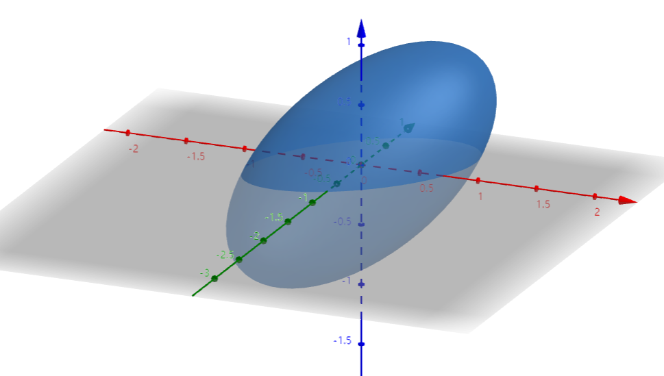
:::

## 3.3 对称矩阵的列空间
:::info
对称矩阵$\bf A$，其正交的特征向量可以张成整个空间，因此任意向量$\bf x$均可表示成特征向量的线性组合 $\mathbf{x}=c_1x_1+c_2x_2+…cx_n$ ，代入得$\mathbf{x^TAx}=c_{1}^2λ_1+c_{2}^2λ_2+…c_n^2λ_n$ ，当特征值都大于零且$x≠0$时，才能保证$\mathbf{x^TAx}>0$。因此条件$1$与正定性等价。(这在[正定矩阵特征值都大于零](https://www.yuque.com/alexman/so5y8g/bk3kq8#kBUoM)中已经详细证明过)

记 $\bf A^k$ 为矩阵$\bf A$左上角$k$阶方块，取特殊向量$\bf x= \begin{bmatrix} \bf x_k\\\bf0\end{bmatrix}$ ，即后$n-k$个元素为$0$，则有 $\mathbf{x^TAx} = \begin{bmatrix} \bf x_k&\bf 0\end{bmatrix}\begin{bmatrix} \bf A_k&*\\*&*\end{bmatrix}\begin{bmatrix} \bf x_k\\\bf 0\end{bmatrix}=\mathbf{x_k^TA^kx_k}$ 。若矩阵$\bf A$满足正定性，则所有$\bf A^k$均满足正定性。已证明正定性等价于特征值均为正，而矩阵行列式等于特征值之积，因此可知子行列式均大于零。反之亦成立，两命题等价。
:::

# 4 练习
## P1 正定矩阵的积**⭐⭐⭐⭐⭐**
:::info
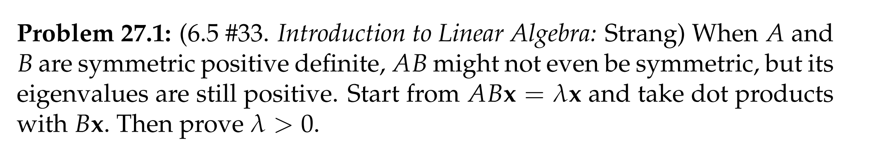
:::
**Key**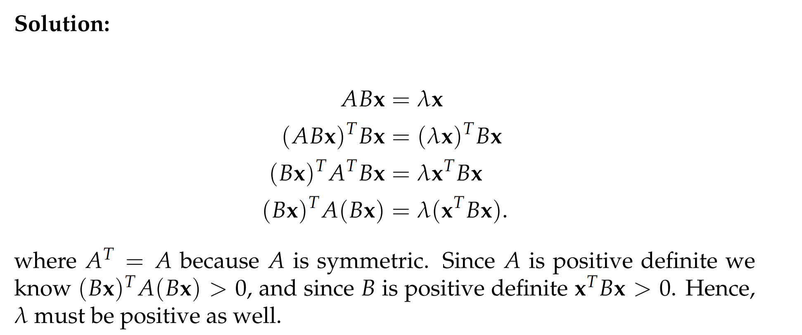
关键就是要化简成为一个二次型然后利用矩阵的正定性。

## P2 二次型**⭐⭐⭐**
:::info
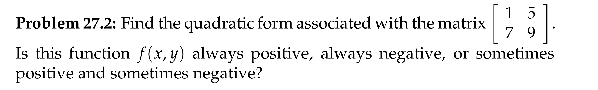
:::
**Key**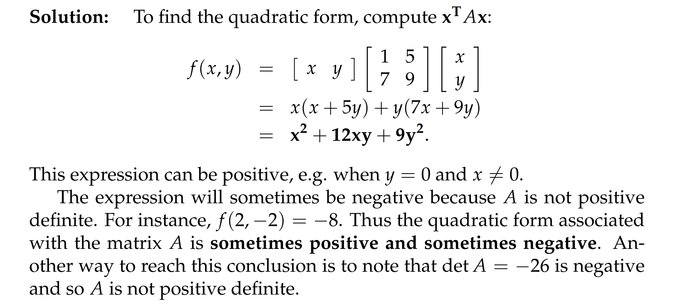

## P3 验证正定性**⭐⭐⭐⭐⭐**
:::info
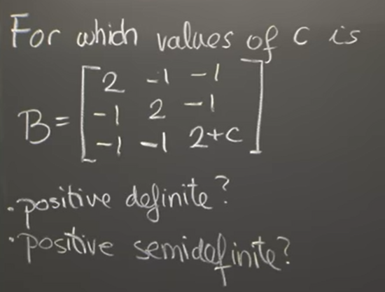
:::
**Determinant Test**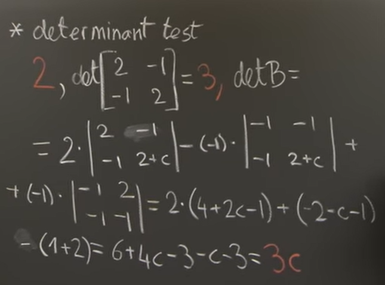
$c>0$时，正定； $c=0$，半正定
**Pivot Test**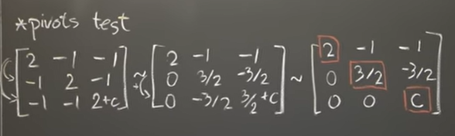
$c>0$时，正定；$c=0$时，半正定(有零特征值)
**Energy Test**首先我们对矩阵进行$\bf LU$分解:
我们写出完整步骤:
$\begin{bmatrix} 2&-1&-1\\-1&2&-1\\-1&-1&2+c\end{bmatrix}\stackrel{row1*\frac{1}{2}+row2}{\longrightarrow} \begin{bmatrix} 2&-1&-1\\0&\frac{3}{2}&-\frac{3}{2}\\-1&-1&2+c\end{bmatrix}\stackrel{row1*\frac{1}{2}+row3}{\longrightarrow} \begin{bmatrix} 2&-1&-1\\0&\frac{3}{2}&-\frac{3}{2}\\0&-\frac{3}{2}&\frac{3}{2}+c\end{bmatrix}\stackrel{row2*1+row3}{\longrightarrow} \begin{bmatrix} 2&-1&-1\\0&\frac{3}{2}&-\frac{3}{2}\\0&0&c\end{bmatrix}$
所以$\bf L=\begin{bmatrix} 1&0&0\\-\frac{1}{2}&1&0\\-\frac{1}{2}&-1&1\end{bmatrix}$,$\bf U=\begin{bmatrix} 2&-1&-1\\0&\frac{3}{2}&-\frac{3}{2}\\0&0&c\end{bmatrix}$
$\mathbf{x^TAx}=\begin{bmatrix} x_1&x_2&x_3\end{bmatrix}\begin{bmatrix} 2&-1&-1\\-1&2&-1\\-1&-1&2+c\end{bmatrix}\begin{bmatrix} x_1\\x_2\\x_3\end{bmatrix}\newline=2x^2+2y^2+(2+c)z^2-2xy-2xz-2yz$
由于$\bf A$是对称矩阵，所以通过[消元求配方](https://www.yuque.com/alexman/so5y8g/oiz47y/edit#MfOtz)中的技巧我们知道:
$2x^2+2y^2+(2+c)z^2-2xy-2xz-2yz=\mathbf{U_{11}}(x+\mathbf{L_{21}}y+\mathbf{L_{31}}z)^2+\mathbf{L_{22}}(y-\mathbf{L_{23}})^2+\mathbf{U_{33}}z^2=2(x-\frac{1}{2}y-\frac{1}{2}z)^2+\frac{3}{2}(y-z)^2+cz^2$
此时如果$c=0$，则当$\begin{cases} x-\frac{1}{2}y-\frac{1}{2}z=0\\y-z=0\\z=0\end{cases}$有非零解时, 即$\begin{bmatrix} 2&-1&-1\\0&1&-1\\0&0&0\end{bmatrix}$的零空间有非零解$\bf x$时，$\mathbf{x^TAx}=0$, 此时矩阵$\bf A$是半正定的。$c>0$时，我们知道$\begin{bmatrix} 2&-1&-1\\0&1&-1\\0&0&c\end{bmatrix}$只有零解，与$\bf x\neq 0$矛盾，所以$\mathbf{x^TAx}=0,\forall x\neq 0$, 所以此时矩阵正定。
