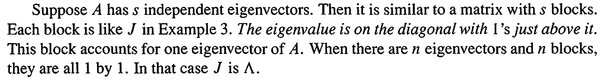
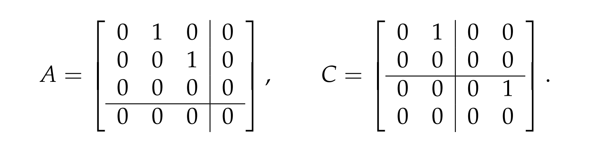
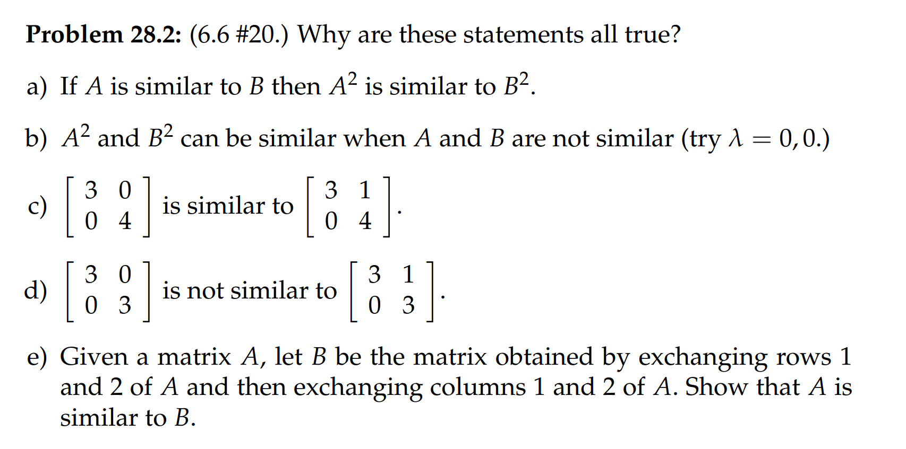

[Lecture Notes.pdf](https://www.yuque.com/attachments/yuque/0/2022/pdf/12393765/1660402299065-789394bd-d21c-4e4e-8391-1ca49aed92c9.pdf)
参考: [https://zhuanlan.zhihu.com/p/46087288](https://zhuanlan.zhihu.com/p/46087288)
> 本讲介绍相似矩阵，这些内容以及奇异值分解是线性代数最核心的概念。

# 1 A^TA的正定性**⭐**
> 若矩阵$\bf A$满足对任意向量$\bf x$均有$\bf x^TAx>0,\forall x\neq 0$，则称矩阵为正定矩阵，可以通过特征值、主元和行列式的办法来判断矩阵的正定性。
> 正定矩阵来自于最小二乘问题。有大量的实际问题用到了长方形矩阵，而最小二乘问题中用到了长方形矩阵的积$\bf A^TA$，它是正定矩阵。
> 正定矩阵$\bf A$是对称矩阵，它的逆矩阵 $\bf A^{−1}$也是正定矩阵，逆矩阵的特征值是原矩阵的倒数(`reciprocal`)，因此也都是正数。若矩阵$\bf A$和$\bf B$都是正定矩阵，则$\bf A+B$也是正定矩阵：$\bf x^TAx>0$，$\bf x^TBx>0$，则有 $\bf x^T(A+B)x>0$ (可以用二次型来证明，读者可自行验证)。
> 如果$\bf A$是一个$m\times n$的长方形矩阵，则 $\bf A^TA$ 是对称方阵。通过讨论$\bf x^T(A^TA)x$的正负可以确认它是正定矩阵：$\bf x^T(A^TA)x$=$\bf (Ax)^T(Ax)$=$\bf |Ax|^2≥0$。当且仅当$\bf Ax=0$时，表达式为$\bf 0$。当矩阵$\bf A$的各列线性无关时，即矩阵为列满秩$r=n$，$\bf A$的零空间只有零向量，即此条件下仅有零向量，满足$\bf x^T(A^TA)x=0$。因此矩阵列满秩时，$\bf A^TA$是正定矩阵。正定矩阵将之前的知识点串联起来。

# 2 相似矩阵**⭐⭐⭐⭐⭐**
## 2.1 Insights
> $\bf A$和$\bf B$均是$n\times n$方阵，若存在可逆矩阵$\bf M$，使得$\bf  B=M^{−1}AM$ ，则$\bf A$和$\bf B$为相似矩阵。有了相似矩阵的概念，我们能够将具有相同特征值的方阵归为一类，这些方阵的对角化结果中的对角阵是相同的。**每个这样的对角阵都可以代表一类具有对角线元素的特征值的矩阵。**

## 2.2 相似矩阵特征值相同
> 
> 若矩阵$\bf A$具有$n$个线性无关的特征向量，可以对角化得到$\bf S^{−1}AS=Λ$，则$\bf A$相似于$\bf Λ$，这里的$\bf M$是特征向量矩阵$\bf S$。如果将$\bf M$取其它可逆矩阵，可以得到和$\bf A$相似的另一矩阵$\bf B$，实际上这样可以定义一类矩阵，$\bf Λ$是其中最简洁的一个。
> 例：$\bf A= \begin{bmatrix} 2&1\\1&2\end{bmatrix}$ ，则$\bf Λ= \begin{bmatrix} 3&0\\0&1\end{bmatrix}$ ，则$\bf A$和$\bf \Lambda$相似，
> 而取另一可逆矩阵$\bf M$，则有$\bf B=M^{-1}AM= \begin{bmatrix} 1&-4\\0&1\end{bmatrix}\begin{bmatrix} 3&0\\0&1\end{bmatrix}\begin{bmatrix} 1&4\\0&1\end{bmatrix}$ 。此时$\bf B$也相似于$\bf A$
> **相似矩阵最重要的特性是**：**相似矩阵具有相同的特征值, 相同的特征向量和**`**相同的Jordon Block(也就是特征值的几何重数一致)**`**(下文会详细介绍)。**事实上，所有特征值为$3$和$1$的二阶矩阵都是$\bf A$的相似矩阵。

## 2.3 证明相似矩阵特征值相同
> **证明矩阵**$\bf A$**的相似矩阵**$\bf B=M^{−1}AM$**，具有和矩阵**$\bf A$**相同的特征值：**
> 矩阵$\bf A$具有的特征值$λ$ ，即存在特征向量$\bf x$满足 $\bf Ax=λx$ 。则有：
> $\mathbf{AMM^{−1}x}=λ\mathbf{x}\\\mathbf{M^{−1}AMM^{−1}x}=λ\mathbf{M^{−1}x}\newline \mathbf{BM^{−1}x}=λ\mathbf{M^{−1}x}$
> 即矩阵$\bf B$具有特征值 $λ$ ，且特征向量为 $\bf M^{−1}x$ 。
> 因此，相似矩阵具有相同的特征值，并且线性无关的特征向量的个数相同，但是特征向量往往不同。如果矩阵$\bf A$的特征值互不相等 $λ_1≠λ_2≠…≠λ_n$ ，而与另一个矩阵$\bf B$的特征值完全相同$λ_1=λ_1',λ_2=λ_2',…λ_n=λ_n'$ ，则它们与相同的对角矩阵$\bf Λ$相似。

# 3 Jordan Form**⭐⭐**
## 3.0 Insights
> 如果一个矩阵$\bf A_{n\times n}$有$n$个线性无关的特征向量(`18.03SC`中称为`Complete Case`), 则其可以对角化$\bf A=M\Lambda M^{-1}$ , 其中$\bf \Lambda$是对角阵, $\bf M$是由$\bf A$的特征值对应的特征向量作为列构成的方阵。 其中$\bf \Lambda\sim A$($\bf \Lambda$和$\bf A$是相似矩阵, 特征值相同，特征向量不同)
> 现在我们考虑这样一种方阵$\bf T_{n\times n}$，他只有少于$n$和特征向量(`18.03SC`中是`Defective Case`), 此时矩阵不能按照常规方法对角化得到对角阵，此时我们可以将$\bf M$的选取放宽到任意的可以方阵，$\bf \Lambda$的选取不在是对角阵，而是一个新的形式的矩阵，成为`Jordan Matrix`, 他可以使得任意$n\times n$方阵$\bf T$写成$\bf T =MJM^{-1}$的形式。
> 下面我们将详细介绍`Jordan Form`的定义和应用。

## 3.1 只和自身相似的方阵
### 二阶的情况
> 如果矩阵有重特征值，则可能无法进行对角化。
> 例：二阶矩阵有重特征值 $λ_1=λ_2=4$ 。
> **对于有这些特征值的矩阵，我们考虑两类矩阵:**
> 1. 第一类(对角阵)： $\begin{bmatrix} 4&0\\0&4 \end{bmatrix}$ 只与自己相似， $\bf M^{−1}\begin{bmatrix} 4&0\\0&4 \end{bmatrix}M=4M^{−1}IM=\begin{bmatrix} 4&0\\0&4 \end{bmatrix}$ 。这个系列的相似矩阵仅包含其自身。换句话说，对角阵只和自己相似。
> 

> 2. 第二类(非对角阵)：$\begin{bmatrix} 4&t\\0&4 \end{bmatrix}$所有的重特征值也都为$4$, 其中最简洁的是$\bf J=\begin{bmatrix} 4&1\\0&4 \end{bmatrix}$ ，元素$1$的位置换上其它数值仍然是相似矩阵(因为不会改变特征空间的维数)。这个**最优形式**$\bf J$**称为若尔当（**`**Jordan Form**`**）标准型**。有了这个理论，就可以处理不可对角化的矩阵，完成**近似的“对角化**”转化为若尔当标准型进行处理。
> 
> **我们可以从**$\bf J$**出发构造和其相似的矩阵:**
> 与 $\begin{bmatrix} 4&1\\0&4 \end{bmatrix}$相似的矩阵，迹为$8$，行列式为$16$，因此我们可以构造出很多与$\bf J$相似的矩阵： $\begin{bmatrix} 5&1\\-1&3 \end{bmatrix}$， $\begin{bmatrix} 4&0\\17&4 \end{bmatrix}$ ， $\begin{bmatrix} a&*\\*&8-a \end{bmatrix}$，而它们清一色都不能对角化， 原因就在于，这些矩阵有重特征值$4$, 且这些特征值的代数重数小于几何重数。

### 四阶的情况
> 更复杂的情况，一个四阶矩阵具有重特征值$0$,$λ_1=λ_2=λ_3=λ_4=0$ 。
> $\bf A= \begin{bmatrix} 0&1&0&0\\0&0&1&0\\0&0&0&0\\0&0&0&0\end{bmatrix}$ ,它的秩为$2$，因此其零空间的维数为$4-2=2$，而零空间的基向量就是矩阵的特征向量，因为他们满足$\mathbf{Ax}=0\mathbf{x}$，所以矩阵$\bf A$只有两个特征向量（几何重数为$2$,代数重数为$4$, 所以不能对角化）。
> **若尔当指出上对角线每增加一个**$1$**，矩阵就减掉一个特征向量(零空间减掉一个维度)**，本例中$\lambda=0$对应的特征向量数为$AM-\#1\space on \space the\space diagonal$(就是特征向量的代数重数减去上对角线的$1$的个数), 所以$4-2=2$。 

## 3.2 Jordan Blocks
> 
> 
> **注意:**
> 相似矩阵具有相同的特征值和特征向量个数, 以及相同的`Jordan Matrix`。
> 而如果两个矩阵有相同的特征值(重数不一定一致)和特征向量个数，但是有其中一个**重特征值**的`Jordan Block`不相同，则这两个矩阵也不相似。详见作业`P2`中的$(d)$问

:::info
若尔当块形如$\bf J_i=\begin{bmatrix} \lambda_i &1&0&\cdots&0\\0&\lambda_i&1&\cdots&\vdots\\0&0&\ddots&\ddots&0\\\vdots&\vdots&\ddots&\ddots&1\\0&0&\cdots &0&\lambda_i\end{bmatrix}$，对角线上为重特征值 $λ_i$ ，上对角线为$1$，其它位置的元素均为$0$，每个若尔当块只有$1$个**特征向量**。若干个若尔当块可以拼成一个若尔当矩阵。
**若尔当矩阵**：$\bf J= \begin{bmatrix} \mathbf{J_1}&0&\cdots&0\\0&\mathbf{J_2}&\cdots &0\\\vdots&&\ddots &\vdots\\0&0&\cdots&\mathbf{J_d} \end{bmatrix}$
当矩阵$\bf A$有$n$个特征值和$n$个特征值对应的`Jordan Block`，则$\bf J$进化为对角阵$\bf \Lambda$

:::

## 3.3 Jordan Theorem
:::info
**若尔当理论**：

- 任意$n$阶矩阵$\bf A$都与一个若尔当矩阵$\bf J$相似。若尔当矩阵中的每一个若尔当块对应一个特征向量。
- 若矩阵具有$n$个不同的特征向量，则可以对角化，此时其若尔当标准型$\bf J$就是对角矩阵$\bf Λ$。
- 如果$\bf A$有重复特征值，则特征向量个数变少, 其`Jordan Matrix`的对角线之上(上对角线有$n-d$个$1$)。换句话说，就是说若尔当矩阵上对角线每多一个$1$, 就少一个特征向量。
:::

## 3.4 特征值相同不意味着相似
:::info
**两个矩阵具有相同的特征值和特征向量个数，但是其若尔当块的尺寸不同，两者也并不是相似矩阵**。如下面的两组矩阵
矩阵$\bf A= \begin{bmatrix} 0&1&0&0\\0&0&1&0\\0&0&0&0\\0&0&0&0\end{bmatrix}$ 与$\bf B= \begin{bmatrix} 0&1&7&0\\0&0&1&0\\0&0&0&0\\0&0&0&0\end{bmatrix}$ 为相似矩阵。
但矩阵$\bf A=\begin{bmatrix} 0&1&0&0\\0&0&1&0\\0&0&0&0\\0&0&0&0\end{bmatrix}$与$\bf C=\begin{bmatrix} 0&1&0&0\\0&0&0&0\\0&0&0&1\\0&0&0&0\end{bmatrix}$与并不是相似矩阵，两者具有不同的若尔当块。

:::

## 3.4 应用
> 其实也谈不上什么应用，只是说在面对一些性质不太好的方阵的时候，比如前文介绍的几何重数小于代数重数的方阵不能对角化，而是只能采用近似对角化的形式$\bf A=MJM^{-1}$($\bf J$是`Jordan Matrix`,不是对角阵; $\bf M$是可逆矩阵)
> 所以，对于任意方阵$\bf A$，如果我们要计算$\bf A^k$又正好碰上不能对角化的情况，我们就可以使用其近似对角化形式$\bf A^k=MJ^kM^{-1}$ 计算。
> 但是，`Jordan`标准型实际应用的场景不如前文介绍的对角化或者正交对角化广泛，因为用他的计算不稳定，这里摘录书中的原话:
> 

# 4 练习
## P1 判断题**⭐⭐⭐⭐**
:::info
**下列陈述中哪个是正确的?**
**(a). **如果$\bf A$和$\bf B$是相似矩阵，则$\bf 2A^3+A-3I$和$\bf 2B^3+B-3I$是相似的
**(b). **如果$\bf A$和$\bf B$都是$3\times 3$矩阵，且都有$1,0,-1$特征值，则$\bf A$和$\bf B$相似
**(c). **矩阵$\bf J_1=\begin{bmatrix} -1&1&0\\0&-1&1\\0&0&-1 \end{bmatrix}$和$\bf J_2=\begin{bmatrix} -1&1&0\\0&-1&0\\0&0&-1 \end{bmatrix}$是相似矩阵
:::
**(a) **成立, 因为$\bf A$和$\bf B$相似，所以$\bf A=MBM^{-1}$
则$2\bf A^3+A-3I = M(2B^3+B-3I)M^{-1}$(根据矩阵乘法的分配律可知)
所以$\bf 2A^3+A-3I$和$\bf 2B^3+B-3I$是相似的
**(b)**成立, 因为这就是两个矩阵相似的性质之一。
**证明:**
因为正好这两个矩阵都有足够数量的不同的特征值, 所以$\bf A$和$\bf B$均可对角化，
所以$\bf A=M_1\Lambda M_1^{-1},B=M_2 \Lambda M_2^{-1}$

- 所以$\bf \Lambda =M_1^{-1}AM_1,\Lambda=M_2^{-1}BM_2$
- 并且$\bf\Lambda =M_1^{-1}AM_1=M_2^{-1}BM_2$

所以$\bf A=M_1M_2^{-1}BM_2M_1^{-1}$，因为$\bf M_1,M_2$均可逆, 所以$\bf M_1M_2^{-1}$可逆，其逆矩阵为$\bf M_2M_1^{-1}$
于是$\bf A$和$\bf B$相似
**(c)**不成立, 由于上对角线的$1$的数量不一致，所以$\bf J_1,J_2$不是相似矩阵。
我们也可以研究这两个矩阵的特征空间 
对于$\lambda=-1$特征值来说:
$\bf J_1+I=\begin{bmatrix} 0&1&0\\0&0&1\\0&0&0\end{bmatrix}$, $\bf J_2+I=\begin{bmatrix} 0&1&0\\0&0&0\\0&0&0\end{bmatrix}$
所以$1$这个特征值对于$\bf J_1$来说几何重数是$1$, 对于$\bf J_2$的几何重数是$2$, 于是两个矩阵的对角化矩阵是不同的，所以不相似。或者说，两个矩阵的相同特征值的特征向量是不同的。

## P2 不相似的矩阵找不到对角化
> 

**Key**证明思路异常简单，只要假设一个$\bf M$然后求使得$\bf JM=MK$满足的$\bf M$即可。

## P3 判断矩阵相似**⭐⭐⭐**
> 

**(a) True**
详见`P1`中的$(a)$问
**(b) False**
这里就是说两个矩阵虽然特征值相同，但是特征向量个数不同，且最重要的是，他们的若尔当块不同，所以不相似。
**(c) True**两个矩阵的特征值相同，重数也相同，特征向量个数也相同，所以两个矩阵必然相似。(其`Jordan Matrix`都是对角阵)

**(d) True**两个矩阵的特征值相同，但是`Jordan Matrix`不同（特征值的重数不一致），所以不相似。
**(e) True**
