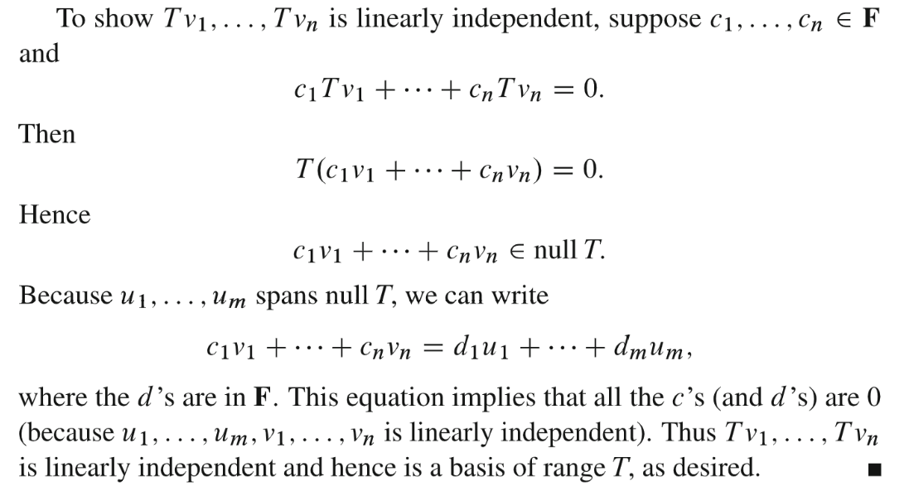

**参考列表**
> - [MIT的各种数学](https://zhuanlan.zhihu.com/p/46119592)
> - [线性代数笔记-我是8位的](https://www.cnblogs.com/bigmonkey/p/12038710.html)
> - [3Blue1Brown](https://www.youtube.com/watch?v=P2LTAUO1TdA&list=PLZHQObOWTQDPD3MizzM2xVFitgF8hE_ab&index=13)

[Linear Transformation.pdf](https://www.yuque.com/attachments/yuque/0/2022/pdf/12393765/1660723150962-c54fa5f2-69ff-4d2a-bc5c-df66fc3ff161.pdf)
# 0 前言
> 本讲介绍线性变换。在传统的线代课程中，线性变换会出现在的比矩阵还要早的位置，实际上可以在脱离坐标和具体数值的情况下讨论线性变换。但是面对科学计算的课题，还是要回到坐标上来。每个线性变换都对应于一个矩阵，矩阵概念的背后就是线性变换的概念。

# 0x 特别注意
> 本章节中涉及到的所有线性变换$T$的描述矩阵$\bf A$都是在标准基下进行的。**也就是说，假设线性变换**$T:V\to W$**, **$V,W$**选的都是标准基。这是为了对**`**3.7**`**中**$V,W$**中可以任意选择基的情况做一个简化方便理解。**

# 1 基本思想
## 1.1 定义
> 
> 

## 1.2 判断线性变换
> 1. $T(\mathbf v)=\bf v+v_0$**不是线性变换**
>    - 不满足$T(\mathbf{u+v})=T(\mathbf u)+T(\mathbf v)$, 因为$T(\mathbf{u,v})=\bf u+v+2v_0\neq u+v+v_0$
>    - 不满足$T(c\mathbf v)=cT(\bf v)$
> 2. $T(\mathbf v)=||\bf v||$**不是线性变换**
>    - 不满足$T(\mathbf{u+v})=T(\mathbf u)+T(\mathbf v)$, 因为根据三角不等式$\bf ||u+v||\leq ||u||+||v||$
>    - 不满足$T(-v)=-Tv$, 因为$||-v||=||v||$而不是$-||v||$

 
## 1.3 图解**⭐⭐**
> 
> 最重要的一点是，`Equally spaced points go to equally spaced points`
> 下面的动图展示了线性变换后的`Equally Spaced`的特点。

**动图(By 3Blue1Brown )**

## 
# 2 线性变换矩阵
> 
> 在线性代数线性算子视角中我们会更加详细的介绍线性变换矩阵的性质和代数定义。

## 2.0 线性变换线性转化了基**⭐⭐**
> 当一个矩阵$\bf A$左乘一个向量$\bf v$, 他把向量$\bf v$转换成另一个向量$\bf u=Av$, 这就和我们写成$T(v)=u$一样，$T$的线性变换可以通过一个矩阵$\bf A$来表达，所以本章的目的就是要找到这个能够描述**线性变换**$T$的所有性质的矩阵。
> 假设向量$\bf v \in V=R^n$, 线性变换后的输出是$T(\bf v)\bf  \in W=R^m$, 那么这个描述矩阵$A$的形状至少可以确定是$m\times n$, **而**$A$**的每一行或者每一列长什么样就由**$\bf V$**和**$\bf W$**的基决定。而我们知道**$\bf V$**和**$\bf W$**的基不止一组，于是我们的**$\bf A$**矩阵也不止一个。所以我们还有一个目的，就是要找出能够描述线性变换**$T$**的最好的那个矩阵**$\bf A$**。**
> 
> **线性变换本质上将一组基**$v_1,...v_j$**改变为了另一组基**$T(v_1),...,T(v_j)$**。而保持组合系数**$c_j$**不变。**
> **至于为什么能够span且线性无关，我们提供如下证明。**
> **下面的动图描述了这一过程**

**动图描述基变换 1**
**动图描述基变换 2**
**证明线性变换之后的基仍然符合基的性质(Optional)**

## 2.1 线性变换本质是坐标系的改变**⭐⭐⭐⭐⭐**
> 本小节我们给出两个视角的解读。

### 2.1.1 同一个向量的不同坐标
> **线性变换改变了同一个向量在不同的基下的坐标表示。**
> 假设有$\bf T$能够完成一个向量从$n$维空间到$m$维空间的线性变换：
> 
> 现在我们打算构造一个矩阵$\bf A$来描述这个线性变换。**在描述时需要两组基：输入空间的一组基来描述输入向量，以及输出空间的一组基来确定输出向量的坐标**。这两组基一旦确定，对应的矩阵也就确定了。
> $\bf v_1,v_2……v_n$是输入空间$\bf V$的一组基向量，来自$\bf R^n$空间；$\bf w_1,w_2……w_m$是输出空间$\bf W$的一组基向量，来自$\bf R^m$空间。对于每个输入向量来说，都有具体的坐标值，该坐标由基向量的线性组合确定，然后把这些坐标值乘以某个矩阵$\bf A$，将得到相应的输出向量，输出向量的坐标同样可以由输出空间的基确定。用矩阵$\bf A$来表示线性变换，就是将矩阵乘以输入向量的坐标，得到它在输出空间的坐标。
> 值得注意的是，线性变换背后的矩阵$\bf A$乘以的是输入向量的坐标，不是输入向量本身，得到的也是输出向量的坐标，不是输出向量本身。定义一个线性变换$\bf T(v)$，对$\bf v = c_1v_1 + c_2v_2 + …… + c_nv_n$进行变换，如果用$\bf A$描述这个变换，则$\bf A$需要满足：$\bf A\begin{bmatrix} c_1\\c_2\\\vdots\\c_n\end{bmatrix}=\begin{bmatrix} d_1\\d_2\\\vdots\\d_m\end{bmatrix}......(1)$ ，其中$\begin{bmatrix} c_1\\c_2\\\vdots\\c_n\end{bmatrix}$是输入坐标($\bf V$的标准基下的坐标)，$\begin{bmatrix} d_1\\d_2\\\vdots\\d_m\end{bmatrix}$是输出坐标($\bf W$空间下的坐标)
> 之后用输出坐标对输出空间的基向量进行线性组合，得到最终的输出向量$\bf w$：
> 
> 由于我们之前一直使用的是标准基，因此感觉不到坐标的存在。
> 其中$\bf A$矩阵记录了每一个$\bf V$的标准基经过线性转换(）到$\bf W$中对应的坐标表示。

**坐标变换示意动图**

### 2.1.2 坐标语言的翻译过程
> **我们也可以有另一种视角的理解，将线性变换视为一种坐标系语言的翻译过程。**
> 假设我理解的世界都是以标准正交基作为向量坐标选取的依据的。比如我说某个向量的坐标是$\begin{bmatrix} -1\\2 \end{bmatrix}$, 我的意思就是$v=-1\cdot \begin{bmatrix} 1\\0\end{bmatrix}+2\begin{bmatrix} 0\\1 \end{bmatrix}$
> 现在有另一个地外文明的人告诉我说他手头也有个向量，坐标也是$\begin{bmatrix} -1\\2 \end{bmatrix}$, 我潜意识认为他和我说的应该是同一个向量。结果，当我们把彼此口中的向量画出来时候，
> 他画出了, 而我们画出了
> **造成差别的关键就在于我们的基选取是不同的, 我们的基是标准基，而他的基在我们的坐标系看来是**$\begin{bmatrix} 2\\1\end{bmatrix}$**和**$\begin{bmatrix} -1\\1\end{bmatrix}$**, 尽管我们的坐标都是**$\begin{bmatrix} -1\\2 \end{bmatrix}$
> 所以，我们即使知道了一个向量的坐标，仍然对这个向量一无所知。所以我们需要在不同的基的视角下建立一个联系，也就是我和他需要建立一套翻译机制，让我能理解他们世界中的向量表达。
> 这时候，矩阵$\bf A$的作用就是**将他的坐标表示**(任意基，输入端)转换成**我们的坐标表示**(标准基，输出端)。
> 

## 2.2 根据标准基构建变换矩阵**⭐⭐⭐⭐⭐**
### 2.2.1 构建原则
> 我们如何构建这个线性变换矩阵呢?
> 简便起见，**我们在本小节中只考虑选取标准基作为输入输出空间基向量的构建方法，**`**3.7**`**讲中将会介绍使用任意的基构建的方法。**
> **我们来简单介绍一下构建思想:**
> 确定矩阵$\bf A$的前提是需要选取输入空间$\bf V$和输出空间$\bf W$的**标准基**，我们依然用$\bf v_1,v_2……v_n$和$\bf w_1,w_2……w_m$表示这两组**标准基**。
> $\bf T(v_1)$表示对输入空间的第一个基向量$\bf v_1$做线性变换，然后我们试图找到一组系数使得, 然后我们将作为线性变换矩阵的第一列。
> 类似的表示对输入空间的第二个基向量做线性变换，然后我们试图找到一组系数使得, 然后我们将作为线性变换矩阵的第一列。
> 于是我们可以按照这个逻辑构建出矩阵的所有列。
> 此时如果我们有一个向量在下的坐标表示是, 则通过左乘就可以得到这个向量在下的坐标表示。
> 

### 2.2.2 通过标准基转换结果构建
> 

## 2.3 多项式导数变换**⭐⭐⭐⭐**
> 本小节我们介绍多项式的导数变换$T$(是一个线性变换，可验证)
> 对于一个多项式$p(x)=a+bx+cx^2+dx^3$来说，我们称$1,x,x^2,x^3$为多项式的**标准基**(也可以称他们为正交的函数。)

### 2.3.1 定义
> 对于导数变换$T(\mathbf x)=\frac{du}{dx}$, $v=p(x), w=q(x)$
> 
> 

### 2.3.2 构建导数变换矩阵
> 我们以一个三次多项式$v=a+bx+cx^2+dx^3$为例, 现在我们想要通过一个导数变换矩阵$\bf A$将其转换为一个二次多项式$u=B+Cx+Dx^2$, $u\in \bf U$
> 我们知道，多项式$v=p(x)$作为输入空间$\bf V$，其**标准基**为$1,x,x^2,x^3$, 多项式$u=q(x)$作为输出空间$\bf U$其**标准基**为$1,x,x^2$
> - 对$\bf V$的**标准基**$\mathbf v_1=1$进行线性变换，$T(v_1)=\frac{d1}{dx}=0=0\cdot 1+0\cdot x +0\cdot x^2$,$\bf A$的第一列就是$\begin{bmatrix} 0\\0\\0 \end{bmatrix}$
> - 对$\bf V$的**标准基**$\mathbf v_2=x$进行线性变换，$T(v_2)=\frac{dx}{dx}=1=1\cdot 1+0\cdot x +0\cdot x^2$,$\bf A$的第二列就是$\begin{bmatrix} 1\\0\\0 \end{bmatrix}$
> - 对$\bf V$的**标准基**$\mathbf v_3=x^2$进行线性变换，$T(v_3)=\frac{dx^2}{dx}=2x=0\cdot 1+2\cdot x +0\cdot x^2$,$\bf A$的第三列就是$\begin{bmatrix} 0\\2\\0 \end{bmatrix}$
> - 对$\bf V$的**标准基**$\mathbf v_4=x^3$进行线性变换，$T(v_4)=0\cdot 1+0\cdot x +3\cdot x^2$,$\bf A$的第四列就是$\begin{bmatrix} 0\\0\\3 \end{bmatrix}$
> 
最终$\bf A=\begin{bmatrix} 0&1&0&0\\0&0&2&0\\0&0&0&3 \end{bmatrix}$

### 2.3.3 导数变换的基本空间
> 线性变换的基本空间也也就等同于其转换矩阵的基本空间。
> 
> `dimension(column space)+dimension(nullspace)=dimension(input space)`也被称为`foundamental theorem of linear algebra`
> **我们针对线性变换的基本空间有特殊的数学记号(我们把线性变换**$T$**看成一个函数):**
> 

## 2.4 多项式积分变换**⭐⭐⭐⭐**
### 2.4.1 案例
> 借着积分变换，我们可以介绍一个线性变换$T$的逆变换$T^{-1}$的概念。
> 从基础微积分中我们知道，积分就是导数的逆运算，**沿用**`**2.3.2**`**中的例子**:
> 
> 我们以一个二次多项式$v=B+Cx+Dx^2$为例, 现在我们想要通过一个导数变换矩阵$\bf A^{-1}$将其转换为一个三次多项式$u=a+bx+cx^2+dx^3$, $u\in \bf U$
> 我们知道，多项式$v=p(x)$作为输入空间$\bf V$，其**标准基**为$1,x,x^2$, 多项式$u=q(x)$作为输出空间$\bf U$其基为$1,x,x^2,x^3$
> - 对$\bf V$的**标准基**$\mathbf v_1=1$进行线性变换，$T(v_1)=\int_0^x 1 dx=x=0\cdot 1+1\cdot x +0\cdot x^2+0\cdot x^3$,$\bf A$的第一列就是$\begin{bmatrix} 0\\1\\0\\0 \end{bmatrix}$
> - 对$\bf V$的标准基$\mathbf v_2=x$进行线性变换，$T(v_2)=\int_0^x x dx=\frac{1}{2}x^2=0\cdot 1+0\cdot x +\frac{1}{2}\cdot x^2+0\cdot x^3$,$\bf A$的第二列就是$\begin{bmatrix} 0\\0\\\frac{1}{2}\\0 \end{bmatrix}$
> - 对$\bf V$的标准基$\mathbf v_3=x^2$进行线性变换，$T(v_3)=\int_0^x x^2dx =\frac{1}{3}x^3=0\cdot 1+0\cdot x +0\cdot x^2+\frac{1}{3}x^3$,$\bf A$的第三列就是$\begin{bmatrix} 0\\0\\0\\\frac{1}{3} \end{bmatrix}$
> 
最终$\bf A^{-1}=\begin{bmatrix} 0&0&0\\1&0&0\\0&\frac{1}{2}&0\\0&0&\frac{1}{3} \end{bmatrix}$, 作为`2.3.2`中的变换$T$的逆变换$T^{-1}$的矩阵。

### 2.4.2 线性变换施加顺序
> **线性变换的施加顺序可能会影响最终的结果:**
> 沿用`2.3.2`和`2.4.1`中的案例
> $\bf A=\begin{bmatrix} 0&1&0&0\\0&0&2&0\\0&0&0&3 \end{bmatrix}$, $\bf A^{-1}=\begin{bmatrix} 0&0&0\\1&0&0\\0&\frac{1}{2}&0\\0&0&\frac{1}{3} \end{bmatrix}$
> $\bf AA^{-1}=\begin{bmatrix} 1&0&0\\0&1&0\\0&0&1\end{bmatrix}$, 但是$\bf A^{-1}A=\begin{bmatrix} 0&0&0&0\\0&1&0&0\\0&0&1&0\\0&0&0&1\end{bmatrix}$
> 假设求导的线性变换是$T$, 积分的线性变换是$T^{-1}$(求导的逆变换)
> **对于常数**$1$
> - 如果我们**先求导再积分**，则线性变换是$T^{-1}(T(x))$, 对应的矩阵表达方式是: $A^{-1}A\begin{bmatrix} 1\\0\\0\\0\end{bmatrix}=\begin{bmatrix} 0\\0\\0\\0\end{bmatrix}$, 我们发现结果是$0$
> - 如果我们**先积分再求导**，则线性变换是$T(T^{-1}(x))$, 对应的矩阵表达方式是: $AA^{-1}\begin{bmatrix} 1\\0\\0\end{bmatrix}=\begin{bmatrix} 1\\0\\0\end{bmatrix}$, 结果是$1$
> 
从上面可知，$AA^{-1}\neq A^{-1}A$, 原因在于导数变换$T$对于常数$x$而言有$T(x)=0$($T$有核空间(零空间)), 根据`2.3.3`可知所有的常数都在线性变换矩阵$A$的零空间中, 再对零进行积分得到的当然是$0$

## 2.5 旋转变换
> 
> 

## 2.6 投影变换**⭐⭐⭐⭐**
> 这一小节我们选取了非标准基作为我们的基向量，在`3.7`中会详细介绍。
> 
> 
> **将二维平面内的向量投影红色的直线上，选择**
> - **输入空间**的基选择为$\bf v_1，v_2$(特征向量的方向, 主轴方向)，其中$\bf v_1$是沿着投影方向的向量，$\bf v_2$是垂直于投影方向的向量
> - **输出空间**的基选择为$\bf w_1=v_1$，$\bf w_2=v_2$。对于输入空间中任意向量$\bf v$有$\bf v=c_1v_1+c_2v_2$，输出为$\bf T(v)=c_1v_1+0$。
> 
**我们来构建线性变换矩阵:**
> - $\bf T(v_1)=v_1=1\cdot v_1+0\cdot v_2=1\cdot w_1+0\cdot w_2$, 于是矩阵$\bf A$的第一列就是$\begin{bmatrix} 1\\0\end{bmatrix}$
> - $\bf T(v_2)=v_1=0\cdot v_1+0\cdot v_2=0\cdot w_1+0\cdot w_2$, 于是矩阵$\bf A$的第二列就是$\begin{bmatrix} 0\\0\end{bmatrix}$
> 
因此这个线性变换的矩阵就是$\bf A= \begin{bmatrix} 1&0\\0&0\end{bmatrix}$ ，输入$\begin{bmatrix} c_1\\c_2\end{bmatrix}$ 得到$\begin{bmatrix} 1&0\\0&0\end{bmatrix}\begin{bmatrix} c_1\\c_2\end{bmatrix}=\begin{bmatrix} c_1\\0\end{bmatrix}$。这组例子中实际上我们以投影矩阵的特征向量为基，因此得到的矩阵$\bf A$是对角阵。对角线上就是投影矩阵的特征值$1$和$0$。
> 而如果我们以标准坐标为基，即$\bf w_1=v_1= \begin{bmatrix} 1\\0\end{bmatrix}$ ，$\bf w_2=v_2= \begin{bmatrix} 0\\1\end{bmatrix}$ 。对应的投影矩阵就是之前学到的投影矩阵$\bf P= \frac{aa^T}{a^Ta}$ ($\bf \vec{a}=\begin{bmatrix} 1\\1\end{bmatrix}$)对于投影到斜率$45$度的直线，$\bf P= \begin{bmatrix} 1/2&1/2\\1/2&1/2\end{bmatrix}$。
> **可见，不同的基的选取得到的投影变换的矩阵是不同的。**
> - 在选取$\begin{bmatrix} 1\\0\end{bmatrix}$和$\begin{bmatrix} 0\\1\end{bmatrix}$为基时，投影矩阵为$\begin{bmatrix} 1/2&1/2\\1/2&1/2\end{bmatrix}$
> - 在选取$\begin{bmatrix} 1\\1\end{bmatrix}$和$\begin{bmatrix} -1\\1\end{bmatrix}$为基时，投影矩阵为$\begin{bmatrix} 1&0\\0&0\end{bmatrix}$

# 3 线性变换的乘积**⭐**
> 对于任意两个线性变换$T$和$S$, $TS(x)$就等同于$ABx$, 其中$A,B$分别是描述线性变换$T,S$的矩阵。
> 

# 4 作业
## P1 矩阵的线性转换
> 假设$T(\mathbf A)=\bf A^T$, $\bf A$是$2\times 2$的矩阵
> 1. $T$是不是线性变换，$T^{-1}$是什么。
> 2. 线性转换$T$的矩阵$\bf A$在下列不同的基下的表示($\bf V\to V$, $\bf W\to W$) 
> 
$v_1=\begin{bmatrix} 1&0\\0&0 \end{bmatrix},v_2=\begin{bmatrix} 0&1\\0&0 \end{bmatrix},v_3=\begin{bmatrix} 0&0\\1&0 \end{bmatrix},v_4=\begin{bmatrix} 0&0\\0&1 \end{bmatrix}$
> $w_1=\begin{bmatrix} 1&0\\0&0 \end{bmatrix},w_2=\begin{bmatrix} 0&0\\0&1 \end{bmatrix},w_3=\begin{bmatrix} 0&1\\1&0 \end{bmatrix},w_4=\begin{bmatrix} 0&1\\-1&0 \end{bmatrix}$
> 3. $T$的矩阵$A$的特征值是什么? 

**(1)**
**(2)**
$W$的过程类似

**(3)**
$Tv=\lambda v$, 所以有$\lambda=1,1,1,-1$

## P2 极坐标
> 

**(a)**
**(b)**
**(c)**

## P3 构造线性变换
> 

**Key**
##  
