# 0 前言
> 本讲介绍基变换。选择合适的基向量会给计算制造便利。基变换的一个重要应用就是**压缩，图像、影像、音频和其它一些数据都会因为基变换而得到更高效的压缩储存**。本讲的主题仍旧是线性变换和矩阵的关联。

# 1 基变换矩阵**⭐⭐**
> 在上一讲的[线性变换的本质](https://www.yuque.com/alexman/so5y8g/bvm7ax#ZGydb)中我们探究了如何构建某个线性变换$T:V\to W$的变换矩阵$A$, 构建矩阵的过程中我们将$V$的各个**标准基**$v_j$在经过$T(v_j)$之后使用$W$的**标准基向量**$w_j$的线性组合系数当做矩阵的第$j$列。
> 本节我们探究如果我们**任意取基向量**会对**线性变换矩阵**的构建过程产生怎样的影响？
> 我们首先需要引入一个基变换矩阵的概念。

## 1.1 基变换
> 假设我们有一个线性变换$T:V\to W$:
> 假设我们输入空间$V$选取$\{\begin{bmatrix} 3\\3\end{bmatrix},\begin{bmatrix} 6\\8\end{bmatrix}\}$作为基向量, 输出空间$W$选取$\{\begin{bmatrix} 3\\1\end{bmatrix},\begin{bmatrix} 0\\2\end{bmatrix}\}$作为基向量, 则$\begin{cases}v_1=1\cdot w_1+1\cdot w_2,\newline v_2=2\cdot w_1+3\cdot w_2\end{cases}......................................................(1)$, 于是我们的基变换矩阵是$B=\begin{bmatrix} 1&2\\1&3\end{bmatrix}$
> **我们根据**$(1)$**可以写成**$WB=V$**的形式:**
> 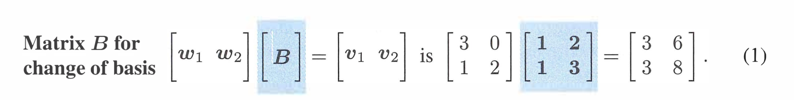
> **于是我们得到**`**Identity Transform**`**的基变换矩阵的公式:**$\bf B=W^{-1}V$
> 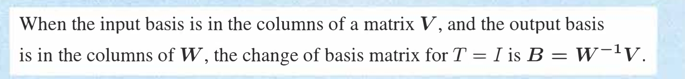

:::success
**我们看一个小案例加深理解：**
假设我们输入空间$V$选取$\{\begin{bmatrix} 3\\3\end{bmatrix},\begin{bmatrix} 6\\8\end{bmatrix}\}$作为基向量, 输出空间$W$选取$\{\begin{bmatrix} 3\\1\end{bmatrix},\begin{bmatrix} 0\\2\end{bmatrix}\}$作为基向量；我们利用公式求得坐标转换矩阵: $B=\begin{bmatrix} 1&2\\1&3\end{bmatrix}$
现在我在$\{\begin{bmatrix} 3\\3\end{bmatrix},\begin{bmatrix} 6\\8\end{bmatrix}\}$基下给定一个坐标$\bf x=\begin{bmatrix} 1\\2\end{bmatrix}$, 求在$\{\begin{bmatrix} 3\\1\end{bmatrix},\begin{bmatrix} 0\\2\end{bmatrix}\}$基下的坐标。
利用$\bf \begin{bmatrix} 3&6\\3&8\end{bmatrix}x=\begin{bmatrix} 15\\19\end{bmatrix}$, 我们知道了这个向量，现在这个向量在$\{\begin{bmatrix} 3\\1\end{bmatrix},\begin{bmatrix} 0\\2\end{bmatrix}\}$基下的坐标是什么呢?
解$\begin{cases} 3y_1=15\\y_1+2y_2=19\end{cases}$这个线性方程组, 得到$\begin{cases} y_1=5\\y_2=7\end{cases}$
这和我们使用$\bf Bx$的到的结果一致。
所以我们看到，$\bf B$就是将**同一个向量的坐标在不同的基下进行转化的一个矩阵**。
虽说是基变换矩阵，实际上还是对同一个向量在不同的基下进行了坐标转换。
:::

## 1.2 理解基变换矩阵公式
> 从[线性变换本质](https://www.yuque.com/alexman/so5y8g/bvm7ax#YcA5C)中我们知道，线性变换矩阵实际上将同一个向量在一个基下的坐标转换成了在另一个基下的坐标。
> 对于任意向量$\begin{cases} u=c_1v_1+\cdots+c_nv_n \\u=d_1w_1+\cdots+d_nw_n\end{cases}$, 分别代表$u$在两个不同的坐标系统下的表示
> 写成矩阵形式，我们有:
> 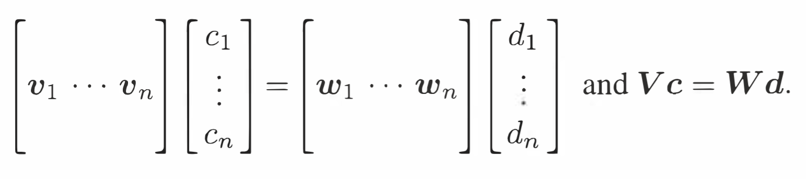
> 如果说$\bf c$是**输入空间的基向量线性组合的坐标**，则$\bf d=W^{-1}Vc$就是**输出空间的基向量线性组合的坐标。其中**$\bf W^{-1}V$**就是坐标转换矩阵。对于**$\bf B=W^{-1}V$**的另一种理解就是: 这个矩阵**$\bf B$**记录了如何将一组基中每一个基向量表示为另一组基向量的线性组合，而形成的矩阵。**
> 
> 观察$\bf W^{-1}V$的形式，我们发现，当我们的输入空间$\bf V$的基向量选择为标准基向量时，$\bf B=W^{-1}$, 这表明，我们的坐标转换矩阵的系数不会大到哪里去。于是我们有:
> 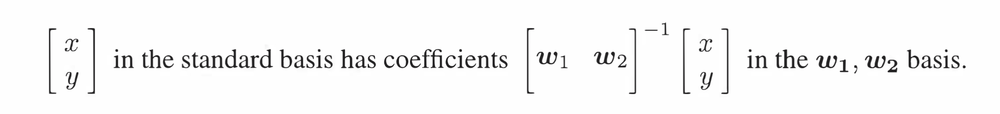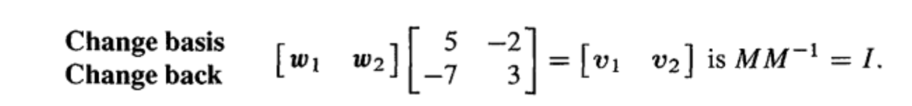
> **而当我们的输出空间**$\bf W$**的基向量选择为标准基向量时，**$\bf B=V$**, 此时我们可以对输入空间坐标**$\bf c$**直接使用**$\bf d=Bc$**得到输出空间下的坐标表示**$\bf d$

## 1.3 恒等变换的基变换矩阵
> 对于一个恒等变换$T(v)=v$，我们经常对输入输出空间使用相同的基向量，这样我们的基变换矩阵公式变为$\bf B=W^{-1}V=B_{out}^{-1}B_{in}$, 其中$\bf B_{in}$表示输入空间的基组成的矩阵，$\bf B_{out}$表示输出空间的基组成的矩阵。
> 当输出空间为标准基时，也就是$\bf W$的各列是标准基时, $\bf B=V=B_{in}, B^{-1}=V^{-1}=W^{-1}=B_{out}^{-1}$

# 2 线性变换分解过程**⭐⭐⭐⭐⭐**
> 由于不同的基向量选取会导致不同的基变换矩阵$\bf B$, 而我们希望我们的$\bf B$越简单越好，最好能是对角矩阵，看到对角矩阵，我们很容易想到特征值和特征向量，这是我们在对角化时引出的概念。
> 对于一个恒等变换$T:R^n\to R^n$, 他的线性变换矩阵是方阵$\bf A$。如果我们使用标准基，$\bf A$可能不是对角矩阵，但如果我们能找到$n$个线性无关的特征向量作为我们的输入输出空间的基，那么我们最终得到的线性变换矩阵$\bf A$就会是一个对角阵。

## 2.1 选取特征向量作为基
> 在[投影变换](https://www.yuque.com/alexman/so5y8g/bvm7ax#az9kr)中，我们介绍了投影变换实际上也是一种线性变换$T$，因此可以为其找到一个描述矩阵。本小节探讨这样做的意义。

:::success
对于一个投影变换$T$, 他将所有$v=(x,y)\in R^2$投影到直线$y=-x$上。如果我们在构建转换矩阵$\bf A$时使用对输入输出空间都是用标准基$\{\bf v_1,v_2\}=\{\begin{bmatrix} 1\\0\end{bmatrix},\begin{bmatrix} 0\\1\end{bmatrix}\}$。
那么$T(\mathbf v_1)=\begin{bmatrix} 1/2\\-1/2\end{bmatrix}$, $T(\mathbf v_2)=\begin{bmatrix} -1/2\\1/2\end{bmatrix}$(投影变换后在标准基下的坐标)
于是我们的$\bf A=\begin{bmatrix} 1/2&-1/2\\-1/2&1/2\end{bmatrix}$, $\bf A^T=A, A^2=A$
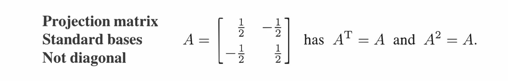
:::
:::info
特征向量的选取肯定不是拍脑袋想出来的，我们对$\bf A$逆向工程一下，求他的特征值和特征向量，得到$\lambda_1=0,v_1=\begin{bmatrix} 1\\1 \end{bmatrix}$和$\lambda_2=1,v_2=\begin{bmatrix} 1\\-1 \end{bmatrix}$
我们可以选取$v_1,v_2$作为输入空间和输出空间的基，则:
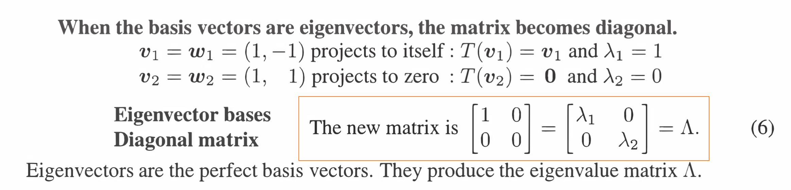
:::

## 2.2 不同基下的线性变换矩阵**⭐⭐⭐⭐**
### 2.2.1 抽丝剥茧式理解
:::warning
对于在`1.3`中得到的$\bf B=W^{-1}V$, 如果我们的输出空间使用标准基的话, 也就是$\bf W$的各列是标准基时:
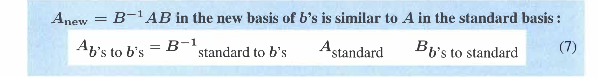
我们来解读一下这个$\bf y=\mathbf{B^{-1}AB}x$的含义（下面的$\bf V,W$其实是同一个空间, 所以$\bf V$和$\bf W$的基向量列表**长度相同, 列表中的基可以任意选取**, 于是$\bf A,B$均为方阵, 为了叙述方便, 我们称$\bf V$为特征空间，$\bf W$为标准空间,  也就是$\bf B$的各列是标准基）:

- 首先是输入向量$\bf x$, 他是在**特征空间的向量坐标**
- (**基变换矩阵**)然后是$\bf B$, 他是我们$\bf V\to W$的基变换矩阵, 将我们在**特征空间的特征向量基**$v_j$下的坐标表示转换成**标准空间的基**$w_j$下的坐标表示; $\bf B$表示进行了一次**坐标转换**
- (**线性变换矩阵**)接着是$\bf A$, 表示我们在**标准空间的基**下进行线性变换(如果是恒等变换则$\bf A=I$)，然后将线性变换的结果仍然使用标准空间的基来表示转换后的坐标(就是在相同维数空间的标准基之间进行**恒等线性变换**); $\bf A$表示在标准空间中进行线性变换。
- (**基变换矩阵**)最后是$\bf B^{-1}$, 表示我们的$\bf W\to V$的基变换矩阵，将我们在**标准空间的基**$w_j$下的坐标**转换回特征空间的基**$v_j$下的坐标表示。 $\bf B^{-1}$表示我们要将**坐标转回特征空间(是**$\bf B$**的逆变换)**。

上述三步的组合$\bf B^{-1}AB$(也称$ITI$线性变换)表示我们在特征空间的基的背景下进行恒等线性变换, 且将转换后的$\bf y$向量使用特征向量来表示坐标。
我们写成$\bf A_{new} = B^{-1}AB$就是想说明，对于同一个恒等线性变换，在不同的基系统下的线性变换矩阵是不同的，且有$\bf A\sim A^{-1}$($\bf A$相似于$\bf A^{-1}$的关系，他们的特征值是相同的)
:::
**图解(3Blue1Brown）**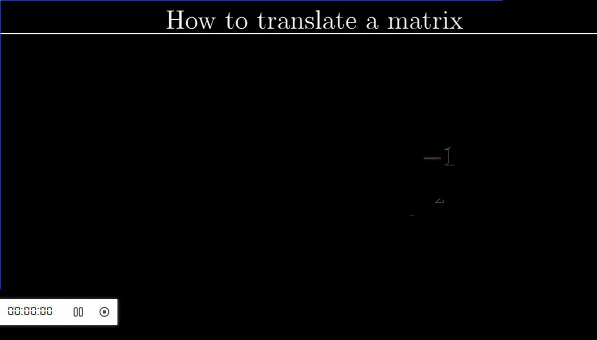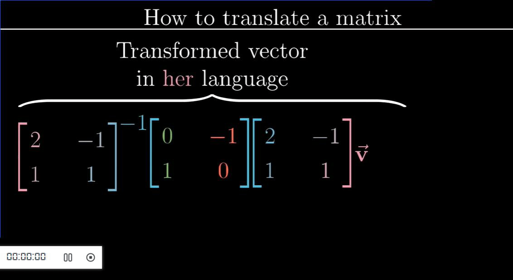
:::success
对于一个恒等变换，$\bf A$就是我们在$\bf W$中(**一般选取标准基**)描述恒等线性变换$T$的矩阵，$\bf A_{new}$是在$\bf V$(**一般选取特征向量作为基**)中描述线性变换$T$的矩阵
一般而言$\bf A_{new}$就是$\bf A$的对角化过程中的对角矩阵(回忆一下对角化公式: $\bf A=BA_{new}B^{-1}$, 也就是$\bf A_{new}=B^{-1}AB$)
$\bf A_{new}$**在特征向量(主轴)的视角下看待线性变换，**$\bf A$**在标准基下看待线性变换**
:::
 

### 2.2.2 算例
:::success
详见作业`1`
:::

## 2.3 选取奇异向量作为基**⭐⭐⭐**
### 2.3.1 抽丝剥茧式理解
:::warning
**上面的特征值方式针对的主要是恒等线性变换，那么对于任意线性变换， 我们可以使用下列方法简化线性变换矩阵**:
`2.1`和`2.2`中我们**针对恒等线性变换**提供了的选取最佳线性变换矩阵的方法, 现在对于两个不同的空间$\bf V,W$和不同长度的基向量列表$\{v_1,v_2,....,v_n\}$, $\{w_1,w_2,...,w_m\}$均不是标准基。($\bf V$是输入空间, $\bf W$是输出空间)。
从奇异值的视角理解$\bf U^{-1}A Vx$会有些困难，我们一步一步阐述:

- 首先是输入坐标$\bf x$, 他是在$\{v_1,v_2,....,v_n\}$下的坐标
- (**基变换矩阵**)然后是$\bf V$, 他是我们$\bf V\to V$的基变换矩阵, 将我们在$\{v_1,v_2,....,v_n\}$下的坐标表示**转换成**$\bf V$下的**标准基**坐标表示; 
- (**线性变换矩阵**)接着是$\bf A$, 表示我们在$\bf V$的**标准基**下进行线性变换, 然后将线性变换的结果用$\bf W$空间的**标准基**来表示转换后的坐标(就是在**不同维数的空间的标准基**之间进行**非恒等线性变换**); 
- (**基变换矩阵**)最后是$\bf U^{-1}$, 表示我们的$\bf W\to W$的基变换矩阵，  将我们在 $\bf W$空间的**标准基**下的坐标**转换成**$\{w_1,w_2,...,w_m\}$下的坐标的坐标表示。

其实上面的叙述就是原书上这两段话的含义。
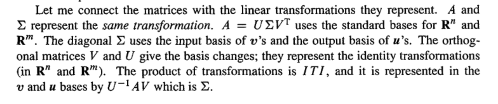
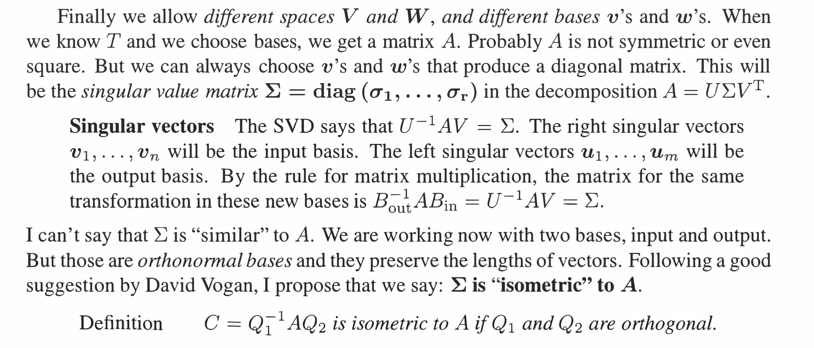
:::

### 2.3.2 算例
> 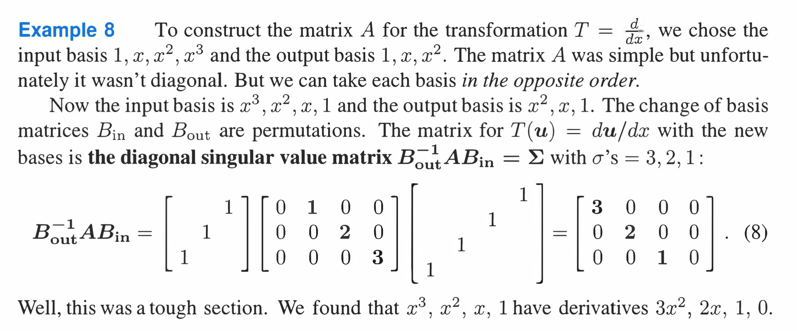
> 理解了`2.3.1`中的叙述，这里就更加好理解了。
> 首先这是一个非恒等变换，因为输入空间是$\bf R^4$, 输出空间是$\bf R^3$
> 比如对于多项式$p(x)=1$来说
> - 他在$\{x^3,x^2,x,1\}$基下的坐标是$\begin{bmatrix} 0\\0\\0\\1 \end{bmatrix}$, 在$\{1,x,x^2,x^3\}$(这是$\mathcal{P}(R)$的标准基)下的坐标是$\begin{bmatrix} 1\\0\\0\\0 \end{bmatrix}$, 所以我们需要一个转换矩阵
> - (**坐标转换**)于是转换矩阵$\bf B_{in}=\begin{bmatrix} 0&0&0&1\\0&0&1&0\\0&1&0&0\\1&0&0&0\end{bmatrix}$, 他将$\bf R^4$空间任意基下的多项式坐标转换成$\bf R^4$空间下标准基的坐标。
> - (**线性变换**)然后是我们的求导线性变换矩阵，在[求导变换](https://www.yuque.com/alexman/so5y8g/bvm7ax#VYpwA)中介绍过，是$\bf A=\begin{bmatrix} 0&1&0&1\\0&0&2&0\\0&0&0&3\end{bmatrix}$, 他在$\bf R^4$和$\bf R^3$的标准基之间进行坐标转换，最终转换成$\bf R^3$下的坐标。
> - (**坐标转换**)最后是我们的逆坐标变换矩阵$\bf B_{out}$。因为我们之前已经在标准基下完成了线性转换，现在要将 在$\bf R^3$的标准基下的坐标转换回的$\bf R^3$的$\{x^3,x^2,x,1\}$基下的坐标，得到的就是$\bf B_{out}^{-1}=\begin{bmatrix} 0&0&1\\0&1&0\\1&0&0\end{bmatrix}$矩阵。

# 3 图像压缩**⭐⭐**
## 3.1 有损压缩
> 例如一幅像素是$512\times 512$的静态黑白图像，图像用一个向量来表示，该向量属于$\bf R^n$空间，其中$n=512\times 512$。向量的分量$x_i$表示某个像素的灰度，变化范围$0\leq x_i \leq 255$，占$8\space bits$ 。彩色图像描述每个点的像素需要三个数据，所以向量长度是黑白图像的$3$倍(机器学习中的`Fully-connected Layer`就是利用了图像的向量展开形式)。
> 如果视频的每一帧静态黑白画面都使用这么长的向量去描述，在网络上传输就会占用大量的带宽。但如果我们使用基变换（`JPEG`标准）， 就可以有效压缩描述图像所需的内存。
> 图像的标准压缩方式为`JPEG`（联合图像专家组 Joint Photographic Experts Group）。**图像压缩的本质就是基变换。**
> **压缩前图像采用的基向量是标准基**。但是在图像中离得很近的区域，颜色是非常接近的，比如教学视频中黑板的一个区域，这些区域像素的灰度值很接近，但是用标准基来存储并没有利用上这一特点，因为标准基互相线性无关，所以对于一个$\begin{bmatrix} 1\\1\\1\\\vdots\\1\end{bmatrix}_{512\times 512}$的超长向量(代表$512\times 512$的黑板, 图像颜色分布很相近)。
> 如果我们使用标准基$\{\begin{bmatrix} 1\\0\\0\\\vdots\\0\end{bmatrix}_{512\times 512},\begin{bmatrix} 0\\1\\0\\\vdots\\0\end{bmatrix}_{512\times 512},\cdots,\begin{bmatrix} 0\\0\\0\\\vdots\\1\end{bmatrix}_{512\times 512}\}$来表示这个向量，需要$512\times 512$这么多的坐标系数。
> 所以对于图像各处颜色分布很接近的情况，$\begin{bmatrix} 1\\1\\1\\\vdots\\1\end{bmatrix}_{512\times 512}$是一个很好的基, 只需要一个坐标系数，所以在一组基中有一个这样的向量能解决很大的问题，可以处理像素灰度接近一致的情况。
> 
> 但图像不是灰度完全一致的，因此接下来的问题是跟它相配合的基要选择哪些。极端的情况包括选择 $\begin{bmatrix} +1\\-1\\+1\\-1\\\vdots \end{bmatrix}$ ，它可以给出类似国际象棋盘那种黑白相间的状态（最高频信号，噪音、扰动……在图像压缩后很少存在），还有图像一半图像暗一半图像亮，可以选择 $\begin{bmatrix} \vdots \\+1\\-1\\\vdots\\-1 \end{bmatrix}$ 。

## 3.2 小波基
> `Wavelets`是小波，一般而言每个小波的非零项会集中在一起，比如$w_3$和$w_4$中，而且一般而言小波互相正交，所以可以作为一种基的选取。
> 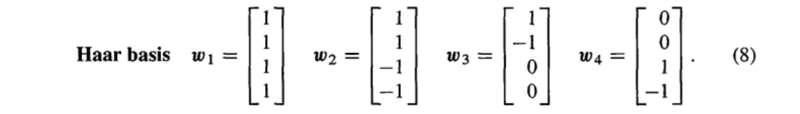
> 下面介绍令一组小波基, 以$\bf R^8$举例:
> 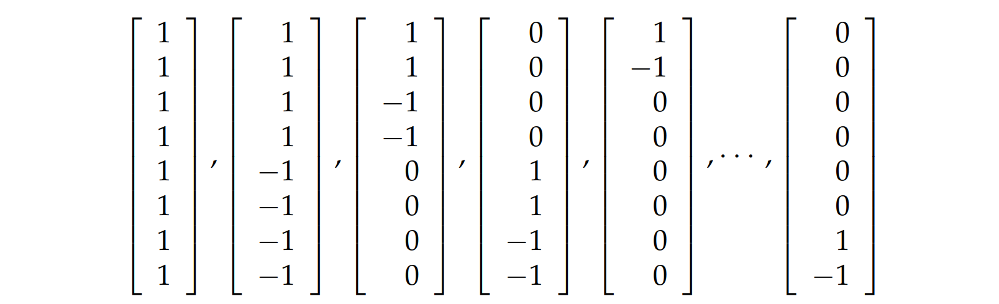
> 以上只是两种小波的选择，还有很多种更多精细的选择，这一组基中有太多从$+1$跳转到$-1$的变化。**线性代数要做的基变换，就是将标准基下的向量**$\bf p$**表示为小波基的线性组合，**求出线性组合的参数$\bf c$满足$\bf p=c_1w_1+c_2w_2+……+c_8w_8$，即$\bf p=W c$。$\bf W$即以小波基向量为列向量的小波矩阵。因此有 $\bf c=W^{−1}p$ 。

## 3.2 傅里叶基
> 在`JPEG`中，将$512\times 512$的区域划分为$8\times 8$的区块进行处理，所用到的基是傅里叶基向量。
> 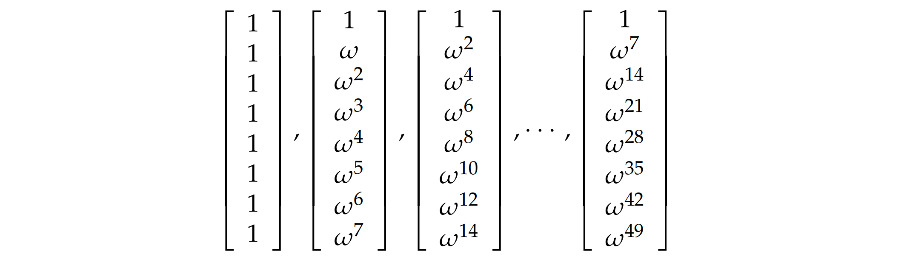
> 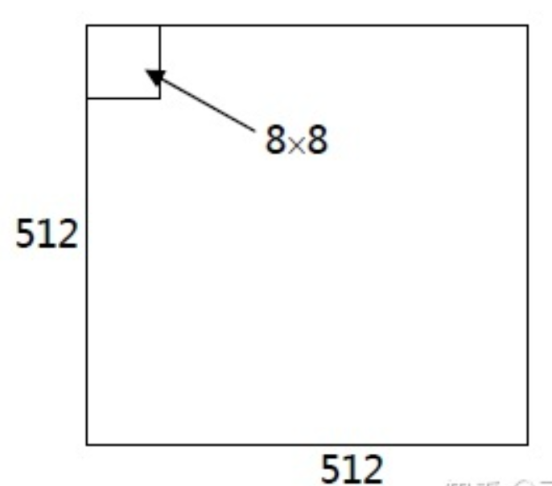
> 傅里叶基（`Fourier basis`）就是之前讲过的[傅里叶矩阵](https://www.yuque.com/alexman/so5y8g/eimtcy#eKkgG)的列向量，每个元素为复数的幂。在$8\times 8$区块中有$64$个系数，$64$个基向量，在这个$64$维空间中做基变换。
> 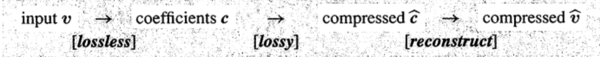
> 首先对输入的信号$\bf v$，从标准基变换为傅里叶基，得到系数$c$，这一步是无损的过程。
> 之后设置阀值进行压缩，超过阀值的认定为肉眼无法分辨的信号。在数学上表现为某些基向量的系数很小，这部分可以丢弃，随之得到新的系数 $\hat{c}$ 。
> 将新的系数赋值在傅里叶基上求和得到 $\bf \hat{x}=∑\hat{c_i}v_i$ 。此时求和项已经不是$64$项，可能只剩下两三项，这就是压缩。
> 视频文件可以视为图像的序列，一幅一幅进行图像压缩即可。但这样做没有利用好视频的性质，因为视频是连续的，一幅图像和下一幅图像非常接近，因此可以存储一幅基础图像，随后只存储下一幅图像对它的修正部分。

## 3.3 总结
> **好的基向量组要求：**
> - 第一，可以快速求逆矩阵，例如快速傅里叶变换，这里也存在快速小波变换，因为小波矩阵列向量正交，因此可以转置得到逆矩阵；
> - 第二，要少量基向量就可以近似信号，可压缩的比例就比较高。

# 4 矩阵的极坐标分解**⭐**
> 每一个复数都有其极坐标形式$re^{i\theta}$, 在[复数基础](https://www.yuque.com/alexman/dydxis/gpg6n4)中已经介绍过。他代表了一个在单位圆上的复数$e^{i\theta}$乘以非负常数$r$。
> 我们将复数$re^{i\theta}$抽象成一个两个$1\times 1$ 的矩阵, 分别是$\bf H=\begin{bmatrix} r\end{bmatrix}$和$\bf Q=\begin{bmatrix} e^{i\theta} \end{bmatrix}$, 那么由于$r\in R$, 则$\bf H$是正定矩阵, 因为$|e^{i\theta}|=1, e^{i\theta}\in \mathbb{C}$, 所以$\bf Q$为酉矩阵。

## 4.1 QH、KQ分解
> 极坐标分解说的是，对于任意一个**实数方阵**, 他可以被分解为$\bf A=QH$, $\bf Q$是正交矩阵，$\bf H$是对称半正定矩阵。特别的，如果$\bf A$是可逆矩阵，则$\bf H$是正定矩阵，且$\bf H^2=A^TA$
> 我们还有另一种类似的分解: $\bf A=KQ$, 其中$\bf K=U\Sigma U^T,Q=UV^T$, 此时如果$\bf A$可逆，$\bf K$是正定矩阵， 且$\bf K^2=AA^T$, 证明过程省略，和$\bf QH$的基本一致。

**证明-H为正定矩阵, H^2=A^TA**> 1. **H为正定矩阵**
> 
对于任意一个矩阵，其可以进行奇异值分解: $\bf A=U\Sigma V^T..................................(1)$, 由于$\bf U,V$都是正交矩阵，所以$\bf U^TU=I, V^TV=I$, 所以我们将$\bf V^TV$插入$(1)$中
> 得到: $\bf A=(U V^T)(V\Sigma V^T)=(Q)(H)$
> 因为两个正交矩阵的乘积仍然是正交矩阵, 所以$\bf UV^T=Q$
> 因为$\bf A$是可逆的，所以$\bf det(A)=det(Q)det(H)\neq 0$, 因为$\bf Q$可逆，所以$\bf det(Q)\neq 0$, 所以$\bf det(H)\neq 0$, 即$\bf H$**可逆**；因为$\bf H=V\Sigma V^T$且$\bf V$可逆， 所以$\bf \Sigma$**可逆**, 所以$\bf \Sigma$实际上是对角矩阵，同时因为$\bf V^T$是正交矩阵，所以矩阵$\bf H$可以正交对角化，所以$\bf H$是半正定矩阵(所有特征值大于等于$0$)，又因为$\bf H$可逆，所以其零空间只有$\{0\}$, 也就是其特征值不包含$0$, 于是其所有特征值大于零，所以$\bf H$是正定对称矩阵，证毕。
> 2. $\bf H^2=A^TA$
> 
$\bf H^2=V\Sigma^2 V^T=A^TA$, 所以$\bf H$实际上是$\bf A^TA$的平方根，且为正定矩		阵。

**Lemma-正交矩阵的乘积仍是正交矩阵**> **两个正交矩阵的乘积仍然是正交矩阵。**
> 假设$\bf A,B$均是正交矩阵，则$\bf A^TA=I,B^TB=I$, 则$\bf (AB)^T(AB)=B^TA^TAB=I$, 证毕。

### 
## 4.2 算例
> 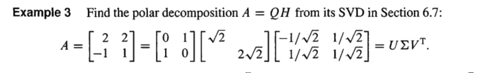

**Key**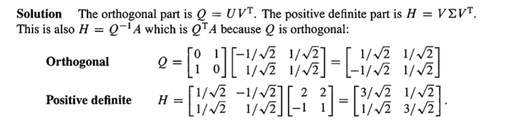

## 4.3 工程学中应用
> 在工程学领域，极坐标分解方阵将矩阵的旋转分量$\bf Q$和拉伸分量$\bf H$分离出来。$\bf H$的特征值是$\bf A$的奇异值，$\bf H$的特征向量是$\bf A^TA$的特征向量(因为$\bf H=A^TA$,在[奇异值与特征值](https://www.yuque.com/alexman/so5y8g/psybsc#X2fvw)中有所介绍) ，这些特征向量给出了主轴的方向，$\bf Q$则旋转了这些主轴。
> 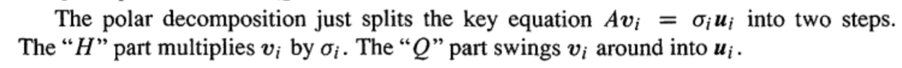

 

# 5* 选择性质较好的基
> 对应第五版中的`8.3`章节(新增章节)

## 5.0 前言
> 上文中我们已经看到了同一个线性变换$T$在不同的基下有不同的矩阵$\bf A$的描述, 这里我们列举几个常见的坐标变换分解。

## 5.1 特征值
> 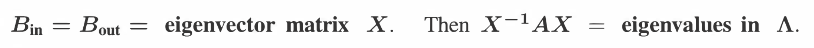
> 这种选择要求线性变换矩阵是$\bf A$是方阵，且有$n$和线性无关的特征向量。也就是$\bf A$可以对角化。

## 5.2 奇异值
> 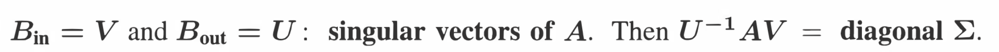
> 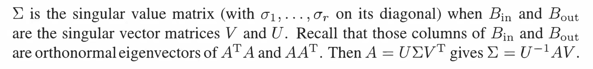

## 5.3 Jordan Form
> 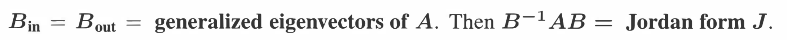
> 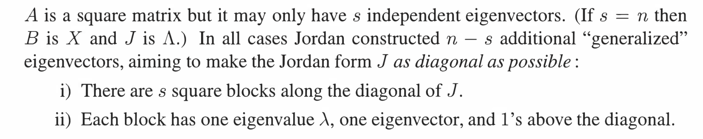

## 5.4 傅里叶矩阵
> 

# 6 函数空间的基
## 6.1 Hilbert Matrix
> 

## 6.2 函数空间的正交基
> 
> 

# 7 勒让德和切比雪夫多项式

> 

# 8 作业
## P1 多项式的基变换**⭐⭐⭐⭐**
> 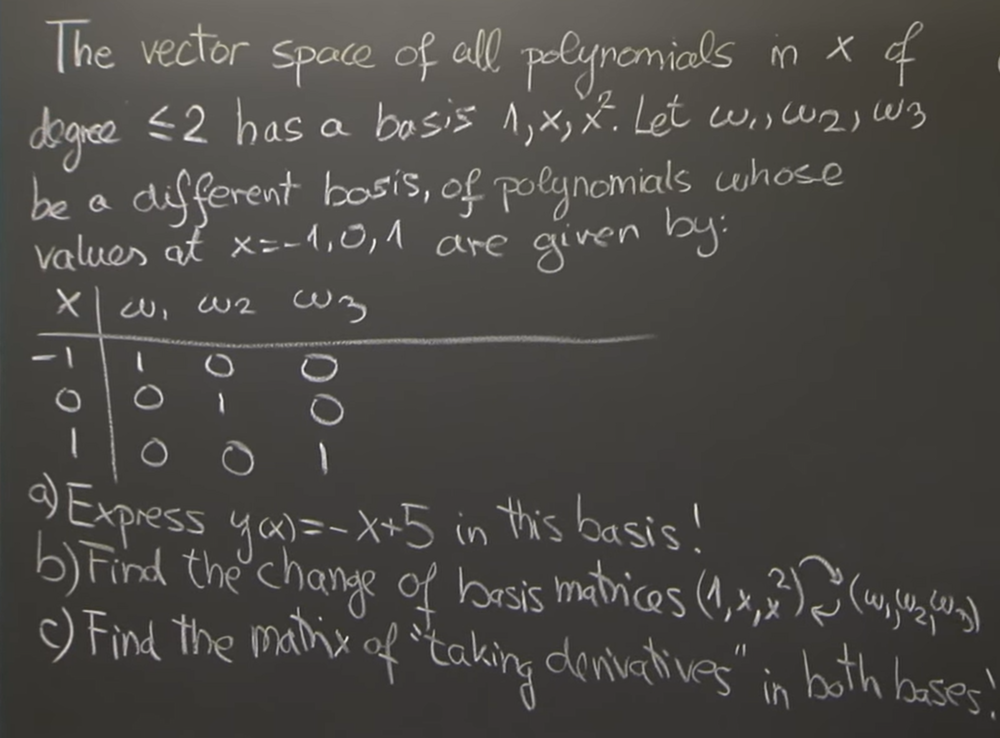

**(a) 换一种组基表达同一个向量**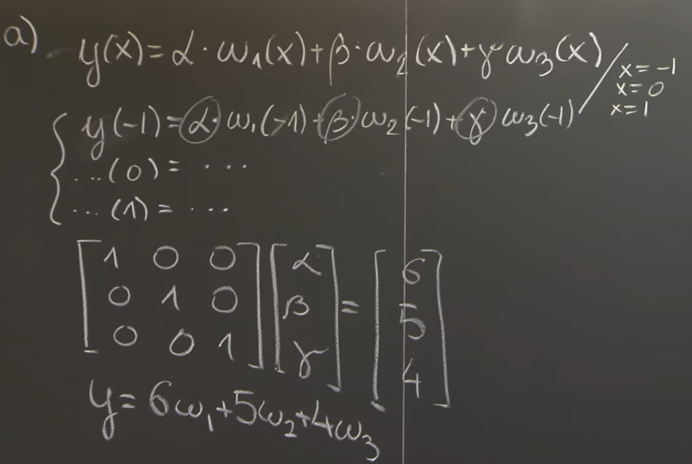
**(b) 将一组基表示为另一组基**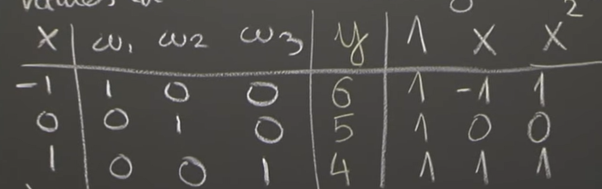
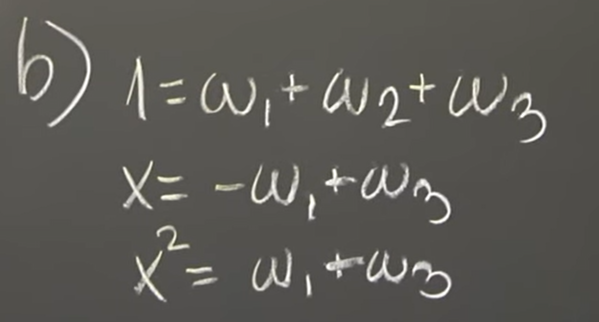
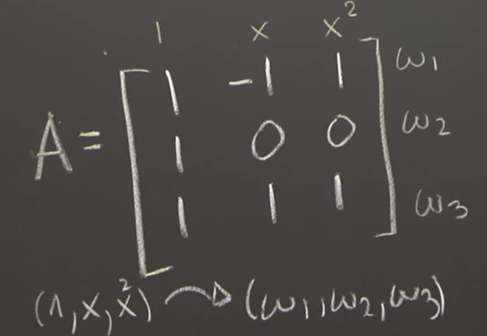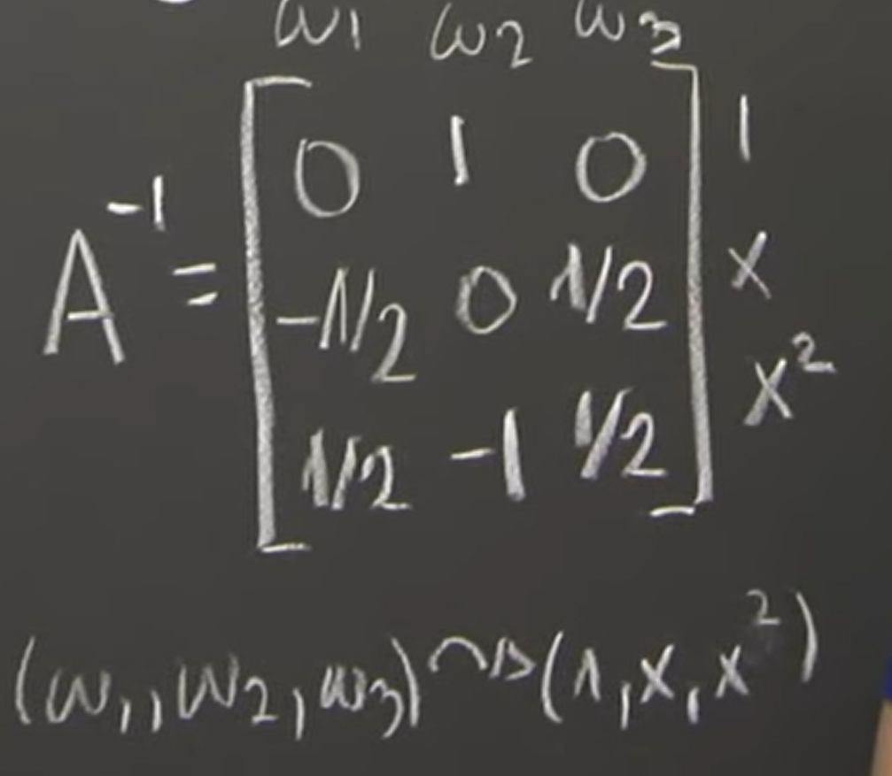
虽然在$(a)$问中我们没有明确的求出$w_i$的关于$x$的表达式，但是$\bf A^{-1}$(竖着读这个矩阵)实际上给出了$w_i(x)$, 也就是$\begin{cases} w_1(x)=-\frac{1}{2}x+\frac{1}{2}x^2\\w_2(x)=1-x^2\\w_3(x)=\frac{1}{2}x+\frac{1}{2}x^2\end{cases}$
**(c) 坐标变换->线性变换->坐标变换**
1. 以$\{1,x,x^2\}$为基:

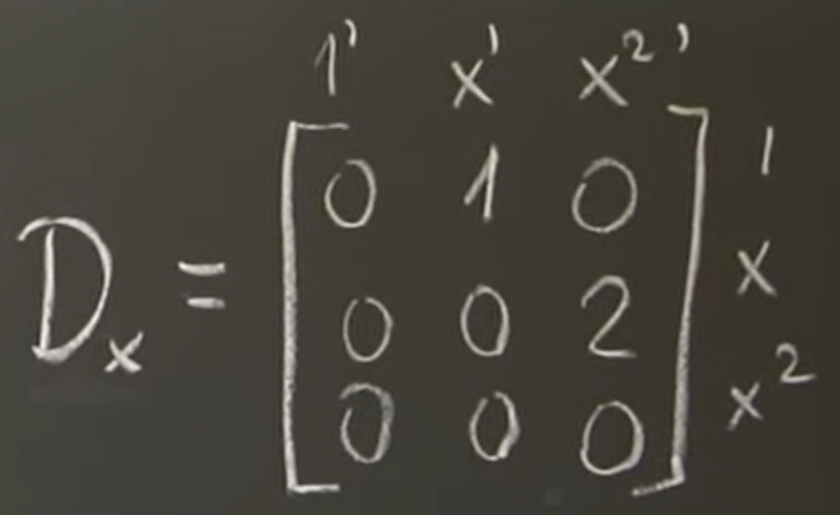

2. 以$\{w_1,w_2,w_3\}$为基:

$\bf D_w=AD_xA^{-1}=\begin{bmatrix} -3/2&2&-1/2\\ -1/2&0&1/2\\1/2&-2&3/2\end{bmatrix}$
其中，$\bf A^{-1}$表示我们从$\{w_1,w_2,w_3\}$下的坐标转换成$\{1,x,x^2\}$下的坐标
$\bf D_x$表示在$\{1,x,x^2\}$下的线性转换矩阵，$\bf A^{-1}$表示从$\{1,x,x^2\}$下的坐标转换成$\{w_1,w_2,w_3\}$下的坐标, 可以发现$\bf D_w\sim D_x$

## P2 Haar Wavelet Basis
> 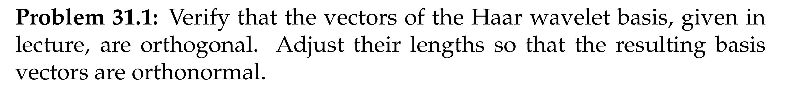
> 

**Key**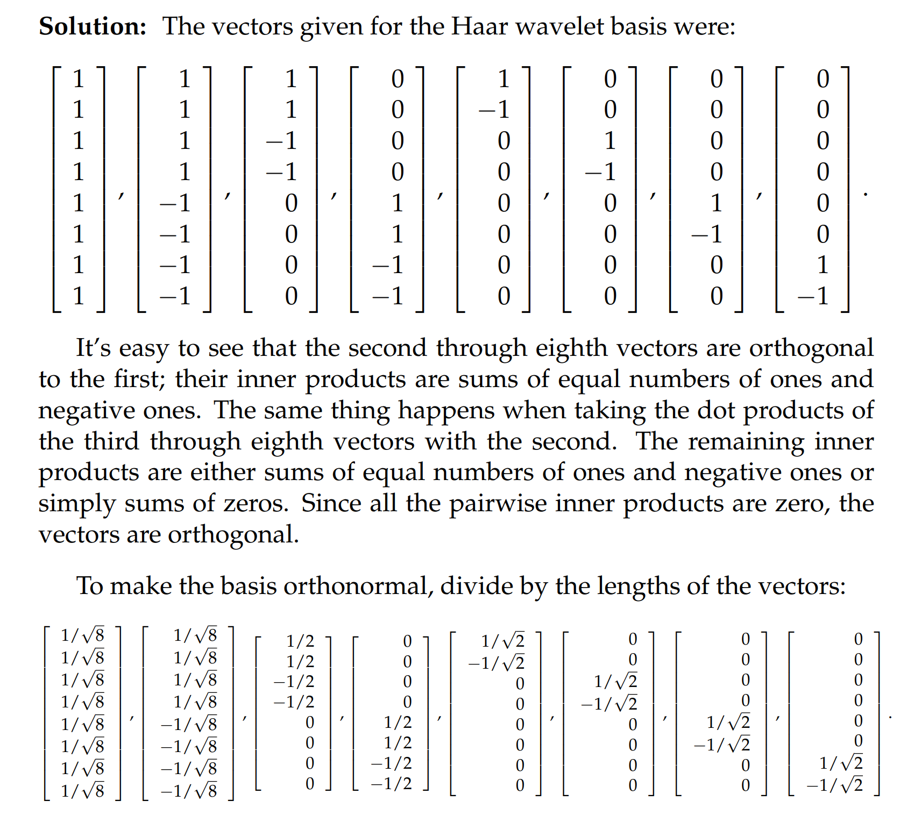

## P3 矩阵空间的基的选取
> 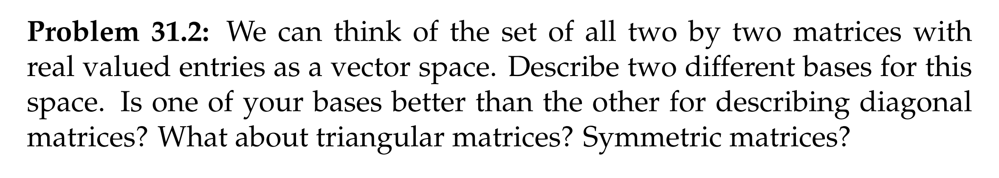

**Key**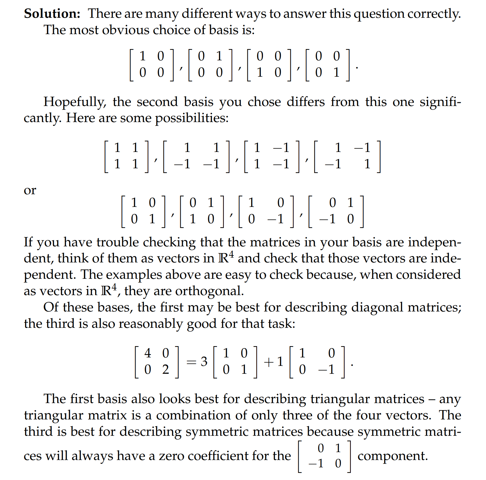
