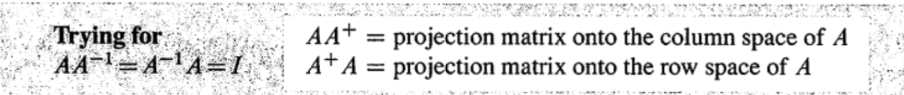
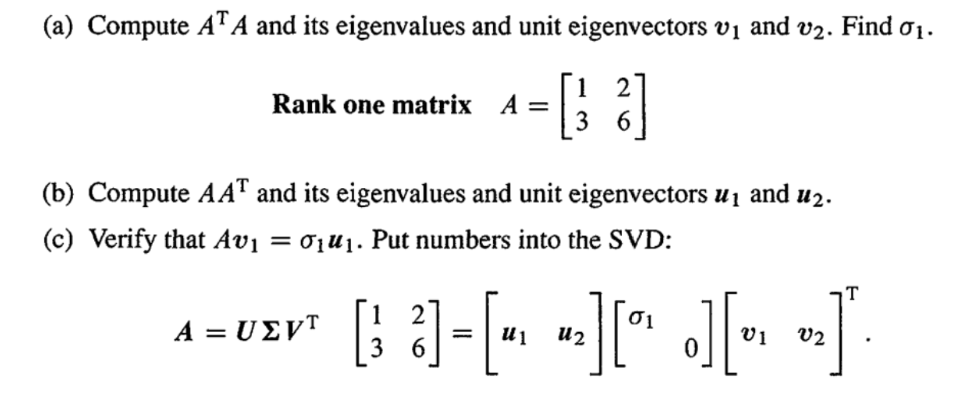
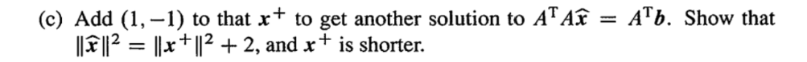

**参考:** [https://zhuanlan.zhihu.com/p/46124893](https://zhuanlan.zhihu.com/p/46124893)
# 0 前言
[Left and Right Inverses, Pseudoinverse.pdf](https://www.yuque.com/attachments/yuque/0/2022/pdf/12393765/1660810757419-b5e00d81-333d-45c0-8368-22846373fd87.pdf)
> 本节主要介绍左右逆矩阵和伪逆矩阵。对应`Introduction to Linear Algebra`第四版书中的`7.3`章节。
> 在[奇异值分解](https://www.yuque.com/alexman/so5y8g/psybsc)一章， 我们了解到奇异值分解就是将一个长方形矩阵$\bf A$的行空间中的向量线性变换到列空间去。用数学语言表示就是, $\bf \forall v_i\in Row(A), Av_i=\sigma_i u_i, u_i\in Col(A)$。
> 其实在学完线性变换之后，我们对$\bf Av=\sigma u$就会产生新的理解，$\bf A$此时就是一个线性变换矩阵，如果我们的行空间和列空间都使用标准基的话, 这个线性变换过程就不需要使用任何的坐标变换矩阵$\bf B_{in}$和$\bf B_{out}$。
> 那么现在，$\bf A$是一个从行空间到列空间的线性变换，如果我们想得到列空间到行空间的线性变换，是不是就得求$\bf A^{-1}$呢？对于方阵来说，只要列线性无关，求$\bf A^{-1}$只需要使用矩阵消元或者$\bf A^{-1}=\frac{1}{det(A)}C^T$公式。但是如果$\bf A$不是方阵呢？这就要介绍到**伪逆**的概念了。
> 但在介绍伪逆的概念之前，我们先补充一些书中讲的不是很清楚的**左右逆**的概念。

# 1 左右逆
## 1.1 两侧逆矩阵
> **称为**`**Two-sided Inverse**`
> 矩阵$\bf A_{m\times n}$的两侧逆矩阵 $\bf A^{−1}$ 满足 $\bf A^{−1}A=AA^{−1}=I$ 。这就是我们通常说矩阵$\bf A$的逆矩阵。此时$r=m=n$，$\bf A$为满秩方阵。

## 1.2 左逆矩阵
> **称为**`**Left Inverse**`
> 矩阵$\bf A_{m\times n}$的列满秩$r=n<m$，列向量线性无关。则矩阵的零空间$\bf N(A)$只有零向量，方程$\bf Ax=b$无解或者有唯一解。当矩阵$\bf A$列满秩的时候，矩阵$\bf A^TA$为可逆矩阵，这是讨论最小二乘问题的核心。
> 
> 矩阵$\bf A^TA$为$n\times n$的对称矩阵且满秩，因此矩阵$\bf A^TA$是可逆矩阵，即$\bf (A^TA)^{−1}A^TA=I$。我们称 $\bf A_{left}^{−1}=(A^TA)^{−1}A^T$ 为$\bf A$的左逆矩阵。
> 
>  $\bf A_{left}^{−1}$ 为$n\times m$矩阵，而$\bf A$为$m\times n$矩阵， $\bf A_{left}^{−1}A=I$ 是$n\times n$矩阵。

## 1.3 右逆矩阵
> **称为**`**Right Inverse**`
> 矩阵$\bf A_{m\times n}$的行满秩$r=m<n$，行向量线性无关。则矩阵的左零空间$\bf N( A^T )$只有零向量。$\bf A$的零空间维数为$n-m$，因此有$n-m$个自由变量，$n$大于$m$时，方程$\bf Ax=b$有无穷多解。
> 
> 因此矩阵$\bf AA^T$是可逆矩阵( **因为**$\bf N(AA^T)=N(A^T)$)，即$\bf AA^T(AA^T)^{−1}=I$矩阵$\bf A$的右逆矩阵为$\bf A_{right}^{−1}=A^T(AA^T)^{−1}$。

## 1.4 投影
> 通常情况下**右乘左逆矩阵**得不到单位阵$\bf I$的，$\bf AA_{left}^{−1}=A(A^TA)^{−1}A^T=P$，这是列空间的投影矩阵。仅在$r=m=n$的条件下，$\bf AA_{left}^{−1}=I$。
> 
> 一个**长方形矩阵**$\bf A$不可能有两侧逆，因为$\bf A$和 $\bf A^T$ 总有一个零空间的维数不是$0$。
> 
> 同样的，**左乘右逆矩阵**得到的是$\bf A_{right}^{−1}A=A^T(AA^T)^{−1}A$，这是向行空间投影的矩阵，投影矩阵在投影空间内表现的就像单位阵$\bf I$一样。

## 1.5 列空间到行空间的映射
> 可逆矩阵的零空间和左零空间只有零向量。列满秩的矩阵的零空间只有零向量，行满秩的矩阵的左零空间只有零向量。但对于不满秩的矩阵$\bf A_{m\times n}$（$r<n，r<m$），其零空间和左零空间均存在，这就使得它取不到两侧逆矩阵$\bf A^{-1}$。
> 因为逆矩阵的作用可以看作是原矩阵的逆操作，但是矩阵$\bf A$对其零空间中向量操作后变为$0$，这时没有逆操作能够恢复这一过程($\bf 0$向量乘以一个矩阵还是$\bf 0$向量)，所以一旦矩阵$\bf A$有大于零维的零空间, 也就是除了零向量还有其他向量，它就不能取两侧逆矩阵$\bf A^{-1}$。
> 
> 对于一个矩阵$\bf A$来说，$\bf Ax$总是在$\bf A$的列空间中。$\bf x$和$\bf Ax$之间其实是一个双射的关系(`One-to-one correspondance/Bijection`)。换句话说，对于$\bf A$的行空间中的向量$\bf x\neq y$, 总是有$\bf Ax\neq Ay$, $\bf Ax$和$\bf Ay$都在$\bf A$的列空间中。

**证明****待证明的命题：如果**$\bf x\neq y$**，那么**$\bf Ax\neq Ay$
使用`Contradiction`证明，假设$\bf \exist x,y \in Row(A),x\neq y,s.t \space Ax=Ay$
则$\bf A(x-y)=0$, 所以$\bf x-y$在$\bf A$的零空间中。但我们知道，一个向量空间对加法是封闭的，于是$\bf x-y\in Row(A)$, 由于行空间和零空间正交，所以$\bf x-y=0$(因为只有零向量自己和自己正交), 与$\bf x\neq y$的前提矛盾，所以原命题得证。
:::warning
**我们可以做如下总结：**
从矩阵**行空间到列空间**的映射$\bf x\to Ax$是可逆的，这种可逆的变换就称为伪逆，伪逆这个概念在统计学家使用线性回归时是非常有用的，因为对于由一行一行数据组成的矩阵，我们不能保证它就是防方阵，即便是方阵，也不能保证其可逆性，也就不能使用最小二乘法得到线性回归的系数，于是，我们可能会使用梯度下降算法，但这是另一片深海了。如果我们只想使用基础线代的视角求得回归系数，就可以使用伪逆的方法应对任何矩阵不满秩的情况了、
:::

# 2 伪逆
## 2.1 伪逆的由来
> 1. $\bf A_{left/right}^{-1}$**与**$\bf A^+$**:**
> 
对于一个非方阵来说$\bf A^{-1}$的表达方式是不存在的，所以我们引入一个新的数学记号$\bf A^{+}$, 称为$\bf A$的伪逆。上文提到的$\bf A_{left}$和$\bf A_{right}$其实都是$\bf A^+$, 只是出现在$\bf A$的两侧而已。$\bf A^+A=I$我们有$\bf A^+=A_{left}^{-1}$。 $\bf AA^+=I$我们有$\bf A^+=A_{right}^{-1}$
> 
> 2. **伪逆的由来:**
> 
对于$\bf Av=\sigma u$这个从行空间到列空间的线性变换来说，他的伪逆应该满足$\bf A^{+}u=\frac{v}{\sigma}$(因为$\mathbf{A^{+}Av=\sigma A^{+}u}$且$\mathbf{A^{+}A=I}$), 其中$\bf u$在$\bf A$的列空间中，$\bf v$在$\bf A$的行空间中。 
> $\bf A^{+}$的奇异值应该就是$\frac{1}{\sigma}$, 于是我们有下列对$\bf A^{+}$进行奇异值分解的过程:
> 
> 如果$\bf A$是一个$m\times n$矩阵，则其伪逆$\bf A^{+}$就是一个$n\times m$的矩阵。 
> 如果$\bf A$是一个方阵，我们就要结合其秩来判断应该使用两侧逆$\bf A^{-1}$还是伪逆$\bf A^{+}$
>    - 如果$m=n=r$, 即$\bf A$是一个列线性无关的方阵时，$\bf A$的两侧逆$\bf A^{-1}$存在
>    - 如果$r<m$或者$r<n$, 即$\bf A^{-1}$不存在时，$\bf A$的伪逆是$\bf A^{+}$
> 

> $\bf u_1,...u_r$在矩阵$\bf A$的列空间中，通过$\bf A^{+}$映射回了$\bf A$的行空间, 对应$\bf v_1,...v_r$
> $\bf u_{r+1},...,u_m$在矩阵$\bf A$的左零空间中，$\bf A^{+}$将它们映射回$\bf A$的零空间。
> 
> 3. **奇异值矩阵**$\bf \Sigma^+$**:**
> 
我们把注意力放到$\bf \Sigma^+$上, 现在假设$\sigma_1=2,\sigma_2=3$, 则$\bf \Sigma^+=\begin{bmatrix} 1/2&0&0\\0&1/3&0\\0&0&0\end{bmatrix}$,		$\bf \Sigma^+=\begin{bmatrix} 2&0&0\\0&3&0\\0&0&0\end{bmatrix}$, $\bf \Sigma^+ \Sigma$并不是$\mathbf{I}$, 而是一个秩为$r$的对角阵，形如$\begin{bmatrix} 1&0&0\\0&1&0\\0&0&0\end{bmatrix}=\begin{bmatrix} \bf I&0\\0&\bf 0\end{bmatrix}$

 

## 2.2 求伪逆矩阵
> 求伪逆矩阵$\bf A^+$的一个方法是利用奇异值分解$\bf A=UΣV^T$，其中对角阵 $\bf Σ$是由矩阵奇异值排列在对角线上构成的$m\times n$矩阵，其秩为$r$。则伪逆矩阵$\bf A^{+}$为$n\times m$矩阵，矩阵的秩也为$r$。
> ， $\bf Σ_{m\times n}=\begin{bmatrix}\sigma_1&&&\\&\ddots&\\&&\sigma_r&\\&&&\bf 0 \end{bmatrix}$ ，$\bf Σ^+_{n\times m}=\begin{bmatrix}\frac{1}{\sigma_1}&&&\\&\ddots&\\&&\frac{1}{\sigma_r}&\\&&&\bf 0 \end{bmatrix}$ $\bf \Sigma Σ^+_{m\times m}=\begin{bmatrix}1&&&\\&\ddots&\\&&1&\\&&&\bf 0 \end{bmatrix}$,$\bf Σ^+\Sigma _{n\times n}=\begin{bmatrix}1&&&\\&\ddots&\\&&1&\\&&&\bf 0 \end{bmatrix}$
> 矩阵右乘伪逆矩阵得到 $\bf ΣΣ^+$ 是$m\times m$矩阵，矩阵对角线前$r$个元素为$1$，其它元素均为$0$，而左乘伪逆矩阵 $\bf Σ^+Σ$ 得到$n\times n$，矩阵对角线前$r$个元素为$1$，其它元素均为$0$，这两个都是投影矩阵，一个投影到行空间，一个投影到列空间。如果$r=m=n$则$\bf \Sigma^+=\Sigma ^{-1}$。
> 
> 最终，我们有: 矩阵$\bf A=U\Sigma V^T$的伪逆矩阵为$\bf A^+=VΣ^+U^T$(因为对于正交矩阵$\bf U,V$, $\bf U^{-1}=U^T,V^{-1}=V^T$)。

## 2.3 伪逆矩阵的性质
### 投影
> 
> 
> 所以伪逆$\bf A^+$可以将$\bf A$变为行空间投影矩阵$\mathbf{A^{+}A}$, 原因如下: $\forall \mathbf{v}\in \mathbf{Row(A)}, \mathbf{Av}\in \mathbf{Col(A)}$, 且$\mathbf{A^{+}Av\in Row(A)}$($\mathbf{A^+}$将$\mathbf{A}$的列空间中的向量反向映射回行空间)。于是$\mathbf{A^{+}A}$对于所有在$\mathbf{A}$的行空间中的向量都不会产生任何影响，于是$\mathbf{A^+A}$就是一个$\mathbf{A}$的行空间的投影矩阵，将向量投影到$\mathbf{A}$的行空间上去。
> 同时伪逆$\mathbf{A^+}$也可以将$\mathbf{A}$变为列空间投影矩阵$\bf AA^+$，原因和上面类似。

### 代数运算
> **逆矩阵满足四个性质：**
> - $\bf AA^+A=U\Sigma V^{\top}V\Sigma^{+}U^{\top}U\Sigma V^{\top}=A$， Projection to column space.
> - $\bf A^+AA^+=V\Sigma^{+}U^{\top}U\Sigma V^{\top}V\Sigma^{+}U^{\top}=A^+$, Projection to row space.
> - $\bf AA^+=(AA^+)^T=\sum_{i=1}^r1u_iu_i^T=UU^T$($\mathbf{U}$is an $m\times r$matrix)
> - $\bf A^+A=(A^+A)^T=\sum_{i=1}^r1v_iv_i^T=VV^T$($\mathbf{V}$is an $n\times r$matrix)
> 
注意：$\bf AA^+=UΣV^TVΣ^+U^T$得到的并不是形如$\bf ΣΣ^+$这种对角线上只有$1$和$0$的对角阵，所得结果是$\bf A$行空间的投影矩阵。
例如$\bf A= \begin{bmatrix} 1\\1 \end{bmatrix}$ ,通过奇异值分解计算可以得到$\bf A^+= \begin{bmatrix} 1/2&1/2 \end{bmatrix}$ 。而$\bf AA^+= \begin{bmatrix} 1/2&1/2\\1/2&1/2 \end{bmatrix}$ 。

## 2.4 最短最小二乘解
> 在最小二乘中，我们知道当$\bf A$的各列**线性相关**，此时我们**无法**利用$\bf A^TAx=A^Tb$求出**唯一的**最小二乘解$\bf x=(A^TA)^{-1}A^Tb$, 原因是 $\bf A^TA$的零空间和$\bf A$一样, 有很多非零向量，因此不可逆, 也就没法使用正上方的公式了。
> 此时我们必须使用伪逆, 如果$\bf A$的各行线性无关的话，$\bf x^+=A^+b$($\bf A^+=A^T(AA^T)^{−1}$右逆 , 满足$\bf AA^+=I$)是最小二乘方程的一个解，我们可以验证，将其代入得$\bf A^TAA^+b=A^Tb$。而我们知道$\bf Ax^+$在$\bf A$的列空间中, 也就是$\bf AA^+b$在$\bf A$的列空间中，而$\bf e=b-AA^+b$(正交于$\bf A$列空间)在$\bf A$的左零空间中, 如下图所示。
> 我们还知道, 因为$\bf A^TA$的零空间和$\bf A$的零空间一致，所以我们可以选取$\bf A$的零空间中的任意一个向量$\bf x_n$, 加上之前的$\bf x^+$，得到$\bf A^TAx=A^Tb$的另一个解$\bf x_n+x^+$。
> 
> 在作业中我们会给出详细的证明过程说明最短性。

**图示**
**原书**

# 3 Polar Decomposition
> 

# 4 总结
## Textbook&Lecture
> 
> 对于第四点的解读（结合图中的映射关系）:
> 1. Identity on the row space: 就是说对于任意在`Row Space`中的向量$v$, $A^{+}Av=v$
> 2. Zero on the null space:  对于任意在`Null Space`中的向量$v$, $A^{+}Av=0$($A^{+}$不会将$0$向量映射回`Null Space`, 而是`Get stuck there`)
> 3. $A^{+}$将$A$的左零空间中的向量映射到$0$。
> 

## Insights
> 对于任意矩阵$\mathbf{A}_{m\times n}$来说, 假设其秩为$r$, 则:
> 1. 如果$r=n<m$, 即矩阵$\mathbf{A}$列满秩，那么$\mathbf{A}$存在左逆$\mathbf{A^{-1}_{left}}$, 推导过程只需要利用$\mathbf{A^TA}$的可逆性即可，因为$\mathbf{(A^T A)^{-1}(A^T A)=I}$, 所以$\mathbf{A^{+}=(A^T A)^{-1}A^T}$。
> 2. 如果$r=m<n$, 即矩阵$\mathbf{A}$行满秩，那么$\mathbf{A}$存在右逆$\mathbf{A^{-1}_{right}}$, 推导过程只需要利用$\mathbf{AA^T}$的可逆性即可，因为$\mathbf{(AA^T)(AA^T)^{-1}=I}$, 所以$\mathbf{A^{+}=A^T(AA^T)^{-1}}$。
> 3. 如果$r=m=n$, 即矩阵可逆，则$\mathbf{A^{+}=A^{-1}}$。
> 4. 如果$r<min(m,n)$, 则左右逆不能直接表示，此时我们需要:
>    - 先对原矩阵进行`Full SVD`得到$\mathbf{A=U\Sigma V^T}$。
>    - 对$\mathbf{\Sigma}$矩阵的非零项取倒数, 其实就是对$\mathbf{A}$的奇异值取倒数并转置，得到$\mathbf{\Sigma^{+}}$。
>    - 通过$\mathbf{V\Sigma^{+}U^T}$得到伪逆$\mathbf{A^{+}}_{n\times m}$。
> 5. 不同于矩阵的逆$\mathbf{A^{-1}}$同时具有$\mathbf{AA^{-1}=A^{-1}A=I}$的性质。矩阵的伪逆**不具有**诸如$\mathbf{AA^{+}=A^{+}A=I}$的性质，而是得到$\mathbf{A^{+}A}$和$\mathbf{AA^{+}}$这两个投影矩阵。
> 6. 对于一个$r<min(m,n)$的矩阵来说，$\mathbf{A^T Ax=A^T b}$的解由$\mathbf{x^+=A^+b}$给出，因为$\mathbf{A^+}$的形状是$n\times m$, 所以其将$\mathbf{A}$的列空间中的向量映射回$\mathbf{A}$的行空间中，于是$\mathbf{x^+}$**在**$\mathbf{A}$**的行空间中。**我们可以任意选取$\mathbf{A}$的零空间中的向量$\mathbf{x_0}$和$\mathbf{x^+}$相加得到$\mathbf{x_0+x^+}$, 得到的新向量其仍然是最小二乘解, 且$\mathbf{x_0\perp x^+}$, 于是$\mathbf{\|x_0+x^+\|=\|x_0\|+\|x^+\|}$(类比勾股定理)，于是$\mathbf{\|x_{new}\|=\|x_0+x^+\|>\|x^+\|}$ , 于是$\mathbf{x^+=A^+b}$是最短的最小二乘解。

# 5 练习
## E1 SVD of Singular Square Matrices
### Construct SVD from A^TA
> **Group 1: Compute A^TA&AA^T**
> 
> **Group 2: Orthonormal Basis**
> 
> **Group 3: Polar Decomposition**
> 

**G1(a)**
**G1(b)**$\mathbf{AA^T=\begin{bmatrix}5&15\\ 15&45 \end{bmatrix}}$, $\lambda_1=50,\lambda_2=0$, $u_1=\frac{1}{\sqrt{10}}\begin{bmatrix} 1\\3\end{bmatrix},u_2=\frac{1}{\sqrt{10}}\begin{bmatrix} -3\\1\end{bmatrix}$
**G1(c)**读者可自行验证。
**G2(a)**
- **Column Space Basis: 从**$U$**中取，取非零奇异值对应的**$u_1$** 为基，所以是**$\frac{1}{\sqrt{10}}\begin{bmatrix} 1\\3\end{bmatrix}$
- **Row Space Basis: 从**$V$**中取，取非零奇异值对应的**$v_1$** 为基，所以是**$\frac{1}{\sqrt{5}}\begin{bmatrix} 1\\2\end{bmatrix}$
- **Null Space Basis: 根据**`**SVD**`**结果，我们知道**$v's$**中对应与**$0$**奇异值的向量就是零空间中的向量，所以Basis是**$v_2$**, 所以是**$\frac{1}{\sqrt{5}}\begin{bmatrix} 2\\-1\end{bmatrix}$
- **Left NullSpace Basis: 根据**`**SVD**`**结果，我们知道**$u's$**中对应与**$0$**奇异值的向量就是零空间中的向量，所以Basis是**$u_2$**, 所以是**$\frac{1}{\sqrt{10}}\begin{bmatrix} -3\\1\end{bmatrix}$
**G2(b)**⭐⭐⭐⭐⭐
**G3**⭐⭐⭐

### Compute Pesudoinverse
> 

**Solution**

## E2 SVD of Invertible Square Matrices
> 

**Solution (5)**
**Solution (6)**
**Solution (7)**
**Solution (8)**
**Solution (9)**

## E3 SVD of rectangular matrices
> 

**Solution (10)**$\Sigma$的形状是通过$A$的形状判断出来的，如果是`Full SVD`则和$A$的形状一致，如果是`Reduced SVD`则和奇异值的个数$r\times r$一致。
**Solution (11) Full SVD**
$\mathbf{A^{+}=V\Sigma^{+}U^T}$, where$\mathbf{V}=\begin{bmatrix}\mathbf{v_1} & \mathbf{v_2} &\mathbf{v_3} \end{bmatrix}$, $\mathbf{\Sigma^{+}=\begin{bmatrix} 1/5\\0\\0\end{bmatrix}=\begin{bmatrix} 0.2\\0\\0\end{bmatrix}}$, and $\mathbf{U}=\begin{bmatrix}1 \end{bmatrix}$
**Solution (12)**
**Solution (13)**对于任意矩阵，都可以$\mathbf{A=U\Sigma V^T}$进行奇异值分解，如果矩阵$\mathbf{det(A)=0}$, 则说明$\mathbf{A}$是方阵且不可逆。所以$r<m=n$($r$是矩阵的秩)。此时左右逆都不存在，伪逆可以通过`SVD`求出。
另一方面，$\mathbf{det(A)=det(U)det(\Sigma)det(V^T)}$, 因为`Full SVD`下，$\mathbf{U,V}$都是可逆的正交矩阵。于是$\mathbf{det(U)>0, det(V)>0}$, 所以既然$\mathbf{det(A)=0}$, 那么$\mathbf{det(\Sigma)=0}$。于是$\mathbf{det(\Sigma^+{})=det(\Sigma)=0}$。
另外，因为$\mathbf{Rank(A)=Rank(\Sigma)}$, 且$\mathbf{Rank(\Sigma^{+})=Rank(\Sigma)}$, 于是$\mathbf{Rank(A^{+})=Rank(\Sigma^{+})=r}$
**Solution (14)**

## E4 Find One-sided Inverse
### Right Inverse
> 

**Solution**从前文我们知道此时矩阵列满秩，所以右逆存在:

## E5 Pseudoinverse Properties
### Least Square⭐⭐⭐
> 

**Solution**

### Shortest Solution⭐⭐⭐⭐⭐
> 

**Solution**

### Projection Property⭐⭐⭐⭐⭐
> 

**Solution**

- $\mathbf{AA^+}$是$\mathbf{A}$的列空间的投影矩阵，所以$\mathbf{\forall p\in Col(A), AA^+p=p}$, $\mathbf{\forall p\in Null(A), AA^+e=0}$(列空间中的向量和左零空间中的向量正交)
- $\mathbf{A^+A}$是$\mathbf{A}$的行空间的投影矩阵，所以$\mathbf{\forall x_r\in Row(A), A^+Ax_r=x_r}$, $\mathbf{\forall x_n\in Null(A^T), A^+Ax_n=0}$(列空间中的向量和左零空间中的向量正交)

### Compute A+A&AA+
> 

**Solution**
$x^+_1=A^+b_1=\begin{bmatrix} 0.12&0.16\end{bmatrix}\begin{bmatrix} 3\\4\end{bmatrix}=1$
$x^+_2=A^+b_2=\begin{bmatrix} 0.12&0.16\end{bmatrix}\begin{bmatrix} -4\\3\end{bmatrix}=0$

### Reduced SVD⭐⭐⭐⭐⭐
> 

**Solution**

### Find Pseudoinverse
> 

**Solution**

## E6 Reduced SVD from Full SVD
> 

**Solution**
