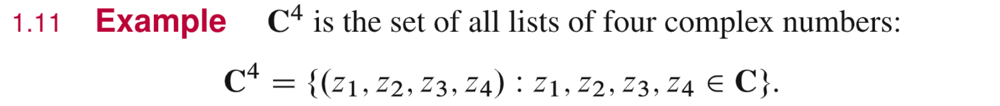
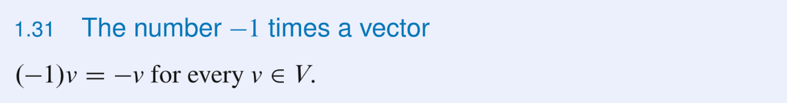
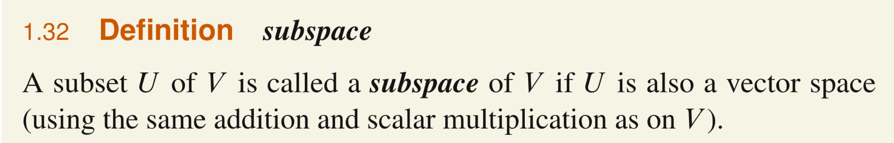
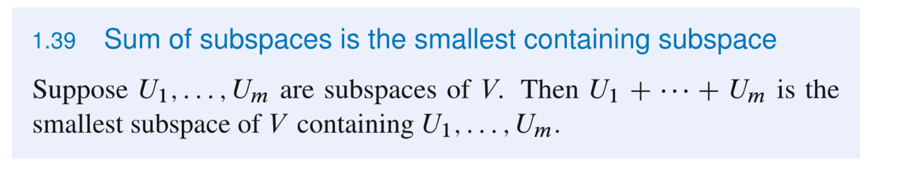
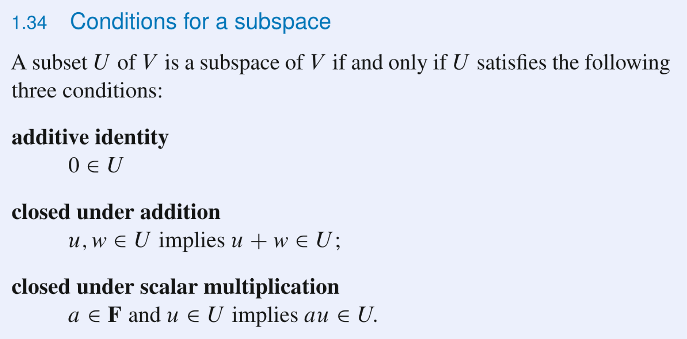
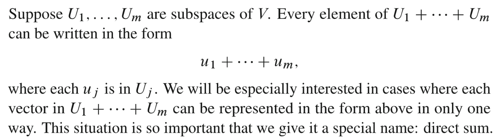
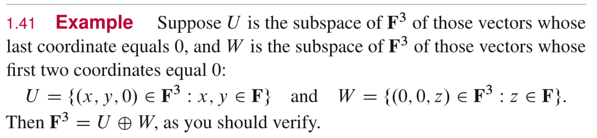
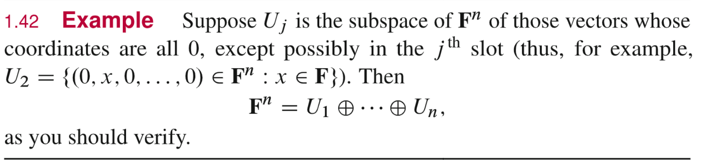
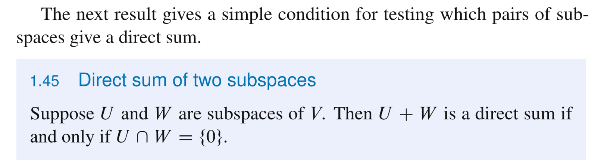

# 1 Complex Arithmetic
## 1.1 复数的定义
> 
> - 复数域我们称为$\mathbb{C}$
> - 复数域$\mathbb{C}$满足加法和数乘封闭。
> - 复数域也叫`**Field** of Complex Numbers`
> - **判断一个集合是否为一个**`**Field**`**就是要看是否满足上面的所有运算性质（即满足加法数乘封闭性）。**

## 1.2 复数的运算性质
> **复数集满足所有下列运算性质, 有一个不满足的话这个数集就不是Field**

### 性质
> 

### 一些证明
> 
> 利用的是对于任意两个复数，如果他们相等，则其实部和虚部一定都相等。

## 1.3 复数减法与除法
### 1.3.1 定义
> 

## 1.4 Notation F
> 
> 我们在`18.02SC`中，我们了解到$\bf F$往往代表一个场，所以这里用$\bf F$也有这一层因素的考量，表示场的概念。注意$\bf F=R\cup C$, 所以当我们说$x\in \bf F$, 实际上暗含的意思是$x\in \mathbb{C}$或者$x\in \mathbb{R}$。
> $\bf F$中的元素我们称为`Scalars`(标量), 是对于`Numbers`的高阶表述，这其实是为了将向量和标量区隔开来。
> 

## 1.5 列表和集合
> 列表中的元素具有有序性，类比`Permutations`
> 集合中的元素不具有有序性，类比`Combinations`
> 

## 1.6 高维数域
### 1.6.1 定义
> 
> 

### 1.6.2 性质
#### 加法
> 
> 
> 

#### 数乘
> 

#### 加法逆元
> 
> 

## 1.7 0的高维定义
> 
> 

## 1.8 Digression on Fields
> 一个域$\bf F$是一个至少含有$0$和$1$这两个元素的集合, 因为一个场需要满足加法和数乘性质
> 

# 2 向量空间
> 这里我们给出一个关于向量空间的代数视角的理解:
> 一个向量空间是一个抽象的实体，内部的每个元素可以是列表，函数或者其他的一些奇怪的东西。

## 2.1 判定向量空间
> 我们往往利用加法数乘封闭性来判定一个空间是否是向量空间。不需要判断其他的运算性质，因为其他性质都可以由这两条性质推出来。
> 
> 
> 

## 2.2 向量空间运算性质
### 2.2.1 向量空间内元素的运算
> 这些性质是所有向量空间中的元素具备的基本运算性质，而不是基本定义，所以不能使用这些性质来判断一个空间是否是向量空间。
> 
> 注意到，向量空间中的加法恒等元只有$0$, 而一个复数场中的加法恒等元有$0$和$1$

### 2.2.2 向量和点
> 
> `2.1`中已经定义了数乘的概念，而我们知道，对于一个向量空间$\bf V$来说，其数乘的性质依赖于$\bf F$中的元素。所以一个更为严格的说法是$\bf V$是一个取决于$\bf F$的向量空间(`V is a vector space over F`)，而不是只说$\bf V$是一个向量空间这样简单。**比如说当**$\bf F=R$**, 这时候。**$\bf V$**就是一个实数向量空间，当**$\bf F=C$**, **$\bf F$**就是一个复数向量空间。**
> 比如$\bf R^n$是一个定义在$\bf R$上的向量空间，$\bf C^n$是一个定义在$\bf C$上的向量空间。

### 2.2.3 实数向量与复数向量空间
> 

## 2.3 F^S
### 2.3.1 定义
> 
> 对于$\bf F^n$这个向量空间(下面给出证明)来说, 我们有$\mathbf{F^n}=\{(x_1,x_2,...,x_n)|x_j\in \mathbf{F},\forall j=1,2,3,...,n\}$, 表示的是$\bf F^n$中的元素是从$\bf F$中人选$n$个元素的全排列的$n$元组。
> 类似的$\bf F^S$的定义就非常有意思了，这个符号出现的意义在于，有时候我们在构建$\bf F^S$中的元素的时候，不想直接从$\bf F$中原封不动的选取$n$个元素$(x_1,x_2,x_3,...,x_n)$, 而是想将$\bf F$中的元素经过一系列定义在$\bf S$和$\bf F$之间的函数映射$f:\mathbf{S\to F}$之后再放入$\bf F^S$中。
> 比如: $\bf F^{[0,1]}=\{f(x)=x^2+3x^3|x\in \mathbf{[0,1]}\}$
> 我们有以下关于$\bf F^S$的加法数乘的定义：
> 
> 

 
### 2.3.2 证明他是一个向量空间
> 

### 2.3.3 和之前的向量空间的联系
> 我们之前的例子中有$\bf F^{\infty}$和$\bf F^n$, 他们都是$\bf F^S$的特殊情况
> 对于$\bf F^n$来说，他可以被理解为是集合$\mathbf{S}=\{1,2,...,n\}$到$\bf F$的映射组成的集合, 用$\mathbf{F}^{\{1,2,...,n\}}$表示
> 对于$\bf F^{\infty}$来说，他可以被理解为是集合$\mathbf{S}=\{1,2,...,n\}$到$\bf F$的映射(将$S$中的元素)组成的集合, 用$\mathbf{F}^{\{1,2,...\}}$表示

## 2.4 向量空间的高阶性质
### 2.4.1 唯一的加法恒等元
> 
> 
> 

### 2.4.2 唯一的加法逆元
> 
> 
> 

> 根据这个性质，我们有如下记号:
> 

### 2.4.3 0 乘以一个向量
> 
> 
> 第一个等式利用了加法恒等元的性质，对于$0\in \mathbf{V},\exist 0\in \mathbf{V}s.t\space 0+0=0$
> 第二个等式利用了向量空间运算性质中的`Distributive Law(第二部分)`, **说明了向量空间中的数乘操作本质上是向量加法运算和**`**Distributive Law**`**的结合。**

### 2.4.4 标量乘以零向量
> 
> 
> 第一个等式仍然利用加法恒等元的性质。第二个等式利用`Distributive Law`(第一部分)

### 2.4.5 -1 乘以一个向量
> 
> 

# 3 子空间
## 3.1 定义
> 
> 一个向量空间$\bf V$的子空间$\bf U$必须满足:
> $\bf U\subset V$, $\bf U$也是向量空间(具有加法数乘封闭性)
> 可能有些数学家使用线性子空间`Linear Subspace`来描述$\bf U$, 本质上是一回事。
> $\bf V$的最小的子空间是$\{0\}$，同时$\bf V$自身是$\bf V$最大的子空间。$\emptyset$不是子空间因为$|\emptyset|=0$，这也说明了子空间必须是一个向量空间，也必须满足加法数乘封闭性。

 
## 3.2 判断一个集合是否是子空间
> 
> `Additive Identity`说的是，一个子空间内部一定有一个$0$, 所以**子空间不为空**。(**证明:** 取$u\in \bf U$, 根据向量空间的数乘封闭性, $0u=0\in \bf U$)
> 以上三个性质保证了我们的向量空间满足所有的在`2.2`中的运算性质(比如`additive inverse`,`scalar multiplication`和`distributive law`等，读者可自行验证 )，同时也是我们快速判断一个向量空间是否是子空间的准则。

**证明**

## 3.3 一些子空间的例子
> 
> 

**(a)**$b=0$的结论是由$(0,0,0,0)\in \mathbf{U}$得到的
因为$(0,0,0,0)\in \mathbf{U}$, 所以必须存在$\begin{cases} x_1=0\\x_2=0\\5x_4+b=0\\x_4=0\end{cases}$同时成立，前面两行可以同时成立，但是后面的两行，我们将其矩阵化$\begin{cases} 5x_4+b=0\\x_4=0\end{cases}\to \begin{bmatrix} 5&1\\1&0\end{bmatrix} \begin{bmatrix} x_4\\b\end{bmatrix}=\begin{bmatrix} 0\\0\end{bmatrix}$
对矩阵$\bf A=\begin{bmatrix} 5&1\\1&0\end{bmatrix}$进行高斯消元，得到$\begin{bmatrix} 5&1\\0&-\frac{1}{5}\end{bmatrix}$, 所以$\bf A$的零空间只有零向量，所以$b=0$成立。
**(b)**由于这个向量空间中都是连续函数，且我们知道，连续函数的和也是连续函数，连续函数的数乘也是连续函数，所以这个集合是一个子空间。
**(c)**令$\mathbf{X}$是定义在$\mathbb R$上的所有实值函数的集合
则令$\mathbf{U}\subset \mathbf{R^R}$,且$\mathbf{U}=\{f\in \mathbf{X}|f是可微的\}$
如果我们想要证明这是一个子空间，必须验证加法数乘封闭性
**加法封闭性:**
两个可微函数之和也是可微函数
$\forall f(x),g(x)\in \mathbf{U}$, 因为他们俩可微，我们有$f'(x)+g'(x)=(f(x)+g(x))'$, 令$h(x)=f(x)+g(x)$, $h(x)$也是可微函数，且$Domain(h)=\mathbb R$, 于是$h(x)=f(x)+g(x)\in \mathbf{U}$
**数乘封闭性：**
可微函数的数乘也是可微函数
$\forall f(x)\in \mathbf{U},c\in \mathbb R$, 因为$f(x)$可微，我们有$cf'(x)=(cf(x))'$, 令$h(x)=cf(x)$, $h(x)$也是可微函数，且$D(h)=\mathbb R$, 于是$h(x)=cf(x) \in \mathbf{U}$
证毕。
**(d)**这个例子值得深入思考
令$\mathbf{X}$是定义在$\mathbb R$上的所有实值函数的集合
则令$\mathbf{U}\subset \mathbf{R^R}$,且$\mathbf{U}=\{f\in \mathbf{X}|f是可微的,且f'(2)=b\}$
如果我们想要知道如果$\bf U$是一个子空间，$b$必须满足什么条件，则我们必须验证加法或者数乘封闭性, 这里选择验证数乘封闭性。
**数乘封闭性:**
$\forall f(x)\in \mathbf{U}$, 我们有$f'(2)=b\to kf'(2)=kb\to (kf(2))'=kb$
如果想要满足数乘封闭性，则必须满足$kf(x)\in \mathbf{U}$, 即$(kf)'(2)=b\to kf'(2)=b$
我们整理一下，如果想要满足数乘封闭性，如果$(kf(2))'=kb$,则$kf'(2)=b$
所以$kb=b$对所有$k\in \mathbb{R}$恒成立。于是$b=0$
**(e)**参考: [https://math.stackexchange.com/questions/3776981/the-set-of-all-sequences-of-complex-numbers-with-limit-0-is-a-subspace-of-ma](https://math.stackexchange.com/questions/3776981/the-set-of-all-sequences-of-complex-numbers-with-limit-0-is-a-subspace-of-ma)

## 3.4 子空间的和
> 当我们在处理向量空间的时候，我们一般只对子空间这样的集合感兴趣，而不是随便拿来一个子集来研究。下面我们介绍一个工具: 子集的和`Sum of Subsets`。
> 我们应该都听说过集合的交并补，而对于任意的多个子空间来说，子空间的并一般不是子空间，但是子空间的和却永远是子空间，下面我们将展开说明。

### 3.4.1 标准定义
> 

### 3.4.2 几个例子
#### 示例1
> 

#### 示例2
> 

### 3.4.3 性质
> 

**Proof**

## 3.5 Directed Sums
### 3.5.1 定义
> 
> 

### 3.5.2 直和的例子
#### 示例1
> 

**Proof**结论比较直观, 此处省略

#### 示例2
> 

**Proof**此处开始逐步渗透线性无关性的思想了，比较重要，但是结论依旧显然。

#### 示例3
> 

**Proof****矩阵视角:**
通过观察$\bf U_1,U_2.U_3$中的向量构成，我们知道，对于$\forall u\in \bf U_1+U_2+U_3$
$u=\begin{bmatrix} 1\\0\\0 \end{bmatrix}a+\begin{bmatrix} 0\\1\\0 \end{bmatrix}b+\begin{bmatrix} 0\\0\\1 \end{bmatrix}c+\begin{bmatrix} 0\\1\\1 \end{bmatrix}d=\begin{bmatrix} anything\\anything\\anything \end{bmatrix}$，于是问题相当于变为$\begin{bmatrix} 1&0&0&0\\0&1&0&1\\0&0&1&1 \end{bmatrix}\begin{bmatrix} a\\b\\c\\d \end{bmatrix}=\begin{bmatrix} t\\z\\w\\q \end{bmatrix}$, 令$\bf A=\begin{bmatrix} 1&0&0&0\\0&1&0&1\\0&0&1&1 \end{bmatrix},x=\begin{bmatrix} a\\b\\c\\d \end{bmatrix},b=\begin{bmatrix} t\\z\\w\\q \end{bmatrix}$
我们发现，其实我们只要求证$\forall \bf b\in \mathbf{F^4}, \bf Ax=b$都只有唯一解就行，不妨令$\bf b=\bf  0$根据矩阵和线性方程的解的性质，矩阵$\bf A$的零空间必须只含有零向量。但是$\bf A$有自由元，所以零空间一定不止零向量，于是我们知道$\bf U_1+U_2+U_3$不是一个`Directed Sum`。反例在第二种视角的证明中给出。分别对应$\begin{cases}  a=0\\b=0\\c=0\\d=0\end{cases}$和$\begin{cases} a=0\\b=1\\c=1\\d=-1\end{cases}$的情况。

**代数视角：**

### 3.5.3 成为直和的条件
> 

> [!proof]
> **Proof**
> **矩阵视角:**
> 正如我们示例`3`中看到的那样，我们只要找到每个子空间$\bf U_i$的基向量，将他们按列组成一个系数矩阵$\bf A$, 然后判断$\bf A$的零空间的维数是否大于零即可。

> [!proof]
> **代数视角:**
> 代数视角使用反证法，如果存在两个不同的表达，则这两个表达一定相同，这种证明思想在数学分析中非常的常用。

### 3.5.4 两个子空间的直和
> [!thm]
>

> [!proof]
> **Proof**
> **矩阵视角:**
> 如果两个子空间的交集只有$\{0\}$, 说明两个子空间内的任意$u\in \mathbf{U},v\in \bf V$都线性无关，所以$\bf U+W$一定是`Directed Sums`

> [!proof]
> **代数视角:**

