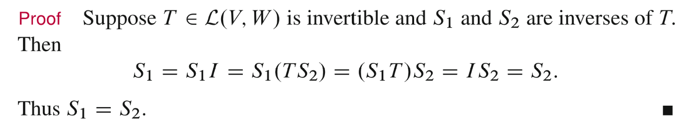
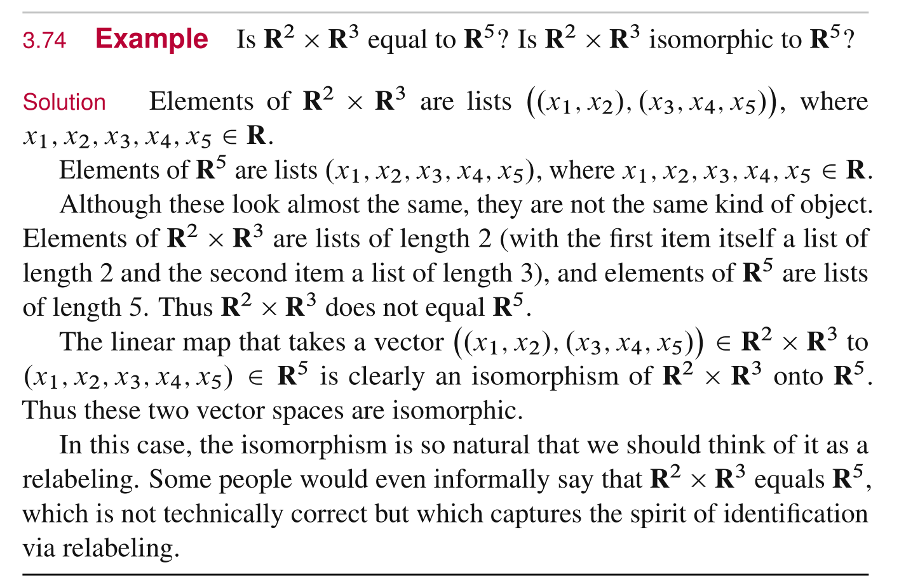
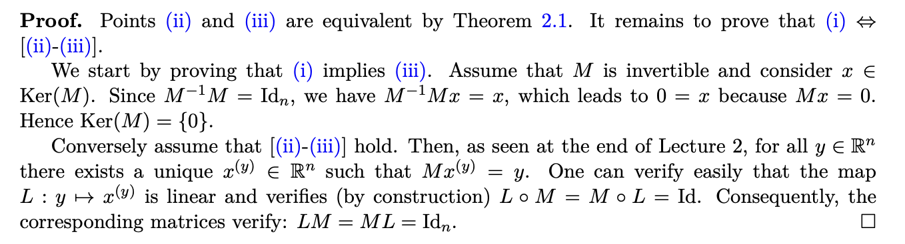

# 1 线性变换
## 1.1 定义
> 
> 

## 1.2 常见线性变换
### 1.2.1 零变换
> 作为$\mathcal{L}(V,W)$的一员，$0$表示一个将$V$空间中的向量全部映射到$W$的加法恒等元(也就是$0$)的映射：
> **定义为:** $0v=0$； 等式左侧的零表示映射函数，右侧的零表示$W$的加法恒等元

 

### 1.2.2 恒等变换
> 在[恒等线性变换](https://www.yuque.com/alexman/so5y8g/fb7s4p#wx4cf)中，我们已经了解了，一个恒等变换$I$, 是一个从$V\to V$的映射，使得: $Iv=v$

### 1.2.3 导数变换
> 在[导数变换](https://www.yuque.com/alexman/so5y8g/bvm7ax#VYpwA)中我们介绍过，微分变换是针对于多项式而言的，所以我们定义:
> 

### 1.2.4 积分变换
> 
> 线性关系由$\int_a^b c\cdot f(x)+d\cdot g(x)dx=c\int_a^b f(x)dx+d\int_a^b g(x)dx$给出

### 1.2.5 multiplication
> 

### 1.2.6 Backward Shift
> 

### 1.2.7 R^3 ro R^2
> 

### 1.2.8 F^n to F^m
> 
> **代数形式非常烦，我们写成矩阵形式:**
> $\bf \begin{bmatrix} A_{1,1}&A_{1,2}&\cdots &A_{1,n} \\A_{2,1}&A_{2,2}&\cdots& A_{2,n} \\\vdots&\vdots&\ddots& \vdots \\A_{m,1}&A_{m,2}&\cdots& A_{m,n} \end{bmatrix}\begin{bmatrix} x_1\\x_2\\\vdots \\x_n\end{bmatrix}=\begin{bmatrix} f_1(x_1,x_2,\cdots,x_n)\\f_2(x_1,x_2,\cdots,x_n)\\\vdots \\f_m(x_1,x_2,\cdots,x_n)\end{bmatrix}$

## 1.3 线性变换唯一性**⭐⭐⭐⭐⭐**
> 在[线性变换是基变换](https://www.yuque.com/alexman/so5y8g/bvm7ax#KP3d3)中，我们已经介绍过这一概念。下面给出公理化证明， 注意这个定理并不意味着$w_j$之间线性无关。
> 当输入空间$V$和输出空间$W$的维数相同时，我们有如下的重要结论:
> 

**存在性证明**
**唯一性证明**

## 1.4 常用性质
> 

**Proof**
1. $L(0)=L(w+(-w))=L(w)-L(w)=0$
2. $L(\sum_{i=1}^k \alpha_iv_i)=L(\alpha_1v_1+\sum_{i=1}^{k-1}\alpha_iv_i)=\alpha_iL(v_i)+L(\sum_{i=1}^{k-1}\alpha_iv_i)$, 依此类推即可。

# 2 线性变换的代数操作
## 2.1 加法和数乘操作
> 
> 这个性质用于判断一个变换是否是线性的
> 

## 2.2 线性变换的乘积
> 
> 将$S$和$T$看做函数， $ST$就是$S \circ T$函数组合的意思，所以类比函数组合的定义，$T$的输出必须是$S$的定义域

## 2.3 线性变换乘积的代数性质
> 
> 注意，对于线性变换的乘积，我们没有$TS=ST$, 也就是我们没有`Communicative Law`。在[线性变换施加顺序](https://www.yuque.com/alexman/so5y8g/bvm7ax#HyWiO)中，我们看到了一个$TS\neq ST$的例子，就是先进行求导变换和先进行积分变换得到的结果的不同。矩阵视角给出的原因是线性变换存在一个核空间(`Kernel Space`, 也就是零空间)。

**Communitive Laws 不成立的原因**

## 2.4 零变换
> 

**Proof**

## 2.5 线性变换的组合
> 

**Proof**Since $L$is linear,$\forall v,w\in \mathbb{R}^m,\alpha\in \mathbb{R}$, we have:

1. $L(v+w)=L(v)+L(w)$where $L(v),L(w)\in \mathbb{R}^n$
2. $L(\alpha v)=\alpha L(v)$

Since $M$is linear, $\forall p,q\in \mathbb{R}^n,\beta\in \mathbb{R}$, we have:

1. $M(p+q)=M(p)+M(q)$
2. $M(\beta p)=\beta M(p)$

$M\circ L(v+w)=M(L(v)+L(w))=M(L(v))+M(L(w))=M\circ L(v)+M\circ L(w)$
$M\circ L(\alpha v)=M(\alpha L(v))=\alpha M(L(v))=\alpha M\circ L(v)$
Thus $M\circ L$is also linear.

# 3 零空间和单射
## 3.1 线性变换的零空间
### 3.1.1 定义
> 本小节我们介绍线性变换$T$的零空间:
> 

### 3.1.2 几个线性变换的零空间
#### zero map
:::success
如果$T$是一个$V\to W$的`zero map`,$\forall v\in V$, 都有$Tv=0$, 则我们称$null\space  T=V$
在后面我们也会看到，当$\bf V=\{0\}$时，$T$是一个单射，因为只有$0$被映射到了$0$
:::

#### L(C^3,F)
> 
> 关于基的求法: $\begin{bmatrix} -2z_2-3z_3\\z_2\\z_3\end{bmatrix}=\begin{bmatrix} -2\\1\\0\end{bmatrix}z_2+\begin{bmatrix} -3\\0\\1\end{bmatrix}z_3$

#### differentiation map
> 
> 在[导数变换的空间](https://www.yuque.com/alexman/so5y8g/bvm7ax#Qasm8)中，我们已经介绍过导数变换$T$是一个线性变换，且对于所有的常数多项式$p(x)=c$, 在变换后$Tp(x)=c'=0$, 所以所有的常数多项式都在$T$的零空间中。

#### multiplication map
:::warning

在后面我们将看到，这个线性变换实际上是一个单射(`Injective`)
:::

#### backward shift
> 

## 3.2 零空间是一个子空间
> 

**Proof**

## 3.3 单射(Injective)
> 
> $If \space Tu=Tv\space implies\space u=v$实际上是$If\space u\neq v, then \space Tu\neq Tv$的逆否命题。二者等价。
> 我们实际上可以通过验证 $0$**是不是唯一一个映射到**$0$ 的假设来验证一个线性变换$T$是否是一个单射， 于是我们有:
> 

**Proof of 3.16(Easy)**首先对于当且仅当我们得从两个方向分别证明其成立。
**首先是正方向(证明集合相等的方法): **
假设$T$是`Injective`的，则$\forall u,v\in V$, $Tu=Tv\implies u=v$。 
因为$null \space T$是一个子空间，所以$\{0\}\subset null\space T$。
因为对于$u\in null\space T$, $T(u)=0=T(0)$, 所以$u=0$, 即$u\in \{0\}$, 所以$null\space T\subset \{0\}$, 于是$null\space T=\{0\}$。
**然后是反方向: **
已知$null\space T=\{0\}$, 则我们取$u,v\in V$且$T(u)=T(v)$, 则$T(u)-T(v)=T(u-v)=0$，因为$u-v\in null \space T$, 所以$u=v$, 于是$T(u)=T(v)\implies u=v$, 所以证毕。

# 4 值域和满射
## 4.1 值域定义/子空间
:::info

一些数学家也用`Image`来指代`Range`
:::
**Examples**

根据[线性变化本质是基的变换](https://www.yuque.com/alexman/so5y8g/bvm7ax#DayFI)，假设我们有一个从的线性变换, 如果我们想要求出(也就是的值域)的基，我们可以简单地对的一组合法的基做线性变换, 得到的和就是`Basis of range`。上面的例子中，因为, , 我们可以取作为的基，然后为了得到的基，我们只需要求即可，根据题意，也就是

**值域是子空间（证明加法乘法封闭性+0在子空间中）(Easy)**

## 4.2 满射
:::info

:::
**Example(Not surjective)**

## 4.3 线性变换基本定理**⭐⭐⭐⭐⭐**
:::info

**怎么理解这个式子呢？**
我们从[线性变换矩阵](https://www.yuque.com/alexman/so5y8g/bvm7ax#EvydD)可知，对于任意一个线性变换$\bf T:V\to W$，都有其对应的描述矩阵$\bf A$, 假设矩阵$\bf A$是一个$m\times n$的矩阵，则$dim V$就是输入空间的维数，也就是$n$, 而$dim\space null\space T$就是$\bf A$的零空间的维数，$dim\space range\space T$就是$\bf A$的列空间的维数。而我们知道，假设$rank\bf( A)=r$, 则$dim(Col(\mathbf{A}))=r,dim(null(\mathbf{A}))=n-r$, 则$dim(Col(\mathbf{A}))+dim(null(\mathbf{A}))=n=dim(\mathbf{V})$
:::
**Proof**
> **这里有两个推论:**
> 1. 如果$T$是满射的话，则$range~T=W$, 即$dim~range~T=dim~W$
> 2. 如果$T$是单射的话，则$null~T=\{0\}$, 即$dim~null~T=0$
> 3. 如果$T$是`Bijective`的话，则$dimV=0+dimW$, 即$dimV=dimW$

## 4.4 高维映射到低维不是单射
:::info

类比一个`Wide Matrix`
:::
**Proof**因为$dimV=dim (null\space T)+dim(range\space T)$, 所以：
$\begin{aligned}dim (null\space T)&=dimV-dim(range\space T)\\&\geq dimV-dim(W)\\&>0\end{aligned}$
根据之前的定理: $T$是`Injective`的，当且仅当$null\space T=\{0\}$, 所以这里$T$不可能是`Injective`的。

## 4.5 低维映射到高维不是满射
:::info

类比一个`Tall Matrix`
:::
**Proof**因为$dimV=dim (null\space T)+dim(range\space T)$, 所以：
$\begin{aligned}dim (range \space T)&=dimV-dim(null\space T)\\&\leq dim V\\&<dim W \end{aligned}$
所以不存在$dim(range\space T)=dim(W)$的情况出现。

# 5 线性方程组
:::info
在[Ax=0的解](https://www.yuque.com/alexman/so5y8g/fxb3kg)和[Ax=b的解](https://www.yuque.com/alexman/so5y8g/szq848)中我们已经介绍过求解线性方程组和判断线性方程组是否有解的方法了。本小节我们更进一步，在代数的框架下重述线性方程组(齐次和非齐次)的解的情况。
我们定义一个$\bf F^n\to F^m$的线性变换$\bf T$:
$\mathbf{T}(x_1,\cdots, x_n)=(\sum_{i=1}^n A_{1,k}x_k, \cdots, \sum_{i=1}^n A_{m,k}x_k)$
:::
## 5.1 Homogeneous
:::info
齐次方程组说的本质上形如: $\mathbf{T}(x_1,\cdots, x_n)=(0,\cdots, 0)=\mathbf{0}$
也就是我们有如下的方程组:
$\begin{aligned} \sum_{i=1}^n A_{1,k}x_k&=0\\\vdots \\ \sum_{i=1}^n A_{m,k}x_k&=0 \end{aligned}$
很明显$\mathbf{x}=\mathbf{0}$是方程的一个解(即$x_1=x_2=\cdots=x_n=0$)
我们想齐次方程组是否还有非零解，也就是说$null\space T$是否不仅仅只是一个$\{0\}$，下面的定理就是$null\space T$不是$\{0\}$的例子:

这个定理证明起来也很方便，只要用线性变换基本定理，以及`4.4/4.5`, 我们就可以知道: 当线性方程组的变量数量大于方程数量时，即$n>m$时，也就是从更大的维度映射到更小的维度的时候，不可能存在单射的情况，也就是说$null\space T$不可能仅仅等于$\{0\}$。换句话说，$dim(null\space T)>0$, 也就是齐次方程有非零解。
:::

## 5.2 Inhomogeneous
:::info
齐次方程组说的本质上形如: $\mathbf{T}(x_1,\cdots, x_n)=(c_1,\cdots, c_m)$
也就是我们有如下的方程组:
$\begin{aligned} \sum_{i=1}^n A_{1,k}x_k&=c_1\\\vdots \\ \sum_{i=1}^n A_{m,k}x_k&=c_m \end{aligned}$
探究这个方程组是否有解，其实就是证明这个映射$\bf T$是否是一个满射，我们只需要证明$range\space T$和$\bf F^m$的维度是否相同。如果维度相同，就说明$\bf T$是满射。但是结合`4.5`中的论述，我们知道如果$n<m$, 也就是如果$\bf T$是从低维映射到高维，就不可能是满射。所以我们有下列定理:

:::

# *6 线性变换矩阵与矩阵运算
## 6.1 线性变换矩阵⭐⭐⭐⭐⭐
:::info

为了更好的记住线性变换矩阵的构建过程，我们做出如下的过程总结:

$\mathcal{M}(T)$的每一列都是通过寻找一组常数向量$[A_{1,k}, \cdots, A_{m,k}]^T$, 使得$T(v_k)=\sum_{j=1}^m A_{j,k}w_j$来获得的。
如果$\bf T$是从$\bf F^n\to F^m$的线性映射，如果我们没有显式地指定$\bf F^n$和$\bf F^m$的基向量，那么默认就是各自空间的标准基向量。此时$\mathcal{M}(T)$是一个$m\times n$的矩阵。
如果$\bf T$是一个多项式映射$\mathcal{P_n}(\mathbf{F})\to \mathcal{P_m}(\mathbf{F})$, 则如果没有特殊说明，一般我们选取$1,x,x^2,\cdots, x^n$作为$\mathcal{P_n}(\mathbf{F})$的标准基，$1,x,x^2,\cdots, x^m$作为$\mathcal{P_m}(\mathbf{F})$的标准基。
:::
**简单线性变换**

**更详细的步骤是:**

- $\mathbf{F}^2$的`Standard Basis`是$\{\begin{bmatrix} 1\\0\end{bmatrix},\begin{bmatrix} 0\\1\end{bmatrix}\}$
- $\mathbf{F}^3$的`Standard Basis`是$\{\begin{bmatrix} 1\\0\\0\end{bmatrix},\begin{bmatrix} 0\\1\\0\end{bmatrix},\begin{bmatrix} 0\\0\\1\end{bmatrix}\}$

$T(\begin{bmatrix} 1\\0\end{bmatrix})=1\cdot \begin{bmatrix} 1\\0\\0\end{bmatrix}+2\cdot \begin{bmatrix} 0\\1\\0\end{bmatrix}+7\cdot \begin{bmatrix} 0\\0\\1\end{bmatrix}$
$T(\begin{bmatrix} 0\\1\end{bmatrix})=3\cdot \begin{bmatrix} 1\\0\\0\end{bmatrix}+5\cdot \begin{bmatrix} 0\\1\\0\end{bmatrix}+9\cdot \begin{bmatrix} 0\\0\\1\end{bmatrix}$
**多项式变换**

**更详细的步骤是:**

- $\mathcal{P}_3(\mathbf{R})$的`Standard Basis`是$\{1,x,x^2,x^3\}$
- $\mathcal{P}_2(\mathbf{R})$的`Standard Basis`是$\{1,x,x^2\}$

$T(1)=1'=0=0\cdot 1+1\cdot x+1\cdot x^2$
$T(x)=x'=1=1\cdot 1+0\cdot x+0\cdot x^2$
$T(x^2)=2x=0\cdot 1+2\cdot x+0\cdot x^2$
$T(x^3)=3x^2=0\cdot 1+0\cdot x+3\cdot x^2$

## 6.2 线性变换矩阵的加法
:::info

:::

## 6.3 线性变换矩阵的数乘
:::info

:::

## 6.4 新向量空间
:::info
上面的两个运算规则表明$\mathbf{F}^{m\times n}$是一个向量空间。

:::
**Proof for 3.40**
**Alternative Proof**

## 6.5 线性变换的乘积/矩阵乘法
:::info

:::
**Proof of 3.43**假设$\widetilde{L}=\begin{bmatrix}L_{11}&L_{12}&\cdots &L_{1n}\\L_{21}&L_{22}&\cdots&L_{2n}\\\vdots&\ddots&&\vdots\\\vdots&&\ddots&\vdots\\L_{m1}&L_{m2}&\cdots&L_{mn}\end{bmatrix}, \widetilde{M}=\begin{bmatrix}M_{11}&M_{12}&\cdots &M_{1m}\\M_{21}&M_{22}&\cdots&M_{2m}\\\vdots&\ddots&&\vdots\\\vdots&&\ddots&\vdots\\M_{k1}&M_{k2}&\cdots&L_{km}\end{bmatrix}$
$M(L(e_i))=M(\begin{bmatrix} L_{11}\\\vdots\\L_{m1}\end{bmatrix} )=\widetilde{M}\begin{bmatrix} L_{11}\\\vdots\\L_{m1}\end{bmatrix}=\begin{bmatrix} \end{bmatrix}$

# 7 线性变换可逆性
## 7.1 可逆线性变换
:::info

:::

## 7.2 线性逆变换是唯一的
:::info

:::
**Proof**

## 7.3 逆变换=单射+满射
:::info

:::
**Proof*****正方向:**

**反方向:**

**不可逆的线性变换**

# 8 同构向量空间**⭐⭐⭐⭐⭐**
## 8.1 同构向量空间的定义
:::info

类比我们在实数分析中学过的`Cardinality`相等的定义，就是存在一个`Bijection`(可逆映射)。
:::

## 8.2 同构空间维数相同
:::info

:::
**Proof**

## 8.3 线性变换矩阵空间和F(m,n)同构
> 

**Proof**

## 8.4 线性变换空间的维数**⭐⭐⭐**
> 

**Proof**假设$V$同构于$\mathbf{F}^n$且$W$同构与$\mathbf{F}^m$。则$dimV=n, dimW=m$。所以$\mathcal{L}(V,W)$同构于$\mathbf{F}^{m\times n}$。因为$div\mathbf{F}^{m\times n}=mn$, 于是结合上述过程，我们有$div \mathcal{L}(V,W)=div\mathbf{F}^{m\times n}=mn=(dim V)(dim W)$, 证毕。

# 9 从矩阵乘法看线性变换
## Matrix of Vectors
> 

**Examples**

## Properties
> 

**Proof**

## Matrix&Vector Multiplication
> 

**Proof**

# 10 线性算子
## Definition**⭐⭐**
> 

## Operator, 单射=满射=双射
> 

**Proof**
**Example**

# 11 向量空间的积
## 向量空间的积
### Definition
> 

**Example**

### Properties
> 

**Proof**
1. `0-vector`: 首先$(\vec{0},\vec{0},\cdots, \vec{0})\in V_1\times V_2\times \cdots\times V_m$
2. `Addition`: $\forall \vec{v},\vec{w}\in V_1\times V_2\times \cdots \times V_m$,

 $\vec{v}+\vec{w}=(\vec{v}_1,\vec{v}_2,\cdots,\vec{v}_m)+(\vec{w}_1,\vec{w}_2,\cdots,\vec{w}_m)=(\vec{v}_1+\vec{w}_1,\vec{v}_2+\vec{w}_2,\cdots,\vec{v}_m+\vec{w}_m)$
因为$v_i,w_i\in V_i$, 所以$w_i+w_i\in V_i$, 所以$v+w\in V_1\times V_2\times \cdots \times V_m$

3. `Scalar Multiplication`: $\forall v\in V_1\times V_2\times \cdots \times V_m, \alpha\in \mathbf{F}$,

 $\alpha v=\alpha(v_1,v_2,\cdots,v_m)=(\alpha v_1,\alpha v_2,\cdots,\alpha v_m)$
因为$v_i\in V_i$, 所以$\alpha v_i\in V_i$, 所以$\alpha v\in V_1\times V_2\times \cdots \times V_m$。
**Example 3.74**

## 向量空间的积的维数
> 

**Proof**本质上要求一个子空间$S$的维数，我们只需要求其基底向量的个数。
因为$V_i$都是有限维的向量空间，所以我们可以令$V_i$的基为$\{v_{i,1},v_{i,2},\cdots, v_{i,k_i}\}$, 即$dim(V_i)=k_i$。
$V_1\times \cdots \times V_m$的基为$\{\begin{bmatrix}v_{1,1}\\0\\\vdots\\0 \end{bmatrix},\begin{bmatrix}v_{1,2}\\0\\\vdots\\0 \end{bmatrix},\cdots,\begin{bmatrix}v_{1,k_1}\\0\\\vdots\\0 \end{bmatrix},
\begin{bmatrix}0\\v_{2,1}\\\vdots\\0 \end{bmatrix},\begin{bmatrix}0\\v_{2,2}\\\vdots\\0 \end{bmatrix},\cdots,\begin{bmatrix}0\\v_{2,k_2}\\\vdots\\0 \end{bmatrix},\cdots,\begin{bmatrix}0\\0\\\vdots\\v_{m,1} \end{bmatrix},\begin{bmatrix}0\\0\\\vdots\\v_{m,2}\end{bmatrix},\cdots,\begin{bmatrix}0\\0\\\vdots\\v_{m,k_m} \end{bmatrix}\}$长度为$k_1+k_2+\cdots+k_m$, 于是$dim(V_1\times \cdots \times V_m)=k_1+\cdots+k_m$

## 向量空间的积->直和
> 

**Proof of Surjective**对于$\forall \vec{u}\in U_1+U_2+\cdots+U_m$, 我们有$\vec{u}=\vec{u}_1+\vec{u}_2+\cdots+\vec{u}_m$。
所以$\forall \vec{u}\in U_1+U_2+\cdots+U_m$, $\exists (\vec{u}_1,\vec{u}_2,\cdots, \vec{u}_m)\in U_1\times U_2\times \cdots \times U_m,~~s.t.~~\Gamma(\vec{u}_1,\vec{u}_2,\cdots, \vec{u}_m)=\vec{u}$, 证毕。
**Proof of Direct Sum <=> Injective**$\Gamma$是`Injective`说的是$null~\Gamma=\{\vec{v}\in U_1\times\cdots\times U_m:\Gamma \vec{v}=0\}=\{0\}$, 也就是说使得$\Gamma(u_1,u_2,\cdots,u_m)=0$的$(u_1,u_2,\cdots, u_m)$只能是$(0,0,\cdots, 0)$。也就是说使得$u_1+u_2+\cdots+u_m=0$的$(u_1,u_2,\cdots, u_m)$只能是$(0,0,\cdots, 0)$, 这等价于说$U_1+U_2+\cdots+U_m$是`Directed Sum`。

## 直和的维数分解
> 

**Proof**因为$\Gamma$是`Surjective`的，所以如果$\Gamma$同时也是`Injective`的，则$\Gamma$是`Bijective`的。
此时$dim(U_1\times U_2\times\cdots\times U_m)=dim(U_1+U_2+\cdots+U_m)$。(输入和输出维数一致，由线性代数基本定理可得)。
即$\Gamma$is injective <=> $dim(U_1\times U_2\times\cdots\times U_m)=dim(U_1+U_2+\cdots+U_m)$
因为$dim(U_1\times U_2\times\cdots\times U_m)=dimU_1+dimU_2+\cdots+dimU_m$永远成立， 所以：
$\Gamma$is injective <=> $dim(U_1+U_2+\cdots+U_m)=dimU_1+dimU_2+\cdots+dimU_m$
结合`3.77`我们可以得到最终的结论。

# *12 向量空间的商
## Sum of vector and Subspaces
> 

**Proof**

## Affine Subset
> 

**Example**

## 向量空间的商
### Definition
> 
> 这里$U$是给定的，$v$是任意的， 一个$v$和一个$U$对应一个`Affine Subset of V`。

**Proof**
> 

### Properties
> 

**Proof**

# *13 Duality
> 

# 14 Rank
## Definition
> 

## Properties
### 行秩=列秩
> 

**Proof**通过高斯消元可证明。

### 高斯消元不改变矩阵的Rank
> 
> 因为上述三个`Span`都是一样的，所以当然维数是一致的，秩也一样。

### Rank-Nullity Theorem
> 

**Proof**

### Inequality properties
> 

**Proof of (1)**
**Proof of (2)****证明: **$Rank(AB)=dim(Col(AB))$, $\forall \vec{x}\in Col(AB), \vec{x}=AB\vec{w}=A(B\vec{w})=A\widetilde{\vec{w}}\in Col(A)$
于是$Col(AB)\subseteq Col(A)$, 于是$dim(Col(AB))\leq dim(Col(A))$, 即$Rank(AB)\leq Rank(A)$对$AB$取转置,$Rank(AB)=Rank((AB)^{\top})=Rank(B^{\top}A^{\top})\leq Rank(B^{\top})=Rank(B)$。
所以$Rank(AB)\leq Rank(A)$且$Rank(AB)\leq Rank(B)$, 即$Rank(AB)\leq min\{Rank(A),Rank(B)\}$。

# 15 Inverses
## Definition
> 

**Proof of Ex3.1**

## Theorem
> 

**Proof**
> 

**Proof of Ex3.2**

# 16 Transpose
## Definition
> 

## Properties
> 

