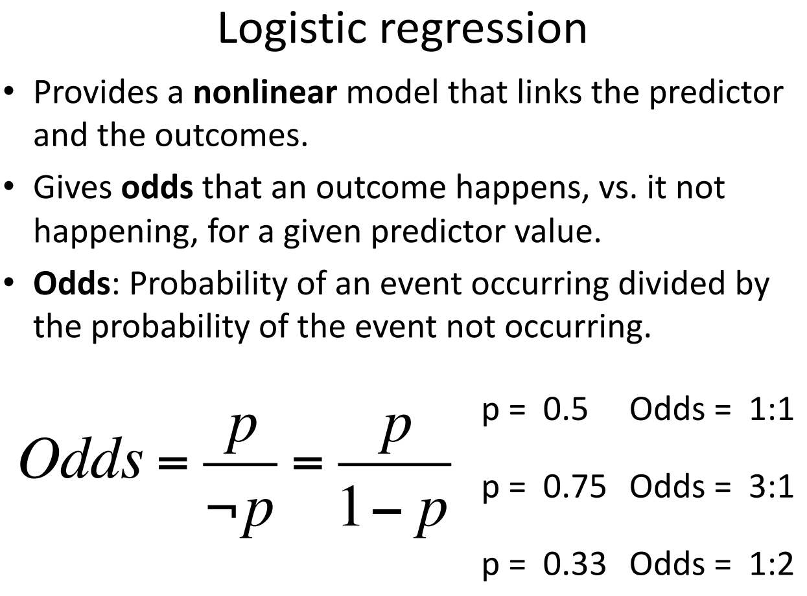
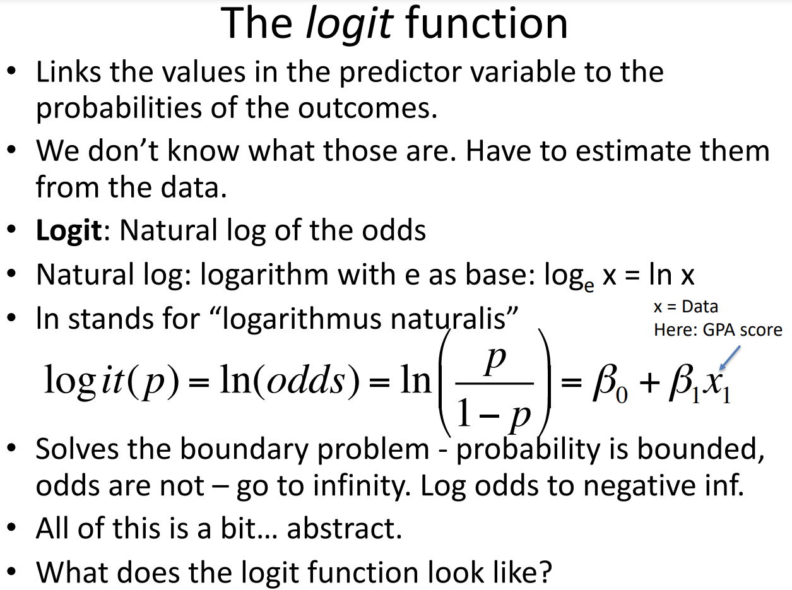
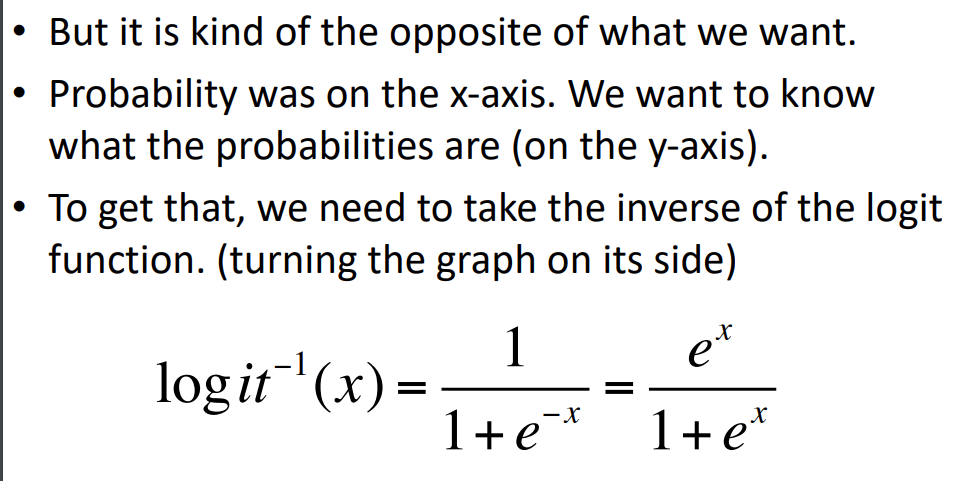
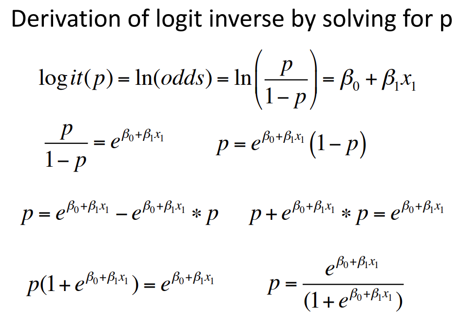
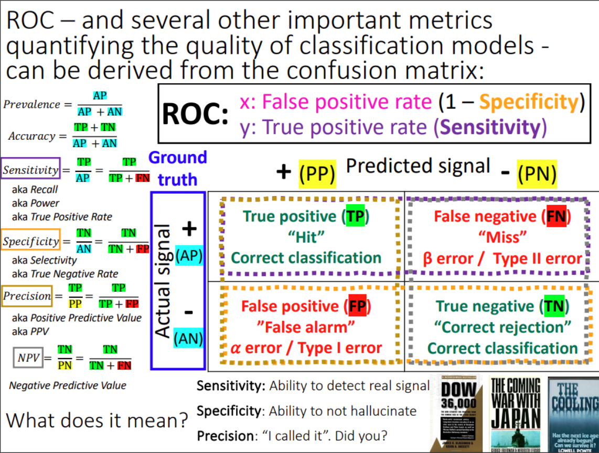
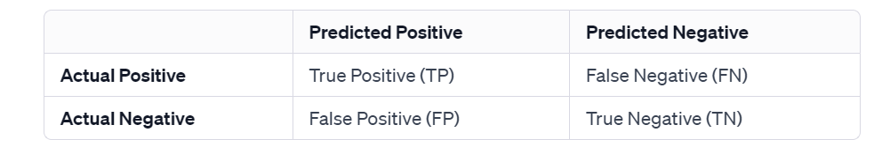
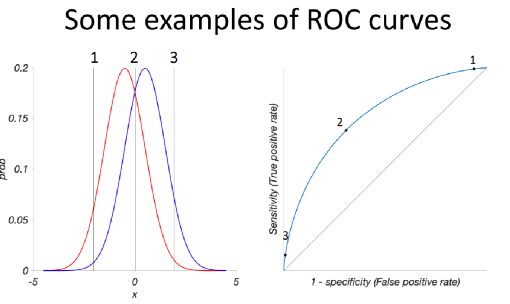
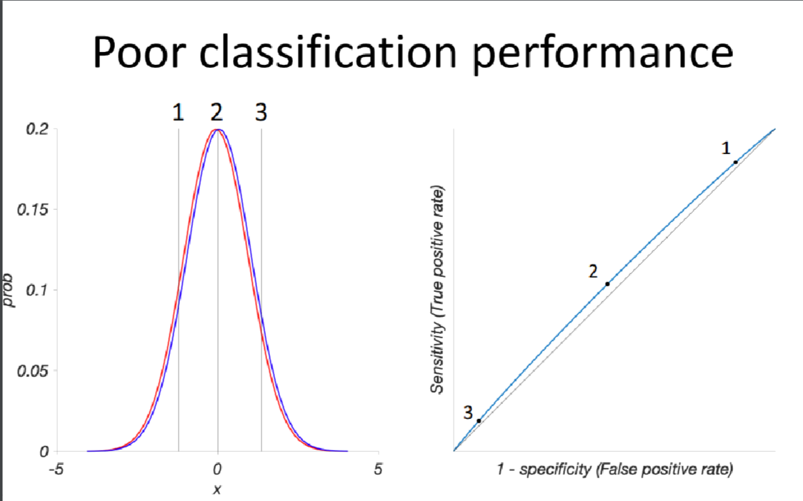
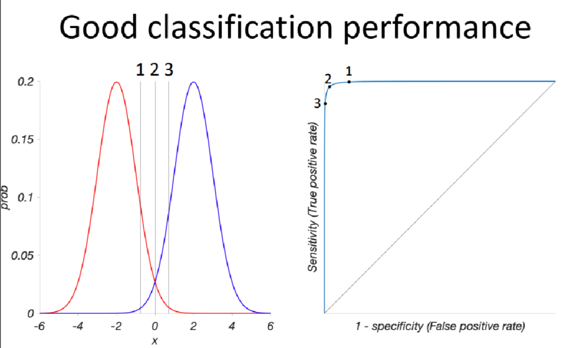

# Logistic Regression
## Odds
> [!important]
> 

## Logit Function - Link Function
> [!important]
> 

# Evaluation of Logistic Regression Model
## ROC Curve
> [!important]
> 

## Confusion Matrix 
> [!def]
> 

## ROC Curve and Distributions
> [!example]
> 

