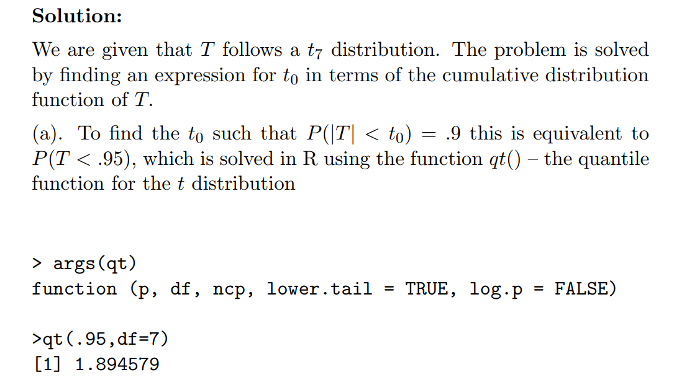

# 1 The Gamma Distribution
## 1.1 Gamma Definition⭐⭐⭐⭐
> [!def]
> 
> **当然我们也有如下的形式:**
> 
> 其中 $\beta=\frac{1}{\lambda}$
> **期望:**$$\begin{aligned}E[X] & =\int_0^{\infty} \frac{\lambda e^{-\lambda x}(\lambda x)^{\alpha-1}}{\Gamma(\alpha)} \cdot x d x \\& =\frac{\lambda^\alpha}{\Gamma(\alpha)} \int_0^{\infty} e^{-\lambda x} x^\alpha d x \\& =\frac{\lambda^\alpha}{\Gamma(\alpha)}\left[-\left.\frac{1}{\lambda} e^{-\lambda x} x^\alpha\right|_0 ^{\infty}-\int_0^{\infty}-\frac{1}{\lambda} e^{-\lambda x} \alpha x^{\alpha-1} d x\right] \\& =\frac{\lambda^\alpha}{\Gamma(\alpha)} \int_0^{\infty} \frac{\alpha}{\lambda} e^{-\lambda x} x^{\alpha-1} d x \\& =\frac{\lambda^\alpha}{\Gamma(\alpha)} \int_0^{\infty} \frac{\alpha}{\lambda} e^{-u}\left(\frac{u}{\lambda}\right)^{\alpha-1} \frac{1}{\lambda} d u \\& =\frac{\lambda^\alpha}{\Gamma(\alpha)} \frac{\alpha}{\lambda^{\alpha+1}} \Gamma(\alpha) \\& =\frac{\alpha}{\lambda}\end{aligned}$$
> 
> **方差:**$$\begin{gathered}\operatorname{Var}[X]=E\left[X^2\right]-E[X]^2 \\=\frac{\alpha}{\lambda^2}=\alpha \beta^2\end{gathered}$$

## 1.2 Gamma函数递归性质⭐⭐⭐⭐⭐
> [!def]
> 
> 

## 1.3 Gamma和n-Erlang
> 我们在[Erlang分布](https://www.yuque.com/alexman/kziggo/axmnmf#xj9dV)介绍过`Erlang Distribution`一般用于描述一个`Possion`过程的`k-th arrival time`, 而`Erlang`分布其实是`Gamma`分布的一个别称。下面我们将深入介绍:
> 当$\alpha$是一个正整数，比如说$\alpha=n$, `Gamma`分布就会以一种离散的形态出现，表示`The amount of time one has to wait until a total n events has occurred`. 
> 所以一般而言, 我们有如下的结论: 
> `n-th arrival time`可以用$Gamma(n,\lambda)$来描述。
> 下面我们给出这个结论的证明:

**证明Gamma(n, lambda)描述了n-th arrival time**假设$T_n$是事件第$n$次发生时经过的时间，注意$T_n\leq t$当且仅当$t$时刻之前事件至少发生了$n$次。也就是说，如果我们令$[0,t]$区间上的时间发生次数总数为$N(t)$, 则我们有:
$P\{T_n\leq t\}=P\{N(t)\geq n\}=\sum_{j=n}^{\infty}P\{N(t)=j\}\newline=\sum_{j=n}^{\infty}\frac{e^{-\lambda t}(\lambda t)^j}{j!}(参数为\lambda t的泊松分布的PMF)$
于是$F_{T_n}(t)=\sum_{j=n}^{\infty}\frac{e^{-\lambda t}(\lambda t)^j}{j!}$, 我们对其求导得到:
$f_{T_n}(t)=\frac{\lambda e^{-\lambda t}(\lambda t)^{n-1}}{(n-1)!}$, 这就是我们的$Gamma(n,\lambda)$分布在$\alpha$为正整数的情况下的`PDF`。

## 1.4 Sum of 独立Gamma is Gamma
> 

**证明**

## 1.5 Sum of 独立Exp is Gamma
> 

## 1.6 Derivative for Gamma Function
> , 
> 

# 2 Chi-squared Distribution
## 2.1 Definition⭐⭐
> [!def]
> 

## 2.2 卡方和伽马分布⭐⭐⭐⭐
> [!important]
> **卡方分布是一种特殊的伽马分布:**
> 对于伽马分布，我们有 $f_X(x ; \alpha, \lambda)= \begin{cases}\frac{\lambda e^{-\lambda x}(\lambda x)^{\alpha-1}}{\Gamma(\alpha)} & x \geq 0 \\ 0 & x<0\end{cases}$
> 且 $\Gamma(\alpha)=\int_0^{\infty} e^{-y} y^{\alpha-1} d y$
> 我们有:
> 当 $\alpha=\frac{n}{2}, \lambda=\frac{1}{2}$ 时，Gamma 分布变成一个自由度为 $n$ 的卡方分布 $\chi_n^2$
> 期望:$$\begin{aligned}E[X] & =\int_0^{\infty} \frac{1}{2^{\frac{n}{2}} \Gamma\left(\frac{n}{2}\right)} x^{\frac{n}{2}-1} e^{-\frac{x}{2}} x d x \\& =\int_0^{\infty} \frac{1}{2^{\frac{n}{2}} \Gamma\left(\frac{n}{2}\right)} x^{\frac{n}{2}} e^{-\frac{x}{2}} d x \ldots \ldots \ldots \ldots \ldots \\d e^{-\frac{x}{2}} & =-\frac{1}{2} e^{-\frac{x}{2}} d x \Rightarrow e^{-\frac{x}{2}} d x=-2 d e^{-\frac{x}{2}}\end{aligned}$$
> 
> 所以 (1) 式变为 $\int_0^{\infty} \frac{1}{2^{\frac{n}{2}} \Gamma\left(\frac{n}{2}\right)} x^{\frac{n}{2}}(-2) d e^{-\frac{x}{2}}$ ，我们使用 Integral by parts 得到$$\begin{aligned}& \int_0^{\infty} \frac{1}{2^{\frac{n}{2}} \Gamma\left(\frac{n}{2}\right)} x^{\frac{n}{2}}(-2) d e^{-\frac{x}{2}}=\left.\frac{1}{2^{\frac{n}{2}} \Gamma\left(\frac{n}{2}\right)} x^{\frac{n}{2}}(-2) e^{-\frac{x}{2}}\right|_0 ^{\infty}-\int_0^{\infty} \frac{1}{2^{\frac{n}{2}} \Gamma\left(\frac{n}{2}\right)}(-2) e^{-\frac{x}{2}} d x^{\frac{n}{2}} \\& =0-0-\int_0^{\infty} \frac{1}{2^{\frac{n}{2}} \Gamma\left(\frac{n}{2}\right)}(-2) e^{-\frac{x}{2}} \frac{n}{2} x^{\frac{n}{2}-1} d x \\& =\int_0^{\infty} \frac{1}{2^{\frac{n}{2}} \Gamma\left(\frac{n}{2}\right)} n \cdot e^{-\frac{x}{2}} x^{\frac{n}{2}-1} d x \\&=\int_0^{\infty} \frac{1}{2^{\frac{n}{2}} \Gamma\left(\frac{n}{2}\right)} n \cdot e^{-u} (2u)^{\frac{n}{2}-1} 2d u\\&=\int_0^{\infty} \frac{1}{ \Gamma\left(\frac{n}{2}\right)} n \cdot e^{-x} (x)^{\frac{n}{2}-1} d x\end{aligned}$$ where $u=\frac{x}{2}$
> 
> 因为 $\Gamma(\alpha)=\int_0^{\infty} x^{\alpha-1} e^{-x} d x, \Gamma\left(\frac{n}{2}\right)=\int_0^{\infty} x^{\frac{n}{2}-1} e^{-x} d x$
> 
> 根据 $(2)$ 式，有 $\int_0^{\infty} \frac{1}{2^{\frac{n}{2}} \Gamma\left(\frac{n}{2}\right)} n \cdot e^{-\frac{x}{2}} x^{\frac{n}{2}-1} d x=n$
> 方差:$$\begin{aligned}\operatorname{Var}[X]=E\left[X^2\right]-E[X]^2 & \\E\left[X^2\right] & =\int_0^{\infty} \frac{1}{2^{\frac{n}{2}} \Gamma\left(\frac{n}{2}\right)} x^2 \cdot x^{\frac{n}{2}-1} e^{-\frac{x}{2}} d x \\& =-\int_0^{\infty} \frac{1}{2^{\frac{n}{2}} \Gamma\left(\frac{n}{2}\right)}(-2) e^{-\frac{x}{2}} x^{\frac{n}{2}}\left(\frac{n}{2}+1\right) d x . .(\text { Integral by parts) } \\& =\int_0^{\infty} \frac{1}{2^{\frac{n}{2}} \Gamma\left(\frac{n}{2}\right)} e^{-\frac{x}{2}} x^{\frac{n}{2}}(n+2) d x \\& =(n+2) \int_0^{\infty} \frac{1}{2^{\frac{n}{2}} \Gamma\left(\frac{n}{2}\right)} x e^{-\frac{x}{2}} x^{\frac{n}{2}-1} d x \\& =(n+2) n\end{aligned}$$$E[X]^2=n^2$ ，所以 $\operatorname{Var}[X]=n^2+2 n-n^2=2 n$

> [!proof] Use MGF
> 

## 2.3 独立的卡方分布之和也是卡方⭐⭐
> [!def]
> 
> 

> [!proof]
> $$\begin{aligned}M_{\chi_n^2}(t) & =E\left[e^{t X}\right]=\int_0^{\infty} \frac{1}{2^{\frac{n}{2}} \Gamma\left(\frac{n}{2}\right)} x^{\frac{n}{2}-1} e^{-\frac{x}{2}} \cdot e^{t x} d x \\& =\int_0^{\infty} \frac{1}{2^{\frac{n}{2}} \Gamma\left(\frac{n}{2}\right)} x^{\frac{n}{2}-1} e^{-\left(\frac{1}{2}-t\right) x} d x\end{aligned}$$
> 
> 
> Letting $u=\left(\frac{1}{2}-t\right) x$$$\begin{aligned}& =\int_0^{\infty} \frac{1}{2^{\frac{n}{2}} \Gamma\left(\frac{n}{2}\right)}\left(\frac{u}{\frac{1}{2}-t}\right)^{\frac{n}{2}-1} e^{-u} \cdot\left(\frac{1}{\frac{1}{2}-t}\right) d u \\& =\left(\frac{1}{2}-t\right)^{-\frac{n}{2}} \int_0^{\infty} \frac{1}{2^{\frac{n}{2}} \Gamma\left(\frac{n}{2}\right)} u^{\frac{n}{2}-1} e^{-u} d u \\& =(1-2 t)^{-\frac{n}{2}} \int_0^{\infty} \frac{1}{\Gamma\left(\frac{n}{2}\right)} u^{\frac{n}{2}-1} e^{-u} d u\end{aligned}$$
> 
> Since $\int_0^{\infty} \frac{1}{\Gamma\left(\frac{n}{2}\right)} u^{\frac{n}{2}-1} e^{-u} d u=1$$$=(1-2 t)^{-\frac{n}{2}}, t<\frac{1}{2}$$
> 
> We then use the MGF to show the sum of $\mathrm{n}$ independent $\chi_1^2$ r.v. $X_1, X_2, \cdots, X_n$ whose MGF takes the form $M_{\chi_1^2}(t)=(1-2 t)^{-\frac{1}{2}}$ :
> 
> $$
> \begin{aligned}E\left[e^{t \sum_{i=1}^n X_i}\right] & =E\left[e^{\sum_{i=1}^n t X_i}\right] \\& =\prod_{i=1}^n E\left[e^{t X_i}\right] \\& =\prod_{i=1}^n(1-2 t)^{-\frac{1}{2}} \\& =(1-2 t)^{-\frac{n}{2}}, t<\frac{1}{2}\end{aligned}$$Since $(1-2 t)^{-\frac{n}{2}}$ is the MGF for $\chi_n^2$, thus the sum of $\mathrm{n}$ independent $\chi_1^2 \quad$ r.v. is $\chi_n^2 \quad$ r.v.

## 2.4 卡方和高斯分布⭐⭐⭐⭐
> [!important]
> 假设$Z_1,Z_2,\cdots, Z_n$是**独立的标准高斯分布**的随机变量$N(0,1)$, 则$Y=\sum_{i=1}^n Z_i^2$服从卡方分布（自由度是$n$）。
> **现在我们来计算**$Y$**的**`PDF`**:**
> 当$n=1$,  我们有$Y=Z^2$的关系存在，此时我们可以求出$f_Y(y)$, 步骤如下：
> 
> 这个表达式是`Gamma`分布$\Gamma(\frac{1}{2},\frac{1}{2})$的`PDF`, 也就是自由度为的卡方分布。
> 因为任意一个都服从自由度为的分布，则根据`1.4`中的性质（$n$个独立的卡方分布的加和是卡方分布），我们有, 于是$\sum_{i=1}^nZ_i^2$的概率密度函数形如:
> 
> 这就是自由度为的卡方分布的`PDF`.
> 对于$\Gamma(\frac{n}{2})$这个表达式来说，如果:
> $n$是偶数，则$\Gamma(\frac{n}{2})=[(\frac{n}{2})-1]!$
> $n$是奇数，则我们可以使用$\Gamma(t)=(t-1)\Gamma(t-1)$和$\Gamma(\frac{1}{2})=\sqrt{\pi}$来计算$\Gamma(\frac{n}{2})$的值。
> 

> [!proof]
> 

## 2.5 卡方和指数分布⭐⭐⭐⭐
> [!important]
> 假设 $Z_1, Z_2, \cdots, Z_n$ 是独立的标准高斯分布的随机变量 $N(0,1)$ ，则 $Y=\sum_{i=1}^n Z_i^2$ 服从卡方分布（自由度是 $n$ )。当 $n=2$ 时， $Y=Z_1^2+Z_2^2$ ，此时我们得到 $f_Y(y)=\frac{1}{2} e^{-\frac{t}{2}}, t \geq 0$ ，是一个指数分布。

# 3 T-distribution
## 3.1 Intro
> [!motiv]
> 

## 3.2 T-分布的构成⭐⭐⭐⭐⭐
> [!def]
> 
> 所以自由度为 $n$ 的 $t$ 分布是由自由度为 $n$ 的卡方分布 $U$ 和标准高斯分布 $Z$ 组成的。
$T=\frac{Z}{\sqrt{\frac{U}{n}}}$ ，其自由度为 $n$ 。

## 3.3 PDF⭐⭐⭐⭐⭐
> [!def]
> 

> [!proof] Proof Method 1 - Using PDF and convolution
> 因为 $T=\frac{Z}{\sqrt{\frac{U}{n}}}$ ，首先我们要计算 $\sqrt{\frac{U}{n}}$ 的 $P D F$ :$\begin{aligned} F_M(m) & =\mathbb{P}\left(\sqrt{\frac{U}{n}} \leq m\right)=\mathbb{P}\left(U \leq m^2 n\right) \\ & =\int_0^{m^2 n} \frac{1}{2^{n / 2} \Gamma(n / 2)} x^{n / 2-1} e^{-x / 2} d x\end{aligned}$
> 然后我们只需要利用微积分第二定理就行:
> $$\begin{aligned}& f_M(m)=\frac{d}{d m} \int_0^{m^2 n} \frac{1}{2^{n / 2} \Gamma(n / 2)} x^{n / 2-1} e^{-x / 2} d x \\& =2 m \cdot \frac{1}{2^{n / 2} \Gamma(n / 2)}\left(m^2 n\right)^{n / 2-1} e^{-\frac{m^2 n}{2}} \\& =\frac{1}{2^{n / 2} \Gamma(n / 2)} 2 m n\left(m^2 n\right)^{n / 2-1} e^{-\frac{m^2 n}{2}} \\& =\frac{m^{n-1} n^{n / 2} e^{-\frac{m^2 n}{2}}}{2^{n / 2-1} \Gamma(n / 2)} \\&\end{aligned}$$
> 
> 所以 $f_M(m)= \begin{cases}\frac{m^{n-1} n^{n / 2} e^{-\frac{m^2 n}{2}}}{2^{n / 2-1} \Gamma(n / 2)} & m>0 \\ 0 & m \leq 0\end{cases}$
> 
> 然后我们计算 $T=\frac{Z}{M}$ 的 PDF， $f_Z(z)=\frac{1}{\sqrt{2 \pi}} e^{-\frac{z^2}{2}}$
> 
> 根据独立随机变量的商, 我们有:$$\begin{aligned}f_T(t) & =\int_{-\infty}^{\infty}|m| \cdot f_Z(m t) f_M(m) d m \\& =\int_0^{\infty} \frac{1}{\sqrt{2 \pi}} e^{-\frac{t^2 m^2}{2}} \cdot \frac{1}{\Gamma\left(\frac{n}{2}\right)} 2^{1-\frac{n}{2}} n^{\frac{n}{2}} e^{-\frac{n m^2}{2}} m^{n-1} m d m \\& =\frac{1}{\sqrt{\pi} \cdot \Gamma\left(\frac{n}{2}\right)} 2^{\frac{1-n}{2}} n^{\frac{n}{2}} \int_0^{\infty} e^{-\frac{n+t^2}{2} m^2} m^n d m\end{aligned}$$
> 
> 令 $w=\frac{n+t^2}{2} m^2$ ，于是 $m=\sqrt{\frac{2 w}{n+t^2}}$ 。同时根据 Gamma 函数的性质 $\int_0^{\infty} e^{-w} w^{\frac{n-1}{2}} d w=\Gamma\left(\frac{n+1}{2}\right)$ ，我们有:$\frac{1}{\sqrt{\pi} \cdot \Gamma\left(\frac{n}{2}\right)} 2^{\frac{1-n}{2}} n^{\frac{n}{2}} \int_0^{\infty} e^{-\frac{n+t^2}{2} m^2} m^n d m$$=\frac{1}{\sqrt{\pi} \cdot \Gamma\left(\frac{n}{2}\right)} 2^{\frac{1-n}{2}} n^{\frac{n}{2}} \cdot \frac{1}{2}\left(\frac{2}{n+t^2}\right)^{\frac{n+1}{2}} \int_0^{\infty} e^{-w} w^{\frac{n-1}{2}} d w$$=\frac{\Gamma\left(\frac{n+1}{2}\right)}{\sqrt{\pi} \cdot \Gamma\left(\frac{n}{2}\right)} n^{\frac{n}{2}} 2^{\frac{1-n}{2}} \cdot 2^{-1} \cdot 2^{\frac{n+1}{2}} \cdot\left(\frac{1}{n+t^2}\right)^{\frac{n+1}{2}}$$=\frac{\Gamma\left(\frac{n+1}{2}\right)}{\sqrt{\pi} \cdot \Gamma\left(\frac{n}{2}\right)} n^{\frac{n}{2}}\left(\frac{1}{n+t^2}\right)^{\frac{n+1}{2}}$$=\frac{\Gamma\left(\frac{n+1}{2}\right)}{\sqrt{n \pi} \cdot \Gamma\left(\frac{n}{2}\right)}\left(1+\frac{t^2}{n}\right)^{-\frac{n+1}{2}}$

> [!proof] Proof Method 2 - Using Transformation and Jacobian
> 

## 3.4 期望和方差
> [!def]
> 
> The derivation of $\mathbb{E}[U]$ and $\mathbb{E}[\frac{1}{U}]$ are both similar to the one in deriving the expectation and variance in Chi-squared distribution.
> 
> The lesson here is that in order for the variance of T-distribution to be valid(exist and positive),  the degree of freedom $n>2$.
> 
> In summary:
> - $\mathbb{E}[T]=0$
> - $\mathbb{V}[T]=\frac{n}{n-2}$

> [!proof] Expectation of T
> https://proofwiki.org/wiki/Expectation_of_Student%27s_t-Distribution
> 

## Practice Exercises
> [!example] Rice 6.4.4
> 

# 4 F-distribution⭐⭐⭐⭐
> [!def]
> 推导过程仿照`T-distribution`即可，难度更小。

# 4 The Cauchy Distribution
:::info

假如, 则根据[随机变量的商](https://www.yuque.com/alexman/kziggo/ei1b29#UHoKQ)的`PDF`求法, 我们得到：

可以看到这就是我们的柯西分布的推导
**注意:**
柯西分布没有`Moment`, 他的用于求`Moment`的积分都是发散的。
:::
**算例**

# 5 The beta Distribution
## 5.1 Definition
> [!def]
> 
> 

## 5.2 运算性质
> 

**a=b 时的情况**
**a不等于b的情况**

# 6 The Weibull Distribution
> 

