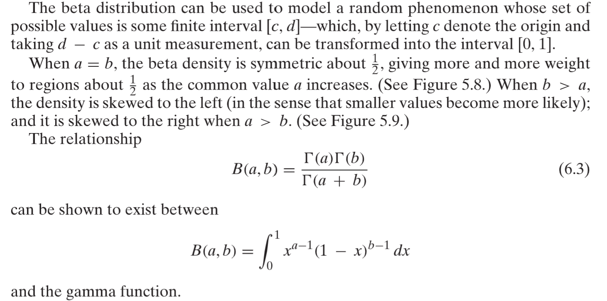
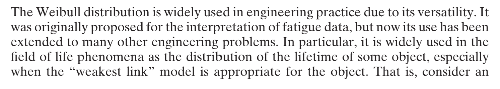

# 1 The Gamma Distribution
## 1.1 Gamma Definition⭐⭐⭐⭐
> 
> **当然我们也有如下的形式:**
> 
> 其中
> **期望:**
> 
> **方差:**
> 

## 1.2 Gamma函数递归性质⭐⭐⭐⭐⭐
> 
> 

## 1.3 Gamma和n-Erlang
> 我们在[Erlang分布](https://www.yuque.com/alexman/kziggo/axmnmf#xj9dV)介绍过`Erlang Distribution`一般用于描述一个`Possion`过程的`k-th arrival time`, 而`Erlang`分布其实是`Gamma`分布的一个别称。下面我们将深入介绍:
> 当$\alpha$是一个正整数，比如说$\alpha=n$, `Gamma`分布就会以一种离散的形态出现，表示`The amount of time one has to wait until a total n events has occurred`. 
> 所以一般而言, 我们有如下的结论: 
> `n-th arrival time`可以用$Gamma(n,\lambda)$来描述。
> 下面我们给出这个结论的证明:

**证明Gamma(n, lambda)描述了n-th arrival time**假设$T_n$是事件第$n$次发生时经过的时间，注意$T_n\leq t$当且仅当$t$时刻之前事件至少发生了$n$次。也就是说，如果我们令$[0,t]$区间上的时间发生次数总数为$N(t)$, 则我们有:
$P\{T_n\leq t\}=P\{N(t)\geq n\}=\sum_{j=n}^{\infty}P\{N(t)=j\}\newline=\sum_{j=n}^{\infty}\frac{e^{-\lambda t}(\lambda t)^j}{j!}(参数为\lambda t的泊松分布的PMF)$
于是$F_{T_n}(t)=\sum_{j=n}^{\infty}\frac{e^{-\lambda t}(\lambda t)^j}{j!}$, 我们对其求导得到:
$f_{T_n}(t)=\frac{\lambda e^{-\lambda t}(\lambda t)^{n-1}}{(n-1)!}$, 这就是我们的$Gamma(n,\lambda)$分布在$\alpha$为正整数的情况下的`PDF`。

## 1.4 Sum of 独立Gamma is Gamma
> 

**证明**

## 1.5 Sum of 独立Exp is Gamma
> 

## 1.6 Derivative for Gamma Function
> , 
> 

# 2 Chi-squared Distribution
## 2.1 Definition⭐⭐
> 

## 2.2 卡方和伽马分布⭐⭐⭐⭐
> **卡方分布是一种特殊的伽马分布:**
> 对于伽马分布，我们有$f_X(x;\alpha,\lambda)=\begin{cases}\frac{\lambda e^{-\lambda x}(\lambda x)^{\alpha-1}}{\Gamma(\alpha)}&x\geq 0\\0&x<0\end{cases}$
> 且$\Gamma(\alpha)=\int_{0}^{\infty}e^{-y}y^{\alpha-1}dy$
> **我们有:**
> 当$\alpha=\frac{n}{2}, \lambda=\frac{1}{2}$时，`Gamma`分布变成一个自由度为$n$的卡方分布
> **期望:**
> 
> $de^{-\frac{x}{2}}=-\frac{1}{2}e^{-\frac{x}{2}}dx\Rightarrow e^{-\frac{x}{2}}dx=-2de^{-\frac{x}{2}}$
> **所以**$(1)$**式变为**$\int_{0}^{\infty}\frac{1}{2^{\frac{n}{2}}\Gamma(\frac{n}{2})}x^{\frac{n}{2}}(-2)de^{-\frac{x}{2}}$**, 我们使用**`**Integral by parts**`**得到**
> 因为$\Gamma(\alpha)=\int_0^{\infty}x^{\alpha-1}e^{-x}dx$, $\Gamma(\frac{n}{2})=\int_0^{\infty}x^{\frac{n}{2}-1}e^{-x}dx$
> 根据$(2)$式，有$\int_0^{\infty}\frac{1}{2^{\frac{n}{2}}\Gamma(\frac{n}{2})}n\cdot e^{-\frac{x}{2}}x^{\frac{n}{2}-1}dx=n$
> **方差: **
> 
> $E[X]^2=n^2$, 所以$Var[X]=n^2+2n-n^2=2n$

## 2.3 独立的卡方分布之和也是卡方⭐⭐
:::info

:::
**推导**
We then use the MGF to show the sum of n independent  r.v. whose MGF takes the form:

Since  is the MGF for , thus the sum of n independent  r.v. is  r.v. 

## 2.4 卡方和高斯分布⭐⭐⭐⭐
> 假设$Z_1,Z_2,\cdots, Z_n$是**独立的标准高斯分布**的随机变量$N(0,1)$, 则$Y=\sum_{i=1}^n Z_i^2$服从卡方分布（自由度是$n$）。
> **现在我们来计算**$Y$**的**`**PDF**`**:**
> 当$n=1$,  我们有$Y=Z^2$的关系存在，此时我们可以求出$f_Y(y)$, 步骤如下：
> 
> 这个表达式是`Gamma`分布$\Gamma(\frac{1}{2},\frac{1}{2})$的`PDF`, 也就是自由度为的卡方分布。
> 因为任意一个都服从自由度为的分布，则根据`1.4`中的性质（$n$个独立的卡方分布的加和是卡方分布），我们有, 于是$\sum_{i=1}^nZ_i^2$的概率密度函数形如:
> 
> 这就是自由度为的卡方分布的`PDF`.
> 对于$\Gamma(\frac{n}{2})$这个表达式来说，如果:
> $n$是偶数，则$\Gamma(\frac{n}{2})=[(\frac{n}{2})-1]!$
> $n$是奇数，则我们可以使用$\Gamma(t)=(t-1)\Gamma(t-1)$和$\Gamma(\frac{1}{2})=\sqrt{\pi}$来计算$\Gamma(\frac{n}{2})$的值。
> 

> 

**Proof**

## 2.5 卡方和指数分布⭐⭐⭐⭐
:::info
假设$Z_1,Z_2,\cdots, Z_n$是**独立的标准高斯分布**的随机变量$N(0,1)$, 则$Y=\sum_{i=1}^n Z_i^2$服从卡方分布（自由度是$n$）。当时，, 此时我们得到, 是一个指数分布。
:::

# 3 T-distribution
## 3.1 Intro
:::info

:::
# 
## 3.2 T-分布的构成⭐⭐⭐⭐⭐
> 
> 所以自由度为的分布是由自由度为的卡方分布和标准高斯分布组成的。
> , 其自由度为。

## 3.3 PDF⭐⭐⭐⭐⭐
> 

**Proof**⭐⭐⭐⭐⭐因为，首先我们要计算的:
对于, 我们有
然后我们只需要利用微积分第二定理就行:

所以
然后我们计算的`PDF`, 
根据[独立随机变量的商](https://www.yuque.com/alexman/kziggo/ei1b29#UHoKQ), 我们有:

令, 于是。同时根据`Gamma`函数的性质, 我们有:

# 4 F-distribution⭐⭐⭐⭐
:::info

推导过程仿照`T-distribution`即可，难度更小。
:::

# 4 The Cauchy Distribution
:::info

假如, 则根据[随机变量的商](https://www.yuque.com/alexman/kziggo/ei1b29#UHoKQ)的`PDF`求法, 我们得到：

可以看到这就是我们的柯西分布的推导
**注意:**
柯西分布没有`Moment`, 他的用于求`Moment`的积分都是发散的。
:::
**算例**

# 5 The beta Distribution
## 5.1 Definition
> 
> 

## 5.2 运算性质
> 

**a=b 时的情况**
**a不等于b的情况**

# 6 The Weibull Distribution
> 

