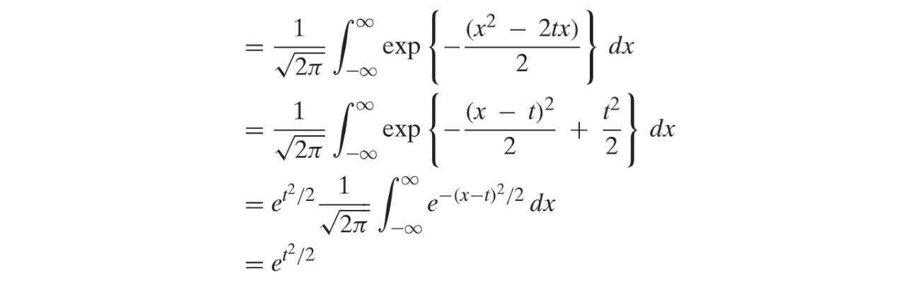
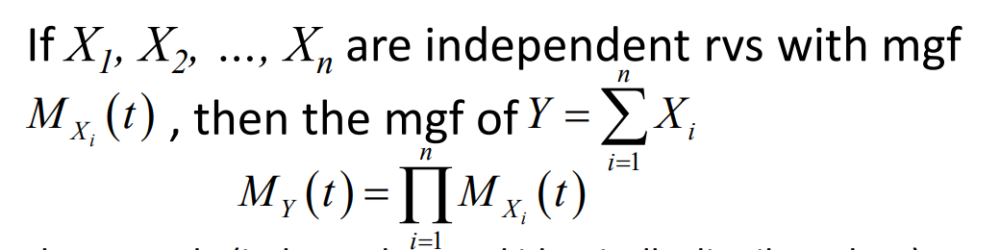

# 1 Moment Generating Functions
> `Moment Generating Function`是概率论中非常重要的概念，因为它能够帮助我们求出一个随机变量$X$的所有阶矩，且能够帮助我们在求一定数量的独立同分布随机变量的和的分布情况。 

[Moment Generating Function Slides.pdf](https://www.yuque.com/attachments/yuque/0/2022/pdf/12393765/1663656281956-6bbf6ad3-d0a8-42f6-aa67-135d66edc60d.pdf)
## 1.1 定义与基本性质
### 1.1.1 定义
> 我们称$M(t)$为`Moment Generating Function`是因为$X$**的所有的**`**Moments**`(`1-th moment`是期望, `2-th moment`是方差)都可以通过对于$M(t)$**的各阶导数在零处的值获得**。
> 比如，**对于**$X$**的期望**，我们可以通过求$M'(0)$获得: 
> - 首先我们可以求$M'(t)$得到，$M'(t)=\frac{d}{dt}E[e^{tX}]=E[\frac{d}{dt}(e^{tX})]=E[Xe^{tX}]$
> - 然后求$M'(0)$, 得到$E[Xe^{tX}]=E[X]$
> 
再比如，**对于**$X$**的方差**，我们可以求$M''(0)$获得:
> - 首先我们可以求$M''(t)=\frac{d}{dt}E[M'(t)]=E[\frac{d}{dt}(Xe^{tX})]=E[X^2e^{tX}]$
> - 于是$M''(0)=E[X^2]$
> 
于是对于$X$**的**`**n-th Moment**`, 我们有$M^n(t)=E[X^ne^{tX}]$, 于是$M^n(0)=E[X^n],n\geq 1$

### 1.1.2 基本性质
> 1. **对于所有的随机变量**$X$**, **$M_X(0)=E[e^0]=1$
> 2. If $X$ takes both positive and negative values with positive probability then $M(t)$ grows at least exponentially fast in $|t|$ as $|t| → ∞$  
> 3. **Knowing all of the derivatives of **$M$** at a single point tells you the moments **$E[X^k ]$** for all integer **$k ≥ 0$**.  **
> 4. **我们在解读**$e^{tX}$**的时候可以从泰勒展开的角度来思考: **$e^{tX} =1+tX+\frac{t^2X^2}{2!}+\cdots+\frac{t^nX^n}{n!}$**, 我们对**$e^{tX}$**求期望，根据期望的线性性质，我们可以得到： **$M_X(t)=E[e^{tX}]=1+tE[X]+\frac{t^2}{2!}E[X^2]+\cdots+\frac{t^n}{n!}E[X^n]\newline=1+tm_1+\frac{t^2}{2!}m_2+\cdots+\frac{t^n}{n!}m_n$**, **$m_k$**是**$X$**的**$k-th$**moment(通过对**$M_X(t)$**求**$k$**阶导并且求这个导函数在**$t=0$**处的值)**

## 1.2 MGF for Common Distributions
> 如果`MGF`存在，则其唯一确定一个随机变量的概率分布。
> 如果两个随机变量的`MGF`相同，则这两个随机变量的分布几乎一致。
> `MGF`是关于的函数，有些`MGF`只对某些有定义，比如几何分布，指数分布，伽马分布。

### Binomial Distribution
> 1. $X$**的期望:**
> 

> 所以$E[X]=M'(0)=np$
> 2. $X$**的方差:**
> 
$E[X^2]=np(1-p)$

### Geometric Distribution
> 

### Possion Distribution
> 
> 
> **如果我们要求**$E[X^n]$**, 只要对**$M(t)$**求**$n$**阶导数即可：**
> $E[X^n]=\frac{d}{dt}M^{(n)}(t)$

### Exponential Distribution
> 

### Normal Distribution
> 对于一个随机变量$X\sim N(\mu,\sigma^2)$, 我们直接求其`MGF`会稍显复杂，所以我们从求其标准化之后的随机变量$Z\sim N(0,1)$的`MGF`开始，然后利用高斯分布的线性性质来求得任何高斯分布的随机变量的`MGF`, 步骤如下:
> 1. **求**$Z$**的**`**MGF**`**: **
> 

> 注意到$\frac{1}{\sqrt{2\pi}}e^{-\frac{(x-t)^2}{2}+\frac{t^2}{2}}$可以看成$\frac{1}{\sqrt{2\pi}}e^{-\frac{(x-t)^2}{2}}\cdot e^{\frac{t^2}{2}}$, 前一个表达式是$N\sim (t,1)$的概率密度函数, 所以如果我们对其求积分$\int_{-\infty}^{\infty}\frac{1}{\sqrt{2\pi}}e^{-\frac{(x-t)^2}{2}}dx=1$, 同时由于这个积分和$t$是无关的，所以我们可以将$e^{\frac{t^2}{2}}$提到积分符号外面去，于是结果就是$e^{\frac{t^2}{2}}$
> 2. **求任意高斯分布随机变量**$X=\mu+\sigma Z$**的**`**MGF**`**:**
> 

> 3. **求得**$X$**的各阶**`**Moment**`**：**
> 

### Gamma Distribution
> **假设伽马分布的参数是**$\alpha,\lambda$**, 则:**
> 
> $f_X(x)=\frac{\lambda e^{-\lambda x}(\lambda x)^{\alpha-1}}{\Gamma(\alpha)},x>0$
> 
> 假设Gamma分布的参数是$\alpha,\beta=\frac{1}{\lambda}$, 则:
> $E[e^{tX}]=(1-\beta t)^{-\alpha}$

> 如果我们利用: 独立的指数分布相加等于Gamma分布的性质，计算就会变得非常简单:
> 如果$Z=nX$, 且$X\sim \mathcal{E}(\lambda)$, 则:
> 
> $Z$服从伽马分布。我们需要特别注意$\lambda$和$t$的相对大小关系：
> 如果$t\leq \lambda$则计算$M_X(t)$所需的积分是发散的。

### Chi-Squared Distribution
> 由于卡方分布是特殊的伽马分布，于是: 
> $\Chi_n^2$的`MGF`是, 其中$\alpha=\frac{n}{2}, \lambda=\frac{1}{\beta}=\frac{1}{2}$
> 由于卡方分布(自由度为)是由一系列独立的高斯随机变量的平方相加得来, 假设，则:
> 
> 则

### Uniform Distribution
:::info

:::

### Summary Table 
> 
> 

### Some Relationship
:::info

:::

## 1.3 MGF和概率分布
### 1.3.1 随机变量之和的MGF
> `MGF`的一个重要性质是: 对于两个**独立**的随机变量$X,Y$, 他们的和$Z$的`MGF`等于$X,Y$各自的`MGF`的乘积。
> 更一般地:
> 
> 下面我们给出证明:

**证明**假设$X$的`MGF`是$M_X(t)$, $Y$的`MGF`是$M_Y(t)$。则$X+Y$的`MGF`是:

第三个等式成立是因为$X,Y$独立。
**Sum of Independent Binomial  **= **Binomial**
**Sum of Independent Possion = Possion **
**Sum of Independent Normal = Normal**
**Sum of Squared Standard Normal = Chi-Squared**
**Sum of Gamma = Gamma**$X_i\sim f_X(x;\alpha,\beta)$，$\sum_{i}X_i\sim f_X(x;n\alpha,\beta)$
如果$X_i$的参数是$(\alpha_i,\beta)$, $\sum_i X_i\sim f_X(x;\sum_i\alpha_i, \beta)$ 
**Conditional Distribution**
本题我们要探究在$Y=p$的条件下，一个原本服从$Uniform(0,1)$均匀分布的随机变量$X$的分布变成了一个$Binomial(n,p)$二项分布, 我们要证明$X$取$\{0,1,\cdots, n\}$是等可能的，证明步骤如下:

### 1.3.2 任意数量随机变量和的MGF
> 由任意数量的独立同分布构成的随机变量$X_1,\cdots, X_N$来说，可以求得$Y=\sum_{i}^{N}X_i$的`MGF`。
> 首先我们求随机变量$Y$的`MGF`的定义和迭期望公式:
> $M_Y(t)=E[e^{tY}]=E[E[e^{tY}|N]]=E[(M_X(t))^N]=\sum_{n=0}^{\infty}(M_X(t))^np_N(n)..............................................(1)$
> 因为$(M_X(t))^n=e^{log(M_X(t))^n}=e^{nlogM_X(t)}$, 把它代入$(1)$, 我们有$M_Y(t)=\sum_{n=0}^{\infty}e^{nlogM_X(t)}p_N(n).....................................(2)$
> **另一方面**，对于随机变量$N$来说，它的`MGF`表达式形如: 
> $M_N(t)=E[e^{tN}]=\sum_{n=0}^{\infty}e^{tn}p_N(n)..............................(3)$, 我们将$(2)$与$(3)$比较，可以得出$M_Y(t)=M_N(logM_X(t))$, 这也意味着$M_Y(t)$这个函数的表达式是可以从$M_N(t)$这个函数的表达式得到的，只要代入不同的变量即可。

**算例1：Generalization**
**算例2：Sum of a Geometric Number of Independent Exponen­tial RandomVariables. **

### 1.3.3 MGF唯一确定概率分布
> 
> `Support`就是`Sample Space`的意思。
> 如果$M_X(t)$存在且在$t=0$附近的区域有限，则随机变量$X$的分布可以被唯一的确定，比如: 
> 

**算例**

## 1.4 MGF的存在性问题
> 从前文我们看出，在我们使用积分$\int_{-\infty}^{\infty}f_X(x)\cdot e^{tx}dx$计算$E[e^{tX}]$的时候，似乎只要$f_X(x)$ 呈指数衰减模式，即$e^{kt}$中的$k<0$, $M_X(t)$就必然存在，如果$k\geq 0$,$M_X(t)$不一定存在。
> 下面我们以`Cauchy Distribution`为例，探究`MGF`不存在的情况:
> 
> 我们也可以不加证明地给出一个`Claim`:
> 

## 1.5 MGF常用性质
### 不等式
> **对于**$b>0,t>0$**, 我们有:**$E[e^{tX}]\geq E[e^{t\cdot min\{X,b\}}]\geq P(X\geq b)\cdot e^{tb}$
> **推导过程：**
> $E[e^{tX}]\geq E[e^{t\cdot min\{X,b\}}]$, 对于$e^{t\cdot min\{X,b\}}$, 我们有两种情况:
> 1. 如果$X\geq b$,$e^{t\cdot min\{X,b\}}=e^{tb}$, 于是$E[e^{t\cdot min\{X,b\}}]=E[e^{tb}]=e^{tb}$
> 2. 如果$X<b$, $e^{t\cdot min\{X,b\}}=e^{tX}$, 于是$E[e^{t\cdot min\{X,b\}}]=E[e^{tX}]$
> 
**所以根据条件全期望公式:**
> $E[e^{tX}]\geq E[e^{t\cdot min\{X,b\}}]=E[e^{t\cdot min\{X,b\}}|X\geq b]P(X\geq b)+E[e^{t\cdot min\{X,b\}}|X<b]P(X< b)\geq E[e^{t\cdot min\{X,b\}}|X\geq b]P(X\geq b)=P(X\geq b)\cdot e^{tb}$

### 线性变换
> 

## 1.6 Characteristic Functions
:::success
前文我们在研究`MGF`的存在性问题的时候说，当一个随机变量的概率函数$f_X$衰减速率不如指数衰减速率时，一般其`MGF`不存在。为了解决这个问题，我们关于随机变量$X$定义一个新的`MGF`, 称为`Characteristic Function`, 这个函数将使得：即使随机变量$X$衰减得很慢，我们仍然能得到一个类似于`MGF`的函数`Charateristic Function`, 且我们可以通过`Characteristic Function`得到随机变量$X$的任意阶矩， 且对所有$t$都有定义。
:::
### 1.6.1 定义
> 假设我们有随机变量$X$, 我们定义：
> ，一般而言，我们看到$e^{it}$的出现就会很自然的想到欧拉公式$e^{it}=cos\theta +isin\theta$

### 1.6.2 和MGF的相似之处
> 随机变量$X$的特征函数和`MGF`都满足一些运算法则，即:
> $\phi_{X+Y}(t)=\phi_X(t)\phi_Y(t)$, 正如我们在`MGF`中看到的那样: $M_{X+Y}(t)=M_X(t)M_Y(t)$
> $\phi_{aX}(t)=\phi_X(at)$, 正如我们在`MGF`中看到的那样，$M_{aX}(t)=M_X(at)$
> 如果$X$有`m-th moment`, 则$E[X^m]=i^m\phi_X^{(m)}(0)$

 

## 1.7 Limit Theorem
> 本小节我们假设$X$是一个随机变量，$X_n$是一个随机变量序列。

### 1.7.1 Convergence in Distribution
> 

### 1.7.2 Levy's Contiuity Theorem
> 

### 1.7.3 Moment generating analogue
> 

## 
# 2 Joint Moment Generating Functions
> 本小节我们将定义对于多个随机变量的`Joint MGF`

## 2.1 定义与基本性质
> 假设我们有$n$个随机变量(不一定独立)$X_1,\cdots,X_n$, 则我们定义一个`Joint MGF`的表达式: $M(t_1,\cdots, t_n)=E[e^{t_1X_1+\cdots t_nX_n}]$。类比我们在联合概率密度函数中的性质，通过`Joint MGF`也可以得到"`Marginal MGF`"，方法就是使得除了$t_i$以外的所有$t_j$都等于零，即对于某个随机变量$X_i$: $M_{X_i}(t)=E[e^{tX_i}]=M(0,\cdots,0, t,0,\cdots,0)$（$t_i=t$）
> 和上文一样，**对于**`**Joint MGF**`**, 我们有:**
> $M(t_1,\cdots, t_n)$**唯一确定了**$X_1,\cdots, X_n$**的联合概率分布**。如果我们能证明这个命题，则我们会有一个推论: $n$个随机变量$X_1,\cdots, X_n$是独立的当且仅当$M(t_1,\cdots, t_n) = M_{X_1}(t_1)\cdots M_{X_n}(t_n)$
> **下面我们会证明红体字标出的命题(Optional):**

**Proof**

## 2.2 一些算例
### 2.2.1 独立的高斯随机变量
> 假设$X,Y$是独立的高斯分布的随机变量，服从$N(\mu,\sigma^2)$分布，我们想证明$X-Y$和$X+Y$是独立的，本章我们可以从`Joint MGF`的视角来完成证明, **证明如下**：
> 
> 其中第二个等式成立是因为: 如果随机变量$X$和$Y$是独立的，则$f(X)$和$g(Y)$也是独立的。

### 2.2.2 独立的泊松变量
> 

