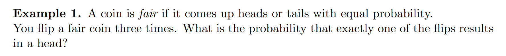
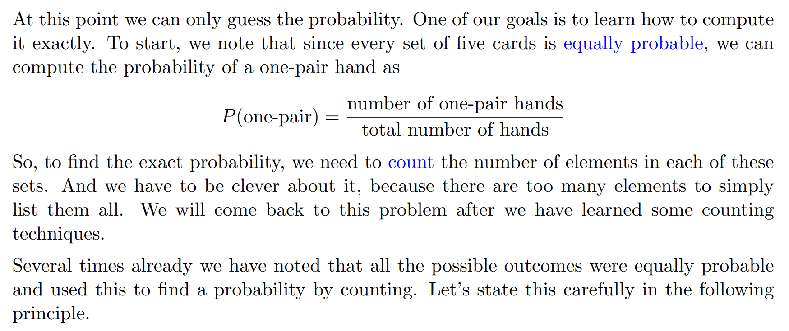
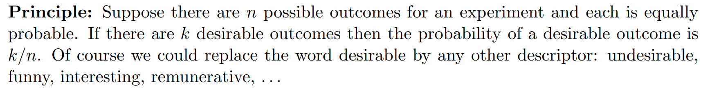
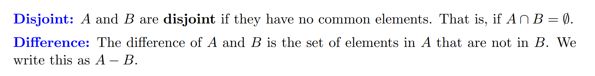
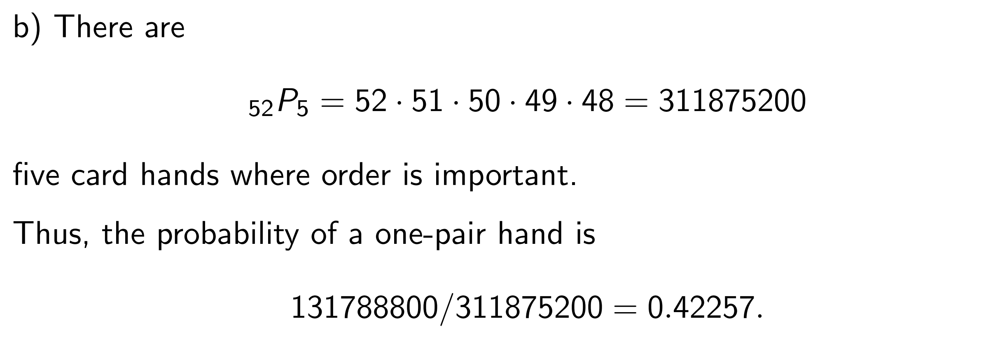

[Counting and Sets.pdf](https://www.yuque.com/attachments/yuque/0/2022/pdf/12393765/1659874745284-cac685e4-5436-464b-9dce-cd313ac9ecc1.pdf)
[Class Slides, Introduction to Probability and Statistics.pdf](https://www.yuque.com/attachments/yuque/0/2022/pdf/12393765/1659882111687-0a70aaea-0357-47fc-b989-50e12b8a93c3.pdf)
[Class Slides, Probability Basics.pdf](https://www.yuque.com/attachments/yuque/0/2022/pdf/12393765/1659882111768-0680d34e-f3db-429a-a051-c86a7ad97349.pdf)

# 0 本节学习目标
> 1. 熟悉集合的基本定义和集合基本操作
> 2. 使用`Venn Diagrams`可视化集合操作
> 3. 理解如何使用**计数**来计算概率
> 4. 理解乘积法则，`Inclusion-exclusion`关系，排列组合

# 1 计数 Counting 
## 1.1 抛硬币
> 
> 
> 这种方法求概率的充要条件就是每一个样本点都必须是等可能的，在这个`Fair coin`的结果序列中，每个长度为$3$的序列结果的概率都是相等的，均为$\frac{1}{8}$

## 1.2 扑克牌**⭐⭐⭐⭐**
### 1.2.1 前置概念
> 本例介绍了两个常用概念: 
> `**Hand**`: 就是五张牌的组合
> `**One-pair hand**`: 就是包含两张数字相同，剩余三张和前两张数字不同的手牌组合。

### 1.2.2 案例
:::success

目前这个阶段，我们只能猜测这五个事件发生的概率。而本小节的目标就是要让我们学习如何计算。
:::

### 1.2.3 计算概率
:::success

:::

### 1.2.4 概率计算原则
:::success

:::

## 1.3 Concept Check
:::success

:::

# 2 集合基础
> 本节我们介绍集合基本操作

## 2.1 定义
:::success

:::

## 2.2 集合运算
> 

## 2.3 DeMorgan's Laws**⭐⭐⭐**
> 
> 

**推导**

## 2.4 韦恩图**⭐⭐**
### 2.4.1 概念
> 

### 2.4.2 证明DeMorgan's Laws
> 

### 2.4.3 算例: 验证Demorgan's Law
> 

## 2.5 集合的乘积法则**⭐⭐⭐**
> 
> 

## 2.6 集合元素计数**⭐⭐**
### 2.6.1 Notations
> 

### 2.6.2 Inclusion-Exclusion 原则
#### 定义
> 

#### 算例
> 
> 

### 2.6.4 乘法法则
#### 定义
> 
> 
> 乘积法则在行为$2$和行为$1$相关时仍然可以使用

#### 算例1
> 

#### 算例2: 选套装**⭐⭐⭐**
> **一些词汇:**
> `denim`: 工装裤

> 
> 

#### 算例3: 基因序列
> 

# 3 排列/组合/分割⭐⭐
## 3.1 排列
### 3.1.1 定义
> 

### 3.1.2 算例
> 
> 
> 后续我们会用`Tree View`来解释排列的本质。实际上就是做了深度优先的遍历。

## 3.2 组合
### 3.2.1 定义⭐⭐
> 

### 3.2.2 求集合的子集
#### 简单形式
> 

#### 推广到一般
> 

## 3.3 排列组合计算公式⭐⭐
> 

## 3.4 分割(Partitions)
> 分割是组合的延伸，组合可以被理解成我从$n$个元素中选出$k$个元素，这样的操作会将$n$个元素分割成两个互斥子集，一个子集是选出的$k$个元素，另一个子集是剩下的$n-k$个元素。而分割则将$n$个元素分成任意多个子集。

### 3.4.1 问题背景
> 

**思想**
**结论**

### 3.4.2 分组问题
> 有了分割的思想，我们来探讨一类经典的排列组合问题: 分组分配问题
> 参考: [https://zhuanlan.zhihu.com/p/336248739](https://zhuanlan.zhihu.com/p/336248739)

#### 平均分组
> 将六本不同的书，平均分成三组，有多少种不同的分法?
> 

#### 不平均分组

#### 部分平均分组

### 3.4.3 分配问题

## 3.5 算例
### 算例1 排列组合辨析
> 

### 算例2 排列组合⭐⭐
> 
> $(2)$问的思路来源于`1.2.3`中的概率计算原则, 这里的$3$和正面朝上没有顺序要求，所以使用组合作为分子，分母是所有可能出现的硬币序列，所以使用排列即可，因为每次抛硬币都是独立事件，所以可以使用乘法法则时可以忽略将条件概率变成常规的事件概率。

### 算例3 Anagrams⭐⭐
> **使用**`**Partitions**`**公式**
> 
> **使用**`**Multinomial Coefficients**`**:**
> 

## 3.6 总结
> 

# 4 扑克牌问题⭐⭐⭐⭐⭐
> 本节我们进一步探究一些扑克牌问题, 作为`1.2`的延伸

## 4.1 问题背景
> 
> 

## 4.2 两种解法
### 4.2.1 组合视角⭐⭐⭐
> 组合视角认为牌选取的顺序无关紧要

#### (a)⭐⭐⭐
> 
> 
> 我们要特别注意这里的`Action 3`和`Action 4`，我们可能会想:
> **如果我们的**`**Action 3**`**是从剩下的**`**48**`**张牌中选一张，然后**`**Action 4**`**是从剩下的**`**44**`**张牌中选一张，答案变成**$(^{13}_1)(^4_2)(^{48}_1)(^{44}_1)(^{40}_1)$**为什么不对?**
> 这是一个特别容易错的点，因为$(^{48}_1)(^{44}_1)(^{40}_1)$表示的是一个排列，这样的选取方式可能会导致$\{3A,4B,5C\}$和$\{4B,5C,3A\}$这样的选取方式被计算$3\times 2\times 1=6$次，而我们在组合视角下认为这两种选取方式没有差别(注意`组合`是子集的意思，一个集合内部的元素是没有顺序的，而列表中的元素才是有顺序的), 所以得到的结果也会是标准结果的两倍。
> 我们验证一下，如果按照答案的计算，则`Action 3-Action 4`一共有$44\times 40\times 8$种, 而我们得到的错误答案是$48\times 44\times 40$种，确实差了$6$倍之多。

#### (b)
> 

### 4.2.2 排列视角⭐⭐
> 组合视角认为牌选取的顺序有关系

#### (a)
> 
> 
> 1. **上例中的**`**Action 1**`**和**`**Action 2**`**的解释: **
> 
由于我们采用排列视角，所以一套手牌内部的手牌顺序是有关的，如果我们先任意选取一张牌，假设是草花$3$, 那么五张牌中一定有另一张牌是`花色3`的(由`One-pair`的性质得到)，但是这两张牌在五张牌中的顺序可以是任意的（乘积法则保证），但是这两张牌在五张牌中的位置是需要特别选取的，于是需要$(^5_2)$考虑这两张相同数字的牌的所有可能的出现位置。
> 2. **为什么**`**Action 1**`**中使用**$_5C_2$**而不是**$_5P_2$**?**
> 
由于乘积法则给出的$52*3$（`Action 2,Action 3`）已经考虑了两张牌的所有可能的顺序，所以在选择两张牌的`Slot`的时候就不需要再考虑顺序了，否则会导致重复

#### (b)
> 
> 在排列视角下，分母也必须考虑顺序。

