# 1 Recitation Problems
[Recitation 1.pdf](https://www.yuque.com/attachments/yuque/0/2022/pdf/12393765/1661159377389-7d23f5a2-013a-4446-837d-0b11d0d1923d.pdf)
[Recitation 1 Solutions.pdf](https://www.yuque.com/attachments/yuque/0/2022/pdf/12393765/1661159377230-02e98a8e-0a95-48cd-9f52-2c2aeb12013e.pdf)
[Recitation 4.pdf](https://www.yuque.com/attachments/yuque/0/2022/pdf/12393765/1661228997813-d5fb2091-251b-4367-84e6-c275866fa89c.pdf)
[Recitation 4 Solutions.pdf](https://www.yuque.com/attachments/yuque/0/2022/pdf/12393765/1661228997812-83039915-edce-423f-9ba7-2a737e0add0d.pdf)

## P1 推导概率函数性质**⭐⭐**
> 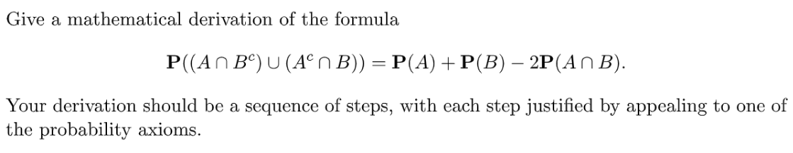

**Key**首先因为$A\cap B^c$和$A^c\cap B$是不相交（`Disjoint`）的，根据概率公理`Addivitiy`, 所以我们有$P((A\cap B^c)\cup(A^c\cap B))=P(A\cup B^c)+P(A^c\cap B)$
然后根据集合性质我们有: $A=(A\cap B)\cup (A \cap B^c)$, 所以$P(A\cup B^c)=P(A)-P(A\cap B)$(`By Addivity`)。
同理：$B=(A^c\cap B)\cup (A \cap B)$, 所以$P(A^c\cup B)=P(B)-P(A\cap B)$(`By Addivity`)。
于是$P((A\cap B^c)\cup(A^c\cap B))=P(A\cup B^c)+P(A^c\cap B)=P(A)+P(B)-2P(A\cap B)$, 证毕。

## P2 天才和巧克力**⭐**
> 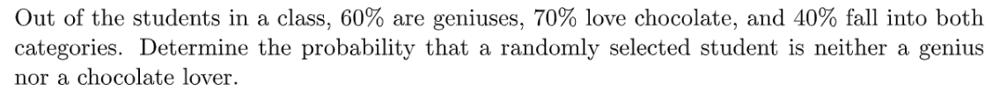

**Key**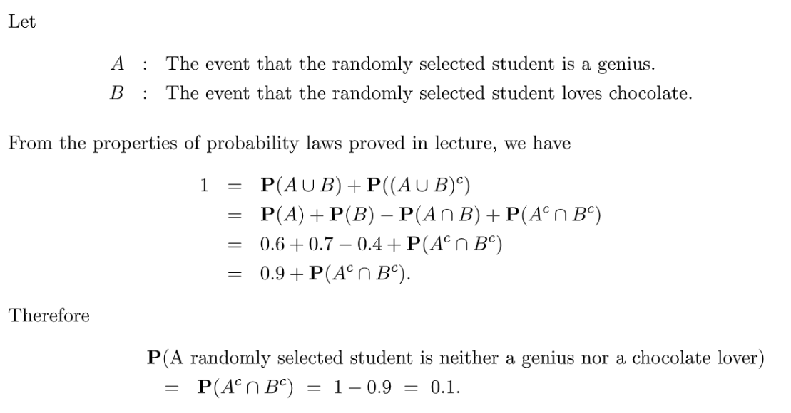

## P3 Unfair Dices**⭐**
> 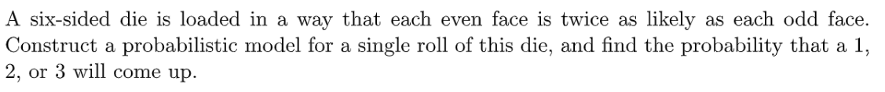

**Key**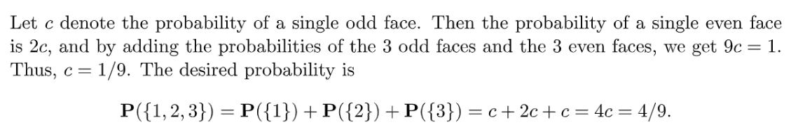

## P4 Continuous Uniform Law**⭐⭐⭐**
> 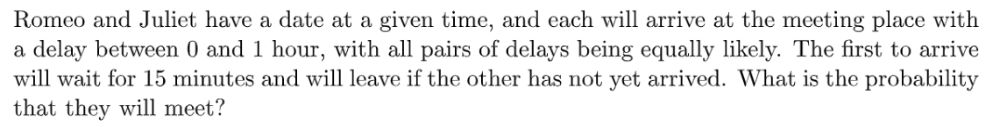

**Key**这是一道经典的`Continuous Uniform Law`的题目。下图中的左下角可以理解为两个人约定好的见面时间，阴影部分就是他俩能够碰面的情况。正方形区域上的每个点都是他们可能到达并等待的事件。
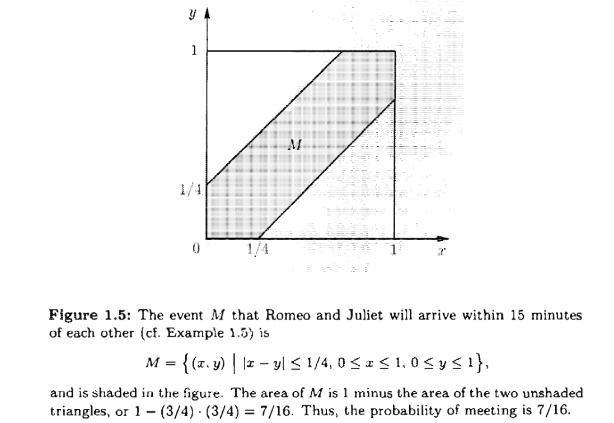

## P5 Continuity Property**⭐⭐⭐⭐⭐**
> 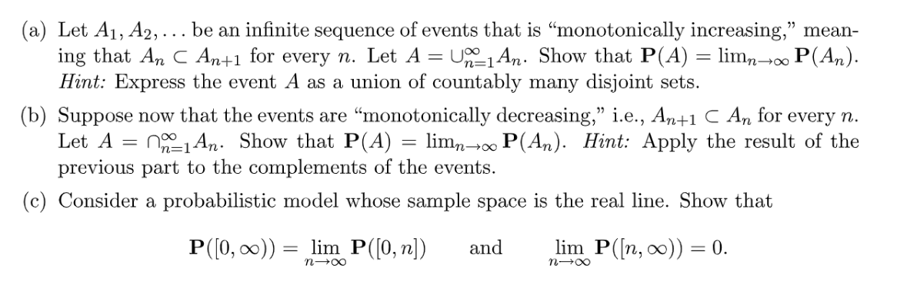

**(a) 集合上界**处理本题需要**一点小技巧**，关键是要能利用好$A_{n-1}\subset A_n$这个性质。
我们知道如果$A\subset B$, 则$A^c\cap B$和$A$是`Disjoint`的。
所以我们可以令$B_1=A_1$，并令$B_n=A_n\cap A_{n-1}^c$, 所以$B_n$是互不相交的, 如下图所示(图中的颜色块)：
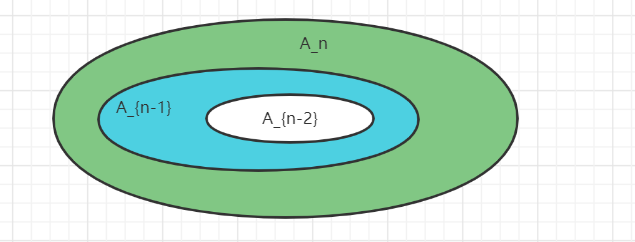
同时又图中可以得出，$A_n=\cup_{k=1}^n B_k$, 所以$A=\cup_{k=1}^\infty B_k$
所以根据概率公理`Additivity`, 得到$P(A)=\sum_{k=1}^\infty P(B_k)=\lim_{n\to \infty}\sum_{k=1}^nP(B_k)=\lim_{n\to \infty}P(\cup_{k=1}^nB_k)=\lim_{n\to \infty}P(A_n)$, 证毕。
**(b) 集合下界**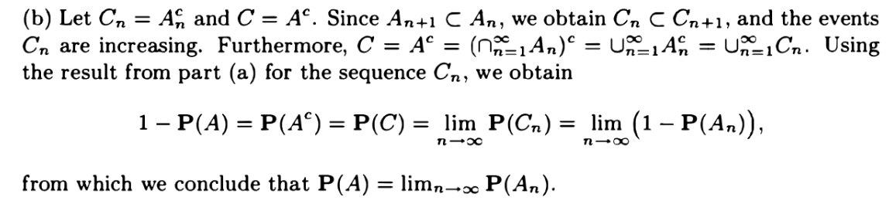
**(c) 使用(a)和(b)的结论**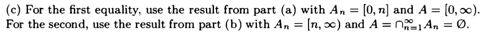

# 2 Assignment
[Assignment 1.pdf](https://www.yuque.com/attachments/yuque/0/2022/pdf/12393765/1661159377221-9ce93033-6d26-4c5d-9512-7a0abb465d14.pdf)
[Assignment 1 Solutions.pdf](https://www.yuque.com/attachments/yuque/0/2022/pdf/12393765/1661159377231-2467cda3-eb3a-4d46-8c7a-e74bab814fa6.pdf)

## P1 事件与韦恩图**⭐⭐⭐**
> 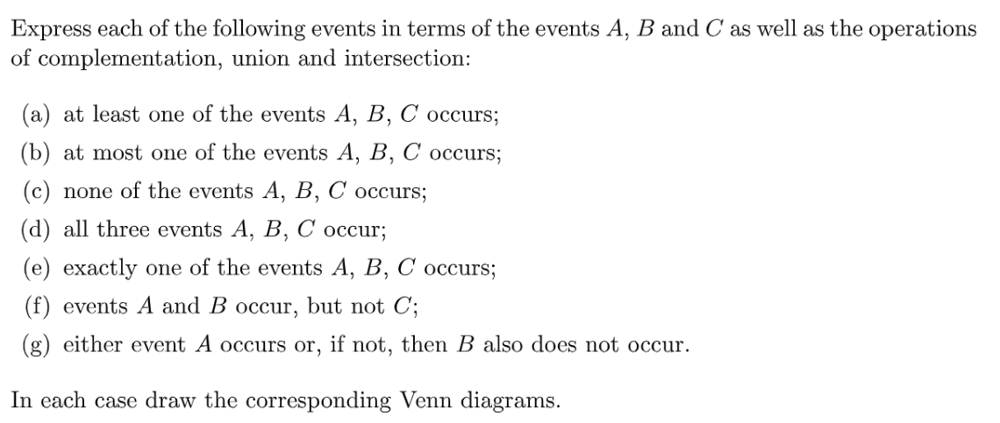

**Key**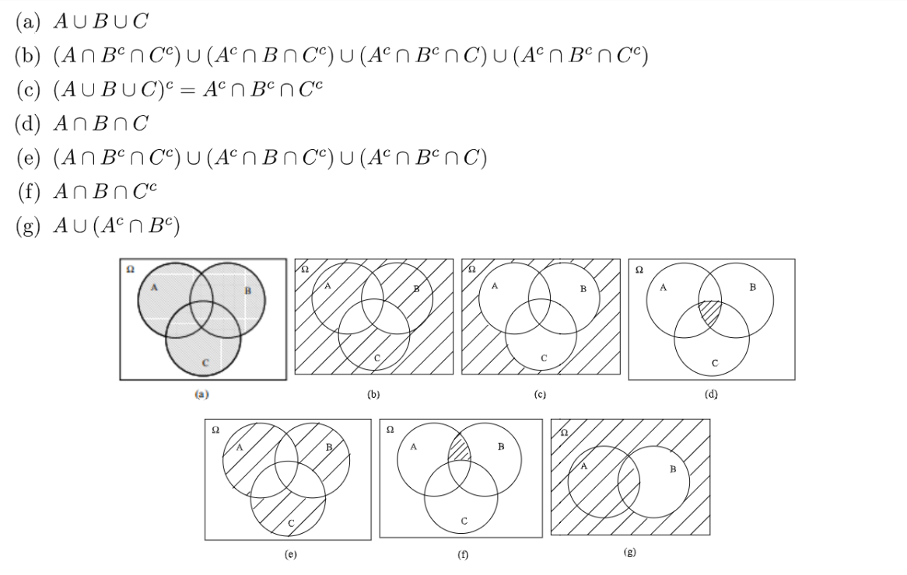

## P2 抛硬币
> 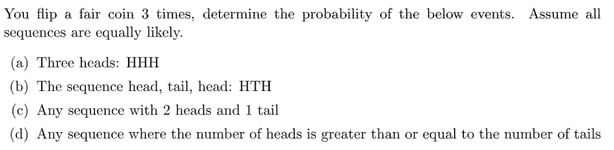

**Key**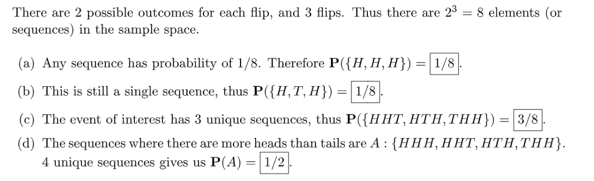

## P3 Discrete Uniform Law**⭐⭐⭐**
> 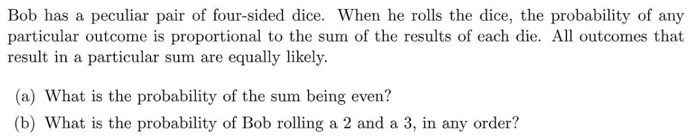

**Key**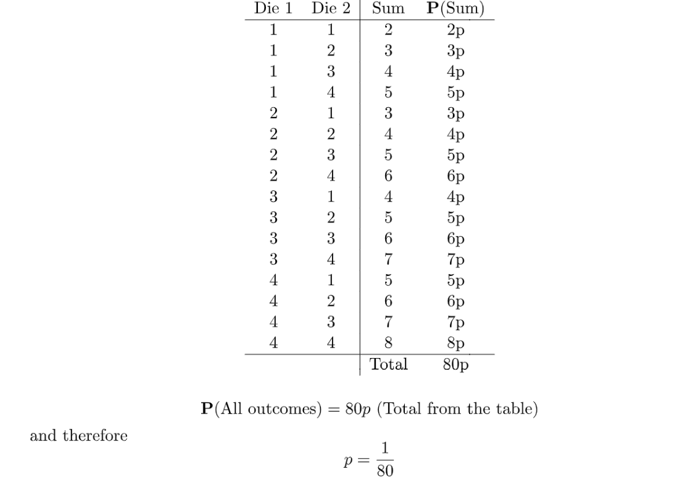
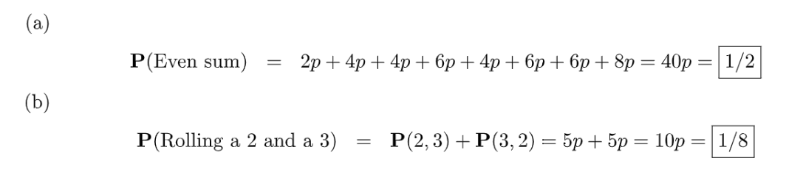

## P4 Continuous Uniform Law
> 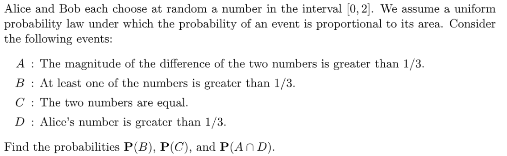

**P(B)**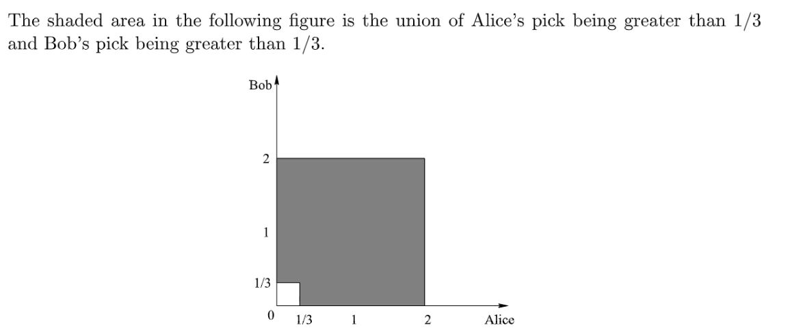

**P(C)**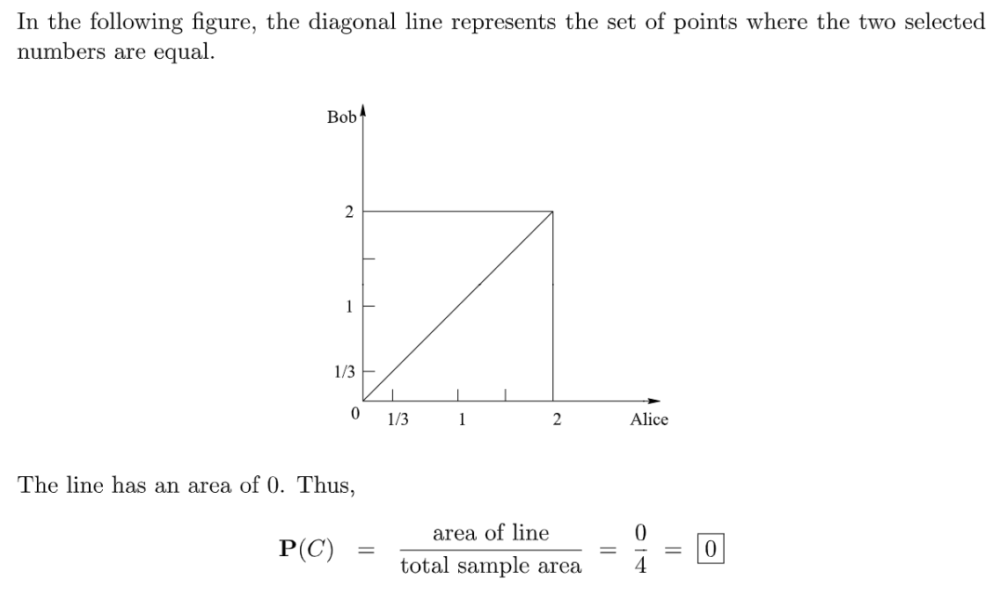
**P(A and D)**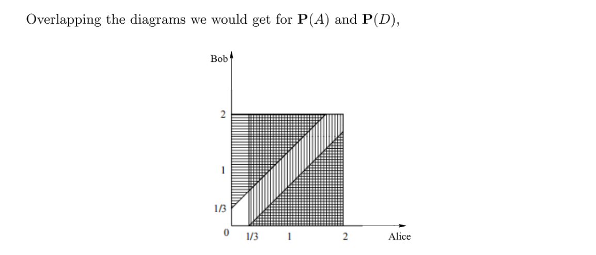
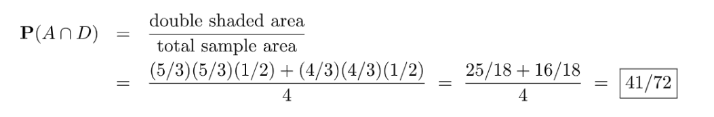

## P5 Continuous Uniform Law 2**⭐⭐⭐**
> 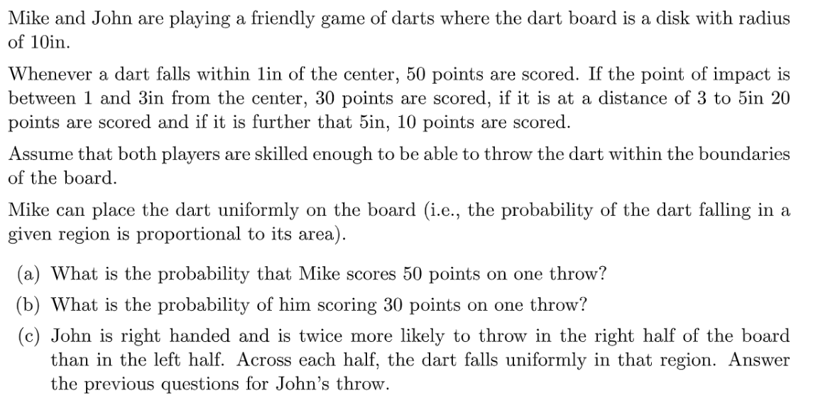

**(a) **因为`Mike`扔到飞镖盘的每一点处的概率是相同的，是`Continuous Uniform`的，且题目说我们的概率是和面积成正比的，所以假设每一点的概率是$\alpha$，则$\pi \cdot 10^2\cdot \alpha=1$, 所以$\alpha=\frac{1}{100\pi}$
因此$(a)$问的答案是: $\frac{\pi\cdot 1^2}{100\pi}=\frac{1}{100}=0.01$
**(b)**因为`Mike`要一次得到$30$分，所以答案是$\frac{\pi\cdot 3^2-\pi\cdot 1^2}{100\pi}=0.08$
**(c)**由于`John`在命中飞镖盘的不同区域的概率是不同的，所以我们在求`John`的概率密度$\alpha$时，需要这样求: 假设`Right Half`概率密度是$2\alpha$, `Left Half`是$\alpha$, 则$10^2\pi\cdot \frac{1}{2} \cdot 2\alpha+10^2\pi\cdot \frac{1}{2}\cdot \alpha=1$, 所以$\alpha=\frac{1}{150\pi}$
于是对于$(a)$问，我们有$\frac{\frac{1}{2}\pi}{75\pi}+\frac{\frac{1}{2}\pi}{150\pi}=\frac{1}{100}=0.01$
对于$(b)$问，我们有$\frac{\frac{1}{2}\cdot8\pi}{75\pi}+\frac{\frac{1}{2}\cdot 8\pi}{150\pi}=\frac{1}{100}=0.08$
**Insights⭐⭐⭐**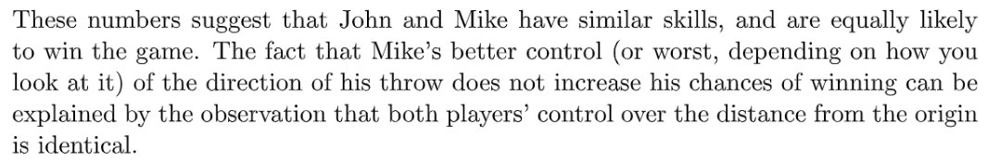

## P6 Bonferroni Inequality**⭐⭐⭐⭐**
> 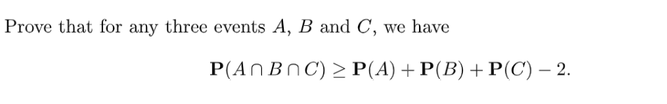

**Key**我们知道$P(A\cap B \cap C)=1-P((A\cap B\cap C)^c)=1-P(A^c\cup B^c\cup C^c).............(1)$
因为$P(A^c\cup B^c\cup C^c)\leq P(A^c)+P(B^c)+P(C^c)$[概率公理性质c](https://www.yuque.com/alexman/kziggo/fxeosd#xKeCw)
所以$P(A^c\cup B^c\cup C^c)\leq P(A^c)+P(B^c)+P(C^c)=3-P(A)-P(B)-P(C)$将其代入$(1)$中即可得到结论
**一般推广形式**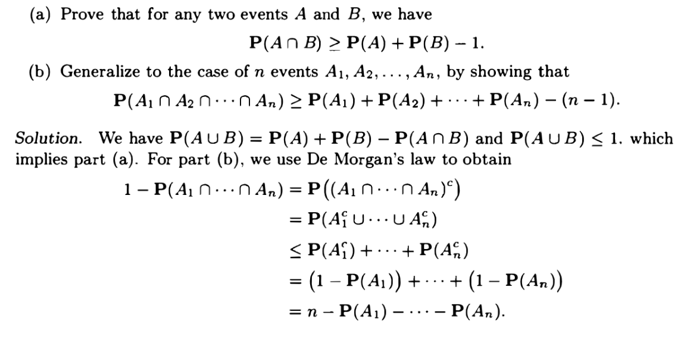

## P7 Continuity Property 2**⭐⭐⭐⭐⭐**
> 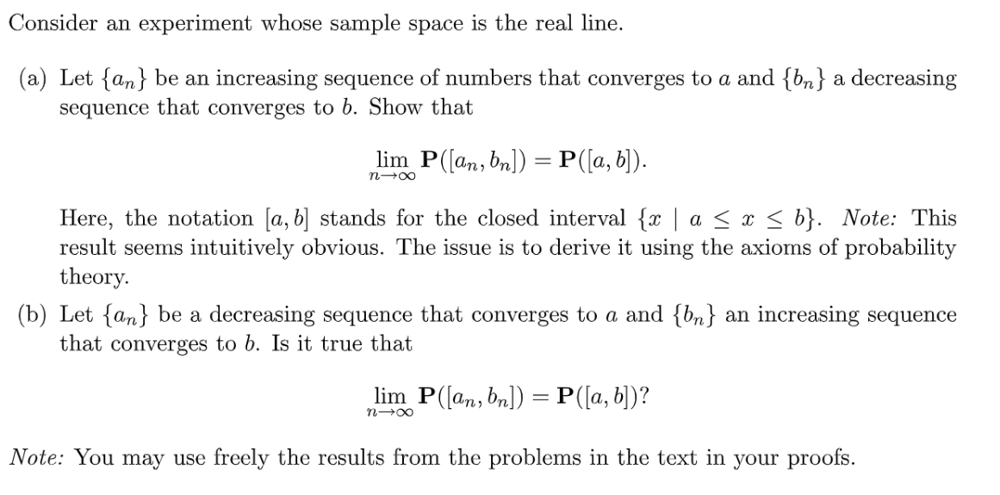

**(a)**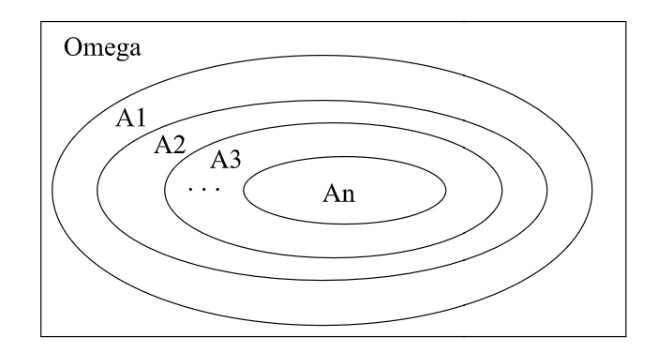
因为$a_n$是递增数列，所以$a_n\leq a_{n+1}$； 因为$b_n$是递减数列，所以$b_n\geq b_{n+1}$
于是我们可以说$[a_{n+1},b_{n+1}]\subset [a_n,b_n]$, 令$A_n=[a_{n},b_{n}]$, 所以$A_{n+1}\subset A_n$
所以$A_n$是一个递减的集合。令$A=\cap_{i=1}^\infty A_i=[a,b]$(因为级数收敛)
所以根据`Continuity Property of Probability`, 我们有$P(A)=\lim_{n\to \infty}P(A_n)$
所以$P([a,b])=\lim_{n\to \infty}P([a_n,b_n])$
**(b)⭐⭐⭐**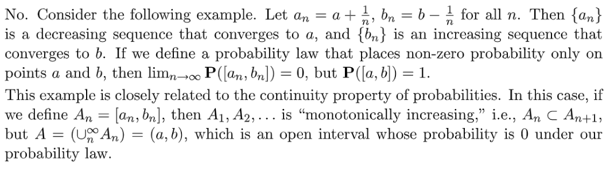
