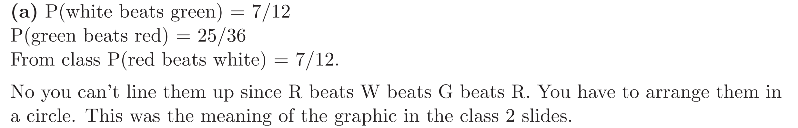
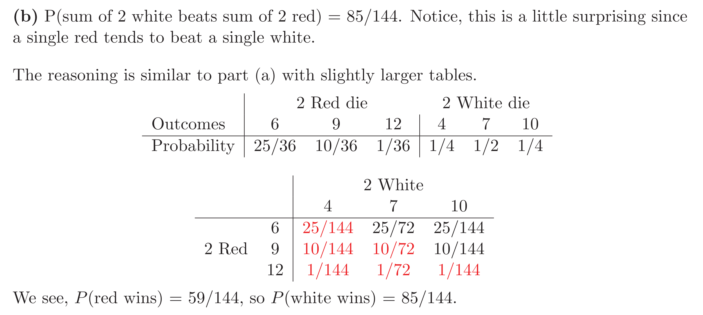

[Problem Set 1.pdf](https://www.yuque.com/attachments/yuque/0/2022/pdf/12393765/1659929223625-db629f2e-9a52-4297-9db7-f6358f275948.pdf)
[Problem Set 1 Solutions.pdf](https://www.yuque.com/attachments/yuque/0/2022/pdf/12393765/1659929223587-f7392780-b73e-42db-937e-023e3032cd4c.pdf)

# P1: Poker Hands⭐⭐⭐
> 
> 本题是[组合视角看待Poker Hands](https://www.yuque.com/alexman/kziggo/fa1dd9#ZpiXA)的变体
> 更多的变体参考: [https://en.wikipedia.org/wiki/Poker_probability](https://en.wikipedia.org/wiki/Poker_probability)

**Two-pair**
**Three-of-a-kind**
尤其注意这里的后三步不要写成$(^{48}_1)(^{44}_1)$，会导致结果被重复计算两次，因为这样计算的方式是排列。

# P2: Non-transitive dice⭐⭐
> 
> **链接地址**: [https://www.youtube.com/watch?v=zWUrwhaqq_c](https://www.youtube.com/watch?v=zWUrwhaqq_c)

**(a)**


**(b)**


# P3: Birthdays⭐⭐⭐⭐⭐⭐
> 
> 
> **链接地址**: [http://chmullig.com/2012/06/births-by-day-of-year/](http://chmullig.com/2012/06/births-by-day-of-year/)

**(a)**

每一个`outcome`都是一个$w$, 代表一个生日序列。
所以样本空间就是$\{w_1,w_2,...,w_{365^n}\}$
**(b)**⭐⭐**数学语言描述:**
事件$\bf A$: 假设我的生日是$b$, 则事件$\bf A$这个集合包括所有的含有$b$的序列$w_b$, 换成数学语言就是$\bf A=\{w_i|b\in w_i\}$
事件$\bf B$: $\bf B=\{w_i|\exist b_j,b_k\in w_i,j\neq k,s.t. \space b_j=b_k\}$
事件$\bf C$: $\bf C = \{w_i|\exist b_i,b_j,b_k\in w_i;i,j,k\space are \space different\space;s.t. \space b_1=b_j=b_k\}$
**通俗解释:**

**(c)**
**(d)**⭐⭐⭐
我们来理解一下两句话:
首先是前半段: 我们假设手上有一把$3$号步枪，面前的军火库中有$\{1,2,3,4,5,6,7,8\}$八把步枪，我们现在假设从中抽取$4$把步枪(可以重复)，用黑布盖住放在我们面前，问，其中包含我们手上步枪编号的概率有多大? 
直觉上来看，如果我们还知道这$4$把步枪都有着不同的编号，那么包含$3$号步枪的概率应该和不包含$3$号步枪的概率一致，因为除了$3$号步枪以外其他的三把步枪可以随意选取，选取的方法数应该是一样的，差别只是包不包含$3$号步枪，所以概率是$50\%$。
但是如果我们不知道这四把步枪是不是有重复编号，假设有重复编号，那么概率会小于$50\%$, 原因是，当我们的四把步枪不重复时，相当于我们有一个长度为$4$的滑动窗口（可以不连续）在$\{1,2,3,4,5,6,7,8\}$上滑动，滑到$3$的概率应该就是$50\%$,(毕竟如果滑动窗口长度是$8$的话概率就是$100\%$)。 而当四把步枪中有重复的时候，相当于我们的有效滑动窗口的长度减少了, 那么滑到$3$的概率就会小于$50\%$。 
**(e)**⭐⭐```r
source('colMatches.r')

npeople=1:60
ntrials=10000

sizematch=2

pvector=rep(0,length(npeople))

for (j in npeople)
{
  days=1:365
  samples=sample(days,j*ntrials,replace=TRUE)
  trials = matrix(samples,nrow=j,ncol=ntrials)
  res = colMatches(trials,sizematch)
  pvector[j]=mean(res)
  if(pvector[j]>0.9){
    print(j)
    break
  }
  
}
```
运行后发现答案是$41$

**(f)**⭐
**(g)**⭐⭐
**(h)**
原因是，并非所有生日的出现都是等可能的，我们之前关于这个问题的所有推导都是建立在一个假设: 所有生日的出现都是等可能的， 而事实上人们可能集中出生在特定的月份中或者年份中，比如美国$20$世纪的婴儿潮时期和战乱时期出生率减少的情况。

用数学语言说就是如果事件发生概率不一致(比如$H$和$T$的概率不一样，那么出现$HH$或者$TT$的概率会比$HT$或者$TH$要高)，那么序列中`match`(事件重复)的概率会更高。
答案中提到的例子如下: [Unfair Coins](https://www.yuque.com/alexman/kziggo/fxeosd#IbHjd)

