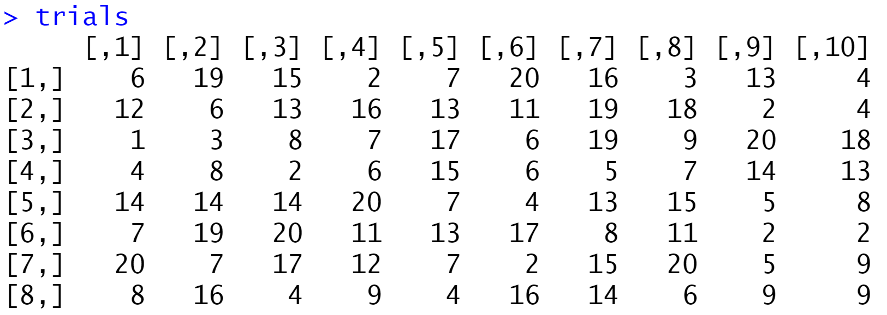

[Studio1slides.pdf](https://www.yuque.com/attachments/yuque/0/2022/pdf/12393765/1659921497779-8b360745-36fd-4fc0-bb74-48b9e5cecbb1.pdf)
[colMatches.r](https://www.yuque.com/attachments/yuque/0/2022/r/12393765/1659921614363-d57cf17f-f9aa-49fc-a1a6-25a7b495313b.r)
[studio1.r](https://www.yuque.com/attachments/yuque/0/2022/r/12393765/1659921614416-9353989b-ed78-42d3-88f7-0dd10d0d2346.r)
[Studio1Birthdays.r](https://www.yuque.com/attachments/yuque/0/2022/r/12393765/1659921614372-0dd6fae1-6e93-4863-b780-c522bea9faa7.r)
[Studio1outline.txt](https://www.yuque.com/attachments/yuque/0/2022/txt/12393765/1659929719074-c0398fe0-7383-4cd0-9aca-f801bb0c0521.txt)
# 1 R Introduction
## 1.1 保存.r 文件
> 


## 1.2 加载在线`r`文件
> 
> 类似于`Javascript`中的`script src='url' `


## 1.3 运行代码片段
> 


## 1.4 清空变量区
> `CTRL+L`


## 1.5 创建项目
> 注意: 只有在创建项目之后才能使用跨文件引用`source()`功能

> 


# 2 排列组合操作
## 2.1 排列
```r
#factorial does what is says
factorial(3)   # 6
factorial(4)   # 24
factorial(22)  # 1.124001e+21
```

## 2.2 组合
```r
# To find n choose k use choose(n,k)
choose(4,2)
choose(10,3)
choose(100,42)
```

## 2.3 扑克牌问题
### 2.3.1 问题背景
> 
> 


### 2.3.2 R语言实现
```r
#Compute the number of ways to get 1 pair and the probability of one pair
choose(13,1) * choose(4,2)* choose(12,3) *4*4*4
choose(13,1) * choose(4,2)* choose(12,3) *4*4*4 /choose(52,5)
```
# 
# 3 抽样操作
```r
#sample picks random values from a list
sample(1:5, 3)  #pick 3 elements from 1,2,3,4,5 --no repeats allowed
sample(1:5, 3)
sample(1:5, 3)
sample(1:20, 8)
sample(1:5, 4, replace=TRUE) #repeats are now allowd   
sample(1:5, 4, replace=TRUE)
sample(1:5, 4, replace=TRUE)
```

# 4 矩阵
## 4.1 矩阵定义
> If you only set `nrow`, matrix will figure out `ncol`, **matrix breaks the list into columns by default** --this is opposite what you might expect. As is typical in R there is a parameter in the `matrix()` function to change this. See if you can figure it out.

```r
matrix(1:30,nrow=5) 
```
> 

```r
matrix(1:30,nrow=5,byrow=TRUE) 
```
> 


## 4.2 求和函数
```r
# colSums and args functions
x=sample(0:1,60,replace=TRUE)
x
y=matrix(x, nrow=5,ncol=6)
y

#colSums() sums each of the columns of y. 
colSums(y)
```

# 5 Simulation
## 5.0 函数声明
> 类似于`Javascript`中的匿名函数表达式声明
> `colMatches(m,sizematch)`:`m`代表一个向量或者矩阵，`sizematch`表示`m`中的每一列中有`sizematch`个元素相同，如果相同，则这一列被标记为`1`，否则为`0` 

```r
# File:   colMatches.r

colMatchesHelp = function()
{
    cat("# --------------------------------------------------\n")
    cat("Syntax: colMatches(A,szmatch)\n")
    cat("For each column in array A checks if at least one entry is\n")
    cat("repeated n times\n")
    cat("\n")
    cat("A = array\n")
    cat("szmatch = the number of matches \n")
    cat("\n")
    cat("Returns a vector of 0's and 1's: 1 means at least\n")
    cat("one entry was repeated at least szmatch times.\n")
    cat("# --------------------------------------------------\n")

}


colMatches = function(A,szmatch=2)
{
    # See colMatchesHelp()
    
    #RED_FLAG: We assume A is a vector or 2 dimensional array
    #RED_FLAG: We don't check that szmatch > 0
    A.dim=dim(A)
    if (is.null(A.dim))
    {
        #assume A is a column vector
        nrows = length(A)
        ncols = 1
        Asrt= matrix(sort(A),nrow=nrows,ncol=ncols)
    }
    else
    {
        nrows=A.dim[1]
        ncols = A.dim[2]
        #apply() is an r-magic function. In this case it applies sort to each column. To apply to each row use apply(A,1,sort)
        Asrt = apply(A,2,sort)
    }
    if (szmatch > nrows)
    {
        #Can't possibly have more matches than rows, return a vector of 0's
        b = rep(0,times=ncols) 
    }
    else
    {
        #Sneaky way to look for runs of szmatch in sorted columns
        x= Asrt[szmatch:nrows,] == Asrt[1:(nrows-szmatch+1),]
        if (ncols == 1)
            b = 1.*(sum(x) > 0)
        else if (szmatch == nrows)
            b=as.vector(1.*x)
        else
            b=as.vector(1.*(apply(x,2,sum) >0))
    }
    return(b)
}
```

## 5.1 模拟掷骰子
### 5.1.1 进行一次实验
> 下面的代码将模拟掷一枚$20$面的骰子$8$次的实验
> 代码将检验每次试验是否会出现重复点数`matches`的情况。

```r
# Simulating rolling a 20-sided die 8 times and checking for matches ----

# soucre() is the way of loading source code in other files
source('colMatches.r')
colMatchesHelp()  
# we'll use this syntax to write help functions for 1805 code.

# First we'll do 1 trial of nrolls of an nsides-sided die
# Give values understandable names.
# In this code an initial 'n' means 'number of'
nsides = 20
nrolls = 8
ntrials = 10
sizematch = 2
die = 1:nsides

trial =  sample(die, nrolls, replace=TRUE)
#display the values in trials
trial
# colMatches is a function we wrote for 18.05 that checks each column of the matrix of a match
#look for two rolls the same
colMatches(trial,2)
```
> 
> 


### 5.1.2 进行n次实验
> 下面的代码将模拟`n`次掷$20$面的骰子$8$次的实验
> **最终求出掷**$20$**面的骰子**$8$**次，其中有两次的点数相同的概率, 使用统计思想**

```r
# Now we'll run ntrials at once
nsides = 20
nrolls = 8
ntrials = 10
sizematch = 2
die = 1:nsides

# ntrials of nrolls each requires nrolls*ntrials random samples
# Generate nrolls*ntrials random samples
y =  sample(die, nrolls*ntrials, replace=TRUE)
# Arrange the samples into one nrolls trial per column of an array
# Note the named arguments are 'nrow' NOT 'nrows' and 'ncol' NOT 'ncols'
trials = matrix(y, nrow=nrolls, ncol=ntrials)
trials
# Use the function colMatches to look for matches in each trial (column)
# colMatches returns a vector (list) of 1's and 0's
w = colMatches(trials,sizematch)
# Use sum to count the number of 1's in w
sum(w)
# Divide by ntrials to get the fraction of trials with a match
sum(w)/ntrials
# A simpler way to get the fraction in one command is with mean()
mean(w)
```
> 
> 
> 


# 6 Simpling Plotting
> 沿用`5`中的掷骰子问题的背景

## 6.1 Plot
> `seq(start,stop,increment)`: 创建一个数组列表，头尾包含
> `plot(x,y,args...)`: 画折线图。

```r
#Simple plotting
# 1. seq(start, stop, increment) makes a list of numbers from
#    start to stop in steps of increment， inclusive on both sides.
# 2. sin(x) applies sin to every element in x
# 3. plot has lots of ways to control the plot
#    type='l' says to connect the points in (x,y) by lines, 
#    lwd is the line width
x = seq(0, 6*pi,.01)
y = sin(x)
plot(x,y,type='l', col='red',lwd=3)
```


## 6.2 For Loop
> 注意`R`语言的向量的索引从`1`开始

```r
# Here's code to plot the (estimated) 
# probability of a match vs nrolls in a trial
# It uses a 'for loop' to run the simulation for various values of nrolls
nsides = 20
ntrials = 1000
sizematch = 2
die = 1:nsides
# Run experiments with nrolls from 1 to 60, nrolls 表示一次试验掷nrolls次
all_nrolls = 1:60

# length(all_nrolls) gives the length of the vector all_nrolls
N = length(all_nrolls)

# rep(value, n) makes a vector with n copies of value.
# We start by creating the probability vector. 
# We let all values be 0. 
# We'll fill in our actual computed values in the loop
prob = rep(0, N)

# This is how you make a for loop(N times)
for (j in 1:N)
{
    nrolls = all_nrolls[j]
    y =  sample(die, nrolls*ntrials, replace=TRUE)
    trials = matrix(y, nrow=nrolls, ncol=ntrials)
    w = colMatches(trials,sizematch)
    prob[j] = mean(w)
}
plot(all_nrolls,prob,type='l',col="red", lwd=2)
```
> 
> 和期望的一样，一次试验掷骰子掷得次数越多，得到一个`match`的概率就越大。


## 6.3 叠加Plots
> `lines`和`plot`的功能类似，只是`lines`不会删除之前的折线图，而是会在之前创建的画布上继续绘制折线图。

```r
nsides = 20
ntrials = 1000
sizematch = 2
die = 1:nsides
# Run experiments with nrolls from 1 to 60
all_nrolls = 1:60

# length(all_nrolls) gives the length of the vector all_nrolls
N = length(all_nrolls)

# 创建概率向量，长度为N
prob = rep(0, N)

for (j in 1:N)
{
    nrolls = all_nrolls[j]
    y =  sample(die, nrolls*ntrials, replace=TRUE)
    trials = matrix(y, nrow=nrolls, ncol=ntrials)
    w = colMatches(trials,sizematch)
    prob[j] = mean(w)
}
plot(all_nrolls,prob,type='l',col="red", lwd=2)

# We do the same plot for sizematch = 3
sizematch = 3

prob = rep(0, N)
for (j in 1:N)
{
    nrolls = all_nrolls[j]
    y =  sample(die, nrolls*ntrials, replace=TRUE)
    trials = matrix(y, nrow=nrolls, ncol=ntrials)
    w = colMatches(trials,sizematch)
    prob[j] = mean(w)
}
# lines adds the plot of all_nrolls,prob to the existing plot instead of
# making a new plot
lines(all_nrolls,prob, col="green", lwd=2) #New color

# Same thing with sizematch = 4
sizematch = 4

prob = rep(0, N)
for (j in 1:N)
{
    nrolls = all_nrolls[j]
    y =  sample(die, nrolls*ntrials, replace=TRUE)
    trials = matrix(y, nrow=nrolls, ncol=ntrials)
    w = colMatches(trials,sizematch)
    prob[j] = mean(w)
}
lines(all_nrolls,prob, col="blue", lwd=2) #New color
```
> 


# 7 生日问题**⭐⭐⭐⭐⭐**
## 7.1 问题背景
> 
> 本质上也是将掷骰子问题进行特殊化处理，每次试验相当于掷一枚$365$面的骰子$n$次


## 7.2 R语言代码
### 7.2.1 画出不同n下的事件的概率
```r
#Need colMatches
source('colMatches.r')

#Set real parameters
# Look for 2 matching birthdays
ndays = 365
npeople = 20
ntrials = 10000
sizematch = 2

# Run ntrials together
year = 1:ndays
y =  sample(year, npeople*ntrials, replace=TRUE)
trials = matrix(y, nrow=npeople, ncol=ntrials)
w = colMatches(trials,sizematch)
mean(w)

#Repeat
#---------------------------
# Look for triples
ndays = 365
npeople = 100
ntrials = 10000
sizematch = 3

# Run ntrials together
year = 1:ndays
y =  sample(year, npeople*ntrials, replace=TRUE)
trials = matrix(y, nrow=npeople, ncol=ntrials)
w = colMatches(trials,sizematch)
mean(w)

#Repeat
#---------------------------
# Plot probability of match vs npeople
ndays = 365
ntrials = 200
sizematch = 2
maxpeople = 100

# Run ntrials together
people = 1:maxpeople;
p = rep(0, length(people))
for (npeople in people)
{
    year = 1:ndays
    y =  sample(year, npeople*ntrials, replace=TRUE)
    trials = matrix(y, nrow=npeople, ncol=ntrials)
    w = colMatches(trials,sizematch)
    p[npeople] = mean(w)
}
plot(people,p,type='l', col='blue', lwd=2)

#Repeat
```
> 
> 如果$n=35$, 则两个人生日在同一天的概率约为$81\%$
> 如果$n=55$, 则两个人生日在同一天的概率约为$99\%$


### 7.2.2 求出最小的`n`
> 求出最小的人数$n$, 使得有两个人生日在同一天的概率大于$0.5$
> 
> 所以至少是$23$个人


## 7.3 至少2/3/4人match的对比
```r
# 类比抛硬币的代码，思想是一样的
nsides = 20
ntrials = 1000
sizematch = 2  # 对应2人match
die = 1:nsides
# Run experiments with nrolls from 1 to 60
all_nrolls = 1:60

# length(all_nrolls) gives the length of the vector all_nrolls
N = length(all_nrolls)

prob = rep(0, N)

# This is how you make a for loop
for (j in 1:N)
{
    nrolls = all_nrolls[j]
    y =  sample(die, nrolls*ntrials, replace=TRUE)
    trials = matrix(y, nrow=nrolls, ncol=ntrials)
    w = colMatches(trials,sizematch)
    prob[j] = mean(w)
}
plot(all_nrolls,prob,type='l',col="red", lwd=2)

# We do the same plot for sizematch = 3,对应3人match
sizematch = 3

prob = rep(0, N)
for (j in 1:N)
{
    nrolls = all_nrolls[j]
    y =  sample(die, nrolls*ntrials, replace=TRUE)
    trials = matrix(y, nrow=nrolls, ncol=ntrials)
    w = colMatches(trials,sizematch)
    prob[j] = mean(w)
}
# lines adds the plot of all_nrolls,prob to the existing plot instead of
# making a new plot
lines(all_nrolls,prob, col="green", lwd=2) #New color

# Same thing with sizematch = 4, 对应4人match
sizematch = 4

prob = rep(0, N)
for (j in 1:N)
{
    nrolls = all_nrolls[j]
    y =  sample(die, nrolls*ntrials, replace=TRUE)
    trials = matrix(y, nrow=nrolls, ncol=ntrials)
    w = colMatches(trials,sizematch)
    prob[j] = mean(w)
}
lines(all_nrolls,prob, col="blue", lwd=2) #New color
```
> 


## 7.4 使用排列组合求解
> 假设一年`365`天, 有$n=35$
> 令事件$\bf A$: $35$人中至少两个人有相同的生日
> 令事件$\bf A^c$: $35$人中任意两个人的生日都不相同
> $\bf P(A)=1-P(A^c)=1-\frac{365*364*...*331}{365^{35}}\approx 0.81$


# 8 生日问题的相关资料
> [Johnny Carson Attempt 1](https://www.cornell.edu/video/the-tonight-show-with-johnny-carson-feb-6-1980-excerpt)
> [Johnny Carson Attempt 2](https://www.cornell.edu/video/the-tonight-show-with-johnny-carson-feb-7-1980-excerpt) 
> [Johnny Carson Attempt 3](https://www.cornell.edu/video/the-tonight-show-with-johnny-carson-feb-8-1980-excerpt)
> [NY Times Article](https://archive.nytimes.com/opinionator.blogs.nytimes.com/2012/10/01/its-my-birthday-too-yeah/)

