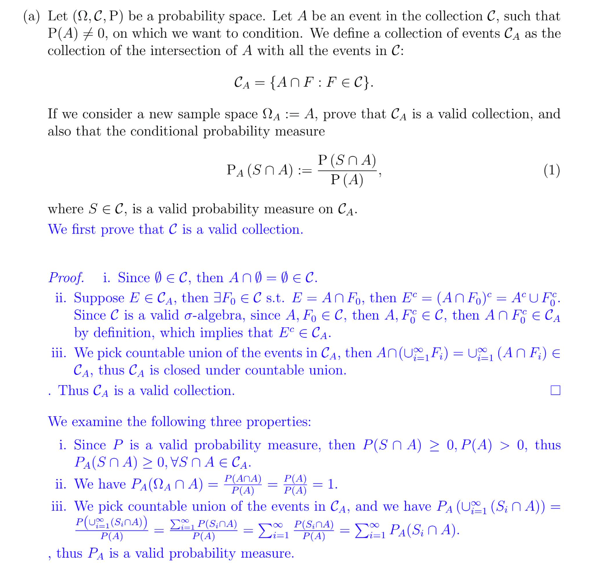
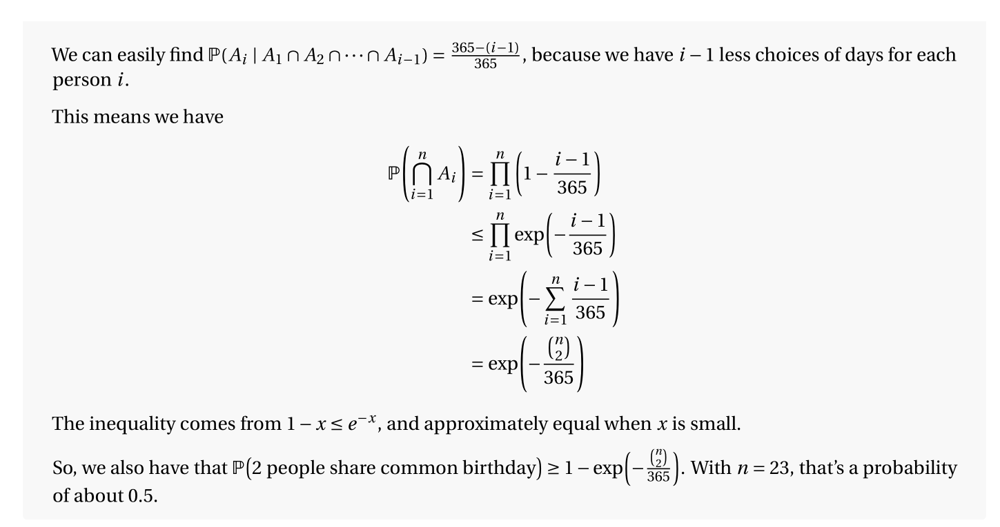
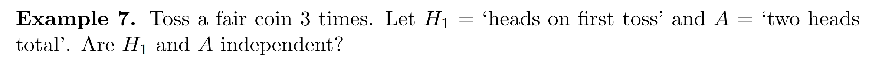
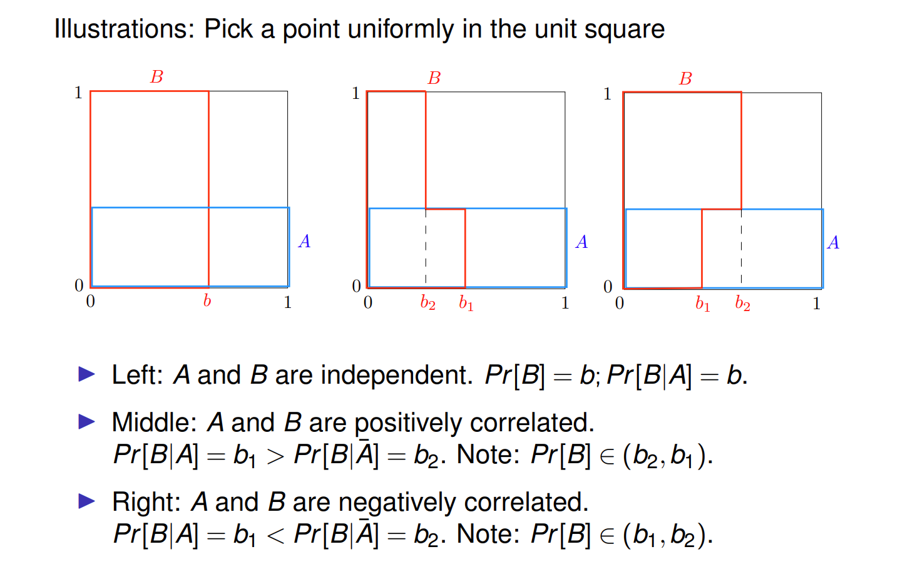

[Conditional Probability, Independence and Bayes' Theorem.pdf](https://www.yuque.com/attachments/yuque/0/2022/pdf/12393765/1659946420551-ce37a484-cbfd-45c4-a872-24a0e4f206b9.pdf)
[Class Slides，Conditional Probability, Independence, Bayes Theorem.pdf](https://www.yuque.com/attachments/yuque/0/2022/pdf/12393765/1660128608605-b056cf26-da9e-4be3-86be-0d06c127bc8d.pdf)
# 1 Conditional Probability
## Motivation
> 条件独立性描述了我们在知道与某个事件相关的信息后这个信息发生的概率。
> 我们用抛硬币的例子来说明:
> 
> 

**(a)**
**(b)**
> 我们定义:
> 事件$A$: 三次掷硬币都是正面朝上
> 事件$B$: 第一次掷硬币是正面朝上
> 
> 事件$\bf A$是建立在$\bf A\cap B$这个新的样本空间的事件，此时的概率函数$\bf P$实际上变成了$\bf P(\cdot|B)$。
> **我们用图像来说明**
> 

## Definition
> 

## Properties
### Multiplication Rule
> 1. **由来**
> 

> 2. **推广：**
> 

> 3. **完整定义:**
> 

**证明**

**图例**

### Conditional Probability Axiom
> 条件概率满足所有常规概率的性质(**满足三大概率公理**), 只是样本空间有所缩减。
> 

**Non-Negativity**很显然成立， 因为概率非负
**Additivity**假设$A_1$和$A_2$是两个互斥的集合，则$A_1\cap B$和$A_2\cap B$也是互斥的:
则$P(A_1\cup A_2|B)=\frac{P((A_1\cup A_2)\cap B)}{P(B)}=\frac{P((A_1\cap B)\cup (A_2\cap B))}{P(B)}\newline=P(A_1|B)+P(A_2|B)$,证毕。
**Normalization**
> 

### Inequality
> 条件概率满足所有常规概率的运算性质， 只是样本空间有所缩减。
> 

## Conditional Sample Space
> 

## Exercises
> 

# 2 Total Law of Probability
## Intuition
> **全概率公式本质上将样本空间**$\bf \Omega$**划分成了独立(**`**Disjoint**`**)的**$n$**个部分(**`**Partition**`**)。**

## Formula
> 

**Simpler Explanations - Partition into Three**

**Simpler Explanations - Partition into n **

## Examples 
### Drawing Balls
> 容器摸球`Urn Problem`是概率统计中非常常见的一个理想化实验。
> 这种问题的目标是求出从容器中摸球的概率, 这个问题的关键是每次摸完球之后是否放回。
> [Wiki参考](https://en.wikipedia.org/wiki/Urn_problem)

> 

**Key**
> 

**Key**

### Birthday Paradox
> 

# 3 Probability Tree**⭐⭐⭐⭐**
> 树是一种可视化条件概率的一种非常直观的方式，本小节我们将介绍概率数的性质和用法。

## Definition
> 我们仍然以容器摸球问题举例:
> 

:::info
题中取球的步骤分为两步，我们可以对每一步画出一个多叉树, 如下图所示:

我们知道，`Level 1`是第一次摸球的所有可能，`Level 2`开始就都是建立在前一次摸球的结果之上摸球的所有可能，是一个条件概率。从根节点出发，树的每一条路径描述了一种完整的取球流程，而将沿途的所有边上的概率数值相乘就得到了这种取法发生的概率大小，可谓非常的直观。

换句话说，概率树可视化了诸如$P(A_1\cap A_2\cap A_3)=P(A_1|A_2\cap A_3)P(A_2|A_3)P(A_3)$这样的链式法则，可以用一个`Level 3`的树来可视化整个$A_1\to A_2\to A_3$过程链。
:::

## Intuition
:::info

:::

## Properties
> 概率树的每一个分支(`Path`)都是彼此独立的。设想一下每一次分叉，都是对当前样本空间的一次划分，每个划分之间彼此都是`Disjoint`的。于是沿着每一条路径到叶子节点得到的事件集合彼此之间都是互相`Disjoint`的。所以我们将这棵树上所有的路径上的条件概率运用链式法则相乘之后在相加得到的结果一定是$1$。

# 4 Independence**⭐⭐**
## Motivation
:::info
特别注意独立性到底意味着什么:** 如果两个事件独立，则一个事件发生不会改变另一个事件发生的概率。**
假设我们抛两次硬币。我们期望两次投掷的结果是独立的。在现实生活中的实验中，多次实验之间的独立性是需要检验的。如果我第一次抛掷的硬币落在蜂蜜里，而且我懒得清理的话，那么第二次投掷可能会受到第一次抛掷结果的影响。如果我们在两次实验之间没有重新校准并且消除一些隐藏变量的影响，那么就会导致实验之间的独立性被破坏。
**We've all experienced hearing the same "fact" from different people. Hearing it from different sources tends to lend it credence until we learn that they all heard it from a common source. That is, our sources were not independent.  **
:::

## Pairwise Independence
:::info

**Corollary:**

:::
**Verbal Description**
**Example - Coin Flips Twice**

`two heads total`是一共两次正面朝上的意思。
$P(A)=C^2_3 \times \frac{1}{2}\times \frac{1}{2}\times \frac{1}{2}=\frac{3}{8}$

**Example - Draw Cards**

## Conditional Independence**⭐⭐**
> 
> 总的来说，条件独立不意味着独立，独立不意味这条件独立。
> 

**Example 1: Conditional Independence doean't mean independence**
**Example 2: Independence doesn't mean Conditional Independence**

## Mutual Independence**⭐⭐**
> 

> 
> 前三行表示$A_1,A_2,A_3$是两两独立的。第四行的结论和前三行没有任何关系。
> 换句话说，第四行不能由前三行推出，前三行也不能由第四行推出
> 

### 两两独立不等于多重独立
> 

### P(ABC)=P(A)P(B)P(C)不等于两两独立
> 
> 

## Conditional Mutual Independence
> 

## Independence of Complement
> **如果事件**$A$**和**$B$**独立，则:**
> **(a).** $A$与$B^c$独立
> **(b).** $A^c$与$B^c$独立

**Proof**

## Network Reliability**⭐⭐**
### 4.6.1 可靠性分析
> 

### 4.6.2 System Reliability
> 下面的例子是一个典型的判断系统可靠性的概率模型，我们有`Series Connection`和`Parallel Connection`, 如下图所示，判断这两类系统可靠我们有不同的方法。
> 

**Series Reliability**相当于交集

**Parallel Reliability**相当于并集

### 4.6.3 Network Connectivity
> 有了以上的知识铺垫，我们可以研究如下的`Network Connectivity`问题
> 

**Key**$A\to B,C\to B$都是`Parallel System`

# 5 Bayes Rules
## 5.1 前言
:::info

:::
**图解**

## 5.2 贝叶斯公式**⭐⭐⭐⭐**
> 
> 这个公式可以理解为我想知道一个被观测到的事件$B$是由什么事件$A_i$(一系列潜在的，但为观测到的事件)造成的，有很多个候选的原因$A_i$，一般我们想知道哪个$A_i$**最可能**成为我们事件$B$的原因，这个公式也正是这个意思，其中$P(A_i)P(B|A_i)$的意思是假设原因是$A_i$, 他造成事件$B$这个结果的概率是多少，那么我们最大化后验概率$P(A_i|B)$的意图就很明显了，为的就是要找到那个最有可能造成$B$的那个原因。也就是我们的推断问题的由来。
> 

**图示**

## 5.3 Correlation
### Motivations
> 

### Summary
> 

## 5.4 Examples
### 抛硬币
:::info

:::

### 下棋
> 
> 我们要计算:
> 1. $P(M=1|B)$
> 2. $P(M=2|B)$

**(1)**所以$P(X=1|B)=0$
**(2)**所以$P(X=2|B)=\frac{P(X=2\cup B)}{P(B)}=\frac{\frac{1}{16}}{\frac{5}{16}}=\frac{1}{5}$

### 航空雷达
> 

**P(A交B)**$P(A\cap B)=P(A)P(B|A)=0.05\cdot 0.99=0.0495$
**P(B)**$P(B)=P(B\cap A)+P(B\cap A^c)=P(B|A)P(A)+P(B|A^c)P(A^c)=0.99\cdot 0.05+0.1\cdot 0.95=0.1445$
**P(A|B)**$P(A|B)=\frac{P(B|A)P(A)}{P(B)}=\frac{0.99\cdot 0.05}{0.1445}=0.34$

# 6 The Base Rate Fallacy**⭐⭐⭐**
## 6.1 前言
:::info

`Base Rate Fallacy`本质就是我们对$P(A|B)$和$P(B|A)$的混淆理解。
:::

## 6.2  算例
:::info

从题中可以读出的信息:

**我们将会从三个视角**: 概率树，概率表，和纯公理化的视角出发解决这个问题。
:::

### 6.2.1 Tree 视角解读
> 
> 

### 6.2.2 Base Rate Fallacy 解读
> 

### 6.2.3 概率表视角解读
> 1. **首先我们使用**`**Base Rate**`**的信息**
> 

> 2. **然后使用假阳率等信息**
> 

> 3. **最后求解**
> 

### 6.2.4 公理化视角
> 

### 6.2.5 可视化
> 蓝色代表健康人群体。红色区域代表生病群体，透明的矩形区域代表测试结果为阳性的群体(也就是`positive tests`), 我们可以看到，他们大多来自健康人群体。所以虽然官方生成这个疾病测试是$95\%$准确的(假阳率是$5\%$), 但这并不意味着$95\%$的`Positive Tests`是准确的，因为`Positive Tests`的准确率在图中就是透明区域中红色部分所占的比重，前文计算出只有惨淡的$8.3\%$
> 

