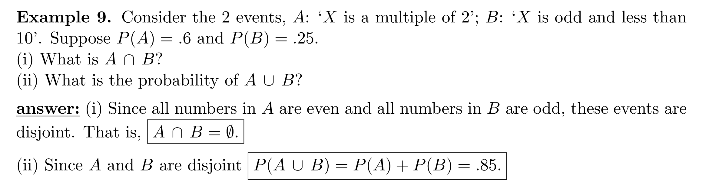
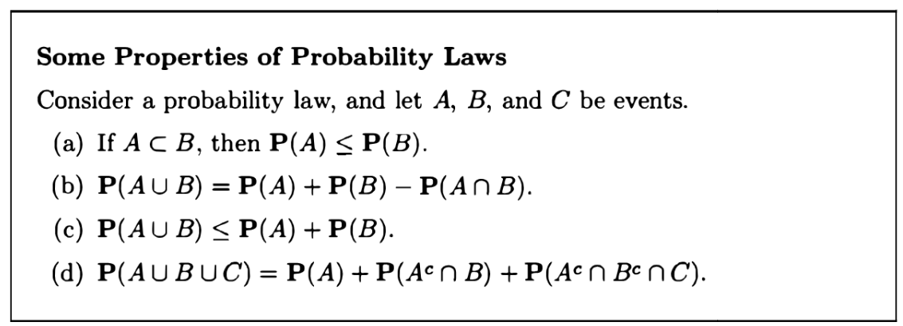
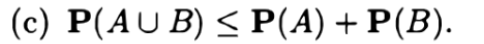

[Probability, Terminology and Examples.pdf](https://www.yuque.com/attachments/yuque/0/2022/pdf/12393765/1659880895551-6419b973-496d-462b-884e-18f6af48c47e.pdf)
[Class Slides, Probability Basics.pdf](https://www.yuque.com/attachments/yuque/0/2022/pdf/12393765/1659884360403-669fc5f1-263b-486b-ba96-71602f7be0a5.pdf)
# 0 本节学习目标
> 1. 了解样本空间，事件和概率函数的定义
> 2. 构建一个实验的样本空间
> 3. 使用概率函数完成基本计算

# 1 概率相关基本术语
## 1.1 术语
> 

## 1.2 样本空间，概率函数
### 1.2.1 离散样本空间
#### 定义
> 

#### 案例
> 
> 

### 1.2.2 连续样本空间
> 对应连续随机变量
> 

### 1.2.3 泊松分布**⭐⭐**
> 
> 

### 1.2.4 样本空间的选取**⭐⭐**
> 本节有一个重要的概念，对于离散随机变量，我们可以画**概率表**，来记录两次独立的事件发生的概率信息。
> **以掷骰子为例, 概率表有两种画法:**
> - 二维表，详细记录所有的点数组合(二元组)的概率
> - 一维表，记录所有可能出现的点数之和的概率
> 
概率表可以帮助我们更好的分析两个独立事件同时发生时的一些概率信息。

> **样本空间的选取可以是任意的， 取决于我们的上下文 **
> 
> 
> 

## 1.3 事件
> 

### 1.3.1 算例
> 

## 1.4 概率函数
> 也叫概率测度

### 1.4.1 定义与性质**⭐⭐⭐⭐**
> 

### 1.4.2 算例
> 

### 1.4.3 证明
> 
> 我们要证明$\sum_{n=1}^{\infty}(1-p)^{n-1}p=1$
> **证明**：$\sum_{n=1}^{\infty}(1-p)^{n-1}p=\frac{p}{1-(1-p)}=\frac{p}{p}=1$(运用几何级数，也就是无穷等比数列求和公式)
> 
> 直觉上来看就是在第$n$次发生之前的$n-1$次都是没有发生的

## 1.5 Stopping Problems**⭐⭐⭐**
> 前面的`Toy Example`示例是**最优停时问题**的简化版本。停时问题意图求解何时结束某个随机过程。在上面的抛硬币直到正面朝上的例子中，这个停时过程是一直抛硬币直到正面朝上之后就停止了。一个更实际的例子是：应该何时结束一系列的医学治疗，停时结果可能取决于治疗的效果如何，病人对这些药物的耐受性如何以及如果继续治疗，治愈的可能性有多大。
> **我们可以探究：**
> - 治疗停止之前的治疗$n$次的概率
> - 治疗停止之前平均的治疗次数。

# 2 概率运算法则
## 2.1 运算法则
> 
> 
> 

### 2.1.1 使用韦恩图证明
> 

### 2.1.2 标准证明**⭐⭐**
> 
> 

## 2.2 算例**⭐⭐⭐⭐**
> 下面的几个例子将围绕一个实验: 在$[1,20]$的范围内随机生成一个整数，且每个整数出现的概率不是等可能的。

### 算例1**⭐⭐**
> 
> 这里$\bf A$代表的是一个事件，而我们的概率测度$\bf P$可以将一个事件（样本空间的子集）映射到概率空间去
> 这里的$\bf X$代表的是随机变量，是一个函数，将样本空间映射为事件集合空间，在`概率论与数理统计进阶`中详细介绍。
> 由于这只是导论课，所以我们不做过多探讨。

### 算例2
> 

### 算例3
> 
> 

### 算例4: 概率最值问题**⭐⭐⭐**
> 
> 
> 本质就是求$P(M\cap B)$的最值，对应了下面三种情况

## 2.3 常见问题⭐⭐⭐
### 2.3.1 20-sided dices⭐⭐
> 
> **问: 至少有两次掷出相同数字（**`**There is a match**`**）的概率？**

**Key**
1. **定义样本空间, 计算样本空间大小**

2. **定义事件**

3. **计算事件概率**

### 2.3.2 Jon's Dice⭐⭐
> 
> 假设筛子都是均匀的

**Key**
1. **构建Probability Table**

2. **分析获胜条件**

3. **得出结论**

由于每个筛子和别的筛子对战的结果都是前一个更容易战胜后一个，所以是一个循环，相生相克的关系。

### 2.3.2 Unfair Coins⭐⭐⭐
> 
> 

**Key**

# 3 概率公理⭐⭐⭐
## 3.1 概率公理
:::info

:::
**Axiom 1 的延伸**$1=P(\Omega) =P(A\cup A^c)=P(A)+P(A^c)$
$P(A)=1-P(A^c)\leq 1$
所以$0\leq P(A) \leq 1$

## 3.2 概率的性质与证明⭐⭐⭐⭐⭐
:::info

下面我们对每一个性质通过韦恩图进行证明。
:::

### 性质a的证明
:::info

当$A\subset B$时，$B=A\cup (A^c\cap B)$
根据概率公理$(2)$(`Addivity`), 因为集合$A$和集合$A^c\cap B$是`Disjoint`的，所以$P(B)=P(A\cup (A^c\cap B))=P(A)+P(A^c\cap B)\geq P(A)$
所以如果$A\subset B$, $P(A)\leq P(B)$, 证毕。
:::

### 性质b的证明
:::info

也就是我们得到了$\begin{cases} P(A\cup B)=P(A)+P(A^c\cap B) \\ P(B)=P(A\cap B)+P(A^c\cap B) \end{cases}$
化简约去$P(A^c\cap B)$, 得到$P(A\cup B)=P(A)+P(B)-P(A\cap B)$, 证毕。
:::

### 性质c的推广与证明
:::info

**证明较为容易，**$P(A\cup B)=P(A)+P(B)-P(A\cap B)$**中的**$P(A\cap B)\geq 0$**, 所以**$P(A)+P(B)\geq P(A\cup B)$**, 证毕。**
**其中,**$(c)$**可以推广为:**

**证明如下(反复利用性质**$(c)$**即可)**

:::

### 性质d的证明
:::info

:::

# 4 Uniform Law
## 4.1 Discrete Uniform Law
> 
> 
> 

## 4.2 Continuous Uniform Law
> 
> 

