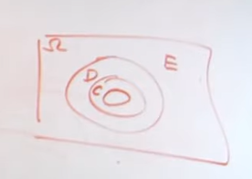
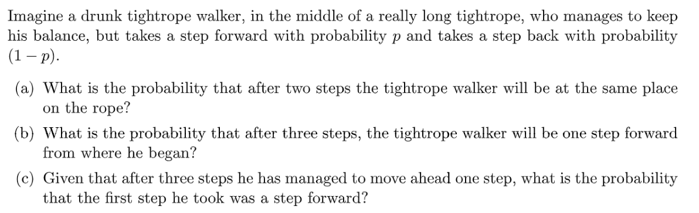
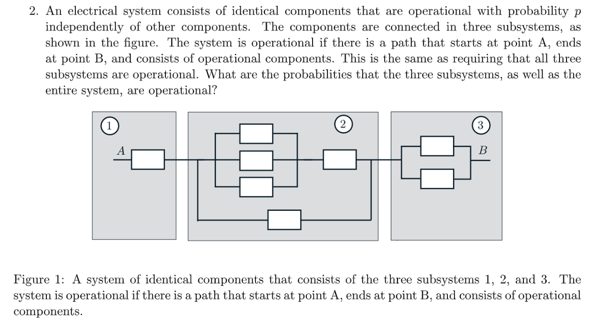
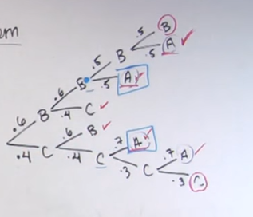

:::info
这些练习来自`MIT 6.041SC/6.431`课程:[https://ocw.mit.edu/courses/6-041sc-probabilistic-systems-analysis-and-applied-probability-fall-2013/pages/unit-i/lecture-5/](https://ocw.mit.edu/courses/6-041sc-probabilistic-systems-analysis-and-applied-probability-fall-2013/pages/unit-i/lecture-5/)
:::

# 1 Recitation Problems
[Recitation 2.pdf](https://www.yuque.com/attachments/yuque/0/2022/pdf/12393765/1661154451461-c3480a09-7b62-43cc-9508-338d6374a2fc.pdf)
[Recitation 2 Solutions.pdf](https://www.yuque.com/attachments/yuque/0/2022/pdf/12393765/1661154451119-7d34a9f6-648f-4e19-bcd3-be9e41766dd4.pdf)
[Recitation 3.pdf](https://www.yuque.com/attachments/yuque/0/2022/pdf/12393765/1661175731437-3d3de971-8f9f-40d4-846a-cdcd1bc6b221.pdf)
[Recitation 3 Solutions.pdf](https://www.yuque.com/attachments/yuque/0/2022/pdf/12393765/1661175731438-fdc0b2e1-5888-4898-8307-4f8d7cc883bf.pdf)

## P1 A Coin Tossing Puzzle⭐⭐⭐
:::info

题目的意思是我抛两枚硬币都朝上这个事件，在我知道了(第一枚硬币朝上)之后概率更大还是(至少有一枚硬币朝上)之后概率更大，问题转化为求两个条件概率。
:::
**计算说明**
**推广**`Alice`的这个问题可以推广到如下形式的问题:

假设我有事件$C,D,E$, 满足：

1. $D\subset E$
2. $C\cap E=D\cap E$

则由图可知$P(C|D)\geq P(C|E)................(3)$
在`Alice`的框架下，我们有$\begin{cases}C=A\cap B\\D=A\\E=A\cup B\end{cases}$, 所以我们有$P(A\cap B|A)\geq P(A\cap B|A\cup B)$成立，也就是$(a)$问中的特殊化问题。

## P2 掷骰子⭐
> 
> `doubles are rolled`指的是我掷两枚骰子的点数一样。

**图示**
**(a)**$\{(1,1),(2,2),(3,3),(4,4),(5,5),(6,6)\}$六种情况是`doubles`

**(b)**
**(c)**
**(d)**

## P3 全概率公式
> 

**(a)**

**(b)**

## P4 三门问题⭐⭐⭐⭐⭐
> 

**解法一(直观解释)**首先对于前两个策略来说，如果我们一开始就选中了正确的门(概率为$\frac{1}{3}$), 那么我如果在朋友打开了那扇没有奖品的门之后选择`Stay`, 那么我就中奖了，所以概率就是$\frac{1}{3}$。如果我一开始就选择了错误的门(概率是$\frac{2}{3}$), 那么我在朋友操作完后选择`Switch`, 一定会中奖，所以`switch`实际上更容易中奖。
 
而关于第三个策略，我们使用概率树进行分析:

因为$0\leq p\leq 1$, 所以我们中奖的概率在$\frac{1}{3}$到$\frac{2}{3}$之间，是一个折中的策略。
**解法二(枚举)**

1. **对于第一种策略:**

2. **对于第二种策略：**

3. **对于第三种策略:**

**推广到n扇门**推广到$n$扇门，也是一样。`switch`中奖的概率总是比`stay`高，因为`switch`的情况是我假设我一开始选的门后面没有`prize`, 概率会比我一开始假定选择的门后面有`prize`然后选择`stay`策略要高很多。

## P5 条件独立性⭐⭐⭐
> 

**Key**
**推广**⭐⭐⭐⭐⭐

## P6 A Random Walker⭐⭐
> 

**(a) Binomial 1**
**(b) Binomial 2**
**(c) 枚举**因为这个条件概率的样本空间其实比较小，所以我们可以直接枚举。

## P7 Noisy Channel⭐⭐⭐
> 
> 

**(a) 全概率公式**也可以理解为一棵概率树

**(b)**
**(c)**
**(d)**

## P8 事件独立性⭐⭐⭐⭐
> 

**(a) **⭐⭐参考[事件独立性悖论](https://www.yuque.com/alexman/kziggo/ci9rgz#JxjC9)

**(b) 重要结论 1 **⭐⭐⭐⭐

**(c) 重要结论 2 **⭐⭐⭐⭐参考[多个事件的独立性](https://www.yuque.com/alexman/kziggo/ci9rgz#GVZCz)

# 2 Tutorial Problems
[Tutorial 1.pdf](https://www.yuque.com/attachments/yuque/0/2022/pdf/12393765/1661177365916-e69753b8-93b6-4abf-a469-0c5c5fbbc177.pdf)
[Tutorial 1 Solutions.pdf](https://www.yuque.com/attachments/yuque/0/2022/pdf/12393765/1661177365909-7e6c8c18-751e-4960-8f08-c13791c46360.pdf)

## P1 事件独立性
> 

**Key**

## P2  Network Reliability⭐⭐
> 

**Series and Parallel System Reliability Criterion**
**Key**

## P3 Chess Problem⭐⭐⭐⭐⭐
> 
> 

**(a)**⭐
第一问                               第三问
第三问可以考虑时间的反面更简单，因为每位参赛选手获冠的事件是`Disjoint`的(题目条件表明了只能有一个赢家), 所以$P(Ai\space Champ)+P(Bo \space Champ) + P(Ci \space Champ)=1$
当然我们也可以顺着思路来，讨论几种情况:

1. `Neither Bo nor Ci makes it to the second round`: $0.6\times 0.4\times 2$
2. `Bo makes to the second round and lose`:$(0.6)^2\times (0.5+0.5^2)$
3. `Ci makes to the second round and lose`: $(0.4)^2\times (0.7+0.3\times 0.7)$

三者相加答案仍然是$0.8956$
**(b)全概率公式**⭐⭐⭐⭐⭐
因为我们知道条件概率也是概率(仅仅是缩减了样本空间)，所以我们应该知道条件概率的全概率公式:$P(A|C)=\sum_{i=1}^n P(A|B_i,C)P(B_i|C)$
如果还不能理解的话，我们有$P(A\cap B|C)=\frac{P(A\cap B\cap C)}{P(C)}$, $P(A|B\cap C)=\frac{P(A\cap B\cap C)}{P(B\cap C)}$, $P(B|C)=\frac{P(B\cap C)}{P(C)}$
所以$P(A\cap B|C)=P(A|B,C)P(B|C)$
**(c) 条件概率**⭐⭐⭐

# 3 Assignment 
[Assignment 2.pdf](https://www.yuque.com/attachments/yuque/0/2022/pdf/12393765/1661177365906-9e2d5120-9047-4bcb-9b49-983fe238c159.pdf)
[Assignment 2 Solutions.pdf](https://www.yuque.com/attachments/yuque/0/2022/pdf/12393765/1661177365902-b0eef2e6-4ca6-4d1b-ae01-a38f1b64ad5a.pdf)

## P1 天气预报⭐⭐⭐
> 

**(a) 条件概率**
**(b) 事件独立性**

**(c) 条件概率**⭐⭐⭐⭐⭐我们在使用概率树的时候，沿着每一条边计算的是$P(A\cap B\cap C)=P(A|B\cap C)P(B|C)P(C)$。往往有的时候，由于事件之间的独立性，这个式子可以化简。加入$B$和$C$独立，则$P(B|C)=P(B)$, $A$和$B\cap C=W$独立，所以$P(A|B\cap C)=P(A)$, 所以$P(A\cap B \cap C)=P(A)P(B)P(C)$, 这其实就是我们的排列组合中的乘法法则(每一步都互相独立的情况, 比如抛三次硬币.)。如果每一步不独立，比如抽取几张特定花色的牌，每一次抽取都会影响下一次抽取的样本空间, 那么概率树上的每一个分支都表示$P(A\cap B\cap C)=P(A|B\cap C)P(B|C)P(C)$

本题中`Missed forecast`和`Actually rains`实际上是独立的。所以$P(actually\space rains|missed\space forecast)=P(actually\space rains)\newline =P(actually\space rains|forcast\space rain)P(forcast\space rain)+P(actually\space rains|forcast\space no \space rain)P(forcast\space no \space rain)\newline =0.8\cdot p+0.1(1-p)=0.1+0.7p$

可以看到，这个概率是会受到季节的影响的。

## P2 条件独立性 
> 

**(a) 事件独立性**

**(b) 事件独立性**

## P3  Widgets⭐⭐⭐
> 

**(a) 乘法法则+贝叶斯定理**⭐⭐这里抛硬币是为了决定我们要买两个`old widgets`还是买两个`new widgets`, 所以$P(old)=P(new)=\frac{1}{2}$。 我们选择两个`old widgets`有两种视角可以看待，一种是组合视角，也就是$\frac{C_{75}^2}{C_{500}^2}=\frac{75\times 74}{500\times 499}$。 另一种是分步思想，也就是概率树思想，我们可以将买两个`old widgets`看成是两次抽取的过程，由于两次抽取不独立(因为不放回), 所以我们有下面的条件概率解题过程:

其实我们发现，在`widgets`数量足够多的情况下，我们放回取样和不放回取样得到的结果是差不多的。
**(b) 贝叶斯定理**⭐⭐容易错，因为题目的意思是我通过抛硬币来决定我买什么，也就是我其实是知道哪些零件是新的($1500$个)，哪些零件是旧($500$个)的，所以我可以直接从新的零件或者旧的零件中选取两个，不需要使用乘积法则再去保证我必须要选出两个旧的。$P(old)$表示的也是这个意思，就是我要么从新的零件中选两个，要么从旧的零件中选两个，所以$P(old)=P(new)=\frac{1}{2}$
在知道了我要从哪一堆零件中抽取时，由于我不知道哪些是坏的(我只知道一个比例)，所以需要使用乘积法则。

## P4 Oscar和他的狗⭐⭐⭐⭐
> 

**(a) 条件概率**
**(b) 贝叶斯定理**
**(c) 贝叶斯定理**⭐⭐很多人看见`Flip a coin`就觉得是不是要算硬币正反面的概率，其实不用，`Flip a coin`只是在描述`Oscar`去`A`还是去`B`的随机性, 所以我们仍然要考虑所有可能，即`Oscar`找的了狗，那么是去`A`中找的，还是去`B`中找的呢? 被贝叶斯公式的**分母部分**包含了所有找到狗的情况的总概率。

**(d) 条件概率**⭐⭐⭐⭐⭐⭐因为这条狗肯定在`A`中，所以有$P(in\space A)$。
另外，这条狗在`A`中这个事件和这条狗存活是独立的（因为知道狗在哪个树林里不能告诉我们狗会不会存活），$P(alive\space day\space 2|in\space A)=P(alive\space day\space 2)$
**我们要假定的是如果某一天没找到，那么后一天的存活概率会不会受影响。**
我们必须假定下面三个事件: 第一天没找到，第二天或者，第二天找到是条件独立的（在`in A`的条件下。这也暗含了两两独立的关系），否则就需要额外信息进行计算, 用数学语言就是:
$P(not\space find\space in \space A\space day\space 1|in\space A)P(alive \space day\space 2|in\space A)P(find\space in\space day\space 2|in\space A)=P(not\space find\space in \space A\space day\space 1\cap alive \space day\space 2\cap find\space in\space day\space 2|in\space A)$

## P5 利用独立性证明⭐⭐⭐
> 
> 详见:[多个事件的独立性](https://www.yuque.com/alexman/kziggo/ci9rgz#GVZCz)和[概率公理性质](https://www.yuque.com/alexman/kziggo/fxeosd#TNcHY)

**(a)**⭐⭐
**(b)**⭐⭐第一种证明方法的引理参考: [事件的补的独立性](https://www.yuque.com/alexman/kziggo/ci9rgz#YWhfZ)

第二种证明方法的引理参考: [Demorgan's Law](https://www.yuque.com/alexman/kziggo/fa1dd9#O16FY)

## P6 Chess Tournament⭐⭐⭐⭐⭐
> 

**(a) 画出概率树**⭐⭐如果$A$胜了$B$, 那么下一局$B$不能和$A$打，只能和$C$打。

**(b) 证明某种概率分配符合概率公理**⭐⭐⭐⭐⭐本题将运用到[概率树最重要的性质](https://www.yuque.com/alexman/kziggo/ci9rgz#p7Eoi)，就是路径互不相容性质。
对于一个包含序列结果的样本空间，比如抛三枚硬币的样本空间$\{HHH,HHT,HTH,THH,HTT,THT,TTH,TTT\}$，我们可以将这个样本空间抽象成一颗概率树:

每一条路径代表了样本空间中的的一个样本点，而如果一个概率分布合理的话，那么假设每一个样本点代表一个事件$A_i$, 那么$A_i$之间彼此一定都是`Disjoint`的，那么$\sum_{i}A_i=1$必须要成立才能满足概率公理。因为`Non-negativity`和`Addivity`一定成立。因此本题也是要验证对于一个长为$k$的结果序列(样本空间中的一个样本点), 概率是$\frac{1}{2^k}$的话满不满足概率公理$3$。
因为:
所以我们发现，这样的概率分配是符合概率公理的，因此是一个合法的`Probability Law`
**(c) ****第一部分:**

**第二部分：**

1. **Alice**

2. **Bob**

仔细观察Bob 获胜的序列，发现获胜概率和`Alice`是一样的， 也是$\frac{5}{14}$

3. **Caroll**

因为`Alice/Bob/Caroll`获胜的三个事件彼此是`Disjoint`的，毕竟任何两人不能同时获胜，三人也不能同时获胜，所以$P(Caroll\space win)=1-\frac{5}{14}-\frac{5}{14}=\frac{4}{14}$

