[Studio 3 Slides.pdf](https://www.yuque.com/attachments/yuque/0/2022/pdf/12393765/1662646041464-af9e125a-1157-4d88-a111-bb02a5050da6.pdf)
[studio3.r](https://www.yuque.com/attachments/yuque/0/2022/r/12393765/1662646102020-eb88775c-259a-4695-8431-f79034917ca0.r)
[studio3-sol.r](https://www.yuque.com/attachments/yuque/0/2022/r/12393765/1662646102022-5d41e939-4408-4b65-8e51-9f42bf5ff440.r)

# 1 几个函数介绍
## 1.1 rnorm
:::info
类似我们之前的`rbinom()`, `rnorm`将为我们产生指定数量的满足高斯分布的随机值。
**用法:**`rnorm(n, mu, sigma) gives us n random values from Norm(mu, sigma^2)`
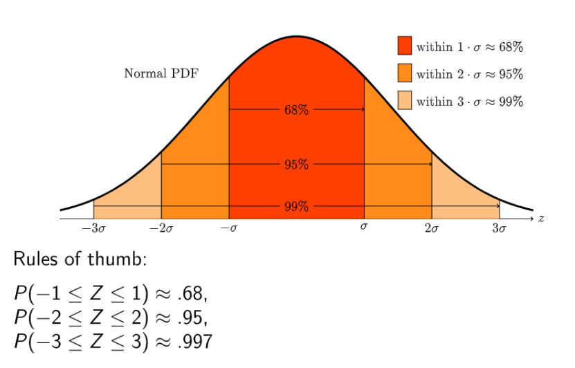
:::
```r
# rnorm(n, mu, sigma) gives us n random values from Norm(mu, sigma^2)
rnorm(5,0,1)
# Test the .68, .95 rules
x = rnorm(10000,0,1)
mean(abs(x) < 1)
mean(abs(x) < 2)
```


## 1.2 dnorm
:::info
`dnorm(num,mu,sigma)`: 求出$f_{X\sim(\mu,\sigma^2)}(num)$(概率密度)
:::
```r
# dnorm is the pdf it gives the values of the density at x
x = 0
dnorm(x,0,1)
x = c(0,.2,.4,.6,.8,1.0)
dnorm(x,0,1)
dnorm(x,0,2)
```
```r
#Plot the standard normal density
z = seq(-6,6,.01)  #sequence from -6 to 6 in steps of .1
plot(z,dnorm(z,0,1), type='l', col='blue', lwd=3)
#add some other densities
lines(z,dnorm(z,1,1), col='red', lwd=3)
lines(z,dnorm(z,0,2), col='green', lwd=3)
```
**PDF Graph**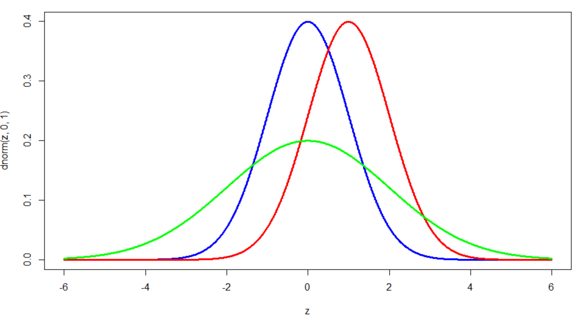


## 1.3 pnorm
:::info
`pnorm(num,mu,sigma)`: 求的是$F_{X\sim N(\mu,\sigma^2)}(num)=P(X\leq num)$
:::
```r
#pnorm is the cdf
x = 0
pnorm(x,0,1)
x = c(0,.2,.4,.6,.8,1.0)
pnorm(x,0,1)
pnorm(x,0,2)
#Plot the standard normal cdf
z = seq(-6,6,.01)  #sequence from -6 to 6 in steps of .1
plot(z,pnorm(z,0,1), type='l', col='blue', lwd=3)
#add some other cdf's
lines(z,pnorm(z,1,1), col='red', lwd=3)
lines(z,pnorm(z,0,2), col='green', lwd=3)
```
**CDF Graph**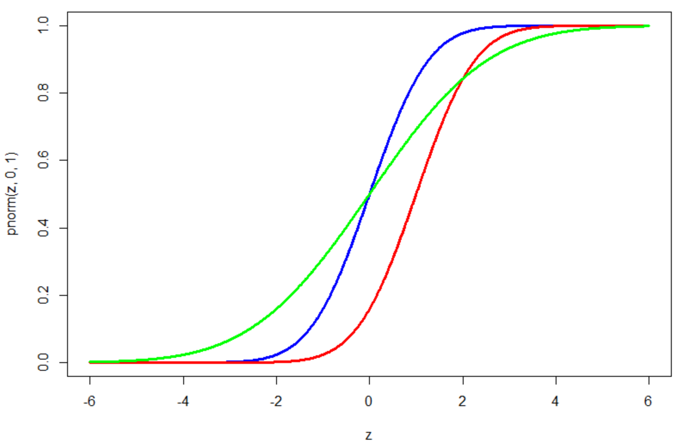


## 1.4 qnorm
:::info
`qnorm(p,mu,sigma)`是`pnorm(num,mu,sigma)`的反函数。
:::
```r
#qnorm is the inverse of the cdf it takes a probability and produces a value
#a = qnorm(p, 0,1)  <==> P(Z<a) = p <===> p = pnorm(a,0,1)
qnorm(.5,0,1)
p = pnorm(.351,0,1)
p  # 0.6372
a = qnorm(p,0,1)
a  # 0.351
```


## 1.5 runif
:::info
`runif(ntrials,a,b)`: 产生一个服从$Uniform(a,b)$的均匀分布的随机值。
:::


## 1.6 rexp/dexp/abline
:::info
`rexp(ntrials,lambda)`: 产生一个服从$exp(\lambda)$的指数分布的随机值。
`dexp(num,lambda)`: 求出$f_{X\sim exp(\lambda)}(num)$(概率密度)
`abline(v=0\h=0)`: 画出水平或者竖直线。
:::
```r
#plot the pdf of exponential(.5)
x = seq(0,10,.01)
plot(x,dexp(x,.5), type='l', col='blue', lwd=3)
abline(v=0)
abline(h=0)
```
**Graph**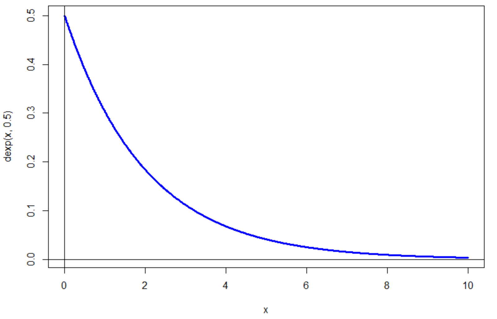


## 1.7 Histogram
### 1.7.1 hist
:::info
`hist(seq,freq=TRUE)`: 画出`seq`中的统计量。
:::
```r
#Histograms
data = rexp(100,.5)
hist(data) # 不指定freq参数y轴默认是频数
```
**Graph**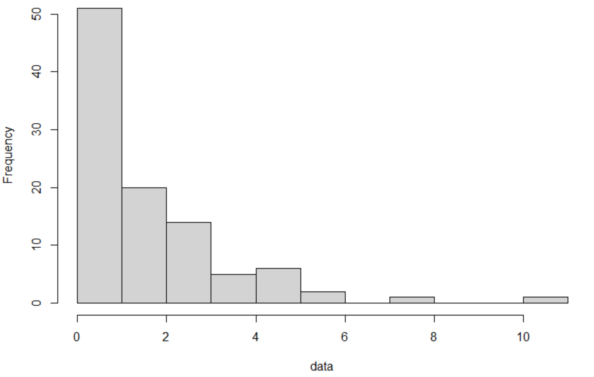


### 1.7.2 breaks为常数时
:::info
`breaks`参数为常数时，用于直接指定`bin`的个数
:::
```r
#controlling the number of bins
#breaks = a single number gives the number of bins 
#(actually this just 'suggests' the number of bins. I'm not sure how R chooses the exact number)
data = rexp(100,.5)
hist(data, breaks=12)
hist(data, breaks=100)
hist(data, breaks=2)
```
**breaks=12**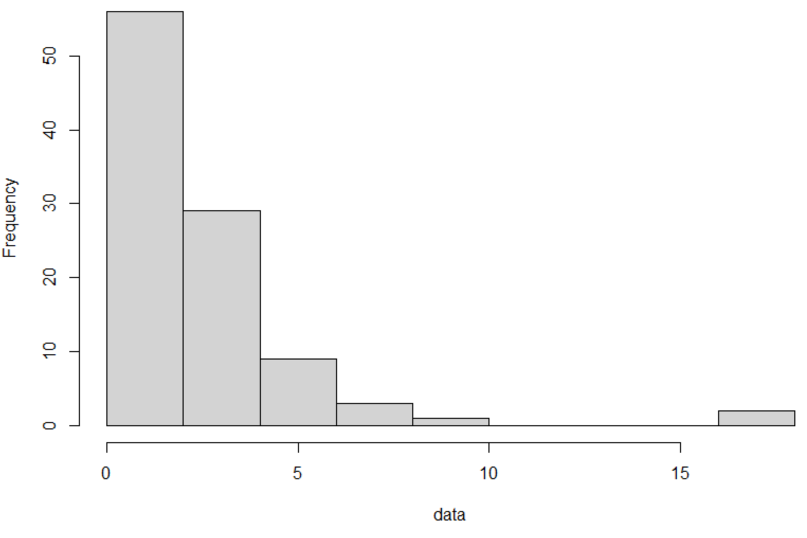
**breaks=100**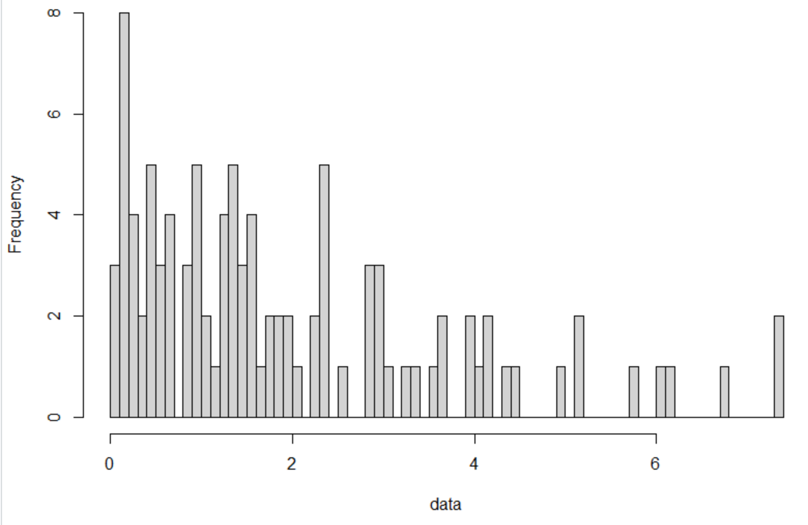
**breaks=2**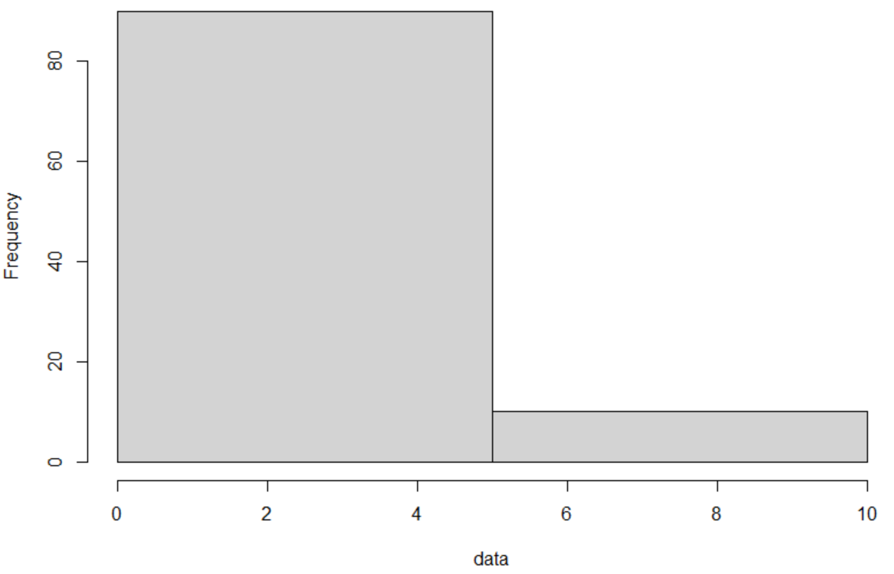

### 1.7.3 breaks为向量时
:::info
`breaks`参数为向量(`seq`)时，用于指定`bin`的边界
:::
```r
#breaks = a vector gives the edges of each bin
data = rexp(100,.5)
binwidth = .4
bins = seq(min(data), max(data)+binwidth, binwidth)
hist(data, breaks=bins, col='purple')
```
**Graph**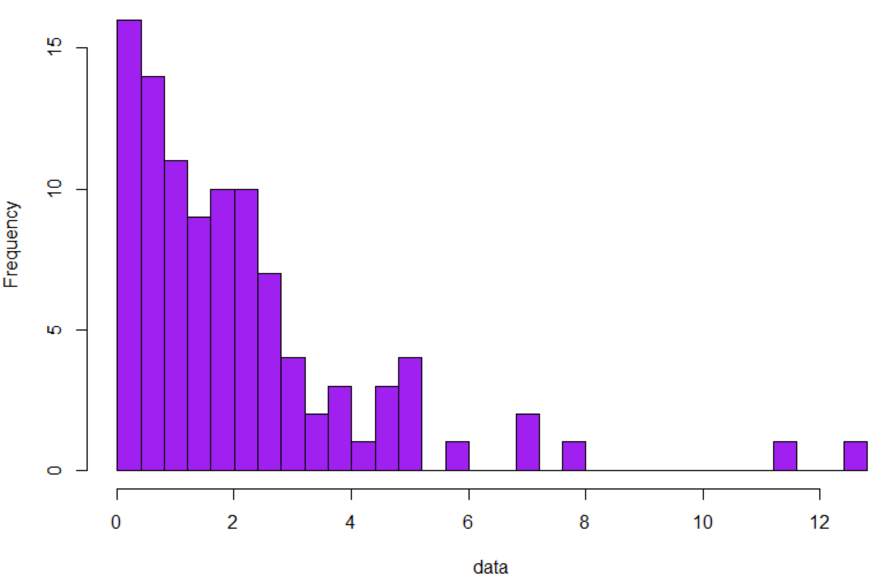


### 1.7.4 freq=FALSE
:::info
`hist(seq,freq=FALSE)`: 画出`seq`中的统计量, 指定`freq=FALSE`使`y`轴是概率密度。
:::
```r
#By default you get a frequency histogram. 
#To get a density you set freq=FALSE
data = rexp(100,.5)
binwidth = .4
bins = seq(min(data), max(data)+binwidth, binwidth)
hist(data, breaks=bins, col='purple', freq=FALSE)
```
**Graph**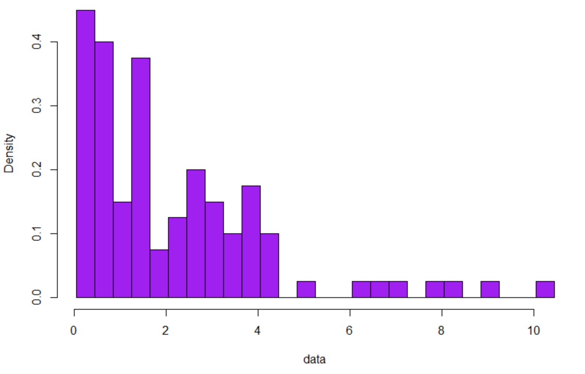


### 1.7.5 hist和density函数对比
```r
#With enough data the densitiy histogram should look like the pdf
lambda = .5
data = rexp(10000,lambda)
binwidth = .3
bins = seq(min(data), max(data)+binwidth, binwidth)
hist(data, breaks=bins, col='green', freq=FALSE)
x = seq(0,max(data)+1,.01)
lines(x,dexp(x,lambda), col='purple', lwd=4)
```
**Graph**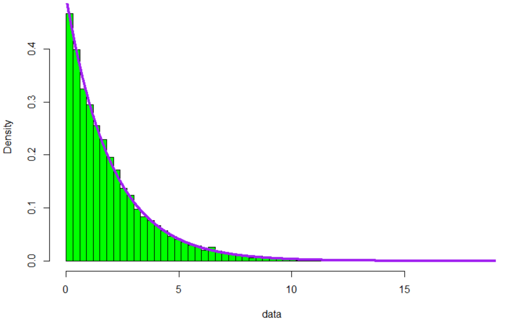


# 2 编程练习
## 2.1 Frequency histogram
:::info
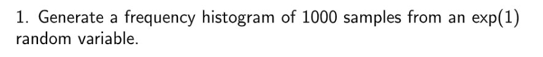
:::
```r
lambda = 1
data = rexp(1000,lambda)
binwidth = .5
bins = seq(min(data), max(data)+binwidth, binwidth)
hist(data, breaks=bins, col='yellow', freq=TRUE)
```
**Graph**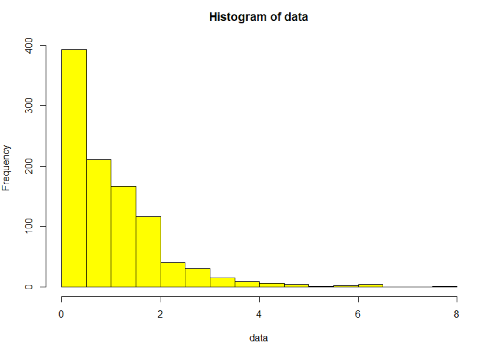

## 2.2 独立指数分布的平均值
:::info
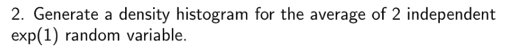
我们也可以使用卷积公式计算出两个独立的$exp(1)$随机变量的平均值的概率密度函数
:::
```r
data=seq(0,10,0.01)
plot(data,2*data/exp(2*data),type='l',col='purple',lwd=2)
```
**概率视角**令$X\sim exp(1),Y\sim exp(1),W=\frac{X+Y}{2}$
所以$f_W(w)=\int_{0}^{2w} f_X(t)f_Y(2w-t)dt=\int_{0}^{2w}e^{-t}\cdot e^{-(2w-t)}dt\newline=\int_{0}^{2w} e^{-2w}dt=\frac{2w}{e^{2w}}$
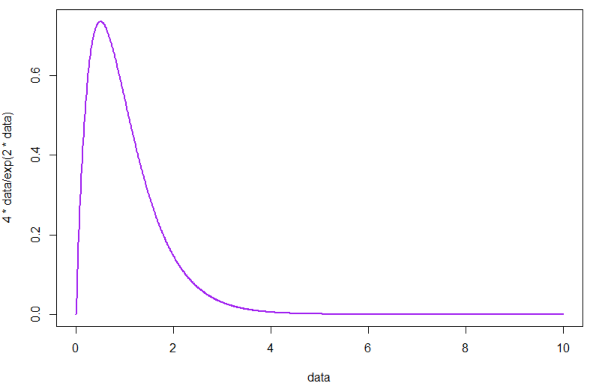
```r
lambda = 1
data1 = rexp(1000,lambda)
data2 = rexp(1000,lambda)
aveData = (data1+data2)/2
binwidth = .4
bins = seq(min(aveData), max(aveData)+binwidth, binwidth)
hist(aveData, breaks=bins, col='yellow', freq=TRUE)
```
**统计视角**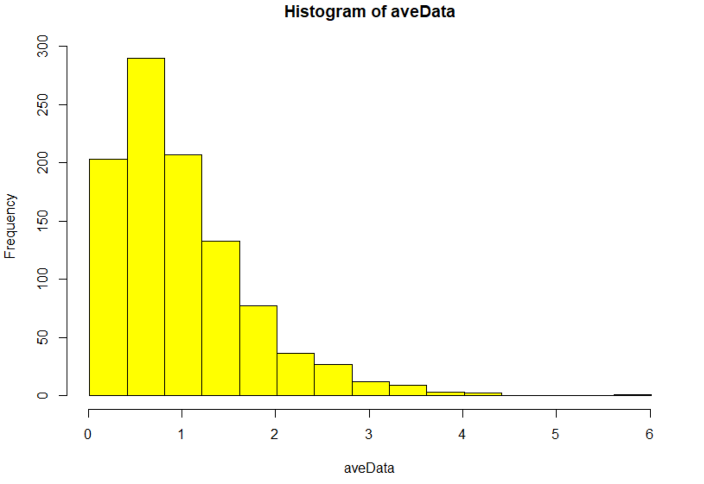
**对比Histogram和Density Function**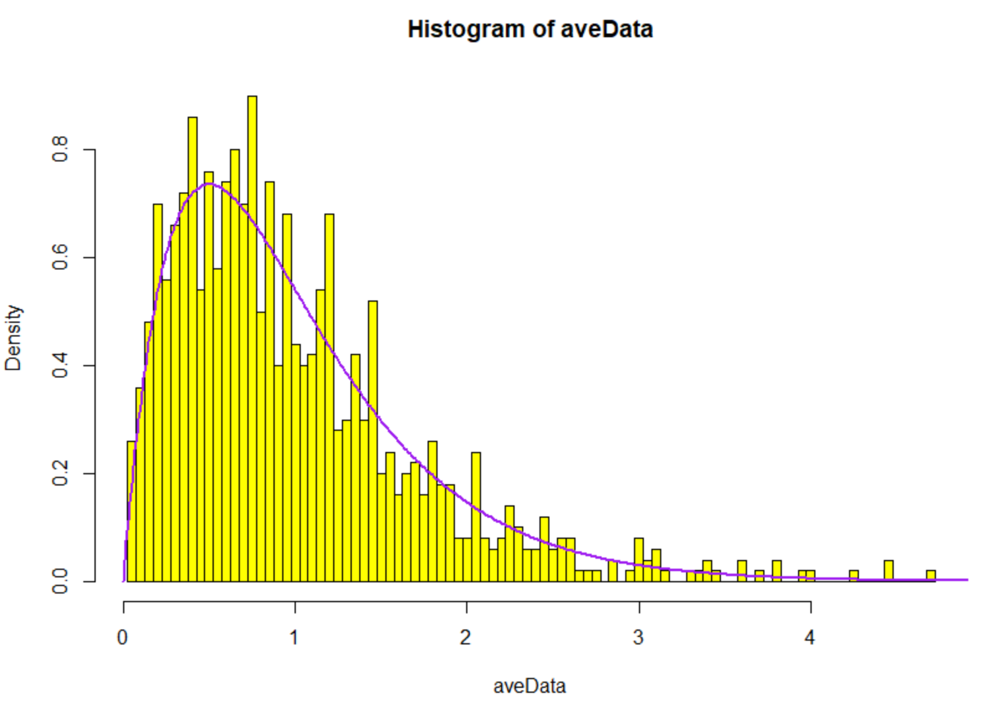


## 2.3 50个指数分布之和
:::info
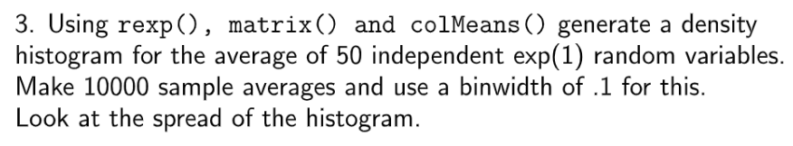
:::
**Key**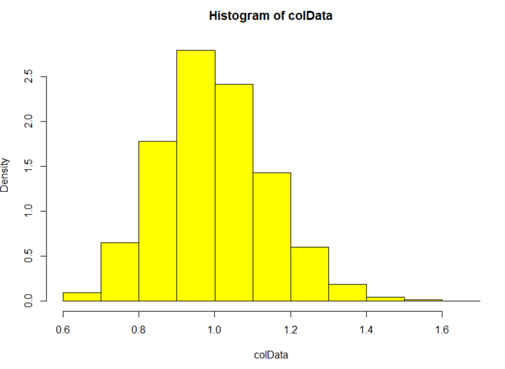
```r
average=50
samples=10000
data=matrix(rexp(average*samples,1),nrow=50,ncol=10000)
colData=colMeans(data)
binWidth=0.1
bins=seq(min(colData),max(colData)+binWidth,binWidth)
hist(colData,breaks=bins,col="yellow",freq=FALSE)
```

## 2.4 和高斯分布的对比
:::info
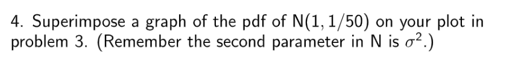
:::
**Key**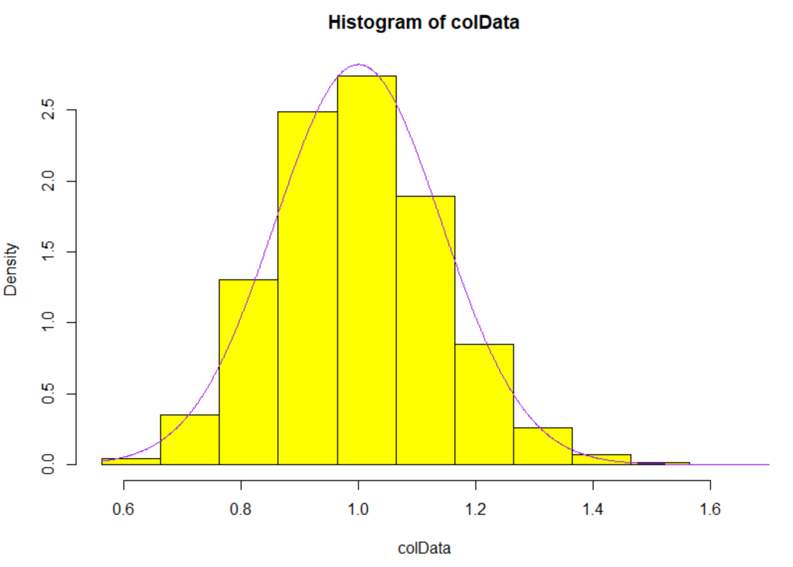
```r
average=50
samples=10000
data=matrix(rexp(average*samples,1),nrow=50,ncol=10000)
colData=colMeans(data)
binWidth=0.1
bins=seq(min(colData),max(colData)+binWidth,binWidth)
hist(colData,breaks=bins,col="yellow",freq=FALSE)

z=seq(min(colData),max(colData)+binWidth,0.001)
lines(z,dnorm(z,1,1/sqrt(50)),col="purple",type="l")
```
