[Problem Set 2.pdf](https://www.yuque.com/attachments/yuque/0/2022/pdf/12393765/1660894473607-d56dfa2e-baec-408f-82df-b305c6c4f172.pdf)
[Problem Set 2_solutions.pdf](https://www.yuque.com/attachments/yuque/0/2022/pdf/12393765/1660894473581-ec272c64-dd21-4ddd-8b96-cbe306bee6ab.pdf)

# P1 Boy or Girl Paradox
:::info
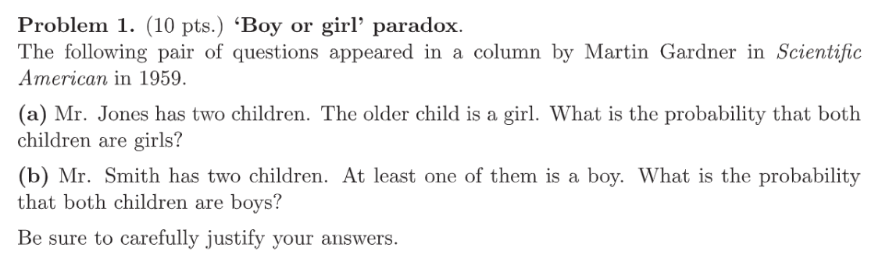
:::
**(a)**我们使用两种方式来思考:

1. **从条件概率的视角:**

假设年长的孩子为女孩的事件为$B$, 两个孩子均为女孩的概率是$A$, 则我们实际上要求的是$P(A|B)$, 因为$P(A|B)=\frac{P(A\cap B)}{P(B)}=\frac{\frac{1}{2}\cdot\frac{1}{2}}{\frac{1}{2}}=\frac{1}{2}$

2. **从样本空间的角度**

我们也可以这样想，假设两个孩子是$A,B$, 我们用下标$b$这个孩子是男孩，用下标$g$表示这个孩子是女孩，$o$表示这个孩子更年长，
于是我们的样本空间是$\{(A_g,B_{go}),(A_{go},B_{g}),(A_{b},B_{bo}),(A_{bo},B_{b}),\\(A_{b},B_{go}),(A_{bo},B_{g}),(A_{g},B_{bo}),(A_{go},B_{b})\}$
假设每种情况是等可能的，则两个均为女孩且年长的是女孩的概率是$\frac{4}{8}=\frac{1}{2}$
**(b)**假设两个孩子中至少有一个男孩的事件是$A$, 两个孩子都是男孩的事件是$B$, 则我们要求$P(B|A)=\frac{P(A,B)}{P(A)}=\frac{\frac{1}{2}\cdot\frac{1}{2}}{1-\frac{1}{2}\cdot \frac{1}{2}}=\frac{1}{3}$

# P2 The Blue Taxi
:::info
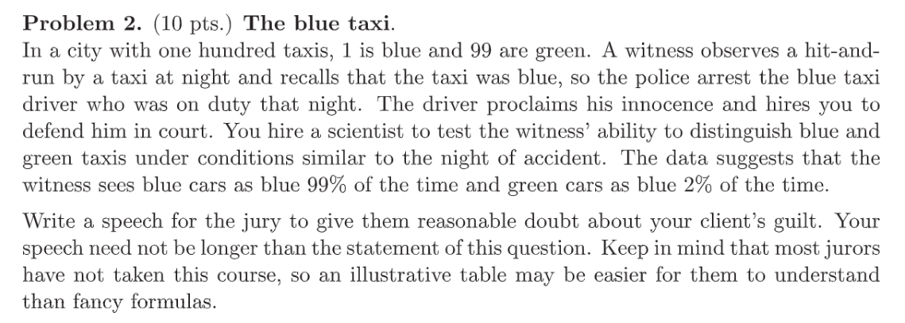
:::
**Key**我们采用英文书写:
Since the witness claims to see the blue car, we have to make sure that the car is indeed blue. We know from the scientist that:

1. Given that the car is blue, $99\%$of time the witness sees as blue. 
2. Given that the car is green, $2\%$of time the witness sees as green.

**Then we can define the events as follows:**

- Event $B$: The car happens to be in blue.
- Event $G$: The car happens to be in green.
- Event $SB$: The witness recognizes the car as blue.
- Event $SG$: The witness recognizes the car as green.

So based on the information we have, $P(B)=0.01$, $P(G)=0.99$, $P(SB|B)=0.99$, $P(SB|G)=0.02$, we want to compute the probability $P(B|SB)$
We can use the bayes theorem to compute the probability:
$P(B|SB)=\frac{P(SB|B)P(B)}{P(SB)}=\frac{P(SB|B)P(B)}{P(SB|B)P(B)+p(SB|G)P(G)}\newline=\frac{0.99*0.01}{0.99*0.01+0.99*0.02}=\frac{1}{3}$
So in fact the probability that the accused person is the criminal is only $0.3333$, so it is likely that the witness mistakes the color of the car.

# P3 Trees of cards**⭐⭐⭐**
:::info
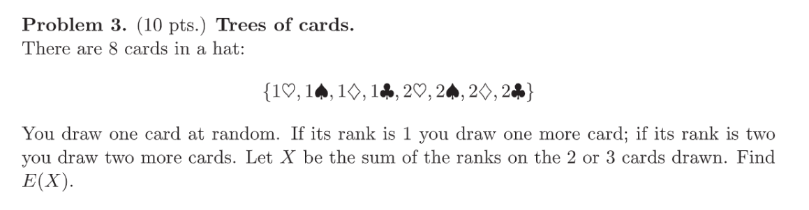
:::
**Key**我们需要计算$X$的所有取值和其对应的概率：
**首先**$X=2$**时，有:**
我第一次抽到$1$然后第二次抽到$1$停止，概率是$\frac{1}{2}\cdot\frac{3}{7}=\frac{3}{14}$
**然后是**$X=3$**时，有:**
我第一次抽到$1$，第二次抽到$2$停止, 概率是$\frac{1}{2}\cdot\frac{4}{7}=\frac{2}{7}$
**然后是**$X=4$**时, 有:**
抽牌的`rank`是$2,1,1$, 概率是$\frac{1}{2}\cdot\frac{C_4^2}{C_7 ^2}=\frac{1}{7}$
**然后是**$X=5$**, 有:**
抽牌的`rank`是$2,1,2$或者$2,2,1$(算一种), 概率是$\frac{1}{2}\cdot\frac{C_3^1\cdot C_4^1}{C_7^2}=\frac{2}{7}$
**最后是**$X=6$**, 有:**
抽牌的`rank`是$2,2,2$, 概率同样是$\frac{1}{2}\cdot\frac{C_3^2}{C_7 ^2}=\frac{1}{14}$
我们验证一下$p_X(x)$是否满足概率公理，因为$\sum_x p_X(x)=1$, 且$p_X(x)\geq 0,\forall x$, 所以$E[X]=2\cdot\frac{3}{14}+3\cdot\frac{3}{7}+4\cdot\frac{1}{7}+5\cdot\frac{1}{7}+6\cdot\frac{1}{14}=\frac{26}{7}\approx 3.7143$


# P4 Dice
:::info
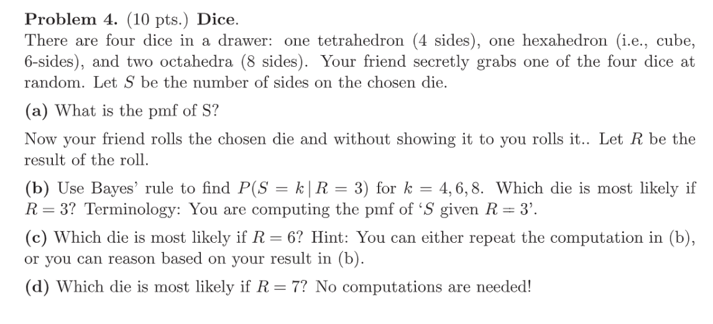
:::
**(a)**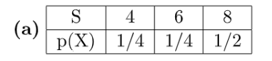
**(b)**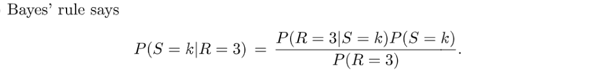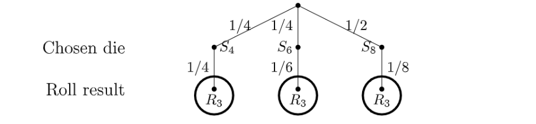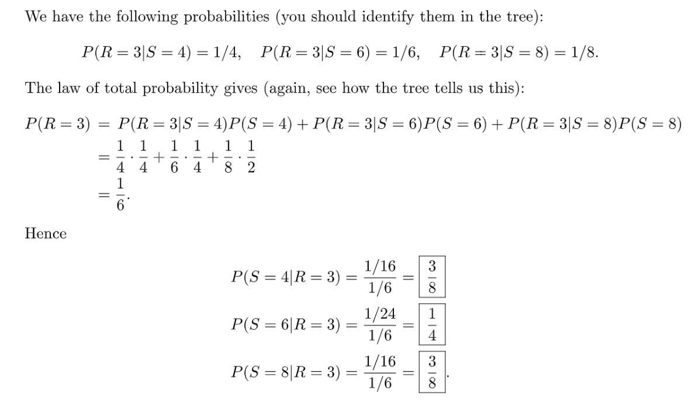
**(c)**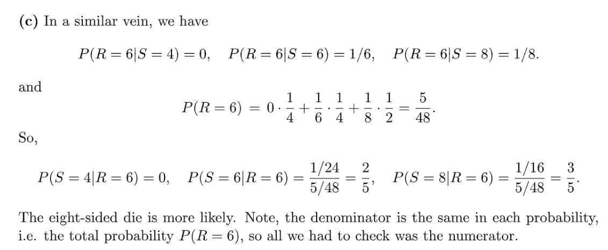
**(d)**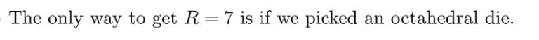

# P5 Seating Arrangement**⭐⭐⭐⭐⭐**
:::info
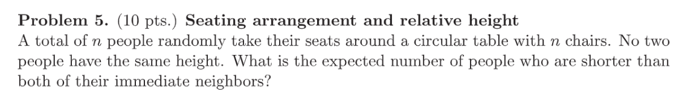
:::
**简单方法⭐⭐⭐**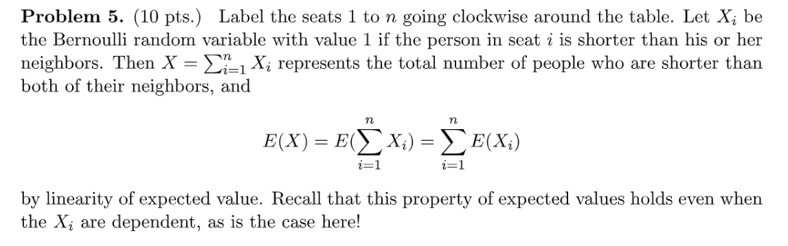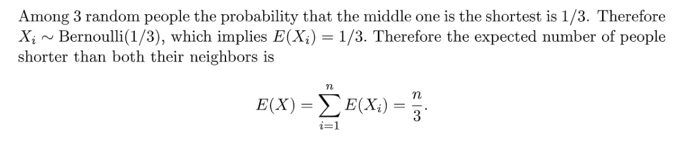
**严格推导⭐⭐⭐⭐⭐**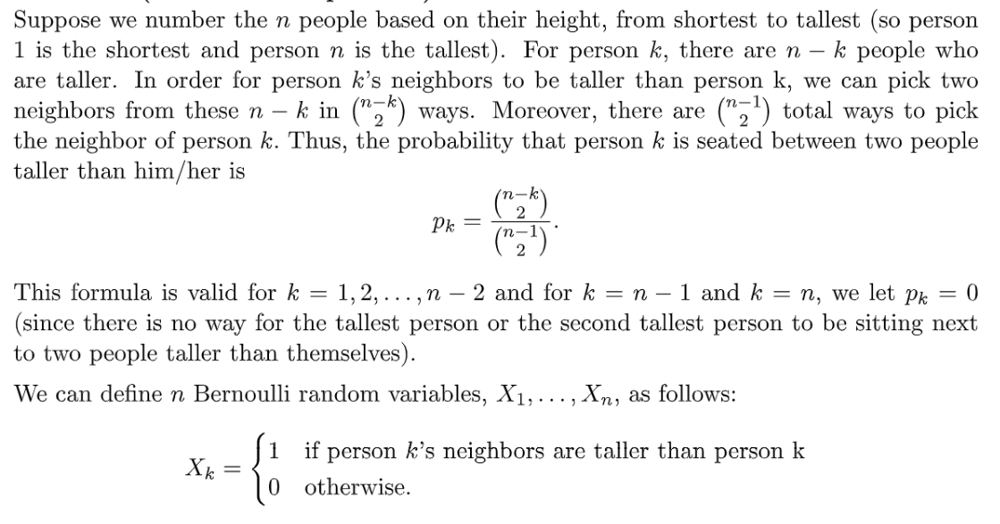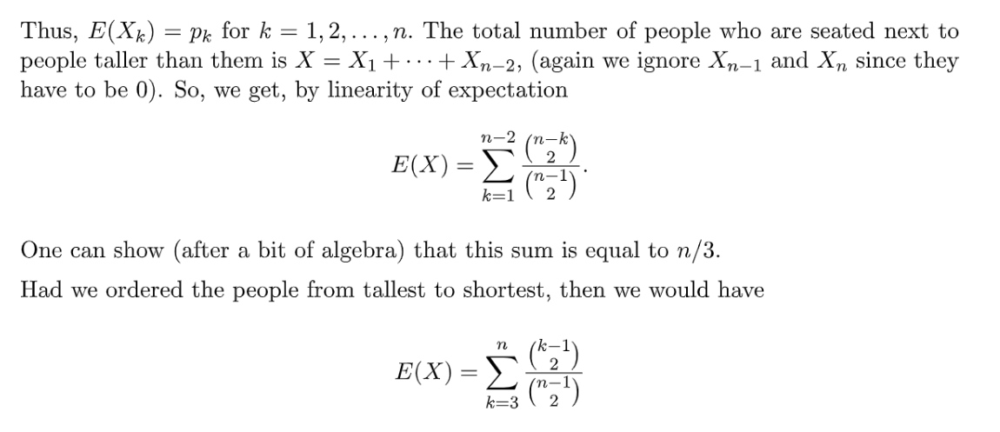

# P6 R Simulation
:::info
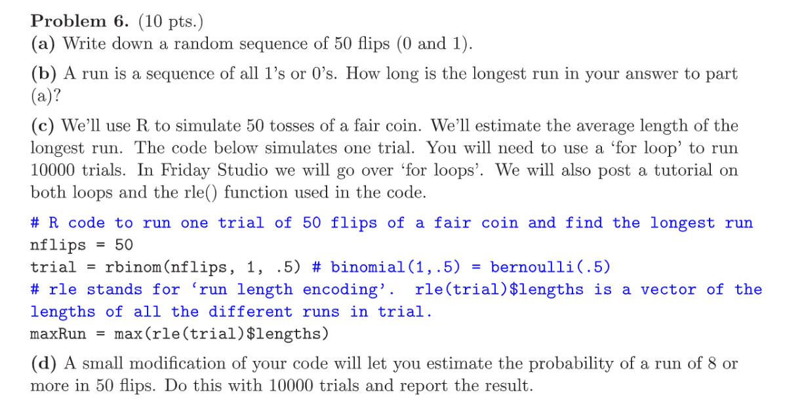
:::
**(a)**$10101010101010101010101010101010101010101010101010$
**(b)**只有$1$, 因为连续的$0$或者$1$长度最大为$1$
**(c)****使用到的函数:**

1. `rle(seq): seq表示结果序列，返回结果序列中的所有run的长度`
2. `max(seq): 求出序列中的最大值`
3. `rep(num,times): 生成一个长为times, 全为num的序列`
4. `rbinom(nflips,n,p):进行二项分布(n,p)实验nflips次，得到一个序列`
```r
ntrials=10000
nflips=50
res=rep(0,10000)
for(j in 1:10000){
  trial=rbinom(nflips,1,0.5)
  res[j]=max(rle(trial)$length)
}
mean(res) # 5.9566
```
**(d)**```r
ntrials=10000
nflips=50
res=rep(0,10000)
for(j in 1:10000){
  trial=rbinom(nflips,1,0.5)
  res[j]=sum(rle(trial)$length>=8)
}
print(mean(res>0)) #0.1613
```
