# 0 前言
[Studio2_slides.pdf](https://www.yuque.com/attachments/yuque/0/2022/pdf/12393765/1660882317901-2ab7361f-16e4-4406-8342-0ce9bcb10ea6.pdf)
[Studio2_slides_sol.pdf](https://www.yuque.com/attachments/yuque/0/2022/pdf/12393765/1660887118777-77c948d1-2561-4448-b862-7213bea7b789.pdf)
[Studio2_slides_expanded_sol.pdf](https://www.yuque.com/attachments/yuque/0/2022/pdf/12393765/1660887118633-4db4010c-263f-4349-8625-5a35a41d9a47.pdf)
[studio2.r](https://www.yuque.com/attachments/yuque/0/2022/r/12393765/1660887178123-92c8da4f-7f2e-40ec-8798-5568d27c8d5c.r)
[studio2-solutions.r](https://www.yuque.com/attachments/yuque/0/2022/r/12393765/1660887178106-281edfd8-a287-4a5f-8fb6-6e1c2e257194.r)
> 本节我们探讨如何使用`R`语言来模拟`Dearrangement`问题[问题描述](https://www.yuque.com/alexman/kziggo/dqmnqy#jazOH)
> **问题主要说的是：**假设我们有$n$位学生围坐在圆桌前，然后现在他们同时站起来，然后随机选择座位坐下，我们想要探究坐下后有多少学生的座位和之前的是相同的。
> **代数视角的解法:**
> 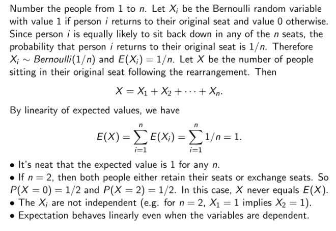我们看到，期望是$1$，下面我们使用统计思想来验证这个结论。
> **统计视角的理解:**
> - 我们可以通过做大量的实验来验证一个随机事件$A$发生的频率是多少，这个频率在实验次数$n\to \infty$时会趋于概率值。做法就是在每次实验中，如果实验中事件$A$发生了，则当前实验记为$1$，最后求$\frac{\#\space 1}{n}$来估算事件的概率。
> - 我们也可以通过做大量的实验来验证一个随机变量$X$的期望值是多少，这个值在实验次数$n\to \infty$时会趋于真实期望值。假设随机变量取值$\{x_1,x_2,...,x_m\}$, 做法就是在每次实验中，如果实验$j$中事件$X=x_t,t\in 1,2,...,m$发生了，则当前实验结果记为$x_{jt}$, 然后最后求$\frac{\sum_{j=1}^n x_{jt}}{n}$来估算期望值。


# 1 坐在原位的人数的期望**⭐⭐**
> 下面的代码统计了在交换座位之后有**多少同学坐在自己的原位。**

## 1.1 进行一次实验
```r
n = 5             # 5位同学
x = 1:n           # 5位同学的座位号
y = sample(x,n)   # 重排后5位同学的座位号
y == x            # Boolean Vector, TRUE 表明这个同学在重排后仍然在自己的原位
sum(y==x)         #The number of TRUE, 表明有多少同学坐在自己的原位
```
> $\#\space 1$就是本次实验中在自己原位的学生个数


## 1.2 进行n次实验
> 下面的代码记录了进行$n$次独立的重排，留在原位的人数的期望值。

```r
n = 9                     # 进行9次实验
x = 1:n
ntrials = 10000
trials = rep(0,ntrials)   # 记录实验结果
for (j in 1:ntrials)
{
    y = sample(x,n) 
    trials[j] = sum(y == x)
}
mean(trials)              # 求出加权平均，也就是期望
```
> 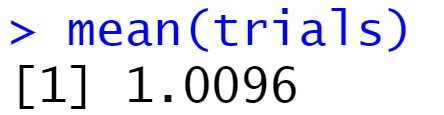数值会波动，且随着$n\to \infty$, 这个数值会逐渐接近$1$,这与我们使用代数运算的结果基本吻合。
> `trials[j]`代表的就是$x_{jt}$, 表示第$j$次实验中，$X=x_t$事件发生，也就是有$x_t$位同学在这次实验结束后还是坐在了自己的原位。


# 2 重排之后有人在原位的概率**⭐**
> 下面的代码求出在重排后至少有一位同学在自己原来的位置上的概率。

```r
n = 9
x = 1:n
ntrials = 10000
trials = rep(0,ntrials)
#  使用for 循环
for (j in 1:ntrials)
{
    y = sample(x,n)
    s = sum(y == x)    #s = number of people in their original seat
    trials[j] = (s == 0) # 至少一个人在原位, trials[j] 就是 1; 如果全都不在原位，trials[j]就是0.
}
mean(trials)  #mean(trials): 进行10000次实验，发生有人在原位的频率(也就是概率)的大小。

```
> 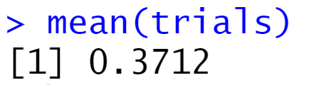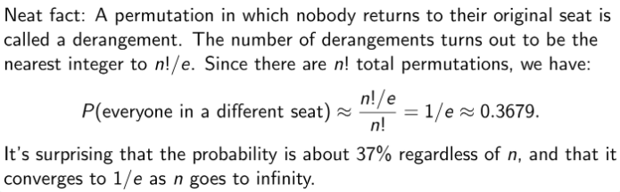
> 这和我们的代数运算结果基本吻合。
> `trials[j]`记录了在第$j$次实验结束时是否有至少一位学生在自己的原位。


# 3 设置seed固定随机性
```r
# set.seed()
# Set the seed for the random number generator so results are reproducible

# This code will always generate the same random numbers
# Run these two lines several times to see they always give the same sequence
# of 10 numbers. 
set.seed(1)
sample(1:5, 6, replace=TRUE) 
```


# 4 二项分布rbinom
> `rbinom(ntrials, ntosses, phead)`:
> `ntrials`: 进行$ntrials$次二项分布模拟。
> `ntosses`: 类比抛$n$次硬币
> `phead`: 硬币朝上的概率
> 回顾$X\sim binomial(n,p)$, $P(X=k)=(_k^n)p^k(1-p)^{n-k}$

**rbinom(10, 8, 0.7)**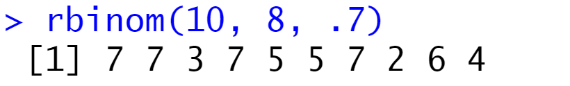
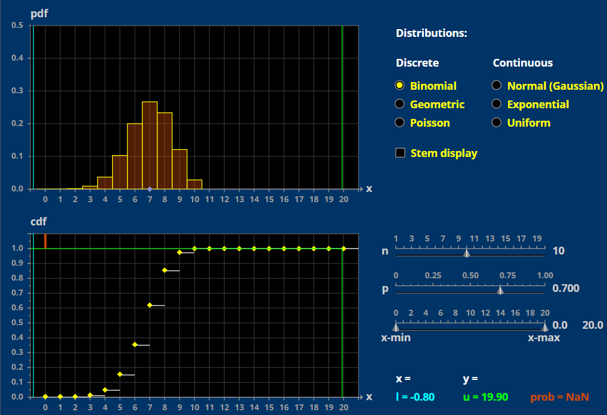
**rbinom(10, 8, 0.2)**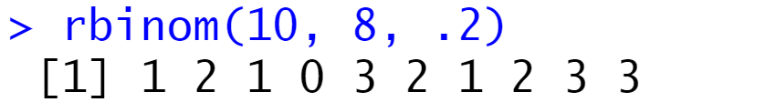
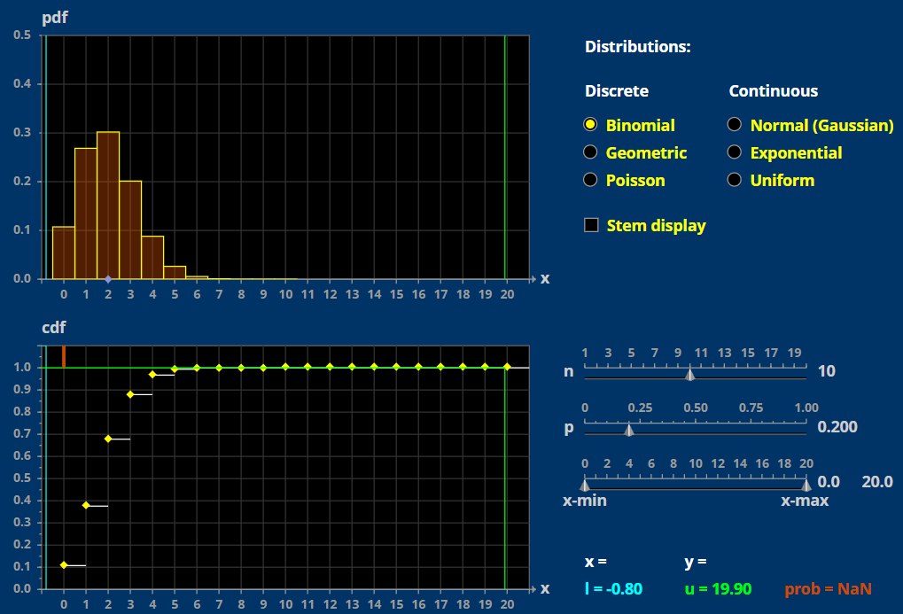
**rbinom(10, 1, 0.5)**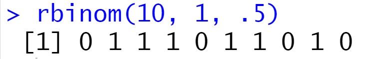
取值为$0$和$1$的概率都是$0.5$, 相当于一次`Bernoulli`实验
 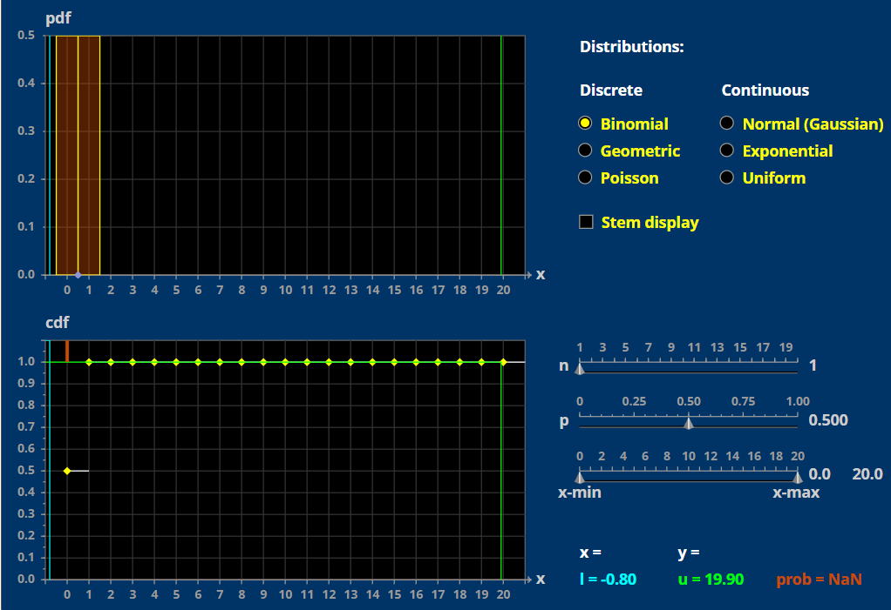

# 5 使用Table和Plot 可视化**⭐⭐**
> `table(trials)`: 根据实验的结果统计每个结果的频率，制作成一张二维频率表
> `plot(table(trials))`: 根据频率表画出直方图。
> **注意**`**trials.frequency**`**不建议使用，在统计**`**trials**`**中各个结果的频率时会有奇怪的错误，建议使用**`**table**`**对其进行封装。**

```r
# Generate 500 Binomial(8,.7) random values.
# Then make a plot of the frequency of each value
phead = .7
ntosses = 8
ntrials = 500
trials = rbinom(ntrials, ntosses, phead)   
# trials 记录了ntrials 次实验的结果，是一个一维长列表。

# table(trials) computes a frequency table:
trials.frequency = table(trials)   
print(trials.frequency)  #This writes to the screen
## trials.frequency
##  1   2   3   4   5   6   7   8 
##  2   6  26  68 112 158  94  34

# Plot the table --plot() is smart enough just plot the table
plot(trials.frequency)     #
```
**图例**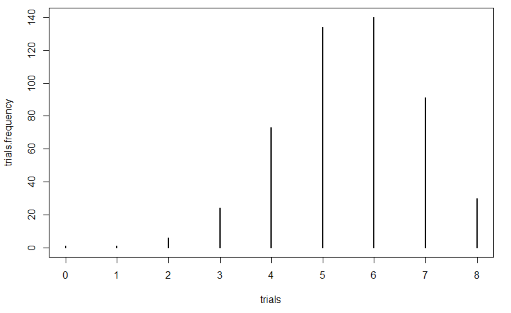

# 6 实用函数dbinom/pbinom
> 本章介绍两个快速求服从二项分布的随机变量的概率:
> `dbinom(values, ntosses, phead)`: `values`是一个特定的值$x_i$的话，计算的是$P(X=x_i)$, 如果`values`是一个列表的话，返回的就是列表中所有随机变量取值的概率。
> `pbinom(values, ntosses, phead)`: 计算`CDF`，也就是$P(X\leq x_i)$

```r
# dbinom() and pbinom()

# Naturally R has a function to do the computation from the previous exercise
# dbinom(values, ntosses, phead ) is the probability mass function (pmf)
# pbinom(values, ntosses, phead ) is the cumulative distribution function (cdf)

# dbinom(values, ntosses, phead)
# Compute  P(Y=6) for Y ~ Binomial(8,.6), compare with answer in exercise 2.
dbinom(6, 8, .6)
# Answer = 0.2090189 --same as in exercise 2

# Compute P(Y = 8) for Y ~ Binomial(10,.9)
dbinom(8, 10, .9)
# 0.1937102

# values can be a vector of values, then dbinom returns a vector of probabilities
# This returns 9 probabilities (for k = 0,1,2,...,8)
dbinom(0:8, 8, .6)
# [1] 0.00065536 0.00786432 0.04128768 0.12386304 0.23224320 0.27869184
# [7] 0.20901888 0.08957952 0.01679616

# pbinom(values, ntosses, phead)
#Compute P(Y <= 6) for Y ~ Binomial(8,.6). 
pbinom(6,8,.6)  #cumulative probability
# 0.8936243  

# You can get a vector of probabilities. Note that for the cdf the probabilities
# increase to 1
pbinom(0:8, 8, .6)
# [1] 0.00065536 0.00851968 0.04980736 0.17367040 0.40591360
# [6] 0.68460544 0.89362432 0.98320384 1.00000000
```


# 7 课堂练习
> 假设$Y\sim Binomial(8,0.6)$

## E1 估算概率**⭐⭐**
> 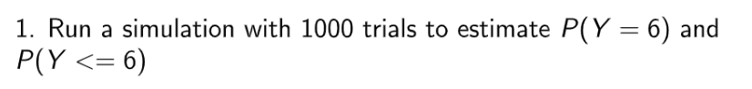

**Key**```r
# 使用mean
ntosses = 8
ntrials = 5000
phead = .6
trials = rbinom(ntrials, ntosses, phead)
mean(trials == 6) #estimate of P(Y = 6)   --pmf
mean(trials<=6)   #estimate of P(Y <= 6)  --cdf


# 使用table
phead = 0.6
ntosses = 8
ntrials = 1000
trials = rbinom(ntrials, ntosses, phead)
frequency_table= table(trials)   
frequency_table['6']/ntrials

```

## E2 估算/计算概率
> 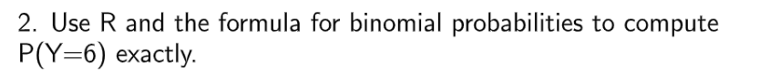

**使用公式**$(^8_6)0.6^60.4^2=0.20901888$
**R语言估算**```r
ntosses = 8
phead = .6
# choose 是组合数公式。
choose(ntosses,6)*phead^6*(1-phead)^(ntosses-6)
```


## E3 抛硬币**⭐⭐⭐⭐**
> 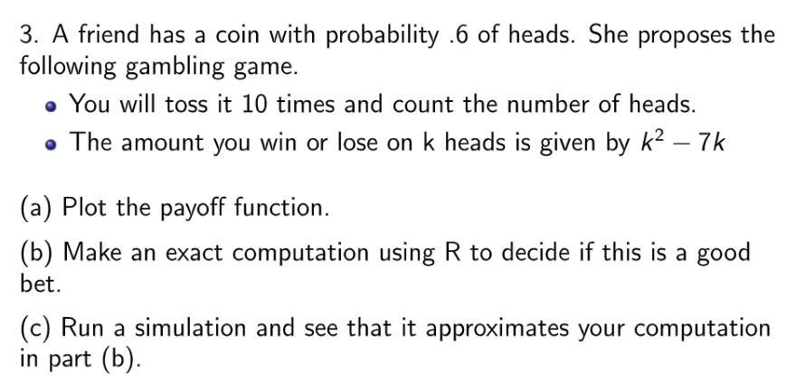

**(a) 画出收益曲线**```r
outcomes = 0:10
payoff = outcomes^2 - 7*outcomes
plot(outcomes, payoff, pch=19) 
# pch=19 tells plot to use solid circles
```
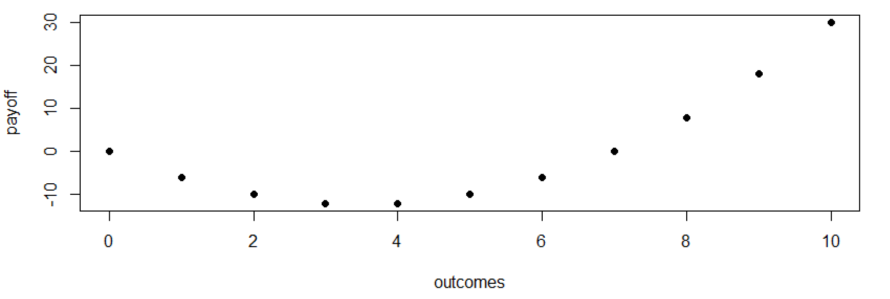
**(b) 决定这个bet是否值得**```r
phead = 0.6
ntosses = 10
ntrials = 1000
trials = rbinom(ntrials, ntosses, phead)

trials = trials^2-7*trials

plot(table(trials))
```
我们多次运行这段代码后，发现负收益的情况更多
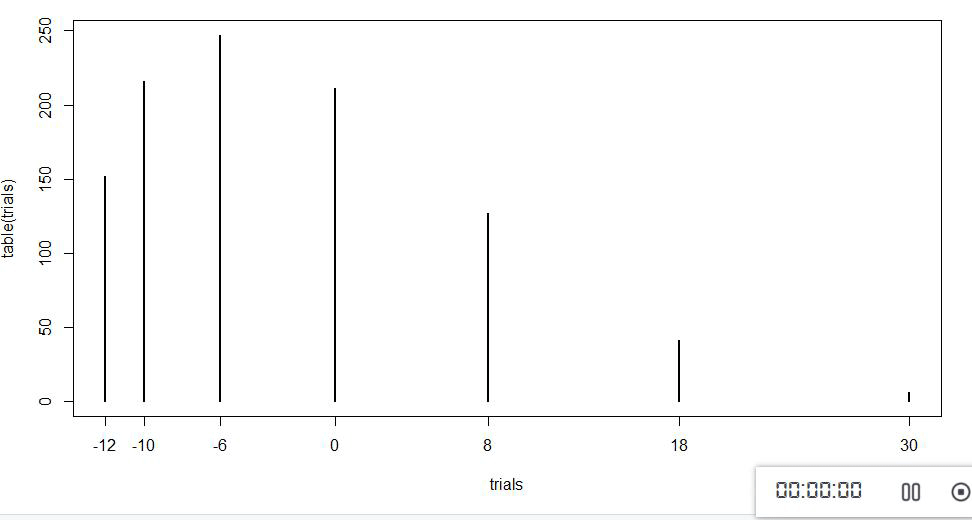
我们也直接使用下面的代码计算期望, 发现是$-3.6$，所以这个赌局不好：
```r
phead = .6
ntosses = 10
outcomes = 0:ntosses
payoff = outcomes^2 - 7*outcomes

#  We can compute the entire vector of probabilities using dbinom
countProbabilities = dbinom(outcomes, ntosses, phead)
countProbabilities  # This is just to take a look at the probabilities

# This is the weighted sum: of probabilities times payoff
expectedValue = sum(countProbabilities*payoff)  
expectedValue    
```
**(c) 利用R语言模拟**```r
phead = 0.6
ntosses = 10
ntrials = 1000
trials = rbinom(ntrials, ntosses, phead)

trials = trials^2-7*trials

mean(trials)
```
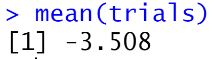


