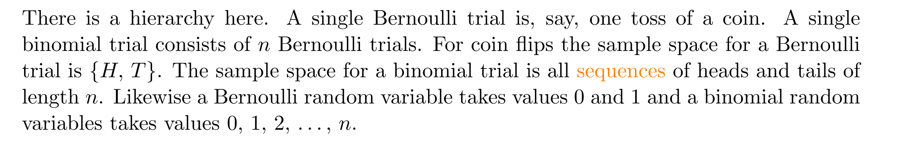
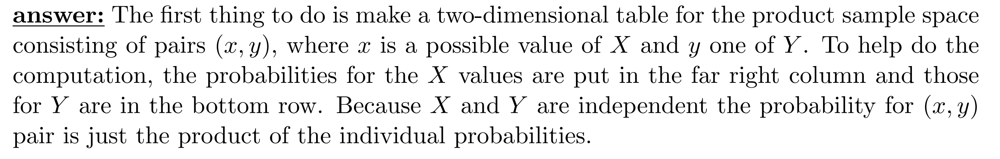

[Class Slides, Discrete Random Variables, Expectation.pdf](https://www.yuque.com/attachments/yuque/0/2022/pdf/12393765/1660878169213-5a7961df-84e9-4346-a24a-590d64227f5f.pdf)

# 0 随机变量
## 0.1 随机变量是什么
> **我们掷骰子的例子入手:**
> 假设我们有一个赌局，通过掷两枚骰子来下注，掷两枚骰子的样本空间定义为:
> 
> 如果我们规定两枚骰子的点数之和为$7$,则赢得$\$500$否则亏$\$100$, 我们就可以定义一个`Payoff Function`: $X(i,j)=\begin{cases} 500&if \space i+j=7\\-100&otherwise\end{cases}$  
> 当然我们也可以改变这个`Payoff Function`: 假设现在我的回报和我两次掷骰子的点数成一个函数关系式，我们假设这个关系是:$Y(i,j)=ij-10$, 则
> 
> 
> **现在问题是，哪一个赌局带来的期望回报更高?**
> 我们可以通过计算这个`Payoff Function`在所有情况下的回报，再分别乘以其概率得到的期望来决定。
> 
> 上述的`Payoff Function`就是随机变量的一些例子，**随机变量本质上将样本空间映射到实数域中去。**
> 

### 
## 0.2 事件和随机变量
> 
> 
> 我们甚至可以使$a$不在$X$的值域当中，此时$P(X=a)=0$, 我们称$X=a$这个事件为`Empty Event`, 对应的集合为`Empty Set`

# 1 离散随机变量
[Discrete Random Variables.pdf](https://www.yuque.com/attachments/yuque/0/2022/pdf/12393765/1659946727489-8d22dfb8-66e7-4573-9c36-768b53d0e77a.pdf)
## 1.0 前言
> 我们在[单变量概率基础](https://www.yuque.com/alexman/kziggo/fxeosd#zDXyT)中已经介绍了离散样本空间和概率函数的定义，现在我们要探究离散随机变量的定义和由来

## 1.1 Definition
> 

**Examples**
## 

## 1.2 离散概率法则
:::info

:::

## 1.3 Discrete Uniform Law
> 
> 

## 1.4 Independence of Random Variables
> 

# 2 概率密度函数和累积分布函数
## 2.0 Distribution
> 

**Example 1**
**Example 2**
**Example 3**

## 2.1 PMF
### 2.1.1 定义
> 
> 

### 2.1.2 性质
> 一个合法的`PMF`函数必须满足所有的三个概率公理:
> 

### 2.1.3 Examples
#### 赌局案例
> 假设我们有一个赌局，和之前一样，通过掷两枚骰子来下注，掷两枚骰子的样本空间定义为:
> 
> 现在我们定义一个随机变量$M(i,j)=max(i,j)$, 我们可以描述所有$M$的取值:
> 
> 如果我们要求$p_M(8)$, 因为$8$不在$M$的值域中，所以$p_M(8)=0$

#### 事件不等式
> 

## 2.2 CDF
### 2.2.1 定义
> 
> 假设我们有一个赌局，和之前一样，通过掷两枚骰子来下注，掷两枚骰子的样本空间定义为:
> 
> 现在定义一个随机变量$M(i,j)=max(i,j)$, 我们可以描述比较其`PMF`和`PDF`的特性:
> 
> 
> 
> 

### 2.2.2 CDF的性质
> 
> $F$一般来说是`Right Continuous`的。

## 2.3 Graphs of PMF and PDF
> 
> 

## 2.4 Conditional PMF
### 2.4.1 定义
> 
> 因为概率空间缩减为了事件$A$对应的原始样本空间，于是我们的概率密度函数要想合法，就必须满足: $\sum_xp_{X|A}(x)=\sum_{x}P(X=x|A)=1$, 于是$\sum_x \frac{P(\{X=x\}\cap A)}{P(A)}=1$
> 于是$\sum_x P(\{X=x\}\cap A)=P(A)$, 所以对于不同的$x$取值，$\{X=x\}\cap A$锁代表的集合彼此应该是`Disjoint`的

### 2.4.2 算例
> 

# 3 常见离散分布
## 3.1 伯努利分布**⭐⭐⭐**
### 3.1.1 定义
:::info

:::

### 3.1.2 简化模型
:::info

还有很多模型可以用伯努利分布来描述，比如是否支持一个提案，$p$是支持提案的比例数(概率), 于是我们可以说，某个人是否支持提案这个试验可以用一个伯努利分布来描述。
写作`Bernoulli(p)`
:::

### 3.1.3 PMF and PDF
:::info
**下面展示了伯努利分布的**`**PDF,CDF**`**的分布图:**

:::

## 3.2 二项分布**⭐⭐⭐⭐⭐**
### 3.2.1 伯努利变量的加和
:::info

**伯努利和二项分布的联系:**

:::

### 3.2.2 抛硬币模型
:::info

:::
> 
> 
> 因为事件$A$: 三次或多次正面朝上和$B$:少于三次正面朝上是互斥事件， 所以$P(A)+P(B)=1,P(A\cap B)=0$, $P(A)=P(B)=\frac{1}{2}$

### 3.3.3 二项分布系数的由来
> 二项分布中的二项式源于二项式展开定理，服从二项分布的随机变量$X\sim binomial(n,p)$的概率密度函数$p_X(X=k)=(_k^n)(1-p)^kp^{n-k}$的系数$(_k^n)$就是$(1-p+p)^k$的二项式展开得到的:
> , 其中$\begin{cases} x=1-p\\y=p\end{cases}$

> 
> 
> 

### 3.3.4 二项分布的组合
> 
> 

### 3.3.5 PMF
> $y$轴的频率就是概率的意思(统计思想)
> 

## 3.3 几何分布**⭐⭐⭐**
### 3.3.1 Insights
> 
> 我们使用$X\sim geo(p)$来表示一个随机变量服从几何分布, $p$是`head`的概率。

### 3.3.2 抛硬币
> 
> 

### 3.3.3 标准定义
> 

### 3.3.4 PMF 和PDF
> 

### 3.3.5 无记忆性**⭐⭐⭐⭐⭐**
#### Definition
> **That means that if you intend to repeat an experiment until the first success, then, given that the first success has not yet occurred, the conditional probability distribution of the number of additional trials does not depend on how many failures have been observed. The die one throws or the coin one tosses does not have a "memory" of these failures. The geometric distribution is the only memoryless discrete distribution.**
> $P(X>m+n|X>n)=P(X>m)$

#### Gambler's Fallacy
> 我们介绍一个经典的忽视了几何分布无记忆性的例子：
> $1913$年$8$月$18$日，在蒙特卡洛的赌场，布莱克在轮盘赌游戏中连续$26$次赌中。大约从布莱克在第$15$次赌中的时候开始, 近乎恐慌的人们争相押注红色。在当时不太成熟的概率思想影响下，他们相信布莱克在$20$次赌中之后再次赌中的概率会小于百万分之一(也是人们的惯性思维), 于是玩家们将他们的赌注提高为原来的两倍或三倍。最终，在这次不寻常的赌局中赌场赚了几百万法郎。而实际上每一次赌局结束后下一次再去赌的时候，能不能赌中的概率应该和之前有没有赌中是没有任何关系的。

#### Hot Hand Fallacy
> 我们再介绍一个著名的`Fallacy`, 就是`NBA`球员的手感问题（`Hot hand fallacy`）。
> 
> [https://home.cs.colorado.edu/~mozer/Teaching/syllabi/7782/](https://home.cs.colorado.edu/~mozer/Teaching/syllabi/7782/)
> 我们倾向于认为，如果一个球员连续投进了好几个球，那么下一次投中的概率会比之前没有投进球时候的概率更大，而实际上这个思想是错的。
> 

#### 证明无记忆性**⭐⭐⭐**
> 

> **我们可以使用条件概率公式来证明:**
> 假设事件$A$是$X=n+k$, 事件$B$是$X\geq n$, 我们有:
> $A\cap B=A$, 因为$X=n+k$保证了$X\geq n$, 于是
> - $P(A\cap B)=P(A)=(1-p)^{n+k}p$
> - $P(B)=\sum_{k=n}^\infty (1-p)^kp=\frac{(1-p)^np}{1-(1-p)}=(1-p)^n$(几何级数性质), 
> 
所以$P(A|B)=\frac{P(A\cap B)}{P(B)}=(1-p)^kp=P(X=k)$

> 

### 3.3.6 男女不平等小岛
> 

**Key**
**思考: 这个岛上的男女比例是多少?**比例就是$\frac{k}{1}$, 因为我们生了女孩之后就停止生育了，在此之前有$k$个男孩。

## 3.4 超几何分布
:::info
[https://en.wikipedia.org/wiki/Hypergeometric_distribution](https://en.wikipedia.org/wiki/Hypergeometric_distribution)

:::

## 3.5 小总结
> 

## 3.7 Applet
[Probability Distributions : MIT Mathlets](https://mathlets.org/mathlets/probability-distributions/)

# 4 随机变量的运算
## 4.1 Insights
> 
> 

## 4.2 随机变量的映射
> 给定一个随机变量$X$,我们可以对$X$进行转换，比如随机变量$Y=1.8X+32$表示摄氏度和华氏度之间的转换。
> $Y=g(X)=aX+b$是一个线性函数。我们也可以使用非线性函数$Y=g(X)=log(X)$来构造变量。

## 4.3 衍生随机变量的PMF
### 4.3.1 公式**⭐⭐⭐⭐**
> 对于离散随机变量$X,Y$, 他们满足函数关系$Y=g(X)$, 在已知$X$的概率密度函数$p_X(x)$时， 我们可以计算$Y$的$p_Y(y)$, 公式为: $p_Y(y)=\sum_{\{x|g(x)=y\}}p_X(x)$
> 

### 4.3.2 算例
#### 算例1 概率转换
> 

**Key**首先由于$Y$是离散变量，我们应该可以列出$Y$的所有可能取值为$0,1,2,3,4$
然后根据公式: $p_Y(y)=\sum_{\{x|g(x)=y\}}p_X(x)$
我们得到:
**图例**

#### 算例2 概率转换
> 
> 现在令$Z=X^2$, 求$Z$的$p_Z(z)$

**Key**根据公式$p_Y(z)=\sum_{\{x|x^2=z\}}p_X(x)$或者$p_Y(z)=\sum_{\{x|y^2=z\}}p_Y(y)$, 得到:

#### 算例3 二项分布
> 
> 上例说明我们可以将一个二项分布拆分成$n$个独立的`Bernoulli`分布来计算。
> 
> **我们可以从代数的角度推导:**
> 对于$P(X+Y=k)$来说，我们假设$Y=t$， 则$P(X+Y=k)=\sum_{t=0}^kP(Y=t)P(X=k-t)=\sum_{t=0}^k(_t^m)(\frac{1}{2})^n(_{k-t}^n)(\frac{1}{2})^n$
> 因为$(_t^m)(_{k-t}^n)=(_{k}^{m+n})$(从$m$个球中取$t$个，从$n$个球中取$k-t$个，相当于从$m+n$个球里取$k$个), 所以$\sum_{t=0}^k(_t^m)(\frac{1}{2})^m(_{k-t}^n)(\frac{1}{2})^n=(_{k}^{m+n})(\frac{1}{2})^{m+n}\sim binomial(m+n,\frac{1}{2})$, 证毕。
> **推导难点有二:**
> 1. $(_t^m)(_{k-t}^n)=(_{k}^{m+n})$组合公式
> 2. $P(X+Y=k)=\sum_{t=0}^kP(Y=t)P(X=k-t)$的理解（这其实是卷积的离散形式，后续会有介绍）。

#### 算例4 联合分布
> 

**Key**

