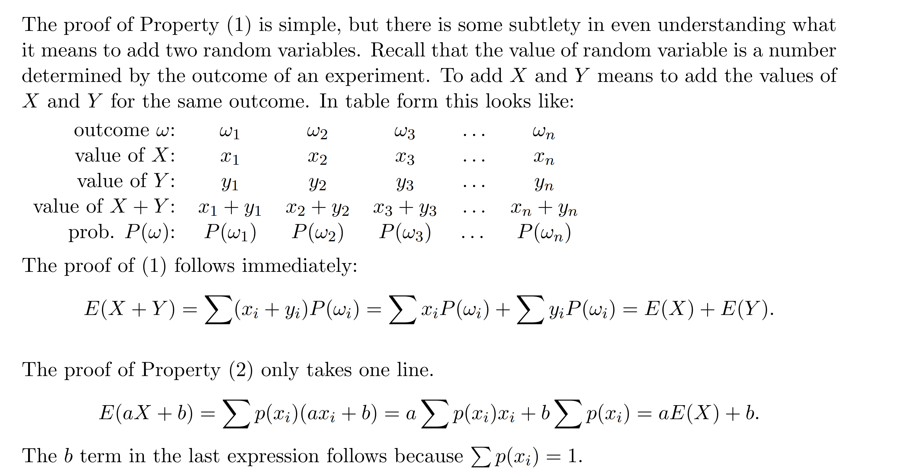
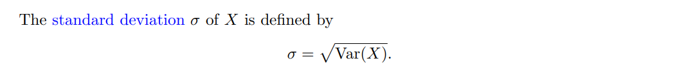
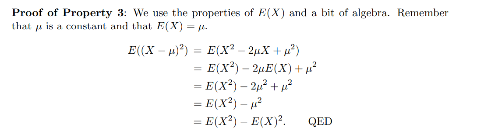

# 1 期望**⭐⭐⭐⭐⭐**
[Discrete Random Variables, Expected Value.pdf](https://www.yuque.com/attachments/yuque/0/2022/pdf/12393765/1662387021985-49016cac-ed51-4bdf-a1df-75e3e7c2a3ee.pdf)
## 1.1 标准定义
> 
> 更一般的:
> 
> 下面我们通过两个例子来说明这个定义是怎么来的。

## 1.2 标准定义的由来
### 1.2.1 骰子平均点数
> 假设我们有一个骰子，有$5$面是$3$, $1$面是$6$, 那么掷骰子$6000$次，掷得的平均点数是多少?

> 我们很容易想到可以把每次掷得的点数相加然后除以$6000$, 得到$\frac{5000\cdot 3+1000\cdot 6}{6000}=\frac{5}{6}\cdot 3+\frac{1}{6}\cdot 6=3.5$, 我们称之为`Expected Average`, 意味着我们预期点数$3$和点数$6$会按照一定的统计频率分布，比如这个例子中点数$3$出现的频率会趋近于$\frac{5}{6}$, 点数$6$的频率会趋近于$\frac{1}{6}$, 所以在做了大量的统计实验之后最终的平均点数会趋近于$3.5$。

### 1.2.2 骰子平均收益
> 假设现在我们掷两枚正常的六面骰子, 如果两次掷得的点数之和为$2$, 则赢得$1000$元，否则输掉$100$元。你预期能够收益多少(输的钱算负收益)?

> 假设我们进行$N$次实验，则其中平均会有$\frac{N}{36}$次掷得的点数之和是$2$（因为点数之和为$2$只能是两次掷得的点数均为$1$才行）, 有$\frac{35}{36}N$次掷得的点数之和不是$2$, 所以我们**玩一次这个游戏**的期望收益是$\frac{\frac{N}{36}\cdot 1000+\frac{35}{36}N\cdot (-100)}{N}=1000\cdot \frac{1}{36}-100\cdot \frac{35}{36}=-69.44$

:::warning
所以你会愿意多次玩这个游戏吗? 不会吧，毕竟玩一次游戏的期望收益是负的。
:::

### 1.2.3 Bernoulli分布的期望
> 

:::success

:::
> 例`4`中我们计算了`Bernoulli`分布的期望值, 是$p$

### 总结
> 通过以上两个例子，我们得出期望的定义:
> 假设$X$是一个离散的随机变量，值域为$\{x_1,x_2,...,x_n\}$, 概率为$\{p(x_1),p(x_2),...,p(x_n)\}$, 的$X$的`Expected Value`（$E(X)$）被定义为:
> $E(X)=\sum_{j=1}^n p(x_j)x_j=p(x_1)x_1+p(x_2)x_2+...+p(x_n)x_n$
> **注意点:**
> - 期望值$E(X)$也称$X$的`Mean`或者`Average`，用$\mu$表示
> - 期望值是对一个随机变量$X$所有可能的取值做一个加权平均。
> - 期望值是一个`Summary Statistic`, 描述了一个随机变量$X$的包括：`Location`或者`Central Tendency`的信息
> - 如果随机变量$X$的所有取值都是等可能的，那么期望值就是这些取值的平均数。

## 1.3 与质心的联系
> 求期望的过程实际上和质心很类似，我们在多元微分的[一维质心](https://www.yuque.com/alexman/tn6ya7/ge3z2i#AJRWm)中介绍过质心的概念和定义。

> 
> 使用物理学的知识我们知道，质心是: $\bar{x}=\frac{m_1x_1+m_2x_2}{m_1+m_2}=3.5$, 这个公式我们描述$x_1$和$x_2$的加权平均, $x_1$对质心有更多的贡献
> 类比$E(X)$的定义，他是随机变量$X$所有可能取值的加权平均，加权的对象时$X$的所有可能的取值，权重就是$p(x_i)$。我们也可以说期望值就是一个随机变量分布平衡的点。

## 1.4 期望的代数性质**⭐⭐**
### 1.4.1 加法数乘
> $E(X)$是一个线性变换，所以满足加法和数乘封闭性:
> 

### 1.4.2 两个随机变量的和的期望
> 

### 1.4.3 二项分布的期望
> 

**Key**可以发现，我们使用期望的线性性质能够更快计算出结果

## 1.5 期望的代数性质证明与应用
### 1.5.1 代数性质证明**⭐⭐**
> 

**简化证明**> 这种证明是在离散随机变量的框架下, 且离散变量的一个取值对应样本空间中的一个样本:
> 

**Proof(教材中的证明)**
**第一个等式使用的是**`**4.3.1**`**中的公式, 后面的等式使用期望的代数性质完成。**
> 对于$Y=g(X)$, 在已知$X$的概率密度函数$p_x(x)$时， 我们可以计算$Y$的$p_Y(y)$, 公式为: $p_Y(y)=\sum_{\{x|g(x)=y\}}p_X(x)$

### 1.5.2 几何分布的期望
> 假设随机变量$X$服从几何分布$X\sim geo(p)$, 则$X$的取值有$k=0,1,2,...$, 概率函数$p_X(X=k)=(1-p)^kp$, 求$E(X)$

:::info
我们根据定义写出期望表达式: $E(X)=\sum_{k=0}^\infty k (1-p)^kp$
然后就是利用**几何级数的性质**和**级数求导**的性质:

:::

### 1.5.3 抛硬币
:::info

:::

### 1.5.4 投篮
:::info

注意这里`head`和`tail`的含义不能搞反，这个例子中`head`表示没投中，`tail`表示投中了
:::

## 1.6 风险厌恶(经济学)**⭐⭐**
> 
> $(a)$的期望: $0.1\cdot 95+0.9\cdot (-5)=5$
> $(b)$的期望(算上`Cost`): $0.1\cdot 100+0.9\cdot 0-5=5$
> `Bias`/`Cost versus loss`。这两种情况的期望收益是相同的: 都是获得$5$美元。在一项研究中，将这个问题抛给$132$名本科生(按不同顺序), 之间用其他的无关问题隔开。$55$位学生给出了自己的意见，其中$42$位拒绝$(a)$而更倾向于$(b)$一种解释是我们更愿意为了不确定的风险花钱`cost`来抵消风险。
> 损失厌恶`Loss Aversion`和`Cost vs Loss`维系着保险行业:人们支付的保险费比他们平均得到的保险金要多(否则这个行业是不可持续的)，但他们还是买了保险保护自己免受重大损失。人们愿意支付$1$美元成本保护自己免受在某一年中损失$100$美元的风险(概率是千分之一)。通过购买保险，你的资产一年后的收益期望值(忽略其他收入和支出)会在$-0.1$美元到$- 1$美元之间变动。但是如果没有保险**可能**会损失$100$美元，有保险的话我们**一定**只会损失$1$美元。

## 1.7 Derangement问题**⭐⭐**
> 

**Key**看到`Number of people`, 我们就要反应出可以使用多个随机变量加和构建目标随机变量的方法。

## 1.8 随机变量的函数的期望值
### 1.8.1 定义与证明**⭐⭐⭐⭐**
> 
> 这个性质让我们在求$h(X)$的时候不需要知道$Y=h(X)$的具体概率分布是什么，而只要知道$X$的分布和$Y$与$X$的映射关系即可。

**Proof**我们**从随机变量的函数角度出发证明**，参考`**Textbook**`的$84-85$页的证明

**关于最后一个等式为什么成立:**
因为等式两边说的是同一个意思。$\sum_{y}\sum_{\{x|g(x)=y\}}g(x)p_X(x)$就是对于每一个$y$求出所有满足$g(x)=y$的$x$的期望值, 然后对所有$y$都求一批$x$的期望；这其实就等同于说我在求所有满足$g(x)=y_j,j=1,2,...,n$的 $x$的期望值。

### 1.8.2 算例
#### 算例1 掷一枚骰子
> 
> 

#### 算例2 掷两枚骰子(R 语言)
> 

**Key**

### 1.8.3 易错点
> 
> 只有当$Y$是$X$的线性函数时，$E(Y)=h(E(X))$才成立。如果$Y=X^2-6X+1$, 不是线性函数的情况, $E(Y)\neq h(E(X))$, 如果$Y$是凸函数，则$E(Y)<h(E(X))$; 反之$E(Y)>h(E(X))$。

# 2 条件期望**⭐⭐⭐⭐**
## 2.1 定义
> 

**算例**
> 求$p_{X|A}(x)$和$E(X|A)$

$p_{X|A}(x)=\begin{cases}\frac{1}{3},x=2,3,4\\0,otherwise \end{cases}$
$E(X|A)=\frac{1}{3}(2+3+4)=3$

## 2.2 条件全概率公式
> 

**推导**
也就是在每个新的，互不相容的样本空间$A_i$中求期望，然后加权平均。
对于$p_X(x)=P(A_1)p_{X|A_1}(x)+\cdots +P(A_n)p_{X|A_n}(x)$
我们在等式两边作如下变化:
$\sum_x xp_X(x)=\sum_x P(A_1)xp_{X|A_1}(x)+\cdots +P(A_n)xp_{X|A_n}(x)\newline=P(A_1)E(X|A_1)+\cdots +P(A_n)E(X|A_n)$，证毕。

# 3 方差**⭐⭐⭐⭐**
[Variance of Discrete Random Variables.pdf](https://www.yuque.com/attachments/yuque/0/2022/pdf/12393765/1662387021993-0eba3541-9a08-404b-ae6b-f6c964f00fba.pdf)
>  本小节我们将介绍`Variance`的概念以及其由来

## 3.1 Spread
> 

## 3.2 方差和标准差
> 如果说均值是概率密度函数的中心，那么方差就是反映数据的离散程度
> 

### 3.2.1 定义**⭐⭐**
> 
> 可以将$X-E(X)$看做一个新的随机变量,
> 则有$E(X-E(X))=E(X)-E(X)=0$(`By Linearity`), 所以$X-E(X)$的期望不能给我们任何有价值的信息，于是我们转而求$(X-E(X))^2$的期望，$E((X-E(X))^2)$就是我们的$Var(X)$
> 

### 3.2.2 解读
> 首先看到方差的公式，$Var(X)=E((X-E(X))^2)$, 如果我们将$(X-E(X))^2$看做是一个新的随机变量$Y$，则我们实际上实在求$Y$的期望，也就是在求$X-E(X)$的其平方的期望，也就是`weighted average of the sqaured distance from the mean`, 平方的目的是为了防止我们在求期望的过程中正负项被约去，导致方差没有任何信息。现在假设$X$是离散随机变量，取值为$\{x_1,x_2,...,x_n\}$，则我们有:
> $Var(X)=E((X-E(X))^2)=\sum_{i=1}^np_X(x_i)(x_i-E(X))^2$
> 

## 3.3 一些例子
> 下面的例子中假设$\mu=E(X)$。后面我们会介绍$\mu$其实是一个无偏估计量。

### 例1 计算均值方差标准差
> 

**Key**

### 例2 计算均值方差
> 
> 

**Key**

## 3.4 常见离散变量的方差
### 3.4.1 伯努利分布的方差
> 

**Proof**
**思考题**
其实$q=\frac{1}{2}$的时候方差最大
[Mathlet](https://mathlets.org/mathlets/probability-distributions/)

### 3.4.2 二项分布的方差
> 
> 由方差性质$1$推得, 详见`6.6.1`

### 3.4.3 其他离散随机变量
> 

## 3.5 离散变量独立性
> 

## 3.6 方差的性质与证明**⭐⭐**
### 3.6.1 性质与证明**⭐⭐⭐⭐**
#### 性质一
> 

#### 性质二
> 

**Proof**

#### 性质三
> 

**Proof**

### 3.6.2 算例
#### 算例1
> 

**Key**

#### 算例2
> 

**Key**

#### 算例3
> 

**Key**

# 4 均值方差性质总结表**⭐⭐⭐⭐**
> 

