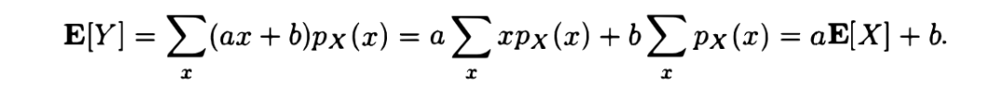
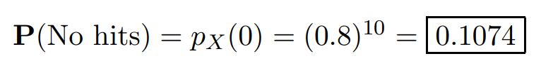
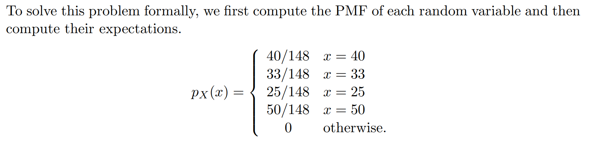
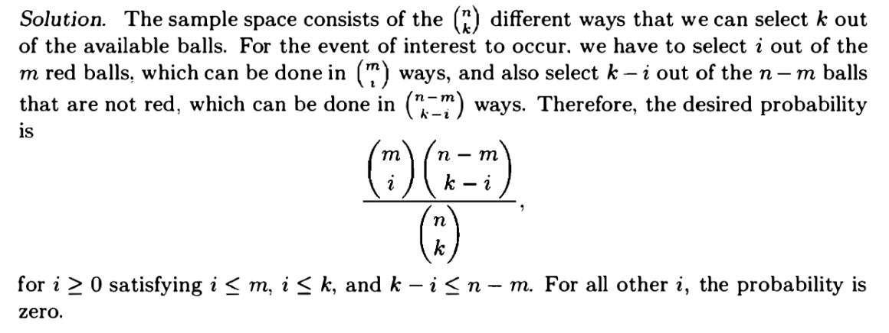
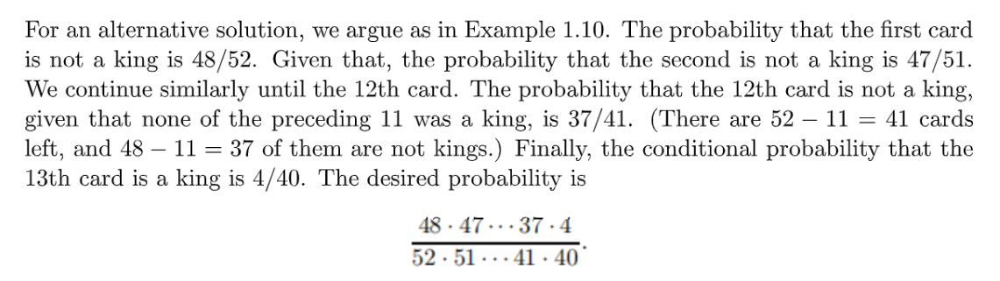
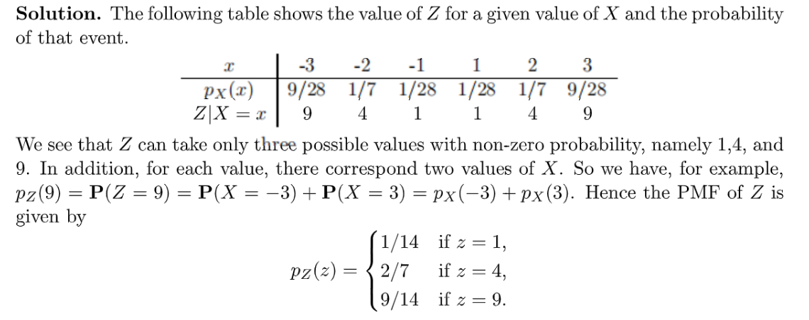
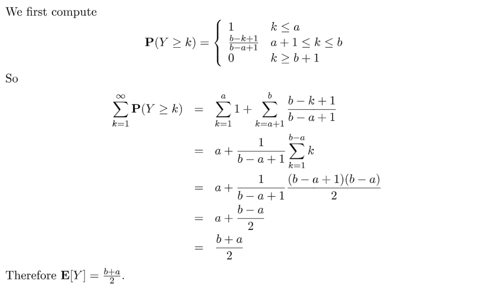

> 这些练习来自`MIT 6.041SC/6.431`课程:[https://ocw.mit.edu/courses/6-041sc-probabilistic-systems-analysis-and-applied-probability-fall-2013/pages/unit-i/lecture-5/](https://ocw.mit.edu/courses/6-041sc-probabilistic-systems-analysis-and-applied-probability-fall-2013/pages/unit-i/lecture-5/)
> 非常值得练习，里面包含了一些书上和讲座中没有提到的一些经典概率模型。

# 1 Recitation Problems
[Recitation 4.pdf](https://www.yuque.com/attachments/yuque/0/2022/pdf/12393765/1661229580605-bb583835-e955-487b-944c-2c4b63f22b4e.pdf)
[Recitation 4 Solutions.pdf](https://www.yuque.com/attachments/yuque/0/2022/pdf/12393765/1661229580598-70e8ce8d-b2c2-452a-b67a-51664d1f27ad.pdf)
[Recitation 5 Problems.pdf](https://www.yuque.com/attachments/yuque/0/2022/pdf/12393765/1660894837978-106ab380-c334-48eb-9c37-9c164e02b8cf.pdf)
[Recitation 5 Problems Solutions.pdf](https://www.yuque.com/attachments/yuque/0/2022/pdf/12393765/1660894837960-733fc2b1-82a0-4ae5-a8e5-7f4cb079fe4a.pdf)

## P1 推导期望方差性质**⭐⭐**
> 

**(a)**
**(b)**

**(c)**

## P2 射击打靶
> 

**(a)**

**(b)**
**(c)**
**(d)**
**(e)**
**(f)**

## P3 MIT 求职者**⭐⭐⭐⭐⭐**
> 

**(a)**随机选择学生的话，公交车上人越多越容易被选中，也就是我们在计算$E(X)$的时候， $X$的值越大，对应的$X$的权重$p_X(x)$就会越大。
假设四辆公交车$A,B,C,D$, 上面的人数分别是$40,33,25,50$, 则假设我们随机选中的人在$D$上，则$X=50$的权重是$p_X(x)=\frac{50}{148}$, 这样会导致我们的期望比$E(Y)$大，因为$Y$的每一种取值的权重都是$\frac{1}{4}$, 不存在哪一个更容易被选中。
**(b)**

## P4 匹兹堡悖论**⭐⭐⭐⭐**
> 

**Key**

这说明人都是风险厌恶的，很多时候人们不会仅仅依赖于`Expected Gain`来决定是否参加一个赌局。
**Supplementary Materials**

## P5 生日问题**⭐⭐⭐**
> 
> 关于这个问题的深入探讨: [生日问题竟等同于抛硬币?](https://www.yuque.com/alexman/kziggo/xvmwt3#fvCsD), 并提供了`R`语言的统计视角模拟实现

**Key**
**图示**

## P6 棋盘摆车
> 
> `Rook`是国际象棋中的"车"， 假设棋盘大小为$8\times 8$

**Key**

## P7 超几何分布**⭐⭐⭐**
> 

**Key**

## P8 多项分布系数**⭐⭐**
> 

**Key**就是先按照排列问题来看，然后每一组除以排列的总数

## P9 多项分布概率**⭐⭐**
> 

**Key**

## 

# 2 Tutorials
[Tutorial 2 Problems.pdf](https://www.yuque.com/attachments/yuque/0/2022/pdf/12393765/1660895101009-a154a270-d8d9-4b2c-98ba-55ad547276ed.pdf)
[Tutorial 2 Solutions.pdf](https://www.yuque.com/attachments/yuque/0/2022/pdf/12393765/1660895101077-449ba39a-9efd-4549-8e7e-ea5cea620592.pdf)
[Tutorial 3 Problems.pdf](https://www.yuque.com/attachments/yuque/0/2022/pdf/12393765/1660895101062-04a1bc05-d3cc-4561-bf6a-662b1148052d.pdf)
[Tutorial 3 Solutions.pdf](https://www.yuque.com/attachments/yuque/0/2022/pdf/12393765/1660895101501-264c2dbd-1de4-40ba-a6aa-aea105eeec83.pdf)

## P1 扑克牌**⭐⭐⭐⭐⭐**
> 
> 这是经典的扑克牌问题的简化版本，可以参考:[n-pair问题](https://www.yuque.com/alexman/kziggo/fa1dd9#PhdCQ)或者[第n张牌问题](https://www.yuque.com/alexman/kziggo/ci9rgz#mRpxC)

**(a)⭐⭐**
**(b)⭐⭐⭐****我们提供两种解法:**

1. **组合视角**

组合视角不关心抽牌的顺序，将"抽$13$张牌"视为组合问题。

2. **乘法法则（更容易理解）**

乘法法则实际上是将抽$13$张牌视作一系列条件概率的乘积。是分步做完抽$13$张牌这一行为的。

**总结**对于$(a)$问，我们从样本空间的视角去理解会更容易，因为我们在说"第$13$张牌是`king`"的时候我们其实是不知道前$12$张牌的任何信息的，况且任何牌都有可能成为第$13$张牌，所以用条件概率的思维不会得到任何可靠的结论。
对于$(b)$问，**如果我们从组合视角去考虑问题**，就不能使用"我一张一张抽牌"的思维，而是忽略实际抽牌的顺序，从结果出发。比如本题中说的"第$13$张牌是`King`", 由于我们不考虑顺序，也就应该避免从条件概率的乘积法则出发。所以最终将问题转化为"$13$张牌中只有一张是`King`, 而且这个`King`只能是$13$张牌中的最后一张"

## P2 衍生随机变量**⭐⭐⭐**
> 

**(a)**根据离散随机变量的概率函数的性质: [离散变量概率函数性质](https://www.yuque.com/alexman/kziggo/fxeosd#zDXyT)
我们有$\sum_{\{x|x\in \{-3,-2,-1,1,2,3\}\}}\frac{x^2}{a}=1$, 所以$\frac{28}{a}=1$, 所以$a=28$
**(b)**根据[离散衍生随机变量公式](https://www.yuque.com/alexman/kziggo/dqmnqy#VelcT)，我们有$p_Z(z)=\sum_{\{x|g(x)=z\}}p_X(x)$。然后我们探究$Z$这个离散随机变量的所有可能取值，$Z$的所有取值是$Z\in \{1,4,9\}$。所以

## P3 分班**⭐⭐**
> 

本题有很多解法，这里介绍三种
**解法一**问题等价于我们要从$A,B,C$三个班级中的某一个班级中选出`Joe`和`Jane`, 所以我们可以分两步:
`Action 1`: 先选择三个班级中的任意一个, 有$(_1^3)=3$种选法。
`Action 2`: 从这个班级里选出`Joe`和`Jane`, 有$(_2^{30})$种选法。
所以最终结果是$\frac{(_1^3)\cdot (_2^{30})}{(_2^{90})}=\frac{29}{89}$
**解法二**这种解法使用条件概率的视角: 假设`Joe`已经完成班级选择了，那么`Jane`和`Joe`同班的概率就是$\frac{29}{89}$, 因为`Jane`只能选择和`Joe`同班。
**解法三（较难理解）**问题等价于我们的每一个班级同时包含`Joe`和`Jane`的组合方式有几种，然后因为有三个班级，所以概率要乘以$3$

## P4 抽牌
> 

**Key**

## P5 期望和方差
> 

**Key**

# 3 Assignment
[Assignment 3.pdf](https://www.yuque.com/attachments/yuque/0/2022/pdf/12393765/1660895100922-ecbc7041-5d18-484c-83ad-16b8f7841441.pdf)
[Assignment 3 Solutions.pdf](https://www.yuque.com/attachments/yuque/0/2022/pdf/12393765/1660895100942-600586a9-40cd-418a-a9fa-7a07c4d47df9.pdf)

## P1 Derangement**⭐⭐⭐**
> 

**(a) Derangement 1**这个问题的本质是一个`Derangement`问题，详见[重排问题](https://www.yuque.com/alexman/kziggo/dqmnqy#jazOH)
我们提供两种思路:

1. **排列（样本空间在求解过程中固定）**

重排问题的本质就是排列，题中说的所有人拿回了自己的帽子，说的就是我把帽子重排之后得到的排序序列和原来一样的概率。这种排列方式有且仅有一种， 而总共有$n!$中排列方式，所以答案是$\frac{1}{n!}$

2. **随机变量 (样本空间在求解过程中变化)**

假设$n$个人，每个人都有各自的编号，用$1,2,3...n$表示, 令$X_i\sim Bernoulli(\frac{1}{n})$表示重排后第$i$个人拿到了帽子，且$X_i=\begin{cases}1,如果拿到的是自己的帽子\\0,otherwise \end{cases}$, $P(X_1)=\frac{1}{n}$。 所以问题转化为一个条件概率的乘法法则：$P(\cap_{i=1}^{n}(X_i=1))=P(X_1=1)P(X_2=1|X_1=1)P(X_3=1|X_2=1,X_1=1)...P(X_n=1|X_1=1,...,X_{n-1}=1)=\frac{1}{n!}$
**(b) Derangement 2**
1. **排列**

2. **随机变量**

使用在$(a)$问中的第二种思路，问题转化为$P(\cap_{i=1}^m(X_i=1))$
$P(\cap_{i=1}^m(X_i=1))=\frac{1}{n(n-1)...(n-m)}=\frac{1}{\frac{n!}{(n-m)!}}=\frac{(n-m)!}{n!}$
**(c)  Derangement 3⭐⭐⭐**本题说法比较绕，本质上说的是前$m$个人拿到的$m$个帽子被限制为最后$m$个人的帽子，所以前$m$个人的帽子的排列只有$m!$种，剩下$n-m$个人拿到的$n-m$个帽子的排列没有限制，于是有$(n-m)!$种，总共有$n!$种排列方式，所以答案是$\frac{m!(n-m)!}{n!}$
**(d)**本题中的没有问任何有关于排列的问题(没有问谁拿到了谁的帽子)，而只是问拿到干净的帽子的概率是多少。同时由于帽子变脏事件彼此之间是独立的，所以**答案是**$(1-p)^m$**, **你可能会想，那么剩下的$n-m$个人他们的帽子的状况需要考虑吗，其实不用。
**如果我们假设:**

- 事件$A$：前$m$个人拿到的都是干净的帽子
- 事件$B_i$：后$n-m$个人拿到的帽子的第$i$种状况
- 事件$A$和$B_i$独立

$P(A)=\sum_{i=1}^mP(A\cap B_i)=\sum_{i=1}^mP(A|B_i)P(B_i)=\sum_{i=1}^mP(A)P(B_i)$, 也就是说如果你考虑了后$n-m$个人拿到的干净函数肮脏的帽子实际上也就是在用全概率公式求出了$P(A)$, 所以不用那么麻烦。
**(e) 二项分布**

## P2 抽卡
> 

**Key**

## P3 随机变量**⭐⭐⭐⭐⭐**
:::info
本题给出了一个重要结论: 对于一个随机变量$X\in \mathbb{Z^+}$, 我们有$E(X)=\sum_{k=1}^\infty P(X\geq k)$
:::
> 

**(a) 交换求和顺序⭐⭐⭐**我们知道$\sum_{k=1}^\infty P(X\geq k)=\sum_{k=1}^\infty \sum_{i=k}^\infty p_X(i)$
然后我们要交换这个二重求和符号的顺序，其实就和我们在推导二重积分的积分区域如何表示的思想是共通的，这也是动态规划的核心思想之一，详见[迭代积分](https://www.yuque.com/alexman/tn6ya7/ge3z2i#UAgj1)，如下图所示:

所以为了使得求和的区域相同，我们有$\sum_{k=1}^\infty \sum_{i=k}^\infty p_X(i)=\sum_{i=1}^\infty \sum_{k=1}^ip_X(i)$
最后我们化简$\sum_{i=1}^\infty \sum_{k=1}^ip_X(i)=\sum_{i=1}^\infty i\cdot p_X(i)=E(X)$, 证毕。
**(b) 均匀分布⭐⭐⭐⭐⭐**我们可以发现，$Y$其实是定义在$[a,b]$上的离散均匀分布, 所以：

## P4 期望方差**⭐**
> 

**(a)**

**(b)**

## P5 组合的意义**⭐⭐⭐⭐**
> 

**Key**

## P6 插板法**⭐⭐⭐⭐⭐**
:::info

**使用这个方法可以求一个线性方程(组)的非负整数解的个数**
:::
**思想**

## P7 插板法的运用**⭐⭐⭐⭐**
> 

**Key**
