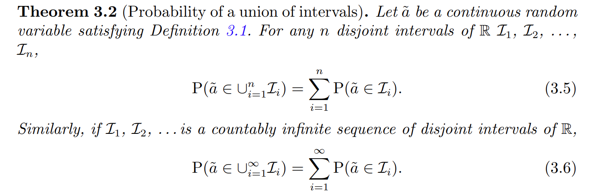
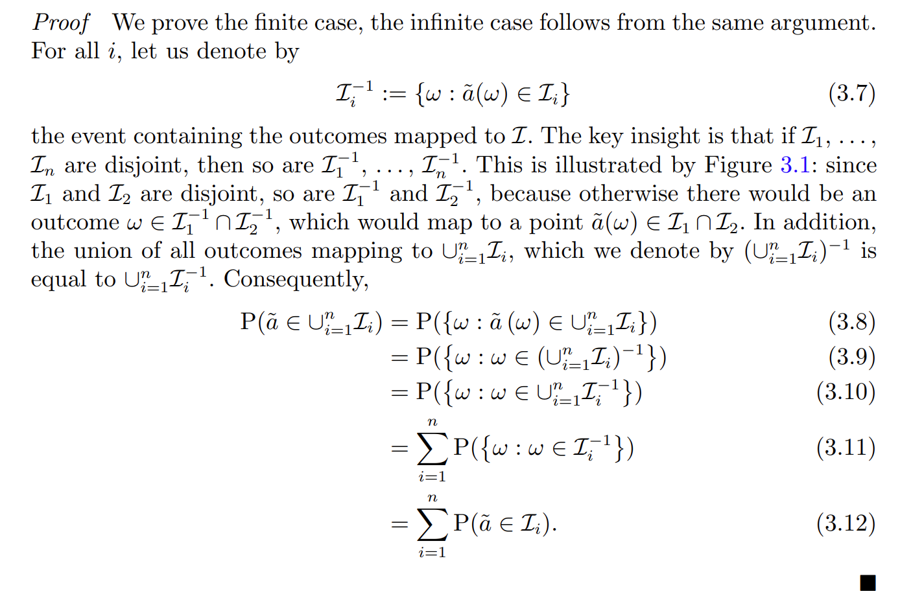
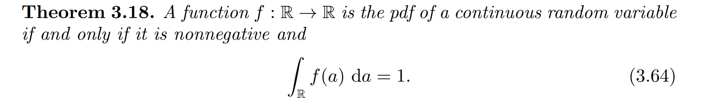
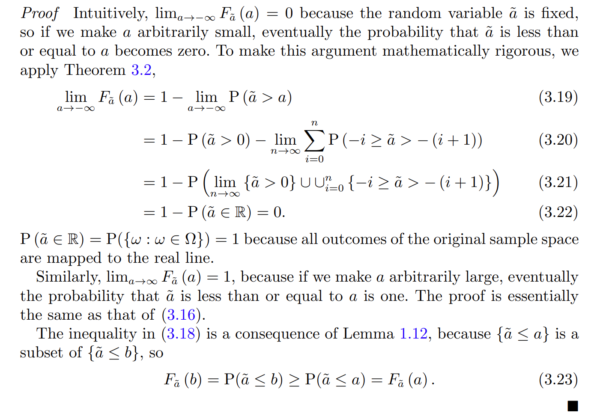
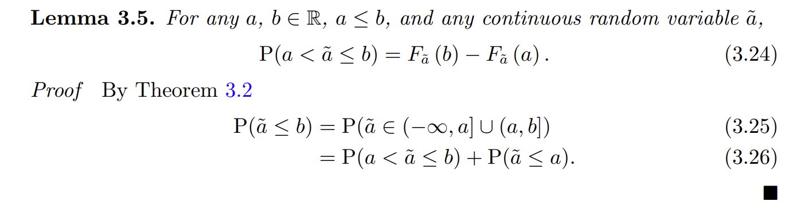
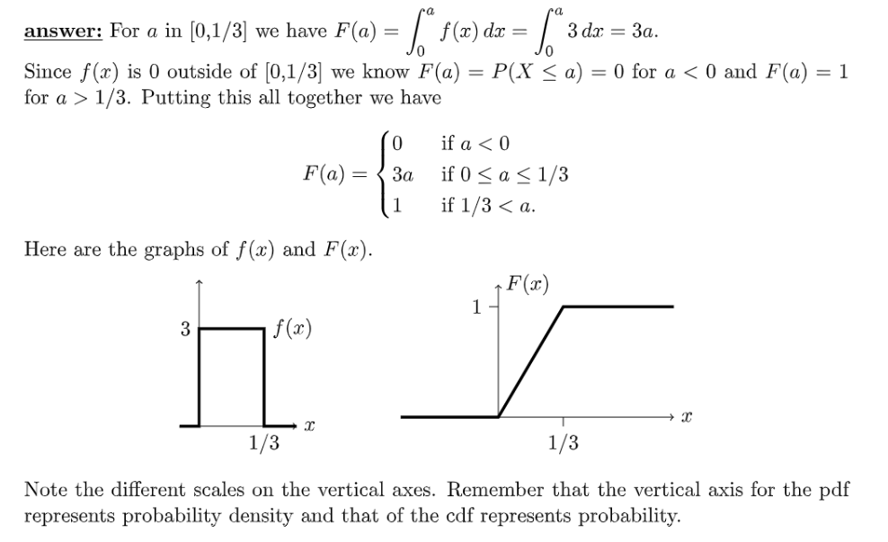

[L08 Slides.pdf](https://www.yuque.com/attachments/yuque/0/2022/pdf/12393765/1661427411021-6595e5e5-4f4e-4f02-8161-2b5316215756.pdf)
[Class Slides, Continuous Random Variables.pdf](https://www.yuque.com/attachments/yuque/0/2022/pdf/12393765/1662645223709-193102dc-5a39-4608-92b7-70b62b7ce6c6.pdf)

# 1 连续型随机变量
[Continuous Random Variables.pdf](https://www.yuque.com/attachments/yuque/0/2022/pdf/12393765/1659946900828-eb64da14-7c6a-4a90-977b-8de7f7ca41e8.pdf)
## 1.1 Probability of Union of Intervals
> 

**Proof of theorem 3.2**

## 1.2 PDF
### Definition
> 
> **如果我们说**$X$**是定义在**$[c,d]$**上的连续性变量，我们实际上可能暗含了一个条件，就是在**$[c,d]$**以外的**$x$**都满足**$f(x)=0$**, 但这不是必须的。**
> **Definition from CDF:**
> $f_X(x)=\frac{dF_X(x)}{dx}=\frac{F_X(x+dx)-F(x)}{dx}$
> $F_X(x+dx)-F(x)=f(x)dx=P(x<X\leq x+dx)$

> 
> 
> 这两个性质对应了概率公理中对于一个概率函数的三个基本要求, 我们还有一些重要性质：
> 1. $P(x\leq X\leq x+\delta)=\int_x^{x+\delta}f(x)dx\approx f(x)\cdot \delta$, $\delta$很小
> 2. $P(X=a)=P(a\leq X\leq a)=\int_a^a f(x)dx=0$
> 3. $P(X\in B)=\int_{\{x|x\in B\}}f(x)dx$

### PDF和PMF的区别
> 为什么我们对于离散性随机变量和连续性随机变量要用两种不同性质的概率函数来描述?为什么要有`PMF`和`PDF`这两种概率密度函数之分呢? 他们有什么区别呢?
> 其实`Mass`和`Density`都是来自物理学中的概念。
> 1. **我们先来看**`**Mass**`**:**
> 

> 2. **再来看**`**Density**`**:**
> 

> 3. **所以根据上面的分析，我们会有如下的总结：**
> 

> `PDF`函数$f(x)$完全可以取大于$1$的值，但是一定要满足$\int_{-\infty}^\infty f(x)dx=1$, 具体看下面的例子。

### 性质
> 

### 算例
#### 算例1
> 
> 

**Key**

#### 算例2
> 

**Key**

#### 算例3
> 

**Key**

## 1.3 CDF的定义与性质
### CDF定义
> 
> 
> 

### 性质
> 

**Simple Proof **
**Proof of 4 for continuous RV**
**对于**$\lim_{a\to \infty}F_{\tilde{a}}(a)$**我们有如下推导:**
$\begin{aligned}\lim_{a\to \infty}F_{\tilde{a}}(a)&= P(\tilde{a}\leq 0)+\lim_{n\to \infty}P(i<\tilde{a}\leq i+1)\\&=P(\lim_{n\to \infty}\{\tilde{a}\leq0\}\cup \cup_{i=1}^n\{i<\tilde{a}\leq i+1\})\\&=P(\tilde{a}\in \mathbb{R})\\&=1\end{aligned}$
**Proof of 5 - Rigorous**

### 图解
> **对于离散随机变量：**
> `**PMF**`**一般是**`**Piecewise Smooth**`**的**
> 
> **对于连续随机变量：**
> `**PDF**`**一般是**`**Continuous**`**的**
> 

### 算例
#### 算例1
> 
> 

**Key**

#### 算例2
> 
> $P(X<1/2)$不光可以使用积分求解，也可以通过$F(1/2)$直接求解。

**Key**

# 2 连续型变量的期望与方差
## 2.1 连续型变量的期望
> 
> 这个定义就很像我们在多元微分`18.02SC`中学习的[一维连续质点的质心公式](https://www.yuque.com/alexman/tn6ya7/ge3z2i#uUXNO)。

## 2.2 连续型变量的函数的期望
> 

## 2.3 方差
> 

# 3 常见连续随机变量
[Gallery of Continuous Random Variables.pdf](https://www.yuque.com/attachments/yuque/0/2022/pdf/12393765/1659946900745-b46d095b-a3fd-4f2b-a089-b268c6a6b0b4.pdf)
[Expectation, Variance and Standard Deviation for Continuous Random Variables.pdf](https://www.yuque.com/attachments/yuque/0/2022/pdf/12393765/1661697144477-df725636-f37c-4fb8-8600-7651505cf73b.pdf)
## 3.1 连续均匀分布
### 3.1.1 基本性质
> 

### 3.1.2 期望与方差
> 期望: $\frac{a+b}{2}$
> 方差:$\frac{(b-a)^2}{12}$

## 3.2 指数分布
### 3.2.1 基本性质
> 

### 3.2.2 期望
:::info
期望: $\frac{1}{\lambda}$
方差: $\frac{1}{\lambda^2}$
:::

### 3.2.3 无记忆性
> 对应于离散变量中的几何分布，连续型变量中的指数分布变量也具有无记忆性:
> $P(T>x+t|T>t)=P(T>x)$，详见[指数分布无记忆性练习](https://www.yuque.com/alexman/kziggo/iknmdr#JyytR)

## 3.3 高斯分布
### 3.3.1 定义
> 

### 3.3.2 保Normality性质
> 

### 3.3.3 标准高斯分布
> 
> 
> 
> 观察最右侧的图像，我们发现$\sigma$越小，我的数据分布越集中。
> **我们有如下的重要性质（对称性）：**
> 

### 3.3.4 转换成标准高斯分布
> 我们可以将一个高斯分布的变量$X$中心化之后转换成一个$Y=\frac{X-\mu}{\sigma}$(标准高斯分布)，这样我们在求$F_X(x)= P(X\leq x)$的时候就可以先将$X\leq x$转换成$Y=\frac{X-\mu}{\sigma}\leq \frac{x-\mu}{\sigma}=F_Y(\frac{x-\mu}{\sigma})=\Phi(\frac{x-\mu}{\sigma})$之后使用标准高斯分布计算表进行求解。
> 
> 

### 3.3.5 标准高斯分布计算表
> 下面的表示$\Phi(x)$对应的值。比如$\Phi(1.71)=0.9564$
> 

## 3.4 拉普拉斯分布**⭐⭐⭐**
### 3.4.1 定义
> 

### 3.4.2 PDF
> 

### 3.4.3 CDF
> 

### 3.4.4 和高斯分布比较
> 注意到其实拉普拉斯分布的公式和高斯分布很像。s
> 

## 3.5 帕累托分布
> 
> [https://en.wikipedia.org/wiki/Pareto_distribution#Applications](https://en.wikipedia.org/wiki/Pareto_distribution#Applications)

## 3.6 Beta 分布
参考: [https://towardsdatascience.com/beta-distribution-intuition-examples-and-derivation-cf00f4db57af](https://towardsdatascience.com/beta-distribution-intuition-examples-and-derivation-cf00f4db57af)
> 后续数理统计会详细介绍，参考[Beta分布练习](https://www.yuque.com/alexman/kziggo/li402g#LR2kv), 这里暂时不做讲解。
> 

**Bell Shape**
**Straight Lines**
**U Shape**

# 4 Mixed Random Variable
> 假设我投掷一枚非常奇怪的硬币，有$1/2$的概率结果是$1/2$, 有$1/2$的概率结果是$[0,1]$范围上的一个值。
> 
> 对于描述这个硬币抛掷结果的随机变量$X$, 我们有:
> 1. **PMF**
> 
这是一个[Delta Function](https://www.yuque.com/alexman/dydxis/lgbk8g#Pteak)，我们可以写出他的导函数的表达式: $f(x)=\frac{1}{2}+\frac{1}{2}\delta(t-\frac{1}{2})$，这个函数对于$F_X(x)$来说其实是一个`Generalized Derivative`, 因为原函数不连续(有跳跃间断点)。
> 2. **CDF**
> 
由于我们知道$F_{X}(x)$就是$f(x)$的反导数，所以我们实际上可以求出`CDF`这个分段函数的表达式:
> $F_X(x)=\begin{cases} \frac{1}{2}x,0\leq t< \frac{1}{2}\\\frac{3}{4}+\frac{1}{2}x,\frac{1}{2}<t\leq1\\1,t>1 \end{cases}$, 其中在$x=\frac{1}{2}$的时候，函数$F_X(x)$发生突变，向上突变$\frac{1}{2}$。

# 5 Quantiles/Percantiles
[Expectation, Variance and Standard Deviation for Continuous Random Variables.pdf](https://www.yuque.com/attachments/yuque/0/2022/pdf/12393765/1661697144477-df725636-f37c-4fb8-8600-7651505cf73b.pdf)
## 5.1 Quantiles
:::info

:::
**指数分布的中位数**

## 5.2 pth quantile
:::info

:::
**均匀分布的 0.6 quantile**
**标准高斯分布的 0.6 quantile**

## 5.3 Percentiles, deciles, quartiles
:::info

:::
