# 1 Recitation Problems
[Recitation 08.pdf](https://www.yuque.com/attachments/yuque/0/2022/pdf/12393765/1661435991591-1ffd22c2-8ded-4277-924e-6b56c1e83b7b.pdf)
[Recitation 08_sol.pdf](https://www.yuque.com/attachments/yuque/0/2022/pdf/12393765/1661435991596-72d2661e-9fcf-47e8-967d-9aa1ef79fb0e.pdf)

## P1 概率密度函数
> 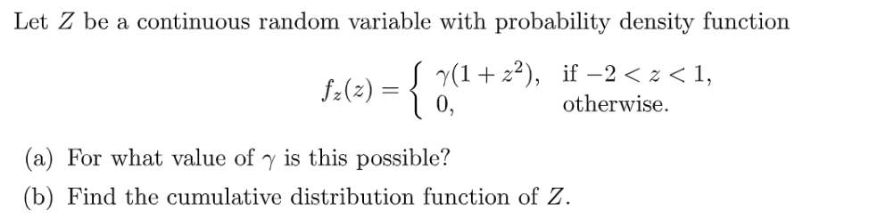

**(a)**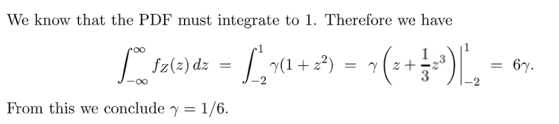
**(b)**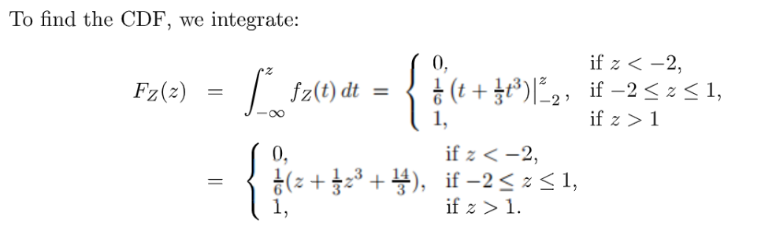

## P2 Mixed Random Variable**⭐⭐⭐⭐⭐**
> 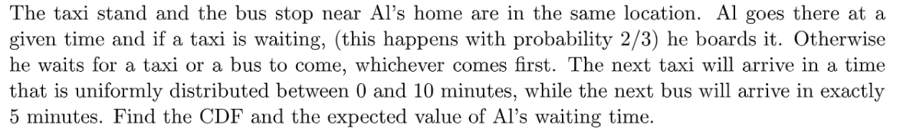
> 这个题目中的随机变量$Z$是一个`Mixed Random Variable`, 我们可以先画出一个概率树:

**概率树**首先有$\frac{2}{3}$的概率，我们不用等就直接有出车，概率是$\frac{1}{3}$
然后如果没有出租车，就分为两种情况，一种是公交车先来，这就说明出租车要再等$5\sim10$分钟内才会来，因为出租车的等待时间$T$是一个在$[0,10]$上的均匀分布，所以我们可以求出$P(T\geq 5)=\frac{5}{10}=\frac{1}{2}$, 于是我们就有了下面的概率树:
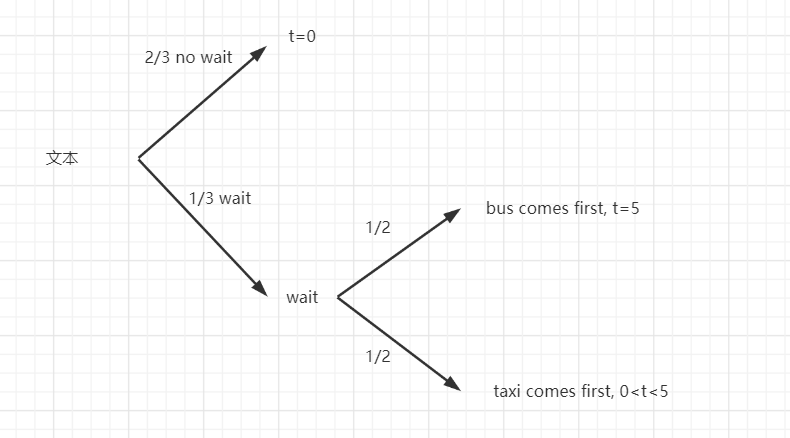
**Key**根据概率树，我们很容易得到$Z$的概率密度函数: $f_Z(z)=\begin{cases}\frac{2}{3},t=0\\\frac{1}{3}\cdot \frac{1}{2},t=5\\\frac{1}{3}\cdot \frac{1}{10},0<t<5 \end{cases}$, 我们也可以将其写成`Generalized Derivative`的形式: $f_Z(z)=\frac{2}{3}\delta(t)+\frac{1}{6}\delta(t-5)+\frac{1}{30}$
所以我们可以画出$f_Z(z)$的图像:
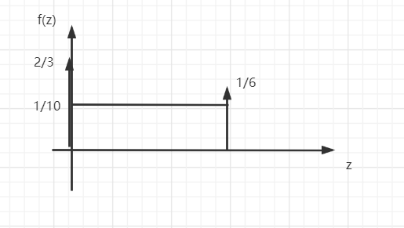
然后我们对$f_Z(z)$求积分得到$F_Z(z)=\begin{cases} 0,t<0\\\frac{2}{3}+\frac{1}{30}t,0\leq t<5\\1,t\geq5\end{cases}$
最后我们可以很快求出期望: $E(Z)=\frac{2}{3}\cdot 0+\frac{1}{6}\cdot 5+\int_{0}^5\frac{1}{30}t\cdot dt=\frac{15}{12}$

## P3 指数分布**⭐⭐⭐⭐⭐**
> 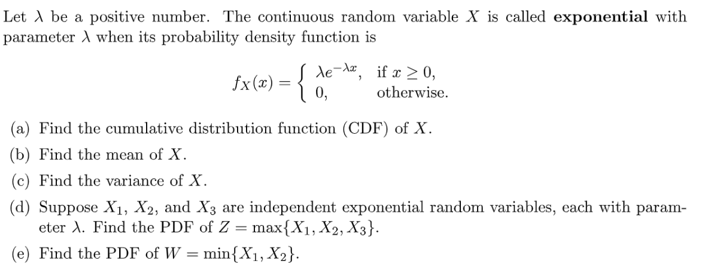

**(a) 计算指数分布的CDF**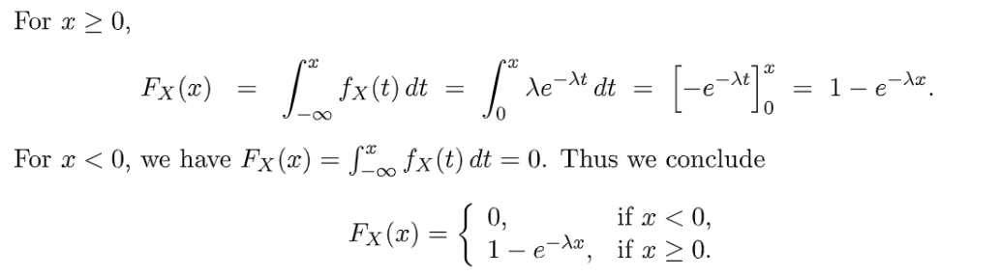
**(b) 计算指数分布的期望⭐⭐**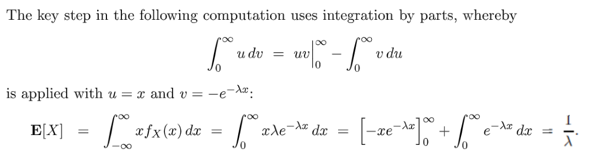
**(c) 计算指数分布的方差⭐⭐**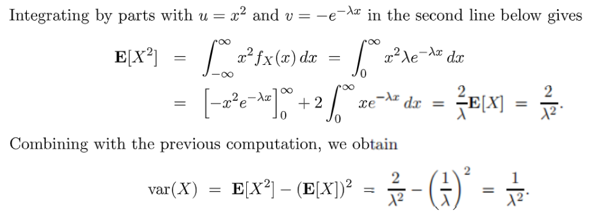
**(d) max⭐⭐⭐⭐⭐**如果发现一个随机变量的构成中有`max`, 一般要想到先求`CDF`，再求`PDF`
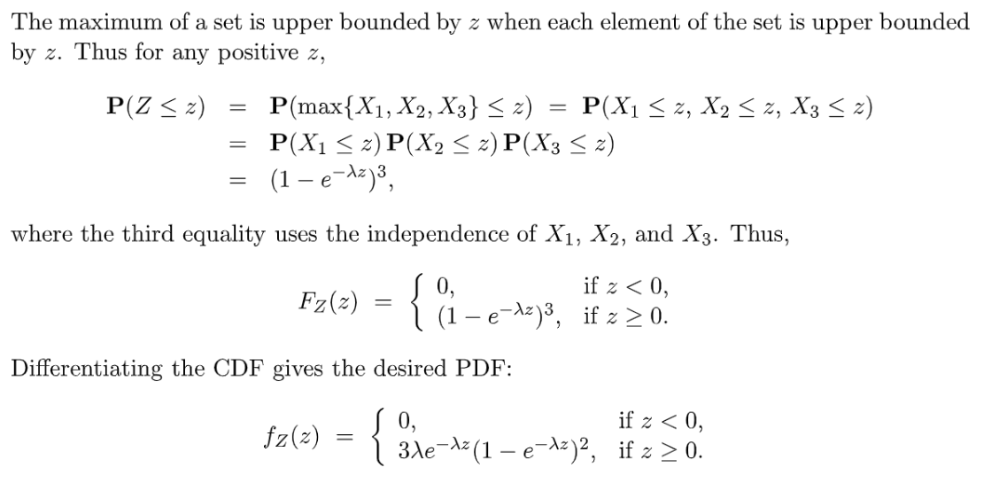
**(e) min⭐⭐⭐⭐⭐**$P(W\leq w)=1-P(W\geq w)=1-P(X_1\geq w,X_2\geq w)\newline =1-(1-P(X_1\leq w))(1-P(X_2\leq w))\newline=1-(1-F_{X_1}(x))(1-F_{X_2}(x))\newline=1-( e^{-\lambda x})^2$，所以：
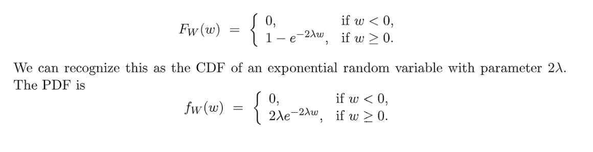

# 2 Tutorial Problems
[Tutorial 04.pdf](https://www.yuque.com/attachments/yuque/0/2022/pdf/12393765/1661435991600-2b1561ba-620c-409b-86c5-5375bc07540f.pdf)
[Tutorial 04_sol.pdf](https://www.yuque.com/attachments/yuque/0/2022/pdf/12393765/1661435991599-a36f162e-8826-4f49-9841-3946de17bd38.pdf)

## 高斯分布计算表
> 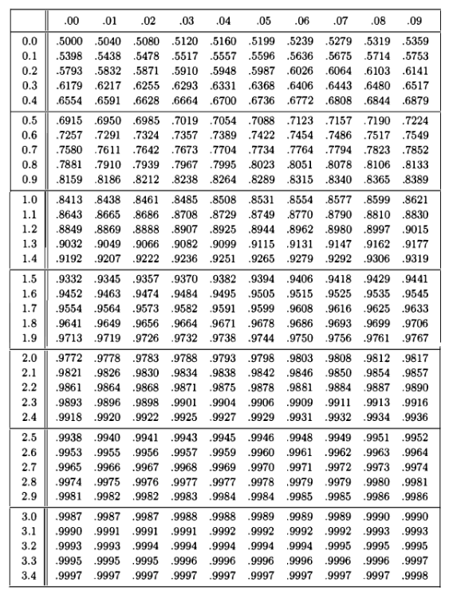

## P1 高斯分布
> 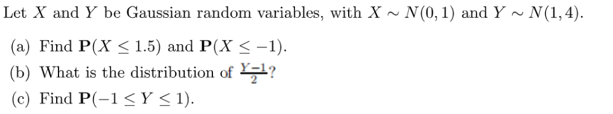

**(a) 对称性**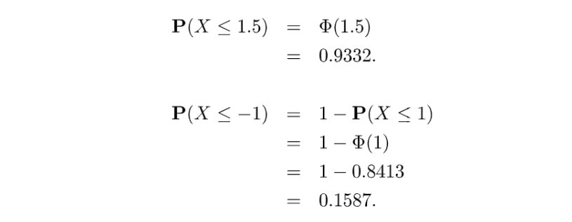
**(b) 高斯分布中心化**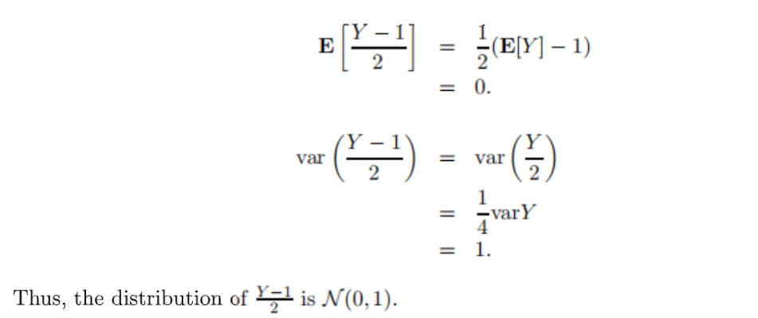
**(c)**

## P2 Circular Uniform PDF**⭐⭐⭐⭐⭐**
:::info
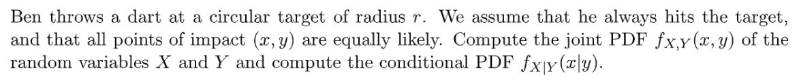
:::
**Key**
1. **首先我们可以很容易得到**$f_{X,Y}(x,y)$

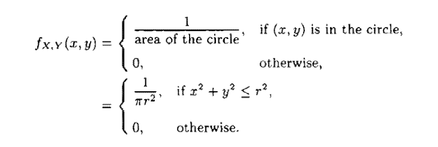

2. **然后我们要求**$f_Y(y)$**, 为了通过**$f_{X|Y}(x|y)=\frac{f_{X,Y}(x,y)}{f_Y(y)}$**得到条件概率表达式:**

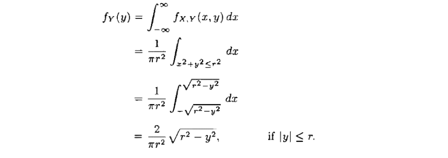
注意这里的积分区域的选取，由于我们在对所有$x$遍历求积分的时候，$y$的值是固定的，所以我们可以把$y$看成是常数。注意到这里的$f_Y(y)$不是一个均匀分布，而是和$y$的值相关的分布函数。同理$f_X(x)$也不是一个均匀分布。

3. **结果很容易得出：**

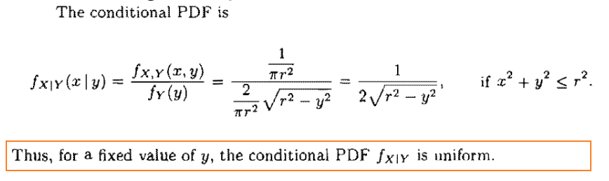
同理$f_{Y|X}(y|x)$也是一个均匀分布。

## P3 指数分布应用**⭐⭐⭐⭐⭐**
> 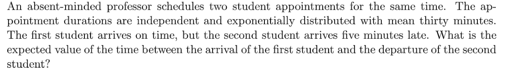
> 题目问的是 **第一个学生到了的时刻和第二个学生开始会议结束的时间差** 的期望

**Key**我们可以假设 **第一个学生到了的时刻和第二个学生开始会议开始的时间差 **是$T$, 假设教授分配会议的时间$M$服从$F_M(m)=1-e^{-\frac{1}{30}m}$我们分情况讨论这个$T$的取值:
如果这个教授给第一个学生的`Appointment`的时间不足$5$分钟，则教授在给第一个学生开完会之后第二个学生还没有到达。此时$T=5$的概率是: $F_M(5)=1-e^{-\frac{1}{6}}$。
如果这个教授给第一个学生的`Appointment`的时间大于$5$分钟，则第二个学生到达的时候第一个学生还没有开完会。则$T\geq 5$, 此时$P(T=t)=\frac{1}{30}e^{-\frac{1}{30}t}$。
所以随机变量$T$的概率函数是：$f_T(t)=\begin{cases} 1-e^{-\frac{1}{6}},t=5\\ \frac{1}{30}e^{-\frac{1}{30}t},t>5\end{cases}$(`Mixed Random Variable`), 于是我们有：$E(T)=5\cdot (1-e^{-\frac{1}{6}})+\int_{5}^\infty \frac{1}{30}t\cdot e^{-\frac{1}{30}t}dt=30e^{-\frac{1}{6}}+5=25.3944518+5=30.3944518$
因为**第二个学生开始会议的时刻和第二个学生结束会议开始的时间差的平均值是**$30$**, **所以最终的结果是$E(T)+30=60.3944518$
