# Gaussian Random Vector
## Definition
> [!def]
> 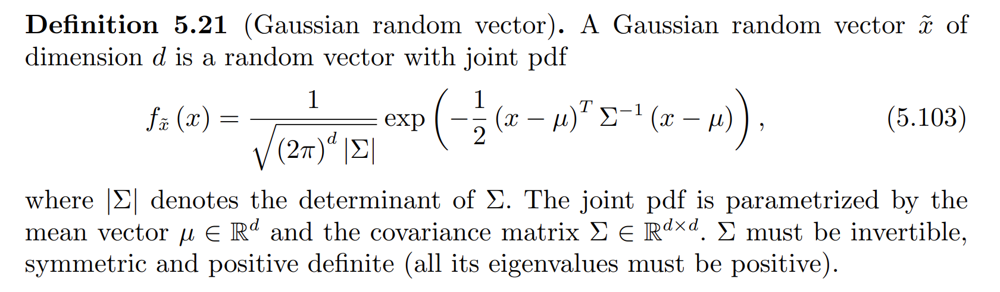

## Marginal and Conditional Distributions of 2D Gaussian
> [!def]
> 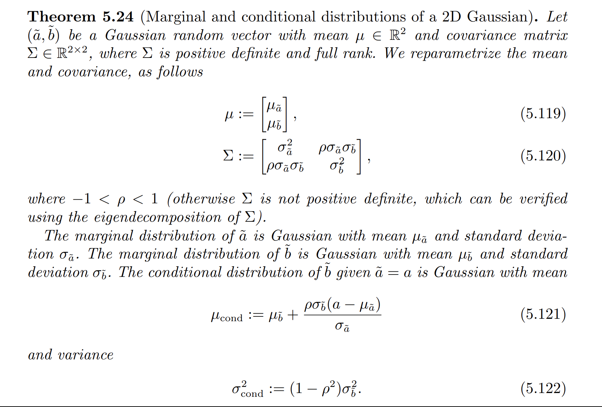

> [!proof]
> 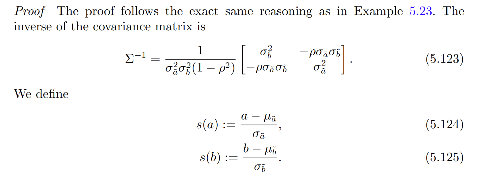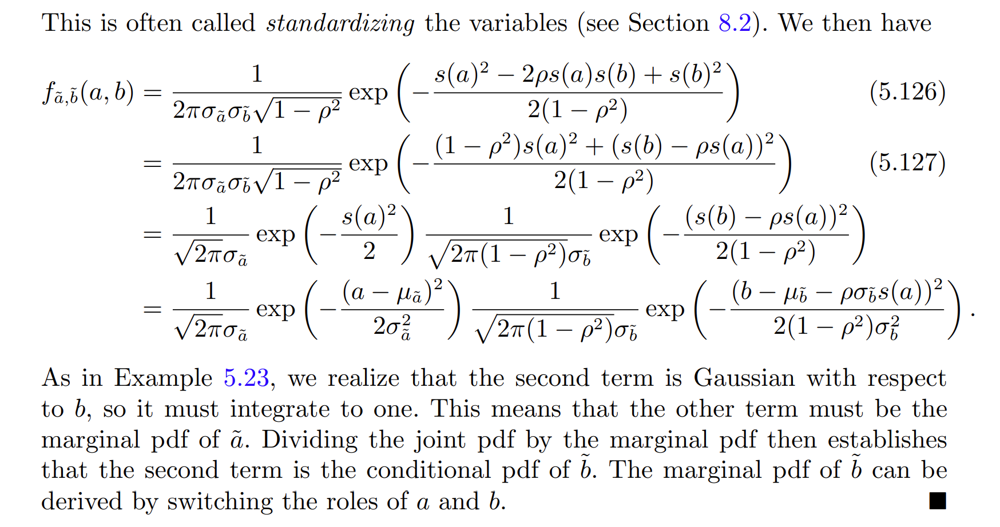

## Generalized Version
> [!important]
> 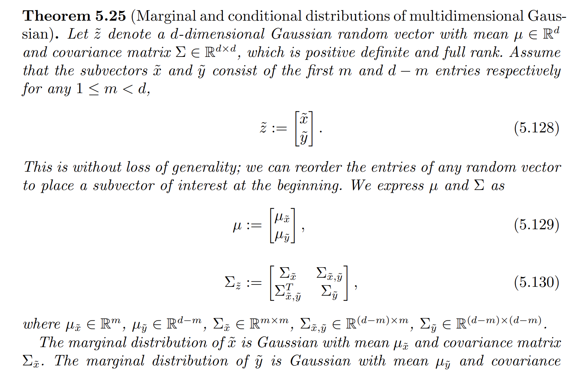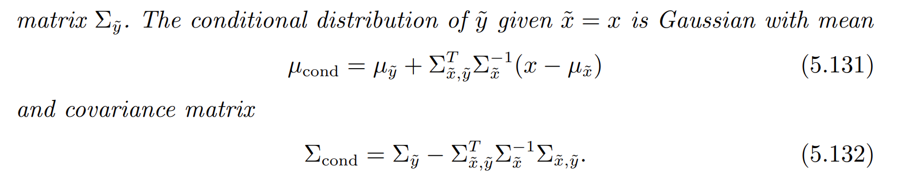

# Max Likelihood Estimation
> [!thm]
> 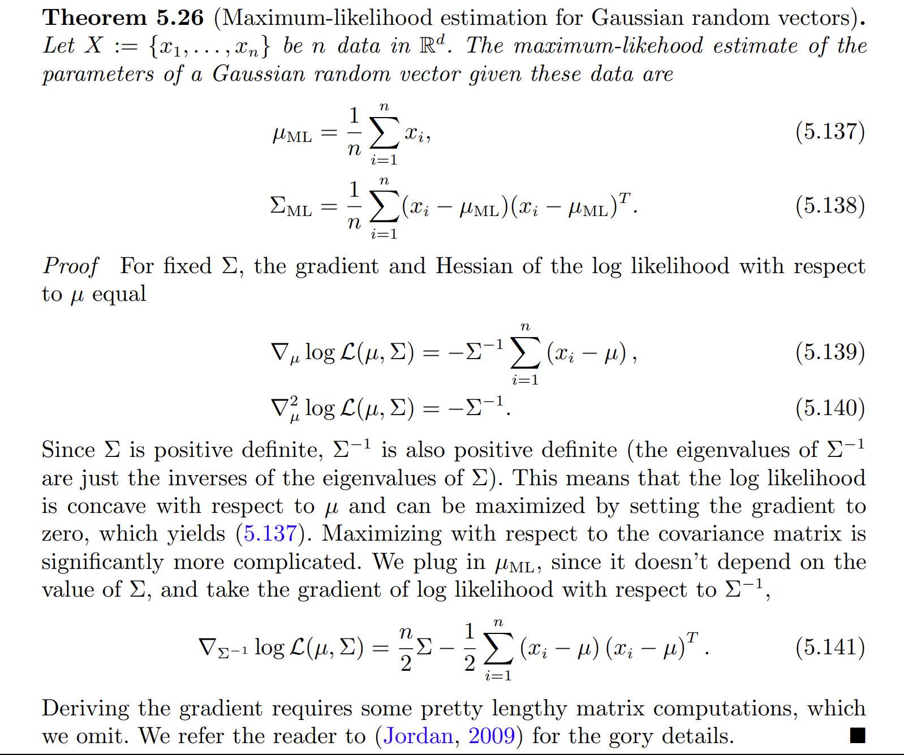

> [!example]
> 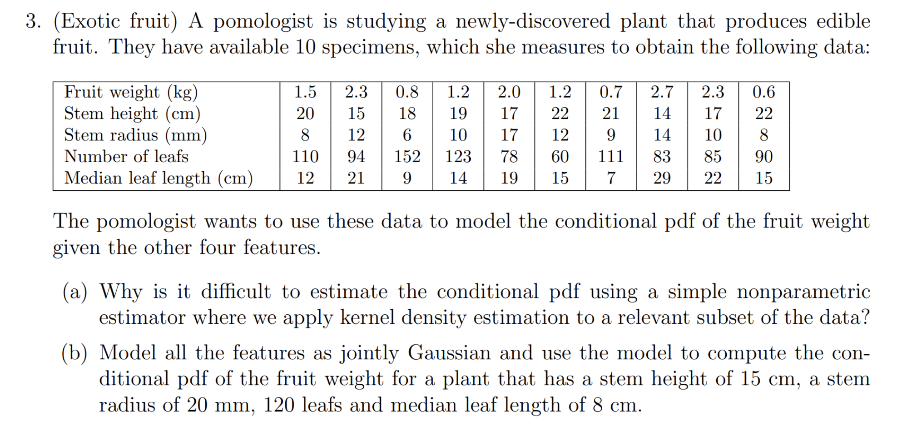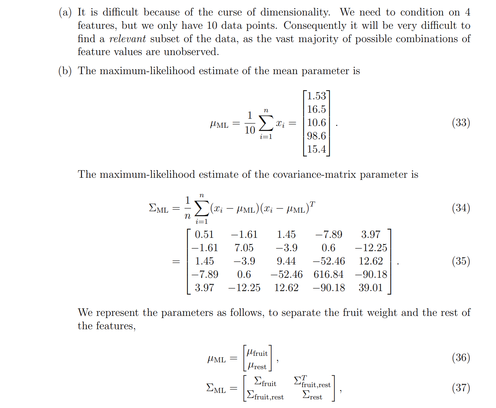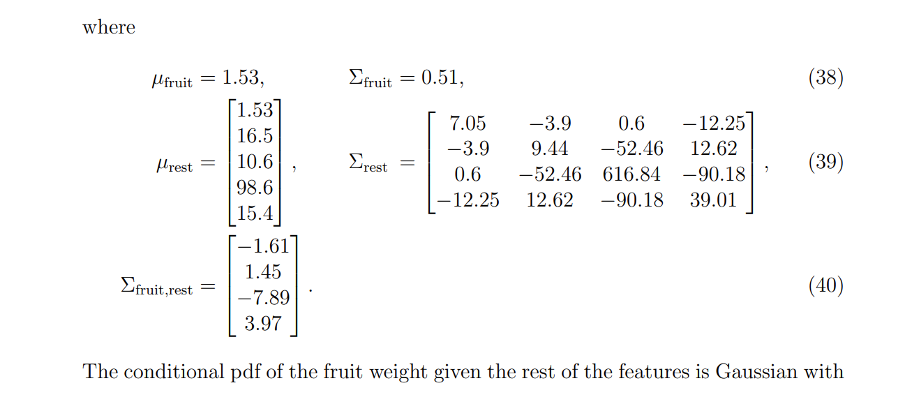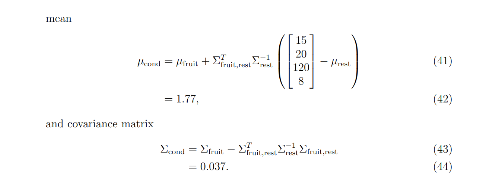

# Gaussian Bayesian Model
> [!example]
> 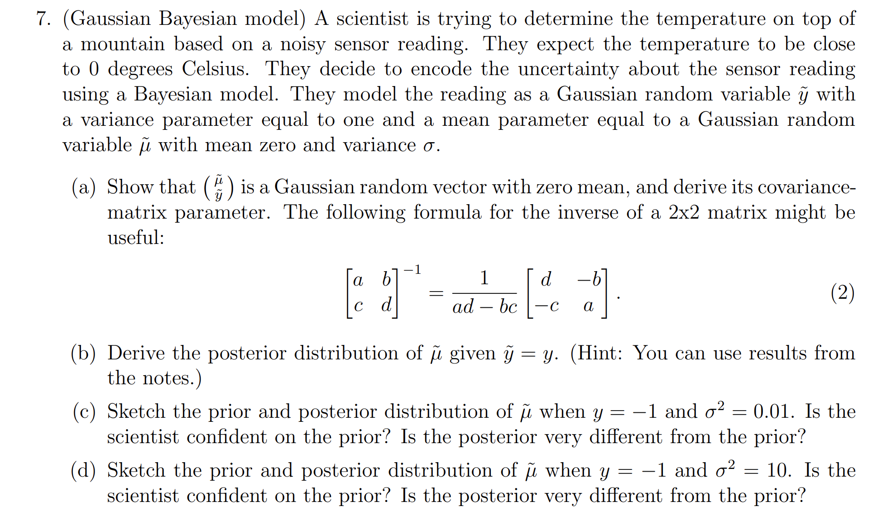

> [!solution]
> 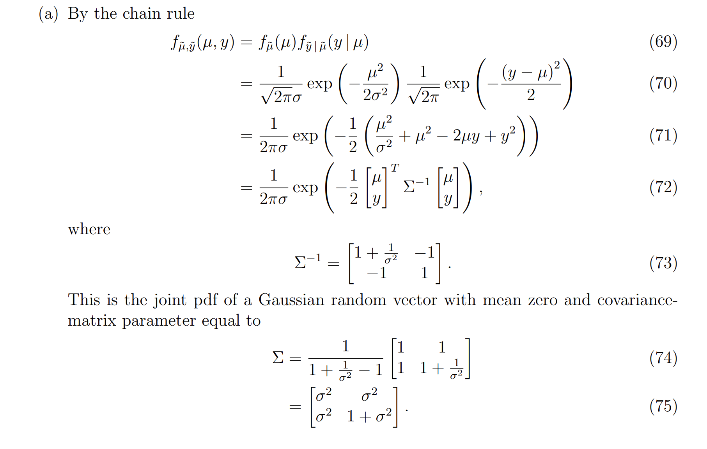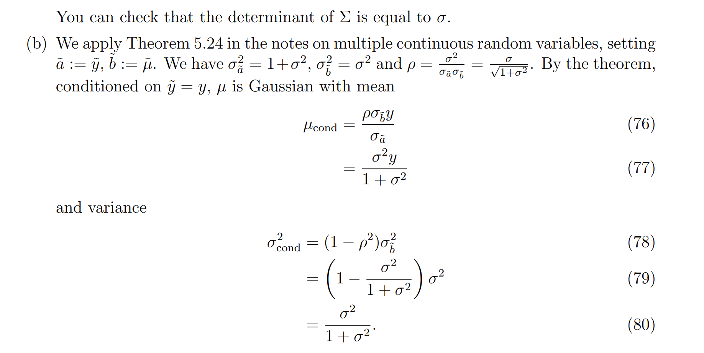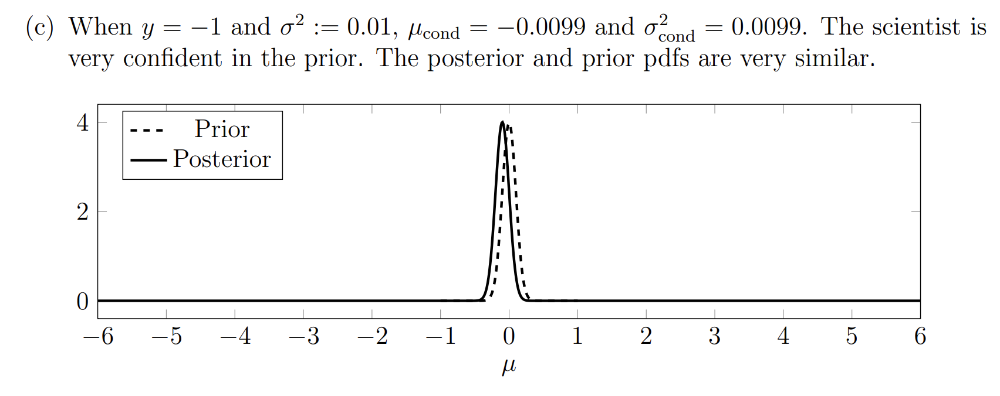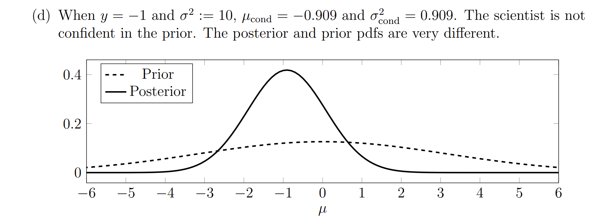

